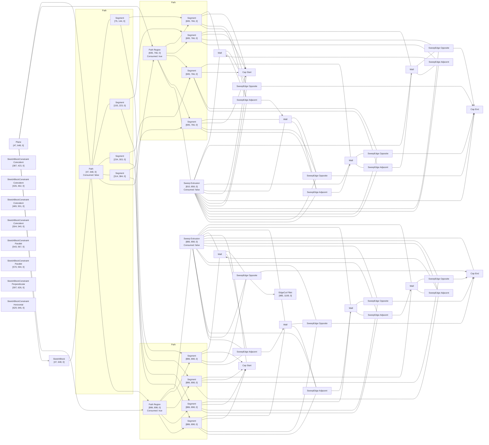

```mermaid
flowchart LR
  subgraph path2 [Path]
    2["Path<br>[47, 648, 0]<br>Consumed: false"]
      %% [ProgramBodyItem { index: 0 }, VariableDeclarationDeclaration, VariableDeclarationInit]
    3["Segment<br>[75, 144, 0]"]
      %% [ProgramBodyItem { index: 0 }, VariableDeclarationDeclaration, VariableDeclarationInit, SketchBlockBody, SketchBlockBodyItem { index: 0 }, VariableDeclarationDeclaration, VariableDeclarationInit]
    4["Segment<br>[155, 223, 0]"]
      %% [ProgramBodyItem { index: 0 }, VariableDeclarationDeclaration, VariableDeclarationInit, SketchBlockBody, SketchBlockBodyItem { index: 1 }, VariableDeclarationDeclaration, VariableDeclarationInit]
    5["Segment<br>[234, 303, 0]"]
      %% [ProgramBodyItem { index: 0 }, VariableDeclarationDeclaration, VariableDeclarationInit, SketchBlockBody, SketchBlockBodyItem { index: 2 }, VariableDeclarationDeclaration, VariableDeclarationInit]
    6["Segment<br>[314, 384, 0]"]
      %% [ProgramBodyItem { index: 0 }, VariableDeclarationDeclaration, VariableDeclarationInit, SketchBlockBody, SketchBlockBodyItem { index: 3 }, VariableDeclarationDeclaration, VariableDeclarationInit]
  end
  subgraph path7 [Path]
    7["Path Region<br>[695, 766, 0]<br>Consumed: true"]
      %% [ProgramBodyItem { index: 2 }, VariableDeclarationDeclaration, VariableDeclarationInit]
    8["Segment<br>[695, 766, 0]"]
      %% [ProgramBodyItem { index: 2 }, VariableDeclarationDeclaration, VariableDeclarationInit]
    9["Segment<br>[695, 766, 0]"]
      %% [ProgramBodyItem { index: 2 }, VariableDeclarationDeclaration, VariableDeclarationInit]
    10["Segment<br>[695, 766, 0]"]
      %% [ProgramBodyItem { index: 2 }, VariableDeclarationDeclaration, VariableDeclarationInit]
    11["Segment<br>[695, 766, 0]"]
      %% [ProgramBodyItem { index: 2 }, VariableDeclarationDeclaration, VariableDeclarationInit]
  end
  subgraph path28 [Path]
    28["Path Region<br>[886, 898, 0]<br>Consumed: true"]
      %% [ProgramBodyItem { index: 4 }, VariableDeclarationDeclaration, VariableDeclarationInit, PipeBodyItem { index: 0 }]
    29["Segment<br>[886, 898, 0]"]
      %% [ProgramBodyItem { index: 4 }, VariableDeclarationDeclaration, VariableDeclarationInit, PipeBodyItem { index: 0 }]
    30["Segment<br>[886, 898, 0]"]
      %% [ProgramBodyItem { index: 4 }, VariableDeclarationDeclaration, VariableDeclarationInit, PipeBodyItem { index: 0 }]
    31["Segment<br>[886, 898, 0]"]
      %% [ProgramBodyItem { index: 4 }, VariableDeclarationDeclaration, VariableDeclarationInit, PipeBodyItem { index: 0 }]
    32["Segment<br>[886, 898, 0]"]
      %% [ProgramBodyItem { index: 4 }, VariableDeclarationDeclaration, VariableDeclarationInit, PipeBodyItem { index: 0 }]
  end
  1["Plane<br>[47, 648, 0]"]
    %% [ProgramBodyItem { index: 0 }, VariableDeclarationDeclaration, VariableDeclarationInit]
  12["Sweep Extrusion<br>[810, 858, 0]<br>Consumed: false"]
    %% [ProgramBodyItem { index: 3 }, VariableDeclarationDeclaration, VariableDeclarationInit]
  13[Wall]
    %% face_code_ref=Missing NodePath
  14[Wall]
    %% face_code_ref=Missing NodePath
  15[Wall]
    %% face_code_ref=Missing NodePath
  16[Wall]
    %% face_code_ref=Missing NodePath
  17["Cap Start"]
    %% face_code_ref=Missing NodePath
  18["Cap End"]
    %% face_code_ref=Missing NodePath
  19["SweepEdge Opposite"]
  20["SweepEdge Adjacent"]
  21["SweepEdge Opposite"]
  22["SweepEdge Adjacent"]
  23["SweepEdge Opposite"]
  24["SweepEdge Adjacent"]
  25["SweepEdge Opposite"]
  26["SweepEdge Adjacent"]
  27["Sweep Extrusion<br>[886, 898, 0]<br>Consumed: false"]
    %% [ProgramBodyItem { index: 4 }, VariableDeclarationDeclaration, VariableDeclarationInit, PipeBodyItem { index: 0 }]
  33[Wall]
    %% face_code_ref=Missing NodePath
  34[Wall]
    %% face_code_ref=Missing NodePath
  35[Wall]
    %% face_code_ref=Missing NodePath
  36[Wall]
    %% face_code_ref=Missing NodePath
  37["Cap Start"]
    %% face_code_ref=Missing NodePath
  38["Cap End"]
    %% face_code_ref=Missing NodePath
  39["SweepEdge Opposite"]
  40["SweepEdge Adjacent"]
  41["SweepEdge Opposite"]
  42["SweepEdge Adjacent"]
  43["SweepEdge Opposite"]
  44["SweepEdge Adjacent"]
  45["SweepEdge Opposite"]
  46["SweepEdge Adjacent"]
  47["EdgeCut Fillet<br>[985, 1108, 0]"]
    %% [ProgramBodyItem { index: 5 }, VariableDeclarationDeclaration, VariableDeclarationInit]
  48["SketchBlock<br>[47, 648, 0]"]
    %% [ProgramBodyItem { index: 0 }, VariableDeclarationDeclaration, VariableDeclarationInit]
  49["SketchBlockConstraint Coincident<br>[387, 423, 0]"]
    %% [ProgramBodyItem { index: 0 }, VariableDeclarationDeclaration, VariableDeclarationInit, SketchBlockBody, SketchBlockBodyItem { index: 4 }, ExpressionStatementExpr]
  50["SketchBlockConstraint Coincident<br>[426, 462, 0]"]
    %% [ProgramBodyItem { index: 0 }, VariableDeclarationDeclaration, VariableDeclarationInit, SketchBlockBody, SketchBlockBodyItem { index: 5 }, ExpressionStatementExpr]
  51["SketchBlockConstraint Coincident<br>[465, 501, 0]"]
    %% [ProgramBodyItem { index: 0 }, VariableDeclarationDeclaration, VariableDeclarationInit, SketchBlockBody, SketchBlockBodyItem { index: 6 }, ExpressionStatementExpr]
  52["SketchBlockConstraint Coincident<br>[504, 540, 0]"]
    %% [ProgramBodyItem { index: 0 }, VariableDeclarationDeclaration, VariableDeclarationInit, SketchBlockBody, SketchBlockBodyItem { index: 7 }, ExpressionStatementExpr]
  53["SketchBlockConstraint Parallel<br>[543, 567, 0]"]
    %% [ProgramBodyItem { index: 0 }, VariableDeclarationDeclaration, VariableDeclarationInit, SketchBlockBody, SketchBlockBodyItem { index: 8 }, ExpressionStatementExpr]
  54["SketchBlockConstraint Parallel<br>[570, 594, 0]"]
    %% [ProgramBodyItem { index: 0 }, VariableDeclarationDeclaration, VariableDeclarationInit, SketchBlockBody, SketchBlockBodyItem { index: 9 }, ExpressionStatementExpr]
  55["SketchBlockConstraint Perpendicular<br>[597, 626, 0]"]
    %% [ProgramBodyItem { index: 0 }, VariableDeclarationDeclaration, VariableDeclarationInit, SketchBlockBody, SketchBlockBodyItem { index: 10 }, ExpressionStatementExpr]
  56["SketchBlockConstraint Horizontal<br>[629, 646, 0]"]
    %% [ProgramBodyItem { index: 0 }, VariableDeclarationDeclaration, VariableDeclarationInit, SketchBlockBody, SketchBlockBodyItem { index: 11 }, ExpressionStatementExpr]
  1 --- 2
  1 <--x 7
  1 <--x 28
  1 <--x 48
  2 --- 3
  2 --- 4
  2 --- 5
  2 --- 6
  2 <--x 7
  2 <--x 28
  48 --- 2
  3 <--x 8
  3 <--x 29
  4 <--x 9
  4 <--x 30
  5 <--x 10
  5 <--x 31
  6 <--x 11
  6 <--x 32
  7 <--x 8
  7 <--x 9
  7 <--x 10
  7 <--x 11
  7 ---- 12
  8 --- 13
  8 x--> 17
  8 --- 19
  8 --- 20
  9 --- 14
  9 x--> 17
  9 --- 21
  9 --- 22
  10 --- 15
  10 x--> 17
  10 --- 23
  10 --- 24
  11 --- 16
  11 x--> 17
  11 --- 25
  11 --- 26
  12 --- 13
  12 --- 14
  12 --- 15
  12 --- 16
  12 --- 17
  12 --- 18
  12 --- 19
  12 --- 20
  12 --- 21
  12 --- 22
  12 --- 23
  12 --- 24
  12 --- 25
  12 --- 26
  13 --- 19
  13 --- 20
  22 <--x 13
  14 --- 21
  14 --- 22
  24 <--x 14
  15 --- 23
  15 --- 24
  26 <--x 15
  20 <--x 16
  16 --- 25
  16 --- 26
  19 <--x 18
  21 <--x 18
  23 <--x 18
  25 <--x 18
  28 ---- 27
  27 --- 33
  27 --- 34
  27 --- 35
  27 --- 36
  27 --- 37
  27 --- 38
  27 --- 39
  27 --- 40
  27 --- 41
  27 --- 42
  27 --- 43
  27 --- 44
  27 --- 45
  27 --- 46
  28 <--x 29
  28 <--x 30
  28 <--x 31
  28 <--x 32
  29 --- 36
  29 x--> 37
  29 --- 45
  29 --- 46
  30 --- 33
  30 x--> 37
  30 --- 39
  30 --- 40
  31 --- 34
  31 x--> 37
  31 --- 41
  31 --- 42
  32 --- 35
  32 x--> 37
  32 --- 43
  32 --- 44
  33 --- 39
  33 --- 40
  42 <--x 33
  34 --- 41
  34 --- 42
  44 <--x 34
  35 --- 43
  35 --- 44
  46 <--x 35
  40 <--x 36
  36 --- 45
  36 --- 46
  39 <--x 38
  41 <--x 38
  43 <--x 38
  45 <--x 38
  45 <--x 47
```
