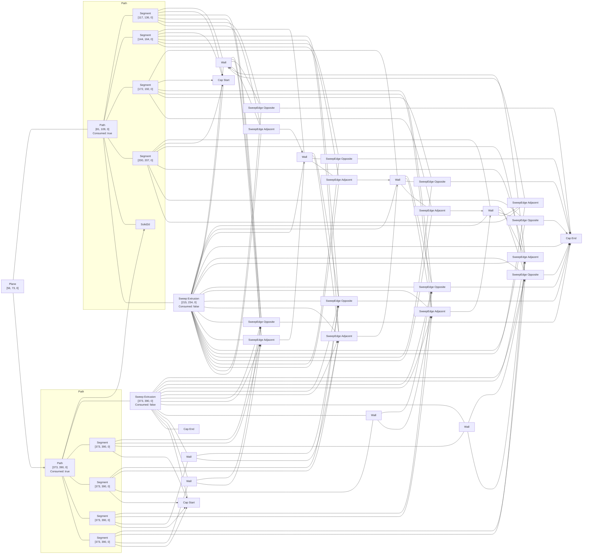

```mermaid
flowchart LR
  subgraph path2 [Path]
    2["Path<br>[81, 109, 0]<br>Consumed: true"]
      %% [ProgramBodyItem { index: 0 }, VariableDeclarationDeclaration, VariableDeclarationInit, PipeBodyItem { index: 1 }]
    3["Segment<br>[117, 136, 0]"]
      %% [ProgramBodyItem { index: 0 }, VariableDeclarationDeclaration, VariableDeclarationInit, PipeBodyItem { index: 2 }]
    4["Segment<br>[144, 164, 0]"]
      %% [ProgramBodyItem { index: 0 }, VariableDeclarationDeclaration, VariableDeclarationInit, PipeBodyItem { index: 3 }]
    5["Segment<br>[172, 192, 0]"]
      %% [ProgramBodyItem { index: 0 }, VariableDeclarationDeclaration, VariableDeclarationInit, PipeBodyItem { index: 4 }]
    6["Segment<br>[200, 207, 0]"]
      %% [ProgramBodyItem { index: 0 }, VariableDeclarationDeclaration, VariableDeclarationInit, PipeBodyItem { index: 5 }]
    7[Solid2d]
  end
  subgraph path24 [Path]
    24["Path<br>[373, 390, 0]<br>Consumed: true"]
      %% [ProgramBodyItem { index: 2 }, VariableDeclarationDeclaration, VariableDeclarationInit, PipeBodyItem { index: 0 }]
    25["Segment<br>[373, 390, 0]"]
      %% [ProgramBodyItem { index: 2 }, VariableDeclarationDeclaration, VariableDeclarationInit, PipeBodyItem { index: 0 }]
    26["Segment<br>[373, 390, 0]"]
      %% [ProgramBodyItem { index: 2 }, VariableDeclarationDeclaration, VariableDeclarationInit, PipeBodyItem { index: 0 }]
    27["Segment<br>[373, 390, 0]"]
      %% [ProgramBodyItem { index: 2 }, VariableDeclarationDeclaration, VariableDeclarationInit, PipeBodyItem { index: 0 }]
    28["Segment<br>[373, 390, 0]"]
      %% [ProgramBodyItem { index: 2 }, VariableDeclarationDeclaration, VariableDeclarationInit, PipeBodyItem { index: 0 }]
  end
  1["Plane<br>[56, 73, 0]"]
    %% [ProgramBodyItem { index: 0 }, VariableDeclarationDeclaration, VariableDeclarationInit, PipeBodyItem { index: 0 }]
  8["Sweep Extrusion<br>[215, 234, 0]<br>Consumed: false"]
    %% [ProgramBodyItem { index: 0 }, VariableDeclarationDeclaration, VariableDeclarationInit, PipeBodyItem { index: 6 }]
  9[Wall]
    %% face_code_ref=Missing NodePath
  10[Wall]
    %% face_code_ref=Missing NodePath
  11[Wall]
    %% face_code_ref=Missing NodePath
  12[Wall]
    %% face_code_ref=Missing NodePath
  13["Cap Start"]
    %% face_code_ref=Missing NodePath
  14["Cap End"]
    %% face_code_ref=Missing NodePath
  15["SweepEdge Opposite"]
  16["SweepEdge Adjacent"]
  17["SweepEdge Opposite"]
  18["SweepEdge Adjacent"]
  19["SweepEdge Opposite"]
  20["SweepEdge Adjacent"]
  21["SweepEdge Opposite"]
  22["SweepEdge Adjacent"]
  23["Sweep Extrusion<br>[373, 390, 0]<br>Consumed: false"]
    %% [ProgramBodyItem { index: 2 }, VariableDeclarationDeclaration, VariableDeclarationInit, PipeBodyItem { index: 0 }]
  29[Wall]
    %% face_code_ref=Missing NodePath
  30[Wall]
    %% face_code_ref=Missing NodePath
  31[Wall]
    %% face_code_ref=Missing NodePath
  32[Wall]
    %% face_code_ref=Missing NodePath
  33["Cap Start"]
    %% face_code_ref=Missing NodePath
  34["Cap End"]
    %% face_code_ref=Missing NodePath
  35["SweepEdge Opposite"]
  36["SweepEdge Adjacent"]
  37["SweepEdge Opposite"]
  38["SweepEdge Adjacent"]
  39["SweepEdge Opposite"]
  40["SweepEdge Adjacent"]
  41["SweepEdge Opposite"]
  42["SweepEdge Adjacent"]
  1 --- 2
  1 <--x 24
  2 --- 3
  2 --- 4
  2 --- 5
  2 --- 6
  2 --- 7
  2 ---- 8
  3 --- 12
  3 x--> 13
  3 --- 21
  3 --- 22
  3 --- 41
  3 --- 42
  4 --- 11
  4 x--> 13
  4 --- 19
  4 --- 20
  4 --- 39
  4 --- 40
  5 --- 10
  5 x--> 13
  5 --- 17
  5 --- 18
  5 --- 37
  5 --- 38
  6 --- 9
  6 x--> 13
  6 --- 15
  6 --- 16
  6 --- 35
  6 --- 36
  24 <--x 7
  8 --- 9
  8 --- 10
  8 --- 11
  8 --- 12
  8 --- 13
  8 --- 14
  8 --- 15
  8 --- 16
  8 --- 17
  8 --- 18
  8 --- 19
  8 --- 20
  8 --- 21
  8 --- 22
  8 --- 35
  8 --- 36
  8 --- 37
  8 --- 38
  8 --- 39
  8 --- 40
  8 --- 41
  8 --- 42
  9 --- 15
  9 --- 16
  18 <--x 9
  9 --- 35
  9 --- 36
  38 <--x 9
  10 --- 17
  10 --- 18
  20 <--x 10
  10 --- 37
  10 --- 38
  40 <--x 10
  11 --- 19
  11 --- 20
  22 <--x 11
  11 --- 39
  11 --- 40
  42 <--x 11
  16 <--x 12
  12 --- 21
  12 --- 22
  36 <--x 12
  12 --- 41
  12 --- 42
  15 <--x 14
  17 <--x 14
  19 <--x 14
  21 <--x 14
  35 <--x 14
  37 <--x 14
  39 <--x 14
  41 <--x 14
  23 <--x 15
  28 <--x 15
  29 <--x 15
  23 <--x 16
  28 <--x 16
  29 <--x 16
  23 <--x 17
  27 <--x 17
  30 <--x 17
  23 <--x 18
  27 <--x 18
  30 <--x 18
  23 <--x 19
  26 <--x 19
  31 <--x 19
  23 <--x 20
  26 <--x 20
  31 <--x 20
  23 <--x 21
  25 <--x 21
  32 <--x 21
  23 <--x 22
  25 <--x 22
  32 <--x 22
  24 ---- 23
  23 --- 29
  23 --- 30
  23 --- 31
  23 --- 32
  23 --- 33
  23 --- 34
  24 --- 25
  24 --- 26
  24 --- 27
  24 --- 28
  25 --- 29
  25 x--> 33
  26 --- 30
  26 x--> 33
  27 --- 31
  27 x--> 33
  28 --- 32
  28 x--> 33
```
