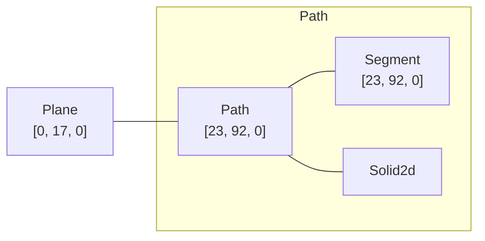

```mermaid
flowchart LR
  subgraph path2 [Path]
    2["Path<br>[23, 92, 0]"]
      %% [ProgramBodyItem { index: 0 }, ExpressionStatementExpr, PipeBodyItem { index: 1 }]
    3["Segment<br>[23, 92, 0]"]
      %% [ProgramBodyItem { index: 0 }, ExpressionStatementExpr, PipeBodyItem { index: 1 }]
    4[Solid2d]
  end
  1["Plane<br>[0, 17, 0]"]
    %% [ProgramBodyItem { index: 0 }, ExpressionStatementExpr, PipeBodyItem { index: 0 }]
  1 --- 2
  2 --- 3
  2 --- 4
```
