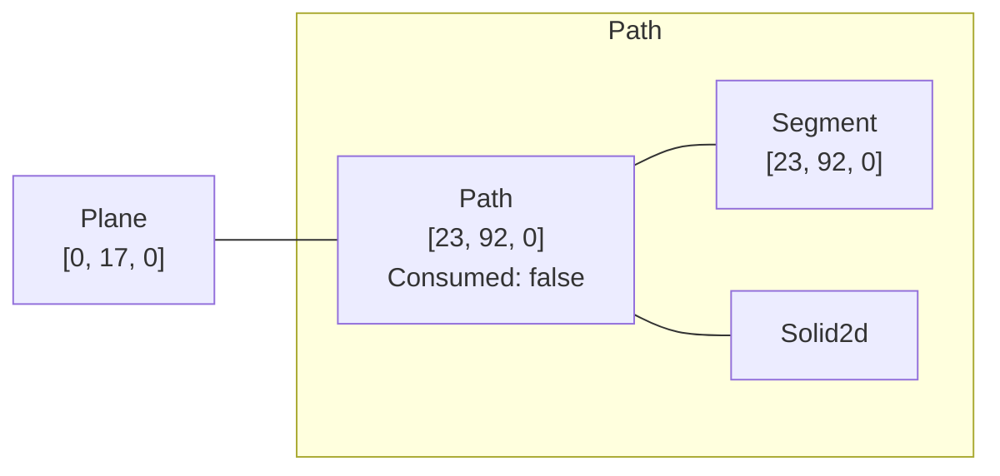

```mermaid
flowchart LR
  subgraph path1 [Path]
    1["Path<br>[23, 92, 0]<br>Consumed: false"]
      %% [ProgramBodyItem { index: 0 }, ExpressionStatementExpr, PipeBodyItem { index: 1 }]
    3["Segment<br>[23, 92, 0]"]
      %% [ProgramBodyItem { index: 0 }, ExpressionStatementExpr, PipeBodyItem { index: 1 }]
    4[Solid2d]
  end
  2["Plane<br>[0, 17, 0]"]
    %% [ProgramBodyItem { index: 0 }, ExpressionStatementExpr, PipeBodyItem { index: 0 }]
  2 --- 1
  1 --- 3
  1 --- 4
```
