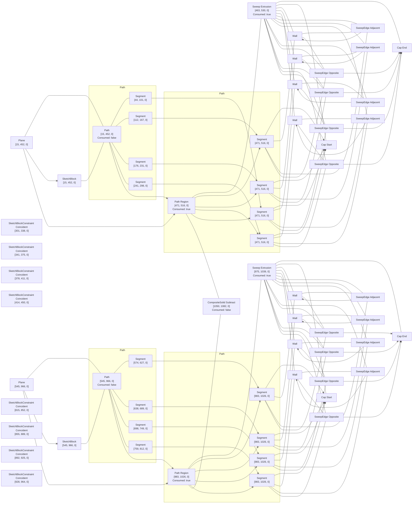

```mermaid
flowchart LR
  subgraph path13 [Path]
    13["Path<br>[15, 452, 0]<br>Consumed: false"]
      %% [ProgramBodyItem { index: 0 }, VariableDeclarationDeclaration, VariableDeclarationInit]
    16["Segment<br>[44, 101, 0]"]
      %% [ProgramBodyItem { index: 0 }, VariableDeclarationDeclaration, VariableDeclarationInit, SketchBlockBody, SketchBlockBodyItem { index: 0 }, VariableDeclarationDeclaration, VariableDeclarationInit]
    17["Segment<br>[112, 167, 0]"]
      %% [ProgramBodyItem { index: 0 }, VariableDeclarationDeclaration, VariableDeclarationInit, SketchBlockBody, SketchBlockBodyItem { index: 1 }, VariableDeclarationDeclaration, VariableDeclarationInit]
    18["Segment<br>[176, 231, 0]"]
      %% [ProgramBodyItem { index: 0 }, VariableDeclarationDeclaration, VariableDeclarationInit, SketchBlockBody, SketchBlockBodyItem { index: 2 }, VariableDeclarationDeclaration, VariableDeclarationInit]
    19["Segment<br>[241, 298, 0]"]
      %% [ProgramBodyItem { index: 0 }, VariableDeclarationDeclaration, VariableDeclarationInit, SketchBlockBody, SketchBlockBodyItem { index: 3 }, VariableDeclarationDeclaration, VariableDeclarationInit]
  end
  subgraph path25 [Path]
    25["Path Region<br>[471, 516, 0]<br>Consumed: true"]
      %% [ProgramBodyItem { index: 1 }, VariableDeclarationDeclaration, VariableDeclarationInit, CallKwUnlabeledArg]
    26["Segment<br>[471, 516, 0]"]
      %% [ProgramBodyItem { index: 1 }, VariableDeclarationDeclaration, VariableDeclarationInit, CallKwUnlabeledArg]
    27["Segment<br>[471, 516, 0]"]
      %% [ProgramBodyItem { index: 1 }, VariableDeclarationDeclaration, VariableDeclarationInit, CallKwUnlabeledArg]
    28["Segment<br>[471, 516, 0]"]
      %% [ProgramBodyItem { index: 1 }, VariableDeclarationDeclaration, VariableDeclarationInit, CallKwUnlabeledArg]
    29["Segment<br>[471, 516, 0]"]
      %% [ProgramBodyItem { index: 1 }, VariableDeclarationDeclaration, VariableDeclarationInit, CallKwUnlabeledArg]
  end
  subgraph path30 [Path]
    30["Path<br>[545, 966, 0]<br>Consumed: false"]
      %% [ProgramBodyItem { index: 2 }, VariableDeclarationDeclaration, VariableDeclarationInit]
    33["Segment<br>[574, 627, 0]"]
      %% [ProgramBodyItem { index: 2 }, VariableDeclarationDeclaration, VariableDeclarationInit, SketchBlockBody, SketchBlockBodyItem { index: 0 }, VariableDeclarationDeclaration, VariableDeclarationInit]
    34["Segment<br>[638, 689, 0]"]
      %% [ProgramBodyItem { index: 2 }, VariableDeclarationDeclaration, VariableDeclarationInit, SketchBlockBody, SketchBlockBodyItem { index: 1 }, VariableDeclarationDeclaration, VariableDeclarationInit]
    35["Segment<br>[698, 749, 0]"]
      %% [ProgramBodyItem { index: 2 }, VariableDeclarationDeclaration, VariableDeclarationInit, SketchBlockBody, SketchBlockBodyItem { index: 2 }, VariableDeclarationDeclaration, VariableDeclarationInit]
    36["Segment<br>[759, 812, 0]"]
      %% [ProgramBodyItem { index: 2 }, VariableDeclarationDeclaration, VariableDeclarationInit, SketchBlockBody, SketchBlockBodyItem { index: 3 }, VariableDeclarationDeclaration, VariableDeclarationInit]
  end
  subgraph path42 [Path]
    42["Path Region<br>[983, 1026, 0]<br>Consumed: true"]
      %% [ProgramBodyItem { index: 3 }, VariableDeclarationDeclaration, VariableDeclarationInit, CallKwUnlabeledArg]
    43["Segment<br>[983, 1026, 0]"]
      %% [ProgramBodyItem { index: 3 }, VariableDeclarationDeclaration, VariableDeclarationInit, CallKwUnlabeledArg]
    44["Segment<br>[983, 1026, 0]"]
      %% [ProgramBodyItem { index: 3 }, VariableDeclarationDeclaration, VariableDeclarationInit, CallKwUnlabeledArg]
    45["Segment<br>[983, 1026, 0]"]
      %% [ProgramBodyItem { index: 3 }, VariableDeclarationDeclaration, VariableDeclarationInit, CallKwUnlabeledArg]
    46["Segment<br>[983, 1026, 0]"]
      %% [ProgramBodyItem { index: 3 }, VariableDeclarationDeclaration, VariableDeclarationInit, CallKwUnlabeledArg]
  end
  1["Cap End"]
    %% face_code_ref=Missing NodePath
  2["Cap End"]
    %% face_code_ref=Missing NodePath
  3["Cap Start"]
    %% face_code_ref=Missing NodePath
  4["Cap Start"]
    %% face_code_ref=Missing NodePath
  5[Wall]
    %% face_code_ref=Missing NodePath
  6[Wall]
    %% face_code_ref=Missing NodePath
  7[Wall]
    %% face_code_ref=Missing NodePath
  8[Wall]
    %% face_code_ref=Missing NodePath
  9[Wall]
    %% face_code_ref=Missing NodePath
  10[Wall]
    %% face_code_ref=Missing NodePath
  11[Wall]
    %% face_code_ref=Missing NodePath
  12[Wall]
    %% face_code_ref=Missing NodePath
  14["Plane<br>[15, 452, 0]"]
    %% [ProgramBodyItem { index: 0 }, VariableDeclarationDeclaration, VariableDeclarationInit]
  15["SketchBlock<br>[15, 452, 0]"]
    %% [ProgramBodyItem { index: 0 }, VariableDeclarationDeclaration, VariableDeclarationInit]
  20["SketchBlockConstraint Coincident<br>[301, 338, 0]"]
    %% [ProgramBodyItem { index: 0 }, VariableDeclarationDeclaration, VariableDeclarationInit, SketchBlockBody, SketchBlockBodyItem { index: 4 }, ExpressionStatementExpr]
  21["SketchBlockConstraint Coincident<br>[341, 375, 0]"]
    %% [ProgramBodyItem { index: 0 }, VariableDeclarationDeclaration, VariableDeclarationInit, SketchBlockBody, SketchBlockBodyItem { index: 5 }, ExpressionStatementExpr]
  22["SketchBlockConstraint Coincident<br>[378, 411, 0]"]
    %% [ProgramBodyItem { index: 0 }, VariableDeclarationDeclaration, VariableDeclarationInit, SketchBlockBody, SketchBlockBodyItem { index: 6 }, ExpressionStatementExpr]
  23["SketchBlockConstraint Coincident<br>[414, 450, 0]"]
    %% [ProgramBodyItem { index: 0 }, VariableDeclarationDeclaration, VariableDeclarationInit, SketchBlockBody, SketchBlockBodyItem { index: 7 }, ExpressionStatementExpr]
  24["Sweep Extrusion<br>[463, 530, 0]<br>Consumed: true"]
    %% [ProgramBodyItem { index: 1 }, VariableDeclarationDeclaration, VariableDeclarationInit]
  31["Plane<br>[545, 966, 0]"]
    %% [ProgramBodyItem { index: 2 }, VariableDeclarationDeclaration, VariableDeclarationInit]
  32["SketchBlock<br>[545, 966, 0]"]
    %% [ProgramBodyItem { index: 2 }, VariableDeclarationDeclaration, VariableDeclarationInit]
  37["SketchBlockConstraint Coincident<br>[815, 852, 0]"]
    %% [ProgramBodyItem { index: 2 }, VariableDeclarationDeclaration, VariableDeclarationInit, SketchBlockBody, SketchBlockBodyItem { index: 4 }, ExpressionStatementExpr]
  38["SketchBlockConstraint Coincident<br>[855, 889, 0]"]
    %% [ProgramBodyItem { index: 2 }, VariableDeclarationDeclaration, VariableDeclarationInit, SketchBlockBody, SketchBlockBodyItem { index: 5 }, ExpressionStatementExpr]
  39["SketchBlockConstraint Coincident<br>[892, 925, 0]"]
    %% [ProgramBodyItem { index: 2 }, VariableDeclarationDeclaration, VariableDeclarationInit, SketchBlockBody, SketchBlockBodyItem { index: 6 }, ExpressionStatementExpr]
  40["SketchBlockConstraint Coincident<br>[928, 964, 0]"]
    %% [ProgramBodyItem { index: 2 }, VariableDeclarationDeclaration, VariableDeclarationInit, SketchBlockBody, SketchBlockBodyItem { index: 7 }, ExpressionStatementExpr]
  41["Sweep Extrusion<br>[975, 1039, 0]<br>Consumed: true"]
    %% [ProgramBodyItem { index: 3 }, VariableDeclarationDeclaration, VariableDeclarationInit]
  47["CompositeSolid Subtract<br>[1050, 1082, 0]<br>Consumed: false"]
    %% [ProgramBodyItem { index: 4 }, VariableDeclarationDeclaration, VariableDeclarationInit]
  48["SweepEdge Adjacent"]
  49["SweepEdge Adjacent"]
  50["SweepEdge Adjacent"]
  51["SweepEdge Adjacent"]
  52["SweepEdge Adjacent"]
  53["SweepEdge Adjacent"]
  54["SweepEdge Adjacent"]
  55["SweepEdge Adjacent"]
  56["SweepEdge Opposite"]
  57["SweepEdge Opposite"]
  58["SweepEdge Opposite"]
  59["SweepEdge Opposite"]
  60["SweepEdge Opposite"]
  61["SweepEdge Opposite"]
  62["SweepEdge Opposite"]
  63["SweepEdge Opposite"]
  24 --- 1
  56 <--x 1
  57 <--x 1
  58 <--x 1
  59 <--x 1
  41 --- 2
  60 <--x 2
  61 <--x 2
  62 <--x 2
  63 <--x 2
  24 --- 3
  26 <--x 3
  27 <--x 3
  28 <--x 3
  29 <--x 3
  41 --- 4
  43 <--x 4
  44 <--x 4
  45 <--x 4
  46 <--x 4
  24 --- 5
  26 --- 5
  5 --- 48
  48 <--x 5
  5 --- 56
  24 --- 6
  27 --- 6
  6 --- 49
  49 <--x 6
  6 --- 57
  24 --- 7
  28 --- 7
  7 --- 50
  50 <--x 7
  7 --- 58
  24 --- 8
  29 --- 8
  8 --- 51
  51 <--x 8
  8 --- 59
  41 --- 9
  43 --- 9
  9 --- 52
  52 <--x 9
  9 --- 60
  41 --- 10
  44 --- 10
  10 --- 53
  53 <--x 10
  10 --- 61
  41 --- 11
  45 --- 11
  11 --- 54
  54 <--x 11
  11 --- 62
  41 --- 12
  46 --- 12
  12 --- 55
  55 <--x 12
  12 --- 63
  14 --- 13
  15 --- 13
  13 --- 16
  13 --- 17
  13 --- 18
  13 --- 19
  13 <--x 25
  14 <--x 15
  14 <--x 25
  16 <--x 29
  17 <--x 26
  18 <--x 27
  19 <--x 28
  25 ---- 24
  24 --- 48
  24 --- 49
  24 --- 50
  24 --- 51
  24 --- 56
  24 --- 57
  24 --- 58
  24 --- 59
  25 <--x 26
  25 <--x 27
  25 <--x 28
  25 <--x 29
  25 --- 47
  26 --- 48
  26 --- 56
  27 --- 49
  27 --- 57
  28 --- 50
  28 --- 58
  29 --- 51
  29 --- 59
  31 --- 30
  32 --- 30
  30 --- 33
  30 --- 34
  30 --- 35
  30 --- 36
  30 <--x 42
  31 <--x 32
  31 <--x 42
  33 <--x 43
  34 <--x 44
  35 <--x 45
  36 <--x 46
  42 ---- 41
  41 --- 52
  41 --- 53
  41 --- 54
  41 --- 55
  41 --- 60
  41 --- 61
  41 --- 62
  41 --- 63
  42 <--x 43
  42 <--x 44
  42 <--x 45
  42 <--x 46
  42 --- 47
  43 --- 52
  43 --- 60
  44 --- 53
  44 --- 61
  45 --- 54
  45 --- 62
  46 --- 55
  46 --- 63
```
