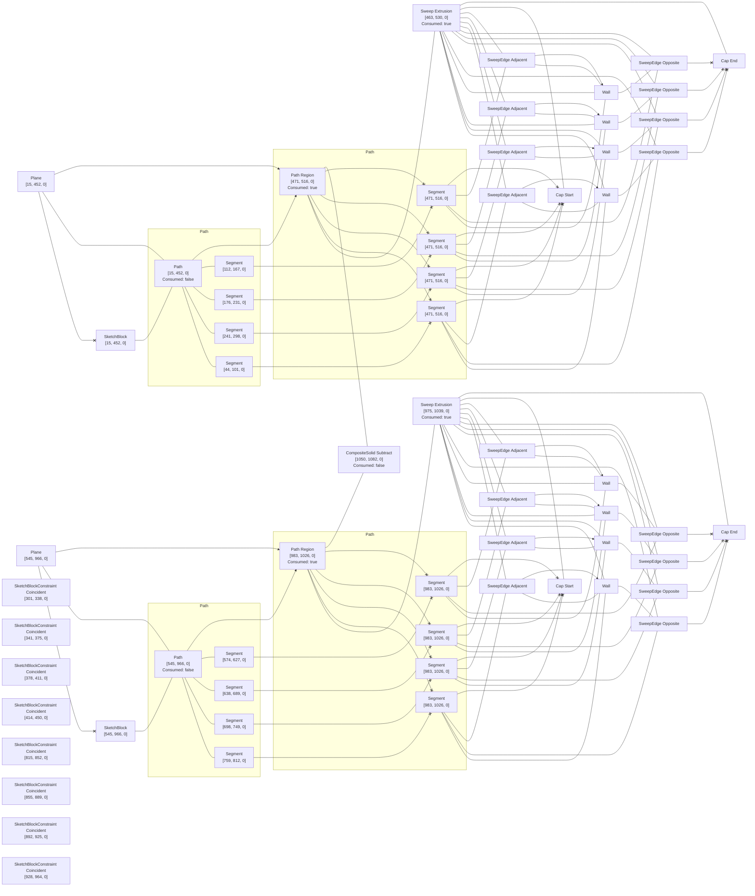

```mermaid
flowchart LR
  subgraph path6 [Path]
    6["Path Region<br>[471, 516, 0]<br>Consumed: true"]
      %% [ProgramBodyItem { index: 1 }, VariableDeclarationDeclaration, VariableDeclarationInit, CallKwUnlabeledArg]
    16["Segment<br>[471, 516, 0]"]
      %% [ProgramBodyItem { index: 1 }, VariableDeclarationDeclaration, VariableDeclarationInit, CallKwUnlabeledArg]
    17["Segment<br>[471, 516, 0]"]
      %% [ProgramBodyItem { index: 1 }, VariableDeclarationDeclaration, VariableDeclarationInit, CallKwUnlabeledArg]
    18["Segment<br>[471, 516, 0]"]
      %% [ProgramBodyItem { index: 1 }, VariableDeclarationDeclaration, VariableDeclarationInit, CallKwUnlabeledArg]
    19["Segment<br>[471, 516, 0]"]
      %% [ProgramBodyItem { index: 1 }, VariableDeclarationDeclaration, VariableDeclarationInit, CallKwUnlabeledArg]
  end
  subgraph path7 [Path]
    7["Path Region<br>[983, 1026, 0]<br>Consumed: true"]
      %% [ProgramBodyItem { index: 3 }, VariableDeclarationDeclaration, VariableDeclarationInit, CallKwUnlabeledArg]
    24["Segment<br>[983, 1026, 0]"]
      %% [ProgramBodyItem { index: 3 }, VariableDeclarationDeclaration, VariableDeclarationInit, CallKwUnlabeledArg]
    25["Segment<br>[983, 1026, 0]"]
      %% [ProgramBodyItem { index: 3 }, VariableDeclarationDeclaration, VariableDeclarationInit, CallKwUnlabeledArg]
    26["Segment<br>[983, 1026, 0]"]
      %% [ProgramBodyItem { index: 3 }, VariableDeclarationDeclaration, VariableDeclarationInit, CallKwUnlabeledArg]
    27["Segment<br>[983, 1026, 0]"]
      %% [ProgramBodyItem { index: 3 }, VariableDeclarationDeclaration, VariableDeclarationInit, CallKwUnlabeledArg]
  end
  subgraph path8 [Path]
    8["Path<br>[15, 452, 0]<br>Consumed: false"]
      %% [ProgramBodyItem { index: 0 }, VariableDeclarationDeclaration, VariableDeclarationInit]
    12["Segment<br>[112, 167, 0]"]
      %% [ProgramBodyItem { index: 0 }, VariableDeclarationDeclaration, VariableDeclarationInit, SketchBlockBody, SketchBlockBodyItem { index: 1 }, VariableDeclarationDeclaration, VariableDeclarationInit]
    13["Segment<br>[176, 231, 0]"]
      %% [ProgramBodyItem { index: 0 }, VariableDeclarationDeclaration, VariableDeclarationInit, SketchBlockBody, SketchBlockBodyItem { index: 2 }, VariableDeclarationDeclaration, VariableDeclarationInit]
    14["Segment<br>[241, 298, 0]"]
      %% [ProgramBodyItem { index: 0 }, VariableDeclarationDeclaration, VariableDeclarationInit, SketchBlockBody, SketchBlockBodyItem { index: 3 }, VariableDeclarationDeclaration, VariableDeclarationInit]
    15["Segment<br>[44, 101, 0]"]
      %% [ProgramBodyItem { index: 0 }, VariableDeclarationDeclaration, VariableDeclarationInit, SketchBlockBody, SketchBlockBodyItem { index: 0 }, VariableDeclarationDeclaration, VariableDeclarationInit]
  end
  subgraph path9 [Path]
    9["Path<br>[545, 966, 0]<br>Consumed: false"]
      %% [ProgramBodyItem { index: 2 }, VariableDeclarationDeclaration, VariableDeclarationInit]
    20["Segment<br>[574, 627, 0]"]
      %% [ProgramBodyItem { index: 2 }, VariableDeclarationDeclaration, VariableDeclarationInit, SketchBlockBody, SketchBlockBodyItem { index: 0 }, VariableDeclarationDeclaration, VariableDeclarationInit]
    21["Segment<br>[638, 689, 0]"]
      %% [ProgramBodyItem { index: 2 }, VariableDeclarationDeclaration, VariableDeclarationInit, SketchBlockBody, SketchBlockBodyItem { index: 1 }, VariableDeclarationDeclaration, VariableDeclarationInit]
    22["Segment<br>[698, 749, 0]"]
      %% [ProgramBodyItem { index: 2 }, VariableDeclarationDeclaration, VariableDeclarationInit, SketchBlockBody, SketchBlockBodyItem { index: 2 }, VariableDeclarationDeclaration, VariableDeclarationInit]
    23["Segment<br>[759, 812, 0]"]
      %% [ProgramBodyItem { index: 2 }, VariableDeclarationDeclaration, VariableDeclarationInit, SketchBlockBody, SketchBlockBodyItem { index: 3 }, VariableDeclarationDeclaration, VariableDeclarationInit]
  end
  1["Cap End"]
    %% face_code_ref=Missing NodePath
  2["Cap End"]
    %% face_code_ref=Missing NodePath
  3["Cap Start"]
    %% face_code_ref=Missing NodePath
  4["Cap Start"]
    %% face_code_ref=Missing NodePath
  5["CompositeSolid Subtract<br>[1050, 1082, 0]<br>Consumed: false"]
    %% [ProgramBodyItem { index: 4 }, VariableDeclarationDeclaration, VariableDeclarationInit]
  10["Plane<br>[15, 452, 0]"]
    %% [ProgramBodyItem { index: 0 }, VariableDeclarationDeclaration, VariableDeclarationInit]
  11["Plane<br>[545, 966, 0]"]
    %% [ProgramBodyItem { index: 2 }, VariableDeclarationDeclaration, VariableDeclarationInit]
  28["SketchBlock<br>[15, 452, 0]"]
    %% [ProgramBodyItem { index: 0 }, VariableDeclarationDeclaration, VariableDeclarationInit]
  29["SketchBlock<br>[545, 966, 0]"]
    %% [ProgramBodyItem { index: 2 }, VariableDeclarationDeclaration, VariableDeclarationInit]
  30["SketchBlockConstraint Coincident<br>[301, 338, 0]"]
    %% [ProgramBodyItem { index: 0 }, VariableDeclarationDeclaration, VariableDeclarationInit, SketchBlockBody, SketchBlockBodyItem { index: 4 }, ExpressionStatementExpr]
  31["SketchBlockConstraint Coincident<br>[341, 375, 0]"]
    %% [ProgramBodyItem { index: 0 }, VariableDeclarationDeclaration, VariableDeclarationInit, SketchBlockBody, SketchBlockBodyItem { index: 5 }, ExpressionStatementExpr]
  32["SketchBlockConstraint Coincident<br>[378, 411, 0]"]
    %% [ProgramBodyItem { index: 0 }, VariableDeclarationDeclaration, VariableDeclarationInit, SketchBlockBody, SketchBlockBodyItem { index: 6 }, ExpressionStatementExpr]
  33["SketchBlockConstraint Coincident<br>[414, 450, 0]"]
    %% [ProgramBodyItem { index: 0 }, VariableDeclarationDeclaration, VariableDeclarationInit, SketchBlockBody, SketchBlockBodyItem { index: 7 }, ExpressionStatementExpr]
  34["SketchBlockConstraint Coincident<br>[815, 852, 0]"]
    %% [ProgramBodyItem { index: 2 }, VariableDeclarationDeclaration, VariableDeclarationInit, SketchBlockBody, SketchBlockBodyItem { index: 4 }, ExpressionStatementExpr]
  35["SketchBlockConstraint Coincident<br>[855, 889, 0]"]
    %% [ProgramBodyItem { index: 2 }, VariableDeclarationDeclaration, VariableDeclarationInit, SketchBlockBody, SketchBlockBodyItem { index: 5 }, ExpressionStatementExpr]
  36["SketchBlockConstraint Coincident<br>[892, 925, 0]"]
    %% [ProgramBodyItem { index: 2 }, VariableDeclarationDeclaration, VariableDeclarationInit, SketchBlockBody, SketchBlockBodyItem { index: 6 }, ExpressionStatementExpr]
  37["SketchBlockConstraint Coincident<br>[928, 964, 0]"]
    %% [ProgramBodyItem { index: 2 }, VariableDeclarationDeclaration, VariableDeclarationInit, SketchBlockBody, SketchBlockBodyItem { index: 7 }, ExpressionStatementExpr]
  38["Sweep Extrusion<br>[463, 530, 0]<br>Consumed: true"]
    %% [ProgramBodyItem { index: 1 }, VariableDeclarationDeclaration, VariableDeclarationInit]
  39["Sweep Extrusion<br>[975, 1039, 0]<br>Consumed: true"]
    %% [ProgramBodyItem { index: 3 }, VariableDeclarationDeclaration, VariableDeclarationInit]
  40["SweepEdge Adjacent"]
  41["SweepEdge Adjacent"]
  42["SweepEdge Adjacent"]
  43["SweepEdge Adjacent"]
  44["SweepEdge Adjacent"]
  45["SweepEdge Adjacent"]
  46["SweepEdge Adjacent"]
  47["SweepEdge Adjacent"]
  48["SweepEdge Opposite"]
  49["SweepEdge Opposite"]
  50["SweepEdge Opposite"]
  51["SweepEdge Opposite"]
  52["SweepEdge Opposite"]
  53["SweepEdge Opposite"]
  54["SweepEdge Opposite"]
  55["SweepEdge Opposite"]
  56[Wall]
    %% face_code_ref=Missing NodePath
  57[Wall]
    %% face_code_ref=Missing NodePath
  58[Wall]
    %% face_code_ref=Missing NodePath
  59[Wall]
    %% face_code_ref=Missing NodePath
  60[Wall]
    %% face_code_ref=Missing NodePath
  61[Wall]
    %% face_code_ref=Missing NodePath
  62[Wall]
    %% face_code_ref=Missing NodePath
  63[Wall]
    %% face_code_ref=Missing NodePath
  38 --- 1
  48 <--x 1
  49 <--x 1
  50 <--x 1
  51 <--x 1
  39 --- 2
  52 <--x 2
  53 <--x 2
  54 <--x 2
  55 <--x 2
  16 <--x 3
  17 <--x 3
  18 <--x 3
  19 <--x 3
  38 --- 3
  24 <--x 4
  25 <--x 4
  26 <--x 4
  27 <--x 4
  39 --- 4
  6 --- 5
  7 --- 5
  8 x--> 6
  10 x--> 6
  6 <--x 16
  6 <--x 17
  6 <--x 18
  6 <--x 19
  6 ---- 38
  9 x--> 7
  11 x--> 7
  7 <--x 24
  7 <--x 25
  7 <--x 26
  7 <--x 27
  7 ---- 39
  10 --- 8
  8 --- 12
  8 --- 13
  8 --- 14
  8 --- 15
  28 --- 8
  11 --- 9
  9 --- 20
  9 --- 21
  9 --- 22
  9 --- 23
  29 --- 9
  10 <--x 28
  11 <--x 29
  12 <--x 16
  13 <--x 17
  14 <--x 18
  15 <--x 19
  16 --- 40
  16 --- 48
  16 --- 56
  17 --- 41
  17 --- 49
  17 --- 57
  18 --- 42
  18 --- 50
  18 --- 58
  19 --- 43
  19 --- 51
  19 --- 59
  20 <--x 24
  21 <--x 25
  22 <--x 26
  23 <--x 27
  24 --- 44
  24 --- 52
  24 --- 60
  25 --- 45
  25 --- 53
  25 --- 61
  26 --- 46
  26 --- 54
  26 --- 62
  27 --- 47
  27 --- 55
  27 --- 63
  38 --- 40
  38 --- 41
  38 --- 42
  38 --- 43
  38 --- 48
  38 --- 49
  38 --- 50
  38 --- 51
  38 --- 56
  38 --- 57
  38 --- 58
  38 --- 59
  39 --- 44
  39 --- 45
  39 --- 46
  39 --- 47
  39 --- 52
  39 --- 53
  39 --- 54
  39 --- 55
  39 --- 60
  39 --- 61
  39 --- 62
  39 --- 63
  56 --- 40
  40 x--> 56
  41 x--> 57
  57 --- 41
  42 x--> 58
  58 --- 42
  43 x--> 59
  59 --- 43
  60 --- 44
  44 x--> 60
  45 x--> 61
  61 --- 45
  46 x--> 62
  62 --- 46
  47 x--> 63
  63 --- 47
  56 --- 48
  57 --- 49
  58 --- 50
  59 --- 51
  60 --- 52
  61 --- 53
  62 --- 54
  63 --- 55
```
