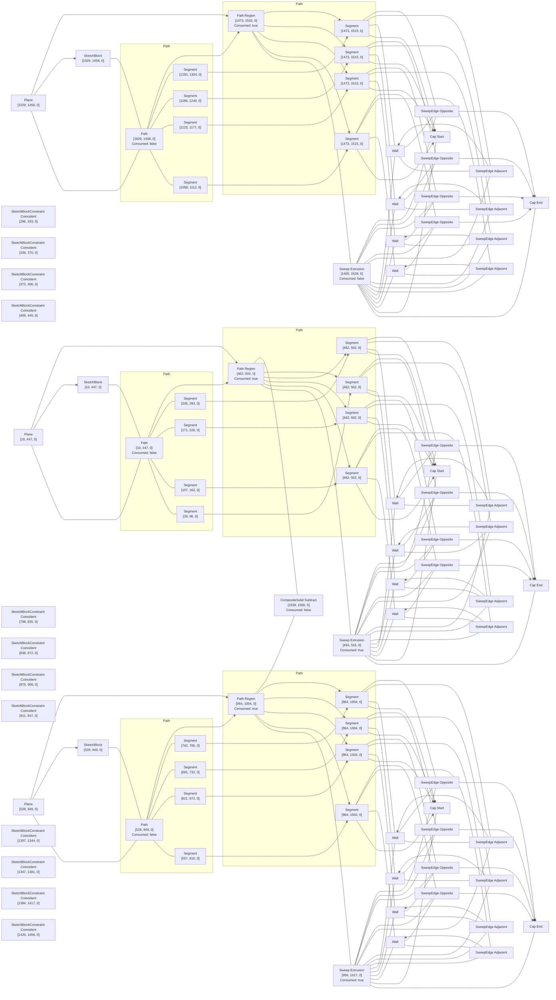

```mermaid
flowchart LR
  subgraph path19 [Path]
    19["Path<br>[10, 447, 0]<br>Consumed: false"]
      %% [ProgramBodyItem { index: 0 }, VariableDeclarationDeclaration, VariableDeclarationInit]
    22["Segment<br>[39, 96, 0]"]
      %% [ProgramBodyItem { index: 0 }, VariableDeclarationDeclaration, VariableDeclarationInit, SketchBlockBody, SketchBlockBodyItem { index: 0 }, VariableDeclarationDeclaration, VariableDeclarationInit]
    23["Segment<br>[107, 162, 0]"]
      %% [ProgramBodyItem { index: 0 }, VariableDeclarationDeclaration, VariableDeclarationInit, SketchBlockBody, SketchBlockBodyItem { index: 1 }, VariableDeclarationDeclaration, VariableDeclarationInit]
    24["Segment<br>[171, 226, 0]"]
      %% [ProgramBodyItem { index: 0 }, VariableDeclarationDeclaration, VariableDeclarationInit, SketchBlockBody, SketchBlockBodyItem { index: 2 }, VariableDeclarationDeclaration, VariableDeclarationInit]
    25["Segment<br>[236, 293, 0]"]
      %% [ProgramBodyItem { index: 0 }, VariableDeclarationDeclaration, VariableDeclarationInit, SketchBlockBody, SketchBlockBodyItem { index: 3 }, VariableDeclarationDeclaration, VariableDeclarationInit]
  end
  subgraph path31 [Path]
    31["Path Region<br>[462, 502, 0]<br>Consumed: true"]
      %% [ProgramBodyItem { index: 1 }, VariableDeclarationDeclaration, VariableDeclarationInit, CallKwUnlabeledArg]
    32["Segment<br>[462, 502, 0]"]
      %% [ProgramBodyItem { index: 1 }, VariableDeclarationDeclaration, VariableDeclarationInit, CallKwUnlabeledArg]
    33["Segment<br>[462, 502, 0]"]
      %% [ProgramBodyItem { index: 1 }, VariableDeclarationDeclaration, VariableDeclarationInit, CallKwUnlabeledArg]
    34["Segment<br>[462, 502, 0]"]
      %% [ProgramBodyItem { index: 1 }, VariableDeclarationDeclaration, VariableDeclarationInit, CallKwUnlabeledArg]
    35["Segment<br>[462, 502, 0]"]
      %% [ProgramBodyItem { index: 1 }, VariableDeclarationDeclaration, VariableDeclarationInit, CallKwUnlabeledArg]
  end
  subgraph path36 [Path]
    36["Path<br>[528, 949, 0]<br>Consumed: false"]
      %% [ProgramBodyItem { index: 2 }, VariableDeclarationDeclaration, VariableDeclarationInit]
    39["Segment<br>[557, 610, 0]"]
      %% [ProgramBodyItem { index: 2 }, VariableDeclarationDeclaration, VariableDeclarationInit, SketchBlockBody, SketchBlockBodyItem { index: 0 }, VariableDeclarationDeclaration, VariableDeclarationInit]
    40["Segment<br>[621, 672, 0]"]
      %% [ProgramBodyItem { index: 2 }, VariableDeclarationDeclaration, VariableDeclarationInit, SketchBlockBody, SketchBlockBodyItem { index: 1 }, VariableDeclarationDeclaration, VariableDeclarationInit]
    41["Segment<br>[681, 732, 0]"]
      %% [ProgramBodyItem { index: 2 }, VariableDeclarationDeclaration, VariableDeclarationInit, SketchBlockBody, SketchBlockBodyItem { index: 2 }, VariableDeclarationDeclaration, VariableDeclarationInit]
    42["Segment<br>[742, 795, 0]"]
      %% [ProgramBodyItem { index: 2 }, VariableDeclarationDeclaration, VariableDeclarationInit, SketchBlockBody, SketchBlockBodyItem { index: 3 }, VariableDeclarationDeclaration, VariableDeclarationInit]
  end
  subgraph path48 [Path]
    48["Path Region<br>[964, 1004, 0]<br>Consumed: true"]
      %% [ProgramBodyItem { index: 3 }, VariableDeclarationDeclaration, VariableDeclarationInit, CallKwUnlabeledArg]
    49["Segment<br>[964, 1004, 0]"]
      %% [ProgramBodyItem { index: 3 }, VariableDeclarationDeclaration, VariableDeclarationInit, CallKwUnlabeledArg]
    50["Segment<br>[964, 1004, 0]"]
      %% [ProgramBodyItem { index: 3 }, VariableDeclarationDeclaration, VariableDeclarationInit, CallKwUnlabeledArg]
    51["Segment<br>[964, 1004, 0]"]
      %% [ProgramBodyItem { index: 3 }, VariableDeclarationDeclaration, VariableDeclarationInit, CallKwUnlabeledArg]
    52["Segment<br>[964, 1004, 0]"]
      %% [ProgramBodyItem { index: 3 }, VariableDeclarationDeclaration, VariableDeclarationInit, CallKwUnlabeledArg]
  end
  subgraph path53 [Path]
    53["Path<br>[1029, 1458, 0]<br>Consumed: false"]
      %% [ProgramBodyItem { index: 4 }, VariableDeclarationDeclaration, VariableDeclarationInit]
    56["Segment<br>[1058, 1112, 0]"]
      %% [ProgramBodyItem { index: 4 }, VariableDeclarationDeclaration, VariableDeclarationInit, SketchBlockBody, SketchBlockBodyItem { index: 0 }, VariableDeclarationDeclaration, VariableDeclarationInit]
    57["Segment<br>[1123, 1177, 0]"]
      %% [ProgramBodyItem { index: 4 }, VariableDeclarationDeclaration, VariableDeclarationInit, SketchBlockBody, SketchBlockBodyItem { index: 1 }, VariableDeclarationDeclaration, VariableDeclarationInit]
    58["Segment<br>[1186, 1240, 0]"]
      %% [ProgramBodyItem { index: 4 }, VariableDeclarationDeclaration, VariableDeclarationInit, SketchBlockBody, SketchBlockBodyItem { index: 2 }, VariableDeclarationDeclaration, VariableDeclarationInit]
    59["Segment<br>[1250, 1304, 0]"]
      %% [ProgramBodyItem { index: 4 }, VariableDeclarationDeclaration, VariableDeclarationInit, SketchBlockBody, SketchBlockBodyItem { index: 3 }, VariableDeclarationDeclaration, VariableDeclarationInit]
  end
  subgraph path65 [Path]
    65["Path Region<br>[1473, 1515, 0]<br>Consumed: true"]
      %% [ProgramBodyItem { index: 5 }, VariableDeclarationDeclaration, VariableDeclarationInit, CallKwUnlabeledArg]
    66["Segment<br>[1473, 1515, 0]"]
      %% [ProgramBodyItem { index: 5 }, VariableDeclarationDeclaration, VariableDeclarationInit, CallKwUnlabeledArg]
    67["Segment<br>[1473, 1515, 0]"]
      %% [ProgramBodyItem { index: 5 }, VariableDeclarationDeclaration, VariableDeclarationInit, CallKwUnlabeledArg]
    68["Segment<br>[1473, 1515, 0]"]
      %% [ProgramBodyItem { index: 5 }, VariableDeclarationDeclaration, VariableDeclarationInit, CallKwUnlabeledArg]
    69["Segment<br>[1473, 1515, 0]"]
      %% [ProgramBodyItem { index: 5 }, VariableDeclarationDeclaration, VariableDeclarationInit, CallKwUnlabeledArg]
  end
  1["Cap End"]
    %% face_code_ref=Missing NodePath
  2["Cap End"]
    %% face_code_ref=Missing NodePath
  3["Cap End"]
    %% face_code_ref=Missing NodePath
  4["Cap Start"]
    %% face_code_ref=Missing NodePath
  5["Cap Start"]
    %% face_code_ref=Missing NodePath
  6["Cap Start"]
    %% face_code_ref=Missing NodePath
  7[Wall]
    %% face_code_ref=Missing NodePath
  8[Wall]
    %% face_code_ref=Missing NodePath
  9[Wall]
    %% face_code_ref=Missing NodePath
  10[Wall]
    %% face_code_ref=Missing NodePath
  11[Wall]
    %% face_code_ref=Missing NodePath
  12[Wall]
    %% face_code_ref=Missing NodePath
  13[Wall]
    %% face_code_ref=Missing NodePath
  14[Wall]
    %% face_code_ref=Missing NodePath
  15[Wall]
    %% face_code_ref=Missing NodePath
  16[Wall]
    %% face_code_ref=Missing NodePath
  17[Wall]
    %% face_code_ref=Missing NodePath
  18[Wall]
    %% face_code_ref=Missing NodePath
  20["Plane<br>[10, 447, 0]"]
    %% [ProgramBodyItem { index: 0 }, VariableDeclarationDeclaration, VariableDeclarationInit]
  21["SketchBlock<br>[10, 447, 0]"]
    %% [ProgramBodyItem { index: 0 }, VariableDeclarationDeclaration, VariableDeclarationInit]
  26["SketchBlockConstraint Coincident<br>[296, 333, 0]"]
    %% [ProgramBodyItem { index: 0 }, VariableDeclarationDeclaration, VariableDeclarationInit, SketchBlockBody, SketchBlockBodyItem { index: 4 }, ExpressionStatementExpr]
  27["SketchBlockConstraint Coincident<br>[336, 370, 0]"]
    %% [ProgramBodyItem { index: 0 }, VariableDeclarationDeclaration, VariableDeclarationInit, SketchBlockBody, SketchBlockBodyItem { index: 5 }, ExpressionStatementExpr]
  28["SketchBlockConstraint Coincident<br>[373, 406, 0]"]
    %% [ProgramBodyItem { index: 0 }, VariableDeclarationDeclaration, VariableDeclarationInit, SketchBlockBody, SketchBlockBodyItem { index: 6 }, ExpressionStatementExpr]
  29["SketchBlockConstraint Coincident<br>[409, 445, 0]"]
    %% [ProgramBodyItem { index: 0 }, VariableDeclarationDeclaration, VariableDeclarationInit, SketchBlockBody, SketchBlockBodyItem { index: 7 }, ExpressionStatementExpr]
  30["Sweep Extrusion<br>[454, 516, 0]<br>Consumed: true"]
    %% [ProgramBodyItem { index: 1 }, VariableDeclarationDeclaration, VariableDeclarationInit]
  37["Plane<br>[528, 949, 0]"]
    %% [ProgramBodyItem { index: 2 }, VariableDeclarationDeclaration, VariableDeclarationInit]
  38["SketchBlock<br>[528, 949, 0]"]
    %% [ProgramBodyItem { index: 2 }, VariableDeclarationDeclaration, VariableDeclarationInit]
  43["SketchBlockConstraint Coincident<br>[798, 835, 0]"]
    %% [ProgramBodyItem { index: 2 }, VariableDeclarationDeclaration, VariableDeclarationInit, SketchBlockBody, SketchBlockBodyItem { index: 4 }, ExpressionStatementExpr]
  44["SketchBlockConstraint Coincident<br>[838, 872, 0]"]
    %% [ProgramBodyItem { index: 2 }, VariableDeclarationDeclaration, VariableDeclarationInit, SketchBlockBody, SketchBlockBodyItem { index: 5 }, ExpressionStatementExpr]
  45["SketchBlockConstraint Coincident<br>[875, 908, 0]"]
    %% [ProgramBodyItem { index: 2 }, VariableDeclarationDeclaration, VariableDeclarationInit, SketchBlockBody, SketchBlockBodyItem { index: 6 }, ExpressionStatementExpr]
  46["SketchBlockConstraint Coincident<br>[911, 947, 0]"]
    %% [ProgramBodyItem { index: 2 }, VariableDeclarationDeclaration, VariableDeclarationInit, SketchBlockBody, SketchBlockBodyItem { index: 7 }, ExpressionStatementExpr]
  47["Sweep Extrusion<br>[956, 1017, 0]<br>Consumed: true"]
    %% [ProgramBodyItem { index: 3 }, VariableDeclarationDeclaration, VariableDeclarationInit]
  54["Plane<br>[1029, 1458, 0]"]
    %% [ProgramBodyItem { index: 4 }, VariableDeclarationDeclaration, VariableDeclarationInit]
  55["SketchBlock<br>[1029, 1458, 0]"]
    %% [ProgramBodyItem { index: 4 }, VariableDeclarationDeclaration, VariableDeclarationInit]
  60["SketchBlockConstraint Coincident<br>[1307, 1344, 0]"]
    %% [ProgramBodyItem { index: 4 }, VariableDeclarationDeclaration, VariableDeclarationInit, SketchBlockBody, SketchBlockBodyItem { index: 4 }, ExpressionStatementExpr]
  61["SketchBlockConstraint Coincident<br>[1347, 1381, 0]"]
    %% [ProgramBodyItem { index: 4 }, VariableDeclarationDeclaration, VariableDeclarationInit, SketchBlockBody, SketchBlockBodyItem { index: 5 }, ExpressionStatementExpr]
  62["SketchBlockConstraint Coincident<br>[1384, 1417, 0]"]
    %% [ProgramBodyItem { index: 4 }, VariableDeclarationDeclaration, VariableDeclarationInit, SketchBlockBody, SketchBlockBodyItem { index: 6 }, ExpressionStatementExpr]
  63["SketchBlockConstraint Coincident<br>[1420, 1456, 0]"]
    %% [ProgramBodyItem { index: 4 }, VariableDeclarationDeclaration, VariableDeclarationInit, SketchBlockBody, SketchBlockBodyItem { index: 7 }, ExpressionStatementExpr]
  64["Sweep Extrusion<br>[1465, 1528, 0]<br>Consumed: false"]
    %% [ProgramBodyItem { index: 5 }, VariableDeclarationDeclaration, VariableDeclarationInit]
  70["CompositeSolid Subtract<br>[1539, 1565, 0]<br>Consumed: false"]
    %% [ProgramBodyItem { index: 6 }, VariableDeclarationDeclaration, VariableDeclarationInit]
  71["SweepEdge Adjacent"]
  72["SweepEdge Adjacent"]
  73["SweepEdge Adjacent"]
  74["SweepEdge Adjacent"]
  75["SweepEdge Adjacent"]
  76["SweepEdge Adjacent"]
  77["SweepEdge Adjacent"]
  78["SweepEdge Adjacent"]
  79["SweepEdge Adjacent"]
  80["SweepEdge Adjacent"]
  81["SweepEdge Adjacent"]
  82["SweepEdge Adjacent"]
  83["SweepEdge Opposite"]
  84["SweepEdge Opposite"]
  85["SweepEdge Opposite"]
  86["SweepEdge Opposite"]
  87["SweepEdge Opposite"]
  88["SweepEdge Opposite"]
  89["SweepEdge Opposite"]
  90["SweepEdge Opposite"]
  91["SweepEdge Opposite"]
  92["SweepEdge Opposite"]
  93["SweepEdge Opposite"]
  94["SweepEdge Opposite"]
  64 --- 1
  83 <--x 1
  84 <--x 1
  85 <--x 1
  86 <--x 1
  30 --- 2
  87 <--x 2
  88 <--x 2
  89 <--x 2
  90 <--x 2
  47 --- 3
  91 <--x 3
  92 <--x 3
  93 <--x 3
  94 <--x 3
  64 --- 4
  66 <--x 4
  67 <--x 4
  68 <--x 4
  69 <--x 4
  30 --- 5
  32 <--x 5
  33 <--x 5
  34 <--x 5
  35 <--x 5
  47 --- 6
  49 <--x 6
  50 <--x 6
  51 <--x 6
  52 <--x 6
  64 --- 7
  66 --- 7
  7 --- 71
  71 <--x 7
  7 --- 83
  64 --- 8
  67 --- 8
  8 --- 72
  72 <--x 8
  8 --- 84
  64 --- 9
  68 --- 9
  9 --- 73
  73 <--x 9
  9 --- 85
  64 --- 10
  69 --- 10
  10 --- 74
  74 <--x 10
  10 --- 86
  30 --- 11
  32 --- 11
  11 --- 75
  75 <--x 11
  11 --- 87
  30 --- 12
  33 --- 12
  12 --- 76
  76 <--x 12
  12 --- 88
  30 --- 13
  34 --- 13
  13 --- 77
  77 <--x 13
  13 --- 89
  30 --- 14
  35 --- 14
  14 --- 78
  78 <--x 14
  14 --- 90
  47 --- 15
  49 --- 15
  15 --- 79
  79 <--x 15
  15 --- 91
  47 --- 16
  50 --- 16
  16 --- 80
  80 <--x 16
  16 --- 92
  47 --- 17
  51 --- 17
  17 --- 81
  81 <--x 17
  17 --- 93
  47 --- 18
  52 --- 18
  18 --- 82
  82 <--x 18
  18 --- 94
  20 --- 19
  21 --- 19
  19 --- 22
  19 --- 23
  19 --- 24
  19 --- 25
  19 <--x 31
  20 <--x 21
  20 <--x 31
  22 <--x 35
  23 <--x 32
  24 <--x 33
  25 <--x 34
  31 ---- 30
  30 --- 75
  30 --- 76
  30 --- 77
  30 --- 78
  30 --- 87
  30 --- 88
  30 --- 89
  30 --- 90
  31 <--x 32
  31 <--x 33
  31 <--x 34
  31 <--x 35
  31 --- 70
  32 --- 75
  32 --- 87
  33 --- 76
  33 --- 88
  34 --- 77
  34 --- 89
  35 --- 78
  35 --- 90
  37 --- 36
  38 --- 36
  36 --- 39
  36 --- 40
  36 --- 41
  36 --- 42
  36 <--x 48
  37 <--x 38
  37 <--x 48
  39 <--x 49
  40 <--x 50
  41 <--x 51
  42 <--x 52
  48 ---- 47
  47 --- 79
  47 --- 80
  47 --- 81
  47 --- 82
  47 --- 91
  47 --- 92
  47 --- 93
  47 --- 94
  48 <--x 49
  48 <--x 50
  48 <--x 51
  48 <--x 52
  48 --- 70
  49 --- 79
  49 --- 91
  50 --- 80
  50 --- 92
  51 --- 81
  51 --- 93
  52 --- 82
  52 --- 94
  54 --- 53
  55 --- 53
  53 --- 56
  53 --- 57
  53 --- 58
  53 --- 59
  53 <--x 65
  54 <--x 55
  54 <--x 65
  56 <--x 66
  57 <--x 67
  58 <--x 68
  59 <--x 69
  65 ---- 64
  64 --- 71
  64 --- 72
  64 --- 73
  64 --- 74
  64 --- 83
  64 --- 84
  64 --- 85
  64 --- 86
  65 <--x 66
  65 <--x 67
  65 <--x 68
  65 <--x 69
  66 --- 71
  66 --- 83
  67 --- 72
  67 --- 84
  68 --- 73
  68 --- 85
  69 --- 74
  69 --- 86
```
