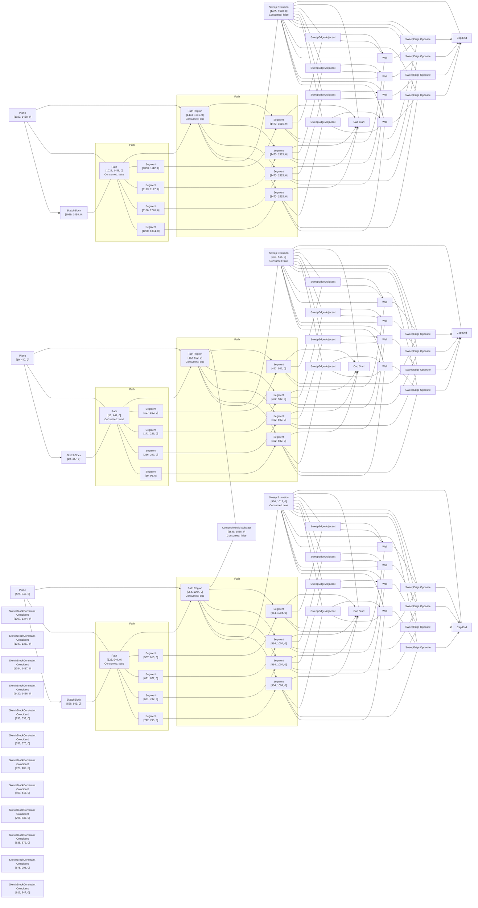

```mermaid
flowchart LR
  subgraph path8 [Path]
    8["Path Region<br>[1473, 1515, 0]<br>Consumed: true"]
      %% [ProgramBodyItem { index: 5 }, VariableDeclarationDeclaration, VariableDeclarationInit, CallKwUnlabeledArg]
    22["Segment<br>[1473, 1515, 0]"]
      %% [ProgramBodyItem { index: 5 }, VariableDeclarationDeclaration, VariableDeclarationInit, CallKwUnlabeledArg]
    23["Segment<br>[1473, 1515, 0]"]
      %% [ProgramBodyItem { index: 5 }, VariableDeclarationDeclaration, VariableDeclarationInit, CallKwUnlabeledArg]
    24["Segment<br>[1473, 1515, 0]"]
      %% [ProgramBodyItem { index: 5 }, VariableDeclarationDeclaration, VariableDeclarationInit, CallKwUnlabeledArg]
    25["Segment<br>[1473, 1515, 0]"]
      %% [ProgramBodyItem { index: 5 }, VariableDeclarationDeclaration, VariableDeclarationInit, CallKwUnlabeledArg]
  end
  subgraph path9 [Path]
    9["Path Region<br>[462, 502, 0]<br>Consumed: true"]
      %% [ProgramBodyItem { index: 1 }, VariableDeclarationDeclaration, VariableDeclarationInit, CallKwUnlabeledArg]
    29["Segment<br>[462, 502, 0]"]
      %% [ProgramBodyItem { index: 1 }, VariableDeclarationDeclaration, VariableDeclarationInit, CallKwUnlabeledArg]
    30["Segment<br>[462, 502, 0]"]
      %% [ProgramBodyItem { index: 1 }, VariableDeclarationDeclaration, VariableDeclarationInit, CallKwUnlabeledArg]
    31["Segment<br>[462, 502, 0]"]
      %% [ProgramBodyItem { index: 1 }, VariableDeclarationDeclaration, VariableDeclarationInit, CallKwUnlabeledArg]
    32["Segment<br>[462, 502, 0]"]
      %% [ProgramBodyItem { index: 1 }, VariableDeclarationDeclaration, VariableDeclarationInit, CallKwUnlabeledArg]
  end
  subgraph path10 [Path]
    10["Path Region<br>[964, 1004, 0]<br>Consumed: true"]
      %% [ProgramBodyItem { index: 3 }, VariableDeclarationDeclaration, VariableDeclarationInit, CallKwUnlabeledArg]
    37["Segment<br>[964, 1004, 0]"]
      %% [ProgramBodyItem { index: 3 }, VariableDeclarationDeclaration, VariableDeclarationInit, CallKwUnlabeledArg]
    38["Segment<br>[964, 1004, 0]"]
      %% [ProgramBodyItem { index: 3 }, VariableDeclarationDeclaration, VariableDeclarationInit, CallKwUnlabeledArg]
    39["Segment<br>[964, 1004, 0]"]
      %% [ProgramBodyItem { index: 3 }, VariableDeclarationDeclaration, VariableDeclarationInit, CallKwUnlabeledArg]
    40["Segment<br>[964, 1004, 0]"]
      %% [ProgramBodyItem { index: 3 }, VariableDeclarationDeclaration, VariableDeclarationInit, CallKwUnlabeledArg]
  end
  subgraph path11 [Path]
    11["Path<br>[1029, 1458, 0]<br>Consumed: false"]
      %% [ProgramBodyItem { index: 4 }, VariableDeclarationDeclaration, VariableDeclarationInit]
    17["Segment<br>[1058, 1112, 0]"]
      %% [ProgramBodyItem { index: 4 }, VariableDeclarationDeclaration, VariableDeclarationInit, SketchBlockBody, SketchBlockBodyItem { index: 0 }, VariableDeclarationDeclaration, VariableDeclarationInit]
    19["Segment<br>[1123, 1177, 0]"]
      %% [ProgramBodyItem { index: 4 }, VariableDeclarationDeclaration, VariableDeclarationInit, SketchBlockBody, SketchBlockBodyItem { index: 1 }, VariableDeclarationDeclaration, VariableDeclarationInit]
    20["Segment<br>[1186, 1240, 0]"]
      %% [ProgramBodyItem { index: 4 }, VariableDeclarationDeclaration, VariableDeclarationInit, SketchBlockBody, SketchBlockBodyItem { index: 2 }, VariableDeclarationDeclaration, VariableDeclarationInit]
    21["Segment<br>[1250, 1304, 0]"]
      %% [ProgramBodyItem { index: 4 }, VariableDeclarationDeclaration, VariableDeclarationInit, SketchBlockBody, SketchBlockBodyItem { index: 3 }, VariableDeclarationDeclaration, VariableDeclarationInit]
  end
  subgraph path12 [Path]
    12["Path<br>[10, 447, 0]<br>Consumed: false"]
      %% [ProgramBodyItem { index: 0 }, VariableDeclarationDeclaration, VariableDeclarationInit]
    18["Segment<br>[107, 162, 0]"]
      %% [ProgramBodyItem { index: 0 }, VariableDeclarationDeclaration, VariableDeclarationInit, SketchBlockBody, SketchBlockBodyItem { index: 1 }, VariableDeclarationDeclaration, VariableDeclarationInit]
    26["Segment<br>[171, 226, 0]"]
      %% [ProgramBodyItem { index: 0 }, VariableDeclarationDeclaration, VariableDeclarationInit, SketchBlockBody, SketchBlockBodyItem { index: 2 }, VariableDeclarationDeclaration, VariableDeclarationInit]
    27["Segment<br>[236, 293, 0]"]
      %% [ProgramBodyItem { index: 0 }, VariableDeclarationDeclaration, VariableDeclarationInit, SketchBlockBody, SketchBlockBodyItem { index: 3 }, VariableDeclarationDeclaration, VariableDeclarationInit]
    28["Segment<br>[39, 96, 0]"]
      %% [ProgramBodyItem { index: 0 }, VariableDeclarationDeclaration, VariableDeclarationInit, SketchBlockBody, SketchBlockBodyItem { index: 0 }, VariableDeclarationDeclaration, VariableDeclarationInit]
  end
  subgraph path13 [Path]
    13["Path<br>[528, 949, 0]<br>Consumed: false"]
      %% [ProgramBodyItem { index: 2 }, VariableDeclarationDeclaration, VariableDeclarationInit]
    33["Segment<br>[557, 610, 0]"]
      %% [ProgramBodyItem { index: 2 }, VariableDeclarationDeclaration, VariableDeclarationInit, SketchBlockBody, SketchBlockBodyItem { index: 0 }, VariableDeclarationDeclaration, VariableDeclarationInit]
    34["Segment<br>[621, 672, 0]"]
      %% [ProgramBodyItem { index: 2 }, VariableDeclarationDeclaration, VariableDeclarationInit, SketchBlockBody, SketchBlockBodyItem { index: 1 }, VariableDeclarationDeclaration, VariableDeclarationInit]
    35["Segment<br>[681, 732, 0]"]
      %% [ProgramBodyItem { index: 2 }, VariableDeclarationDeclaration, VariableDeclarationInit, SketchBlockBody, SketchBlockBodyItem { index: 2 }, VariableDeclarationDeclaration, VariableDeclarationInit]
    36["Segment<br>[742, 795, 0]"]
      %% [ProgramBodyItem { index: 2 }, VariableDeclarationDeclaration, VariableDeclarationInit, SketchBlockBody, SketchBlockBodyItem { index: 3 }, VariableDeclarationDeclaration, VariableDeclarationInit]
  end
  1["Cap End"]
    %% face_code_ref=Missing NodePath
  2["Cap End"]
    %% face_code_ref=Missing NodePath
  3["Cap End"]
    %% face_code_ref=Missing NodePath
  4["Cap Start"]
    %% face_code_ref=Missing NodePath
  5["Cap Start"]
    %% face_code_ref=Missing NodePath
  6["Cap Start"]
    %% face_code_ref=Missing NodePath
  7["CompositeSolid Subtract<br>[1539, 1565, 0]<br>Consumed: false"]
    %% [ProgramBodyItem { index: 6 }, VariableDeclarationDeclaration, VariableDeclarationInit]
  14["Plane<br>[1029, 1458, 0]"]
    %% [ProgramBodyItem { index: 4 }, VariableDeclarationDeclaration, VariableDeclarationInit]
  15["Plane<br>[10, 447, 0]"]
    %% [ProgramBodyItem { index: 0 }, VariableDeclarationDeclaration, VariableDeclarationInit]
  16["Plane<br>[528, 949, 0]"]
    %% [ProgramBodyItem { index: 2 }, VariableDeclarationDeclaration, VariableDeclarationInit]
  41["SketchBlock<br>[1029, 1458, 0]"]
    %% [ProgramBodyItem { index: 4 }, VariableDeclarationDeclaration, VariableDeclarationInit]
  42["SketchBlock<br>[10, 447, 0]"]
    %% [ProgramBodyItem { index: 0 }, VariableDeclarationDeclaration, VariableDeclarationInit]
  43["SketchBlock<br>[528, 949, 0]"]
    %% [ProgramBodyItem { index: 2 }, VariableDeclarationDeclaration, VariableDeclarationInit]
  44["SketchBlockConstraint Coincident<br>[1307, 1344, 0]"]
    %% [ProgramBodyItem { index: 4 }, VariableDeclarationDeclaration, VariableDeclarationInit, SketchBlockBody, SketchBlockBodyItem { index: 4 }, ExpressionStatementExpr]
  45["SketchBlockConstraint Coincident<br>[1347, 1381, 0]"]
    %% [ProgramBodyItem { index: 4 }, VariableDeclarationDeclaration, VariableDeclarationInit, SketchBlockBody, SketchBlockBodyItem { index: 5 }, ExpressionStatementExpr]
  46["SketchBlockConstraint Coincident<br>[1384, 1417, 0]"]
    %% [ProgramBodyItem { index: 4 }, VariableDeclarationDeclaration, VariableDeclarationInit, SketchBlockBody, SketchBlockBodyItem { index: 6 }, ExpressionStatementExpr]
  47["SketchBlockConstraint Coincident<br>[1420, 1456, 0]"]
    %% [ProgramBodyItem { index: 4 }, VariableDeclarationDeclaration, VariableDeclarationInit, SketchBlockBody, SketchBlockBodyItem { index: 7 }, ExpressionStatementExpr]
  48["SketchBlockConstraint Coincident<br>[296, 333, 0]"]
    %% [ProgramBodyItem { index: 0 }, VariableDeclarationDeclaration, VariableDeclarationInit, SketchBlockBody, SketchBlockBodyItem { index: 4 }, ExpressionStatementExpr]
  49["SketchBlockConstraint Coincident<br>[336, 370, 0]"]
    %% [ProgramBodyItem { index: 0 }, VariableDeclarationDeclaration, VariableDeclarationInit, SketchBlockBody, SketchBlockBodyItem { index: 5 }, ExpressionStatementExpr]
  50["SketchBlockConstraint Coincident<br>[373, 406, 0]"]
    %% [ProgramBodyItem { index: 0 }, VariableDeclarationDeclaration, VariableDeclarationInit, SketchBlockBody, SketchBlockBodyItem { index: 6 }, ExpressionStatementExpr]
  51["SketchBlockConstraint Coincident<br>[409, 445, 0]"]
    %% [ProgramBodyItem { index: 0 }, VariableDeclarationDeclaration, VariableDeclarationInit, SketchBlockBody, SketchBlockBodyItem { index: 7 }, ExpressionStatementExpr]
  52["SketchBlockConstraint Coincident<br>[798, 835, 0]"]
    %% [ProgramBodyItem { index: 2 }, VariableDeclarationDeclaration, VariableDeclarationInit, SketchBlockBody, SketchBlockBodyItem { index: 4 }, ExpressionStatementExpr]
  53["SketchBlockConstraint Coincident<br>[838, 872, 0]"]
    %% [ProgramBodyItem { index: 2 }, VariableDeclarationDeclaration, VariableDeclarationInit, SketchBlockBody, SketchBlockBodyItem { index: 5 }, ExpressionStatementExpr]
  54["SketchBlockConstraint Coincident<br>[875, 908, 0]"]
    %% [ProgramBodyItem { index: 2 }, VariableDeclarationDeclaration, VariableDeclarationInit, SketchBlockBody, SketchBlockBodyItem { index: 6 }, ExpressionStatementExpr]
  55["SketchBlockConstraint Coincident<br>[911, 947, 0]"]
    %% [ProgramBodyItem { index: 2 }, VariableDeclarationDeclaration, VariableDeclarationInit, SketchBlockBody, SketchBlockBodyItem { index: 7 }, ExpressionStatementExpr]
  56["Sweep Extrusion<br>[1465, 1528, 0]<br>Consumed: false"]
    %% [ProgramBodyItem { index: 5 }, VariableDeclarationDeclaration, VariableDeclarationInit]
  57["Sweep Extrusion<br>[454, 516, 0]<br>Consumed: true"]
    %% [ProgramBodyItem { index: 1 }, VariableDeclarationDeclaration, VariableDeclarationInit]
  58["Sweep Extrusion<br>[956, 1017, 0]<br>Consumed: true"]
    %% [ProgramBodyItem { index: 3 }, VariableDeclarationDeclaration, VariableDeclarationInit]
  59["SweepEdge Adjacent"]
  60["SweepEdge Adjacent"]
  61["SweepEdge Adjacent"]
  62["SweepEdge Adjacent"]
  63["SweepEdge Adjacent"]
  64["SweepEdge Adjacent"]
  65["SweepEdge Adjacent"]
  66["SweepEdge Adjacent"]
  67["SweepEdge Adjacent"]
  68["SweepEdge Adjacent"]
  69["SweepEdge Adjacent"]
  70["SweepEdge Adjacent"]
  71["SweepEdge Opposite"]
  72["SweepEdge Opposite"]
  73["SweepEdge Opposite"]
  74["SweepEdge Opposite"]
  75["SweepEdge Opposite"]
  76["SweepEdge Opposite"]
  77["SweepEdge Opposite"]
  78["SweepEdge Opposite"]
  79["SweepEdge Opposite"]
  80["SweepEdge Opposite"]
  81["SweepEdge Opposite"]
  82["SweepEdge Opposite"]
  83[Wall]
    %% face_code_ref=Missing NodePath
  84[Wall]
    %% face_code_ref=Missing NodePath
  85[Wall]
    %% face_code_ref=Missing NodePath
  86[Wall]
    %% face_code_ref=Missing NodePath
  87[Wall]
    %% face_code_ref=Missing NodePath
  88[Wall]
    %% face_code_ref=Missing NodePath
  89[Wall]
    %% face_code_ref=Missing NodePath
  90[Wall]
    %% face_code_ref=Missing NodePath
  91[Wall]
    %% face_code_ref=Missing NodePath
  92[Wall]
    %% face_code_ref=Missing NodePath
  93[Wall]
    %% face_code_ref=Missing NodePath
  94[Wall]
    %% face_code_ref=Missing NodePath
  56 --- 1
  71 <--x 1
  72 <--x 1
  73 <--x 1
  74 <--x 1
  57 --- 2
  75 <--x 2
  76 <--x 2
  77 <--x 2
  78 <--x 2
  58 --- 3
  79 <--x 3
  80 <--x 3
  81 <--x 3
  82 <--x 3
  22 <--x 4
  23 <--x 4
  24 <--x 4
  25 <--x 4
  56 --- 4
  29 <--x 5
  30 <--x 5
  31 <--x 5
  32 <--x 5
  57 --- 5
  37 <--x 6
  38 <--x 6
  39 <--x 6
  40 <--x 6
  58 --- 6
  9 --- 7
  10 --- 7
  11 x--> 8
  14 x--> 8
  8 <--x 22
  8 <--x 23
  8 <--x 24
  8 <--x 25
  8 ---- 56
  12 x--> 9
  15 x--> 9
  9 <--x 29
  9 <--x 30
  9 <--x 31
  9 <--x 32
  9 ---- 57
  13 x--> 10
  16 x--> 10
  10 <--x 37
  10 <--x 38
  10 <--x 39
  10 <--x 40
  10 ---- 58
  14 --- 11
  11 --- 17
  11 --- 19
  11 --- 20
  11 --- 21
  41 --- 11
  15 --- 12
  12 --- 18
  12 --- 26
  12 --- 27
  12 --- 28
  42 --- 12
  16 --- 13
  13 --- 33
  13 --- 34
  13 --- 35
  13 --- 36
  43 --- 13
  14 <--x 41
  15 <--x 42
  16 <--x 43
  17 <--x 22
  18 <--x 29
  19 <--x 23
  20 <--x 24
  21 <--x 25
  22 --- 59
  22 --- 71
  22 --- 83
  23 --- 60
  23 --- 72
  23 --- 84
  24 --- 61
  24 --- 73
  24 --- 85
  25 --- 62
  25 --- 74
  25 --- 86
  26 <--x 30
  27 <--x 31
  28 <--x 32
  29 --- 63
  29 --- 75
  29 --- 87
  30 --- 64
  30 --- 76
  30 --- 88
  31 --- 65
  31 --- 77
  31 --- 89
  32 --- 66
  32 --- 78
  32 --- 90
  33 <--x 37
  34 <--x 38
  35 <--x 39
  36 <--x 40
  37 --- 67
  37 --- 79
  37 --- 91
  38 --- 68
  38 --- 80
  38 --- 92
  39 --- 69
  39 --- 81
  39 --- 93
  40 --- 70
  40 --- 82
  40 --- 94
  56 --- 59
  56 --- 60
  56 --- 61
  56 --- 62
  56 --- 71
  56 --- 72
  56 --- 73
  56 --- 74
  56 --- 83
  56 --- 84
  56 --- 85
  56 --- 86
  57 --- 63
  57 --- 64
  57 --- 65
  57 --- 66
  57 --- 75
  57 --- 76
  57 --- 77
  57 --- 78
  57 --- 87
  57 --- 88
  57 --- 89
  57 --- 90
  58 --- 67
  58 --- 68
  58 --- 69
  58 --- 70
  58 --- 79
  58 --- 80
  58 --- 81
  58 --- 82
  58 --- 91
  58 --- 92
  58 --- 93
  58 --- 94
  83 --- 59
  59 x--> 83
  60 x--> 84
  84 --- 60
  61 x--> 85
  85 --- 61
  62 x--> 86
  86 --- 62
  87 --- 63
  63 x--> 87
  64 x--> 88
  88 --- 64
  65 x--> 89
  89 --- 65
  66 x--> 90
  90 --- 66
  91 --- 67
  67 x--> 91
  68 x--> 92
  92 --- 68
  69 x--> 93
  93 --- 69
  70 x--> 94
  94 --- 70
  83 --- 71
  84 --- 72
  85 --- 73
  86 --- 74
  87 --- 75
  88 --- 76
  89 --- 77
  90 --- 78
  91 --- 79
  92 --- 80
  93 --- 81
  94 --- 82
```
