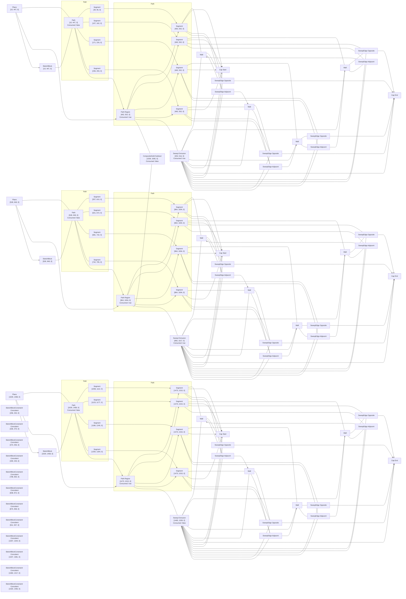

```mermaid
flowchart LR
  subgraph path2 [Path]
    2["Path<br>[10, 447, 0]<br>Consumed: false"]
      %% [ProgramBodyItem { index: 0 }, VariableDeclarationDeclaration, VariableDeclarationInit]
    3["Segment<br>[39, 96, 0]"]
      %% [ProgramBodyItem { index: 0 }, VariableDeclarationDeclaration, VariableDeclarationInit, SketchBlockBody, SketchBlockBodyItem { index: 0 }, VariableDeclarationDeclaration, VariableDeclarationInit]
    4["Segment<br>[107, 162, 0]"]
      %% [ProgramBodyItem { index: 0 }, VariableDeclarationDeclaration, VariableDeclarationInit, SketchBlockBody, SketchBlockBodyItem { index: 1 }, VariableDeclarationDeclaration, VariableDeclarationInit]
    5["Segment<br>[171, 226, 0]"]
      %% [ProgramBodyItem { index: 0 }, VariableDeclarationDeclaration, VariableDeclarationInit, SketchBlockBody, SketchBlockBodyItem { index: 2 }, VariableDeclarationDeclaration, VariableDeclarationInit]
    6["Segment<br>[236, 293, 0]"]
      %% [ProgramBodyItem { index: 0 }, VariableDeclarationDeclaration, VariableDeclarationInit, SketchBlockBody, SketchBlockBodyItem { index: 3 }, VariableDeclarationDeclaration, VariableDeclarationInit]
  end
  subgraph path7 [Path]
    7["Path Region<br>[462, 502, 0]<br>Consumed: true"]
      %% [ProgramBodyItem { index: 1 }, VariableDeclarationDeclaration, VariableDeclarationInit, CallKwUnlabeledArg]
    8["Segment<br>[462, 502, 0]"]
      %% [ProgramBodyItem { index: 1 }, VariableDeclarationDeclaration, VariableDeclarationInit, CallKwUnlabeledArg]
    9["Segment<br>[462, 502, 0]"]
      %% [ProgramBodyItem { index: 1 }, VariableDeclarationDeclaration, VariableDeclarationInit, CallKwUnlabeledArg]
    10["Segment<br>[462, 502, 0]"]
      %% [ProgramBodyItem { index: 1 }, VariableDeclarationDeclaration, VariableDeclarationInit, CallKwUnlabeledArg]
    11["Segment<br>[462, 502, 0]"]
      %% [ProgramBodyItem { index: 1 }, VariableDeclarationDeclaration, VariableDeclarationInit, CallKwUnlabeledArg]
  end
  subgraph path28 [Path]
    28["Path<br>[528, 949, 0]<br>Consumed: false"]
      %% [ProgramBodyItem { index: 2 }, VariableDeclarationDeclaration, VariableDeclarationInit]
    29["Segment<br>[557, 610, 0]"]
      %% [ProgramBodyItem { index: 2 }, VariableDeclarationDeclaration, VariableDeclarationInit, SketchBlockBody, SketchBlockBodyItem { index: 0 }, VariableDeclarationDeclaration, VariableDeclarationInit]
    30["Segment<br>[621, 672, 0]"]
      %% [ProgramBodyItem { index: 2 }, VariableDeclarationDeclaration, VariableDeclarationInit, SketchBlockBody, SketchBlockBodyItem { index: 1 }, VariableDeclarationDeclaration, VariableDeclarationInit]
    31["Segment<br>[681, 732, 0]"]
      %% [ProgramBodyItem { index: 2 }, VariableDeclarationDeclaration, VariableDeclarationInit, SketchBlockBody, SketchBlockBodyItem { index: 2 }, VariableDeclarationDeclaration, VariableDeclarationInit]
    32["Segment<br>[742, 795, 0]"]
      %% [ProgramBodyItem { index: 2 }, VariableDeclarationDeclaration, VariableDeclarationInit, SketchBlockBody, SketchBlockBodyItem { index: 3 }, VariableDeclarationDeclaration, VariableDeclarationInit]
  end
  subgraph path33 [Path]
    33["Path Region<br>[964, 1004, 0]<br>Consumed: true"]
      %% [ProgramBodyItem { index: 3 }, VariableDeclarationDeclaration, VariableDeclarationInit, CallKwUnlabeledArg]
    34["Segment<br>[964, 1004, 0]"]
      %% [ProgramBodyItem { index: 3 }, VariableDeclarationDeclaration, VariableDeclarationInit, CallKwUnlabeledArg]
    35["Segment<br>[964, 1004, 0]"]
      %% [ProgramBodyItem { index: 3 }, VariableDeclarationDeclaration, VariableDeclarationInit, CallKwUnlabeledArg]
    36["Segment<br>[964, 1004, 0]"]
      %% [ProgramBodyItem { index: 3 }, VariableDeclarationDeclaration, VariableDeclarationInit, CallKwUnlabeledArg]
    37["Segment<br>[964, 1004, 0]"]
      %% [ProgramBodyItem { index: 3 }, VariableDeclarationDeclaration, VariableDeclarationInit, CallKwUnlabeledArg]
  end
  subgraph path54 [Path]
    54["Path<br>[1029, 1458, 0]<br>Consumed: false"]
      %% [ProgramBodyItem { index: 4 }, VariableDeclarationDeclaration, VariableDeclarationInit]
    55["Segment<br>[1058, 1112, 0]"]
      %% [ProgramBodyItem { index: 4 }, VariableDeclarationDeclaration, VariableDeclarationInit, SketchBlockBody, SketchBlockBodyItem { index: 0 }, VariableDeclarationDeclaration, VariableDeclarationInit]
    56["Segment<br>[1123, 1177, 0]"]
      %% [ProgramBodyItem { index: 4 }, VariableDeclarationDeclaration, VariableDeclarationInit, SketchBlockBody, SketchBlockBodyItem { index: 1 }, VariableDeclarationDeclaration, VariableDeclarationInit]
    57["Segment<br>[1186, 1240, 0]"]
      %% [ProgramBodyItem { index: 4 }, VariableDeclarationDeclaration, VariableDeclarationInit, SketchBlockBody, SketchBlockBodyItem { index: 2 }, VariableDeclarationDeclaration, VariableDeclarationInit]
    58["Segment<br>[1250, 1304, 0]"]
      %% [ProgramBodyItem { index: 4 }, VariableDeclarationDeclaration, VariableDeclarationInit, SketchBlockBody, SketchBlockBodyItem { index: 3 }, VariableDeclarationDeclaration, VariableDeclarationInit]
  end
  subgraph path59 [Path]
    59["Path Region<br>[1473, 1515, 0]<br>Consumed: true"]
      %% [ProgramBodyItem { index: 5 }, VariableDeclarationDeclaration, VariableDeclarationInit, CallKwUnlabeledArg]
    60["Segment<br>[1473, 1515, 0]"]
      %% [ProgramBodyItem { index: 5 }, VariableDeclarationDeclaration, VariableDeclarationInit, CallKwUnlabeledArg]
    61["Segment<br>[1473, 1515, 0]"]
      %% [ProgramBodyItem { index: 5 }, VariableDeclarationDeclaration, VariableDeclarationInit, CallKwUnlabeledArg]
    62["Segment<br>[1473, 1515, 0]"]
      %% [ProgramBodyItem { index: 5 }, VariableDeclarationDeclaration, VariableDeclarationInit, CallKwUnlabeledArg]
    63["Segment<br>[1473, 1515, 0]"]
      %% [ProgramBodyItem { index: 5 }, VariableDeclarationDeclaration, VariableDeclarationInit, CallKwUnlabeledArg]
  end
  1["Plane<br>[10, 447, 0]"]
    %% [ProgramBodyItem { index: 0 }, VariableDeclarationDeclaration, VariableDeclarationInit]
  12["Sweep Extrusion<br>[454, 516, 0]<br>Consumed: true"]
    %% [ProgramBodyItem { index: 1 }, VariableDeclarationDeclaration, VariableDeclarationInit]
  13[Wall]
    %% face_code_ref=Missing NodePath
  14[Wall]
    %% face_code_ref=Missing NodePath
  15[Wall]
    %% face_code_ref=Missing NodePath
  16[Wall]
    %% face_code_ref=Missing NodePath
  17["Cap Start"]
    %% face_code_ref=Missing NodePath
  18["Cap End"]
    %% face_code_ref=Missing NodePath
  19["SweepEdge Opposite"]
  20["SweepEdge Adjacent"]
  21["SweepEdge Opposite"]
  22["SweepEdge Adjacent"]
  23["SweepEdge Opposite"]
  24["SweepEdge Adjacent"]
  25["SweepEdge Opposite"]
  26["SweepEdge Adjacent"]
  27["Plane<br>[528, 949, 0]"]
    %% [ProgramBodyItem { index: 2 }, VariableDeclarationDeclaration, VariableDeclarationInit]
  38["Sweep Extrusion<br>[956, 1017, 0]<br>Consumed: true"]
    %% [ProgramBodyItem { index: 3 }, VariableDeclarationDeclaration, VariableDeclarationInit]
  39[Wall]
    %% face_code_ref=Missing NodePath
  40[Wall]
    %% face_code_ref=Missing NodePath
  41[Wall]
    %% face_code_ref=Missing NodePath
  42[Wall]
    %% face_code_ref=Missing NodePath
  43["Cap Start"]
    %% face_code_ref=Missing NodePath
  44["Cap End"]
    %% face_code_ref=Missing NodePath
  45["SweepEdge Opposite"]
  46["SweepEdge Adjacent"]
  47["SweepEdge Opposite"]
  48["SweepEdge Adjacent"]
  49["SweepEdge Opposite"]
  50["SweepEdge Adjacent"]
  51["SweepEdge Opposite"]
  52["SweepEdge Adjacent"]
  53["Plane<br>[1029, 1458, 0]"]
    %% [ProgramBodyItem { index: 4 }, VariableDeclarationDeclaration, VariableDeclarationInit]
  64["Sweep Extrusion<br>[1465, 1528, 0]<br>Consumed: false"]
    %% [ProgramBodyItem { index: 5 }, VariableDeclarationDeclaration, VariableDeclarationInit]
  65[Wall]
    %% face_code_ref=Missing NodePath
  66[Wall]
    %% face_code_ref=Missing NodePath
  67[Wall]
    %% face_code_ref=Missing NodePath
  68[Wall]
    %% face_code_ref=Missing NodePath
  69["Cap Start"]
    %% face_code_ref=Missing NodePath
  70["Cap End"]
    %% face_code_ref=Missing NodePath
  71["SweepEdge Opposite"]
  72["SweepEdge Adjacent"]
  73["SweepEdge Opposite"]
  74["SweepEdge Adjacent"]
  75["SweepEdge Opposite"]
  76["SweepEdge Adjacent"]
  77["SweepEdge Opposite"]
  78["SweepEdge Adjacent"]
  79["CompositeSolid Subtract<br>[1539, 1565, 0]<br>Consumed: false"]
    %% [ProgramBodyItem { index: 6 }, VariableDeclarationDeclaration, VariableDeclarationInit]
  80["SketchBlock<br>[10, 447, 0]"]
    %% [ProgramBodyItem { index: 0 }, VariableDeclarationDeclaration, VariableDeclarationInit]
  81["SketchBlockConstraint Coincident<br>[296, 333, 0]"]
    %% [ProgramBodyItem { index: 0 }, VariableDeclarationDeclaration, VariableDeclarationInit, SketchBlockBody, SketchBlockBodyItem { index: 4 }, ExpressionStatementExpr]
  82["SketchBlockConstraint Coincident<br>[336, 370, 0]"]
    %% [ProgramBodyItem { index: 0 }, VariableDeclarationDeclaration, VariableDeclarationInit, SketchBlockBody, SketchBlockBodyItem { index: 5 }, ExpressionStatementExpr]
  83["SketchBlockConstraint Coincident<br>[373, 406, 0]"]
    %% [ProgramBodyItem { index: 0 }, VariableDeclarationDeclaration, VariableDeclarationInit, SketchBlockBody, SketchBlockBodyItem { index: 6 }, ExpressionStatementExpr]
  84["SketchBlockConstraint Coincident<br>[409, 445, 0]"]
    %% [ProgramBodyItem { index: 0 }, VariableDeclarationDeclaration, VariableDeclarationInit, SketchBlockBody, SketchBlockBodyItem { index: 7 }, ExpressionStatementExpr]
  85["SketchBlock<br>[528, 949, 0]"]
    %% [ProgramBodyItem { index: 2 }, VariableDeclarationDeclaration, VariableDeclarationInit]
  86["SketchBlockConstraint Coincident<br>[798, 835, 0]"]
    %% [ProgramBodyItem { index: 2 }, VariableDeclarationDeclaration, VariableDeclarationInit, SketchBlockBody, SketchBlockBodyItem { index: 4 }, ExpressionStatementExpr]
  87["SketchBlockConstraint Coincident<br>[838, 872, 0]"]
    %% [ProgramBodyItem { index: 2 }, VariableDeclarationDeclaration, VariableDeclarationInit, SketchBlockBody, SketchBlockBodyItem { index: 5 }, ExpressionStatementExpr]
  88["SketchBlockConstraint Coincident<br>[875, 908, 0]"]
    %% [ProgramBodyItem { index: 2 }, VariableDeclarationDeclaration, VariableDeclarationInit, SketchBlockBody, SketchBlockBodyItem { index: 6 }, ExpressionStatementExpr]
  89["SketchBlockConstraint Coincident<br>[911, 947, 0]"]
    %% [ProgramBodyItem { index: 2 }, VariableDeclarationDeclaration, VariableDeclarationInit, SketchBlockBody, SketchBlockBodyItem { index: 7 }, ExpressionStatementExpr]
  90["SketchBlock<br>[1029, 1458, 0]"]
    %% [ProgramBodyItem { index: 4 }, VariableDeclarationDeclaration, VariableDeclarationInit]
  91["SketchBlockConstraint Coincident<br>[1307, 1344, 0]"]
    %% [ProgramBodyItem { index: 4 }, VariableDeclarationDeclaration, VariableDeclarationInit, SketchBlockBody, SketchBlockBodyItem { index: 4 }, ExpressionStatementExpr]
  92["SketchBlockConstraint Coincident<br>[1347, 1381, 0]"]
    %% [ProgramBodyItem { index: 4 }, VariableDeclarationDeclaration, VariableDeclarationInit, SketchBlockBody, SketchBlockBodyItem { index: 5 }, ExpressionStatementExpr]
  93["SketchBlockConstraint Coincident<br>[1384, 1417, 0]"]
    %% [ProgramBodyItem { index: 4 }, VariableDeclarationDeclaration, VariableDeclarationInit, SketchBlockBody, SketchBlockBodyItem { index: 6 }, ExpressionStatementExpr]
  94["SketchBlockConstraint Coincident<br>[1420, 1456, 0]"]
    %% [ProgramBodyItem { index: 4 }, VariableDeclarationDeclaration, VariableDeclarationInit, SketchBlockBody, SketchBlockBodyItem { index: 7 }, ExpressionStatementExpr]
  1 --- 2
  1 <--x 7
  1 <--x 80
  2 --- 3
  2 --- 4
  2 --- 5
  2 --- 6
  2 <--x 7
  80 --- 2
  3 <--x 8
  4 <--x 9
  5 <--x 10
  6 <--x 11
  7 <--x 8
  7 <--x 9
  7 <--x 10
  7 <--x 11
  7 ---- 12
  7 --- 79
  8 --- 13
  8 x--> 17
  8 --- 19
  8 --- 20
  9 --- 14
  9 x--> 17
  9 --- 21
  9 --- 22
  10 --- 15
  10 x--> 17
  10 --- 23
  10 --- 24
  11 --- 16
  11 x--> 17
  11 --- 25
  11 --- 26
  12 --- 13
  12 --- 14
  12 --- 15
  12 --- 16
  12 --- 17
  12 --- 18
  12 --- 19
  12 --- 20
  12 --- 21
  12 --- 22
  12 --- 23
  12 --- 24
  12 --- 25
  12 --- 26
  13 --- 19
  13 --- 20
  22 <--x 13
  14 --- 21
  14 --- 22
  24 <--x 14
  15 --- 23
  15 --- 24
  26 <--x 15
  20 <--x 16
  16 --- 25
  16 --- 26
  19 <--x 18
  21 <--x 18
  23 <--x 18
  25 <--x 18
  27 --- 28
  27 <--x 33
  27 <--x 85
  28 --- 29
  28 --- 30
  28 --- 31
  28 --- 32
  28 <--x 33
  85 --- 28
  29 <--x 34
  30 <--x 35
  31 <--x 36
  32 <--x 37
  33 <--x 34
  33 <--x 35
  33 <--x 36
  33 <--x 37
  33 ---- 38
  33 --- 79
  34 --- 39
  34 x--> 43
  34 --- 45
  34 --- 46
  35 --- 40
  35 x--> 43
  35 --- 47
  35 --- 48
  36 --- 41
  36 x--> 43
  36 --- 49
  36 --- 50
  37 --- 42
  37 x--> 43
  37 --- 51
  37 --- 52
  38 --- 39
  38 --- 40
  38 --- 41
  38 --- 42
  38 --- 43
  38 --- 44
  38 --- 45
  38 --- 46
  38 --- 47
  38 --- 48
  38 --- 49
  38 --- 50
  38 --- 51
  38 --- 52
  39 --- 45
  39 --- 46
  48 <--x 39
  40 --- 47
  40 --- 48
  50 <--x 40
  41 --- 49
  41 --- 50
  52 <--x 41
  46 <--x 42
  42 --- 51
  42 --- 52
  45 <--x 44
  47 <--x 44
  49 <--x 44
  51 <--x 44
  53 --- 54
  53 <--x 59
  53 <--x 90
  54 --- 55
  54 --- 56
  54 --- 57
  54 --- 58
  54 <--x 59
  90 --- 54
  55 <--x 60
  56 <--x 61
  57 <--x 62
  58 <--x 63
  59 <--x 60
  59 <--x 61
  59 <--x 62
  59 <--x 63
  59 ---- 64
  60 --- 65
  60 x--> 69
  60 --- 71
  60 --- 72
  61 --- 66
  61 x--> 69
  61 --- 73
  61 --- 74
  62 --- 67
  62 x--> 69
  62 --- 75
  62 --- 76
  63 --- 68
  63 x--> 69
  63 --- 77
  63 --- 78
  64 --- 65
  64 --- 66
  64 --- 67
  64 --- 68
  64 --- 69
  64 --- 70
  64 --- 71
  64 --- 72
  64 --- 73
  64 --- 74
  64 --- 75
  64 --- 76
  64 --- 77
  64 --- 78
  65 --- 71
  65 --- 72
  74 <--x 65
  66 --- 73
  66 --- 74
  76 <--x 66
  67 --- 75
  67 --- 76
  78 <--x 67
  72 <--x 68
  68 --- 77
  68 --- 78
  71 <--x 70
  73 <--x 70
  75 <--x 70
  77 <--x 70
```
