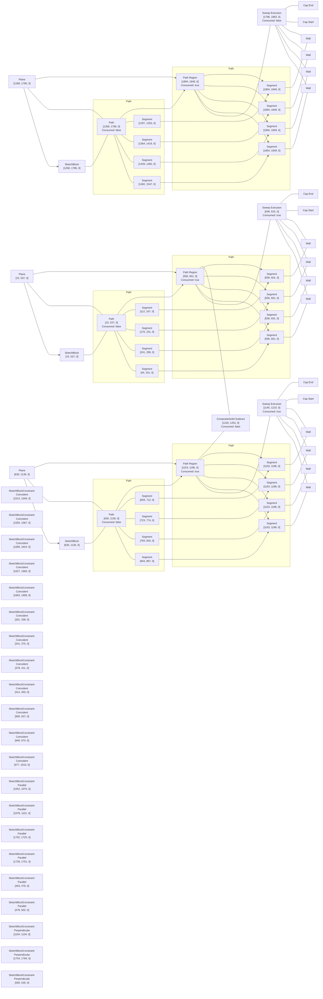

```mermaid
flowchart LR
  subgraph path8 [Path]
    8["Path Region<br>[1153, 1196, 0]<br>Consumed: true"]
      %% [ProgramBodyItem { index: 3 }, VariableDeclarationDeclaration, VariableDeclarationInit, CallKwUnlabeledArg]
    18["Segment<br>[1153, 1196, 0]"]
      %% [ProgramBodyItem { index: 3 }, VariableDeclarationDeclaration, VariableDeclarationInit, CallKwUnlabeledArg]
    19["Segment<br>[1153, 1196, 0]"]
      %% [ProgramBodyItem { index: 3 }, VariableDeclarationDeclaration, VariableDeclarationInit, CallKwUnlabeledArg]
    20["Segment<br>[1153, 1196, 0]"]
      %% [ProgramBodyItem { index: 3 }, VariableDeclarationDeclaration, VariableDeclarationInit, CallKwUnlabeledArg]
    21["Segment<br>[1153, 1196, 0]"]
      %% [ProgramBodyItem { index: 3 }, VariableDeclarationDeclaration, VariableDeclarationInit, CallKwUnlabeledArg]
  end
  subgraph path9 [Path]
    9["Path Region<br>[1804, 1849, 0]<br>Consumed: true"]
      %% [ProgramBodyItem { index: 6 }, VariableDeclarationDeclaration, VariableDeclarationInit, CallKwUnlabeledArg]
    27["Segment<br>[1804, 1849, 0]"]
      %% [ProgramBodyItem { index: 6 }, VariableDeclarationDeclaration, VariableDeclarationInit, CallKwUnlabeledArg]
    28["Segment<br>[1804, 1849, 0]"]
      %% [ProgramBodyItem { index: 6 }, VariableDeclarationDeclaration, VariableDeclarationInit, CallKwUnlabeledArg]
    29["Segment<br>[1804, 1849, 0]"]
      %% [ProgramBodyItem { index: 6 }, VariableDeclarationDeclaration, VariableDeclarationInit, CallKwUnlabeledArg]
    30["Segment<br>[1804, 1849, 0]"]
      %% [ProgramBodyItem { index: 6 }, VariableDeclarationDeclaration, VariableDeclarationInit, CallKwUnlabeledArg]
  end
  subgraph path10 [Path]
    10["Path Region<br>[556, 601, 0]<br>Consumed: true"]
      %% [ProgramBodyItem { index: 1 }, VariableDeclarationDeclaration, VariableDeclarationInit, CallKwUnlabeledArg]
    33["Segment<br>[556, 601, 0]"]
      %% [ProgramBodyItem { index: 1 }, VariableDeclarationDeclaration, VariableDeclarationInit, CallKwUnlabeledArg]
    34["Segment<br>[556, 601, 0]"]
      %% [ProgramBodyItem { index: 1 }, VariableDeclarationDeclaration, VariableDeclarationInit, CallKwUnlabeledArg]
    35["Segment<br>[556, 601, 0]"]
      %% [ProgramBodyItem { index: 1 }, VariableDeclarationDeclaration, VariableDeclarationInit, CallKwUnlabeledArg]
    36["Segment<br>[556, 601, 0]"]
      %% [ProgramBodyItem { index: 1 }, VariableDeclarationDeclaration, VariableDeclarationInit, CallKwUnlabeledArg]
  end
  subgraph path11 [Path]
    11["Path<br>[1268, 1786, 0]<br>Consumed: false"]
      %% [ProgramBodyItem { index: 5 }, VariableDeclarationDeclaration, VariableDeclarationInit]
    22["Segment<br>[1297, 1353, 0]"]
      %% [ProgramBodyItem { index: 5 }, VariableDeclarationDeclaration, VariableDeclarationInit, SketchBlockBody, SketchBlockBodyItem { index: 0 }, VariableDeclarationDeclaration, VariableDeclarationInit]
    23["Segment<br>[1364, 1419, 0]"]
      %% [ProgramBodyItem { index: 5 }, VariableDeclarationDeclaration, VariableDeclarationInit, SketchBlockBody, SketchBlockBodyItem { index: 1 }, VariableDeclarationDeclaration, VariableDeclarationInit]
    24["Segment<br>[1428, 1482, 0]"]
      %% [ProgramBodyItem { index: 5 }, VariableDeclarationDeclaration, VariableDeclarationInit, SketchBlockBody, SketchBlockBodyItem { index: 2 }, VariableDeclarationDeclaration, VariableDeclarationInit]
    25["Segment<br>[1492, 1547, 0]"]
      %% [ProgramBodyItem { index: 5 }, VariableDeclarationDeclaration, VariableDeclarationInit, SketchBlockBody, SketchBlockBodyItem { index: 3 }, VariableDeclarationDeclaration, VariableDeclarationInit]
  end
  subgraph path12 [Path]
    12["Path<br>[15, 537, 0]<br>Consumed: false"]
      %% [ProgramBodyItem { index: 0 }, VariableDeclarationDeclaration, VariableDeclarationInit]
    17["Segment<br>[112, 167, 0]"]
      %% [ProgramBodyItem { index: 0 }, VariableDeclarationDeclaration, VariableDeclarationInit, SketchBlockBody, SketchBlockBodyItem { index: 1 }, VariableDeclarationDeclaration, VariableDeclarationInit]
    26["Segment<br>[176, 231, 0]"]
      %% [ProgramBodyItem { index: 0 }, VariableDeclarationDeclaration, VariableDeclarationInit, SketchBlockBody, SketchBlockBodyItem { index: 2 }, VariableDeclarationDeclaration, VariableDeclarationInit]
    31["Segment<br>[241, 298, 0]"]
      %% [ProgramBodyItem { index: 0 }, VariableDeclarationDeclaration, VariableDeclarationInit, SketchBlockBody, SketchBlockBodyItem { index: 3 }, VariableDeclarationDeclaration, VariableDeclarationInit]
    32["Segment<br>[44, 101, 0]"]
      %% [ProgramBodyItem { index: 0 }, VariableDeclarationDeclaration, VariableDeclarationInit, SketchBlockBody, SketchBlockBodyItem { index: 0 }, VariableDeclarationDeclaration, VariableDeclarationInit]
  end
  subgraph path13 [Path]
    13["Path<br>[630, 1136, 0]<br>Consumed: false"]
      %% [ProgramBodyItem { index: 2 }, VariableDeclarationDeclaration, VariableDeclarationInit]
    37["Segment<br>[659, 712, 0]"]
      %% [ProgramBodyItem { index: 2 }, VariableDeclarationDeclaration, VariableDeclarationInit, SketchBlockBody, SketchBlockBodyItem { index: 0 }, VariableDeclarationDeclaration, VariableDeclarationInit]
    38["Segment<br>[723, 774, 0]"]
      %% [ProgramBodyItem { index: 2 }, VariableDeclarationDeclaration, VariableDeclarationInit, SketchBlockBody, SketchBlockBodyItem { index: 1 }, VariableDeclarationDeclaration, VariableDeclarationInit]
    39["Segment<br>[783, 834, 0]"]
      %% [ProgramBodyItem { index: 2 }, VariableDeclarationDeclaration, VariableDeclarationInit, SketchBlockBody, SketchBlockBodyItem { index: 2 }, VariableDeclarationDeclaration, VariableDeclarationInit]
    40["Segment<br>[844, 897, 0]"]
      %% [ProgramBodyItem { index: 2 }, VariableDeclarationDeclaration, VariableDeclarationInit, SketchBlockBody, SketchBlockBodyItem { index: 3 }, VariableDeclarationDeclaration, VariableDeclarationInit]
  end
  1["Cap End"]
    %% face_code_ref=Missing NodePath
  2["Cap End"]
    %% face_code_ref=Missing NodePath
  3["Cap End"]
    %% face_code_ref=Missing NodePath
  4["Cap Start"]
    %% face_code_ref=Missing NodePath
  5["Cap Start"]
    %% face_code_ref=Missing NodePath
  6["Cap Start"]
    %% face_code_ref=Missing NodePath
  7["CompositeSolid Subtract<br>[1220, 1252, 0]<br>Consumed: false"]
    %% [ProgramBodyItem { index: 4 }, VariableDeclarationDeclaration, VariableDeclarationInit]
  14["Plane<br>[1268, 1786, 0]"]
    %% [ProgramBodyItem { index: 5 }, VariableDeclarationDeclaration, VariableDeclarationInit]
  15["Plane<br>[15, 537, 0]"]
    %% [ProgramBodyItem { index: 0 }, VariableDeclarationDeclaration, VariableDeclarationInit]
  16["Plane<br>[630, 1136, 0]"]
    %% [ProgramBodyItem { index: 2 }, VariableDeclarationDeclaration, VariableDeclarationInit]
  41["SketchBlock<br>[1268, 1786, 0]"]
    %% [ProgramBodyItem { index: 5 }, VariableDeclarationDeclaration, VariableDeclarationInit]
  42["SketchBlock<br>[15, 537, 0]"]
    %% [ProgramBodyItem { index: 0 }, VariableDeclarationDeclaration, VariableDeclarationInit]
  43["SketchBlock<br>[630, 1136, 0]"]
    %% [ProgramBodyItem { index: 2 }, VariableDeclarationDeclaration, VariableDeclarationInit]
  44["SketchBlockConstraint Coincident<br>[1013, 1049, 0]"]
    %% [ProgramBodyItem { index: 2 }, VariableDeclarationDeclaration, VariableDeclarationInit, SketchBlockBody, SketchBlockBodyItem { index: 7 }, ExpressionStatementExpr]
  45["SketchBlockConstraint Coincident<br>[1550, 1587, 0]"]
    %% [ProgramBodyItem { index: 5 }, VariableDeclarationDeclaration, VariableDeclarationInit, SketchBlockBody, SketchBlockBodyItem { index: 4 }, ExpressionStatementExpr]
  46["SketchBlockConstraint Coincident<br>[1590, 1624, 0]"]
    %% [ProgramBodyItem { index: 5 }, VariableDeclarationDeclaration, VariableDeclarationInit, SketchBlockBody, SketchBlockBodyItem { index: 5 }, ExpressionStatementExpr]
  47["SketchBlockConstraint Coincident<br>[1627, 1660, 0]"]
    %% [ProgramBodyItem { index: 5 }, VariableDeclarationDeclaration, VariableDeclarationInit, SketchBlockBody, SketchBlockBodyItem { index: 6 }, ExpressionStatementExpr]
  48["SketchBlockConstraint Coincident<br>[1663, 1699, 0]"]
    %% [ProgramBodyItem { index: 5 }, VariableDeclarationDeclaration, VariableDeclarationInit, SketchBlockBody, SketchBlockBodyItem { index: 7 }, ExpressionStatementExpr]
  49["SketchBlockConstraint Coincident<br>[301, 338, 0]"]
    %% [ProgramBodyItem { index: 0 }, VariableDeclarationDeclaration, VariableDeclarationInit, SketchBlockBody, SketchBlockBodyItem { index: 4 }, ExpressionStatementExpr]
  50["SketchBlockConstraint Coincident<br>[341, 375, 0]"]
    %% [ProgramBodyItem { index: 0 }, VariableDeclarationDeclaration, VariableDeclarationInit, SketchBlockBody, SketchBlockBodyItem { index: 5 }, ExpressionStatementExpr]
  51["SketchBlockConstraint Coincident<br>[378, 411, 0]"]
    %% [ProgramBodyItem { index: 0 }, VariableDeclarationDeclaration, VariableDeclarationInit, SketchBlockBody, SketchBlockBodyItem { index: 6 }, ExpressionStatementExpr]
  52["SketchBlockConstraint Coincident<br>[414, 450, 0]"]
    %% [ProgramBodyItem { index: 0 }, VariableDeclarationDeclaration, VariableDeclarationInit, SketchBlockBody, SketchBlockBodyItem { index: 7 }, ExpressionStatementExpr]
  53["SketchBlockConstraint Coincident<br>[900, 937, 0]"]
    %% [ProgramBodyItem { index: 2 }, VariableDeclarationDeclaration, VariableDeclarationInit, SketchBlockBody, SketchBlockBodyItem { index: 4 }, ExpressionStatementExpr]
  54["SketchBlockConstraint Coincident<br>[940, 974, 0]"]
    %% [ProgramBodyItem { index: 2 }, VariableDeclarationDeclaration, VariableDeclarationInit, SketchBlockBody, SketchBlockBodyItem { index: 5 }, ExpressionStatementExpr]
  55["SketchBlockConstraint Coincident<br>[977, 1010, 0]"]
    %% [ProgramBodyItem { index: 2 }, VariableDeclarationDeclaration, VariableDeclarationInit, SketchBlockBody, SketchBlockBodyItem { index: 6 }, ExpressionStatementExpr]
  56["SketchBlockConstraint Parallel<br>[1052, 1075, 0]"]
    %% [ProgramBodyItem { index: 2 }, VariableDeclarationDeclaration, VariableDeclarationInit, SketchBlockBody, SketchBlockBodyItem { index: 8 }, ExpressionStatementExpr]
  57["SketchBlockConstraint Parallel<br>[1078, 1101, 0]"]
    %% [ProgramBodyItem { index: 2 }, VariableDeclarationDeclaration, VariableDeclarationInit, SketchBlockBody, SketchBlockBodyItem { index: 9 }, ExpressionStatementExpr]
  58["SketchBlockConstraint Parallel<br>[1702, 1725, 0]"]
    %% [ProgramBodyItem { index: 5 }, VariableDeclarationDeclaration, VariableDeclarationInit, SketchBlockBody, SketchBlockBodyItem { index: 8 }, ExpressionStatementExpr]
  59["SketchBlockConstraint Parallel<br>[1728, 1751, 0]"]
    %% [ProgramBodyItem { index: 5 }, VariableDeclarationDeclaration, VariableDeclarationInit, SketchBlockBody, SketchBlockBodyItem { index: 9 }, ExpressionStatementExpr]
  60["SketchBlockConstraint Parallel<br>[453, 476, 0]"]
    %% [ProgramBodyItem { index: 0 }, VariableDeclarationDeclaration, VariableDeclarationInit, SketchBlockBody, SketchBlockBodyItem { index: 8 }, ExpressionStatementExpr]
  61["SketchBlockConstraint Parallel<br>[479, 502, 0]"]
    %% [ProgramBodyItem { index: 0 }, VariableDeclarationDeclaration, VariableDeclarationInit, SketchBlockBody, SketchBlockBodyItem { index: 9 }, ExpressionStatementExpr]
  62["SketchBlockConstraint Perpendicular<br>[1104, 1134, 0]"]
    %% [ProgramBodyItem { index: 2 }, VariableDeclarationDeclaration, VariableDeclarationInit, SketchBlockBody, SketchBlockBodyItem { index: 10 }, ExpressionStatementExpr]
  63["SketchBlockConstraint Perpendicular<br>[1754, 1784, 0]"]
    %% [ProgramBodyItem { index: 5 }, VariableDeclarationDeclaration, VariableDeclarationInit, SketchBlockBody, SketchBlockBodyItem { index: 10 }, ExpressionStatementExpr]
  64["SketchBlockConstraint Perpendicular<br>[505, 535, 0]"]
    %% [ProgramBodyItem { index: 0 }, VariableDeclarationDeclaration, VariableDeclarationInit, SketchBlockBody, SketchBlockBodyItem { index: 10 }, ExpressionStatementExpr]
  65["Sweep Extrusion<br>[1145, 1210, 0]<br>Consumed: true"]
    %% [ProgramBodyItem { index: 3 }, VariableDeclarationDeclaration, VariableDeclarationInit]
  66["Sweep Extrusion<br>[1796, 1863, 0]<br>Consumed: false"]
    %% [ProgramBodyItem { index: 6 }, VariableDeclarationDeclaration, VariableDeclarationInit]
  67["Sweep Extrusion<br>[548, 615, 0]<br>Consumed: true"]
    %% [ProgramBodyItem { index: 1 }, VariableDeclarationDeclaration, VariableDeclarationInit]
  68[Wall]
    %% face_code_ref=Missing NodePath
  69[Wall]
    %% face_code_ref=Missing NodePath
  70[Wall]
    %% face_code_ref=Missing NodePath
  71[Wall]
    %% face_code_ref=Missing NodePath
  72[Wall]
    %% face_code_ref=Missing NodePath
  73[Wall]
    %% face_code_ref=Missing NodePath
  74[Wall]
    %% face_code_ref=Missing NodePath
  75[Wall]
    %% face_code_ref=Missing NodePath
  76[Wall]
    %% face_code_ref=Missing NodePath
  77[Wall]
    %% face_code_ref=Missing NodePath
  78[Wall]
    %% face_code_ref=Missing NodePath
  79[Wall]
    %% face_code_ref=Missing NodePath
  65 --- 1
  66 --- 2
  67 --- 3
  65 --- 4
  66 --- 5
  67 --- 6
  8 --- 7
  10 --- 7
  13 x--> 8
  16 x--> 8
  8 <--x 18
  8 <--x 19
  8 <--x 20
  8 <--x 21
  8 ---- 65
  11 x--> 9
  14 x--> 9
  9 <--x 27
  9 <--x 28
  9 <--x 29
  9 <--x 30
  9 ---- 66
  12 x--> 10
  15 x--> 10
  10 <--x 33
  10 <--x 34
  10 <--x 35
  10 <--x 36
  10 ---- 67
  14 --- 11
  11 --- 22
  11 --- 23
  11 --- 24
  11 --- 25
  41 --- 11
  15 --- 12
  12 --- 17
  12 --- 26
  12 --- 31
  12 --- 32
  42 --- 12
  16 --- 13
  13 --- 37
  13 --- 38
  13 --- 39
  13 --- 40
  43 --- 13
  14 <--x 41
  15 <--x 42
  16 <--x 43
  17 <--x 33
  37 x--> 18
  18 --- 68
  38 x--> 19
  19 --- 69
  39 x--> 20
  20 --- 70
  40 x--> 21
  21 --- 71
  22 <--x 27
  23 <--x 28
  24 <--x 29
  25 <--x 30
  26 <--x 34
  27 --- 72
  28 --- 73
  29 --- 74
  30 --- 75
  31 <--x 35
  32 <--x 36
  33 --- 76
  34 --- 77
  35 --- 78
  36 --- 79
  65 --- 68
  65 --- 69
  65 --- 70
  65 --- 71
  66 --- 72
  66 --- 73
  66 --- 74
  66 --- 75
  67 --- 76
  67 --- 77
  67 --- 78
  67 --- 79
```
