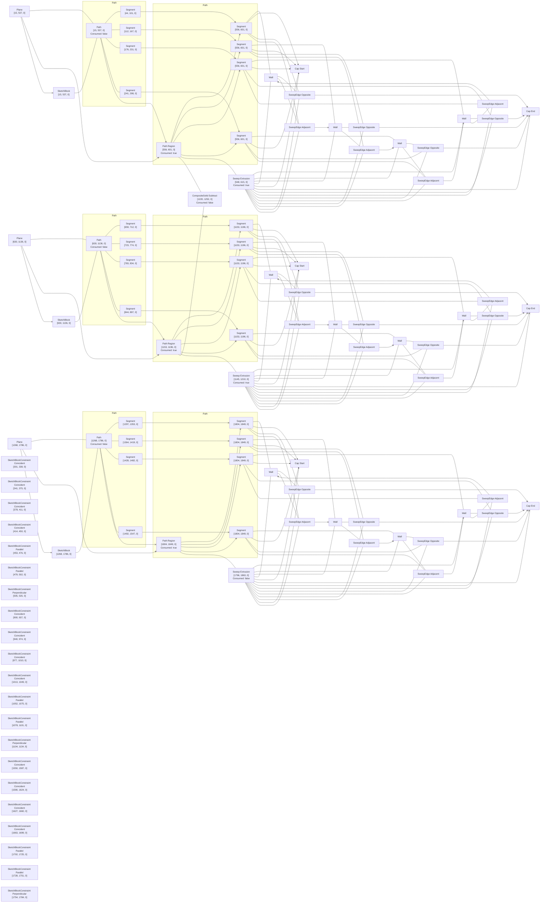

```mermaid
flowchart LR
  subgraph path2 [Path]
    2["Path<br>[15, 537, 0]<br>Consumed: false"]
      %% [ProgramBodyItem { index: 0 }, VariableDeclarationDeclaration, VariableDeclarationInit]
    3["Segment<br>[44, 101, 0]"]
      %% [ProgramBodyItem { index: 0 }, VariableDeclarationDeclaration, VariableDeclarationInit, SketchBlockBody, SketchBlockBodyItem { index: 0 }, VariableDeclarationDeclaration, VariableDeclarationInit]
    4["Segment<br>[112, 167, 0]"]
      %% [ProgramBodyItem { index: 0 }, VariableDeclarationDeclaration, VariableDeclarationInit, SketchBlockBody, SketchBlockBodyItem { index: 1 }, VariableDeclarationDeclaration, VariableDeclarationInit]
    5["Segment<br>[176, 231, 0]"]
      %% [ProgramBodyItem { index: 0 }, VariableDeclarationDeclaration, VariableDeclarationInit, SketchBlockBody, SketchBlockBodyItem { index: 2 }, VariableDeclarationDeclaration, VariableDeclarationInit]
    6["Segment<br>[241, 298, 0]"]
      %% [ProgramBodyItem { index: 0 }, VariableDeclarationDeclaration, VariableDeclarationInit, SketchBlockBody, SketchBlockBodyItem { index: 3 }, VariableDeclarationDeclaration, VariableDeclarationInit]
  end
  subgraph path7 [Path]
    7["Path Region<br>[556, 601, 0]<br>Consumed: true"]
      %% [ProgramBodyItem { index: 1 }, VariableDeclarationDeclaration, VariableDeclarationInit, CallKwUnlabeledArg]
    8["Segment<br>[556, 601, 0]"]
      %% [ProgramBodyItem { index: 1 }, VariableDeclarationDeclaration, VariableDeclarationInit, CallKwUnlabeledArg]
    9["Segment<br>[556, 601, 0]"]
      %% [ProgramBodyItem { index: 1 }, VariableDeclarationDeclaration, VariableDeclarationInit, CallKwUnlabeledArg]
    10["Segment<br>[556, 601, 0]"]
      %% [ProgramBodyItem { index: 1 }, VariableDeclarationDeclaration, VariableDeclarationInit, CallKwUnlabeledArg]
    11["Segment<br>[556, 601, 0]"]
      %% [ProgramBodyItem { index: 1 }, VariableDeclarationDeclaration, VariableDeclarationInit, CallKwUnlabeledArg]
  end
  subgraph path28 [Path]
    28["Path<br>[630, 1136, 0]<br>Consumed: false"]
      %% [ProgramBodyItem { index: 2 }, VariableDeclarationDeclaration, VariableDeclarationInit]
    29["Segment<br>[659, 712, 0]"]
      %% [ProgramBodyItem { index: 2 }, VariableDeclarationDeclaration, VariableDeclarationInit, SketchBlockBody, SketchBlockBodyItem { index: 0 }, VariableDeclarationDeclaration, VariableDeclarationInit]
    30["Segment<br>[723, 774, 0]"]
      %% [ProgramBodyItem { index: 2 }, VariableDeclarationDeclaration, VariableDeclarationInit, SketchBlockBody, SketchBlockBodyItem { index: 1 }, VariableDeclarationDeclaration, VariableDeclarationInit]
    31["Segment<br>[783, 834, 0]"]
      %% [ProgramBodyItem { index: 2 }, VariableDeclarationDeclaration, VariableDeclarationInit, SketchBlockBody, SketchBlockBodyItem { index: 2 }, VariableDeclarationDeclaration, VariableDeclarationInit]
    32["Segment<br>[844, 897, 0]"]
      %% [ProgramBodyItem { index: 2 }, VariableDeclarationDeclaration, VariableDeclarationInit, SketchBlockBody, SketchBlockBodyItem { index: 3 }, VariableDeclarationDeclaration, VariableDeclarationInit]
  end
  subgraph path33 [Path]
    33["Path Region<br>[1153, 1196, 0]<br>Consumed: true"]
      %% [ProgramBodyItem { index: 3 }, VariableDeclarationDeclaration, VariableDeclarationInit, CallKwUnlabeledArg]
    34["Segment<br>[1153, 1196, 0]"]
      %% [ProgramBodyItem { index: 3 }, VariableDeclarationDeclaration, VariableDeclarationInit, CallKwUnlabeledArg]
    35["Segment<br>[1153, 1196, 0]"]
      %% [ProgramBodyItem { index: 3 }, VariableDeclarationDeclaration, VariableDeclarationInit, CallKwUnlabeledArg]
    36["Segment<br>[1153, 1196, 0]"]
      %% [ProgramBodyItem { index: 3 }, VariableDeclarationDeclaration, VariableDeclarationInit, CallKwUnlabeledArg]
    37["Segment<br>[1153, 1196, 0]"]
      %% [ProgramBodyItem { index: 3 }, VariableDeclarationDeclaration, VariableDeclarationInit, CallKwUnlabeledArg]
  end
  subgraph path55 [Path]
    55["Path<br>[1268, 1786, 0]<br>Consumed: false"]
      %% [ProgramBodyItem { index: 5 }, VariableDeclarationDeclaration, VariableDeclarationInit]
    56["Segment<br>[1297, 1353, 0]"]
      %% [ProgramBodyItem { index: 5 }, VariableDeclarationDeclaration, VariableDeclarationInit, SketchBlockBody, SketchBlockBodyItem { index: 0 }, VariableDeclarationDeclaration, VariableDeclarationInit]
    57["Segment<br>[1364, 1419, 0]"]
      %% [ProgramBodyItem { index: 5 }, VariableDeclarationDeclaration, VariableDeclarationInit, SketchBlockBody, SketchBlockBodyItem { index: 1 }, VariableDeclarationDeclaration, VariableDeclarationInit]
    58["Segment<br>[1428, 1482, 0]"]
      %% [ProgramBodyItem { index: 5 }, VariableDeclarationDeclaration, VariableDeclarationInit, SketchBlockBody, SketchBlockBodyItem { index: 2 }, VariableDeclarationDeclaration, VariableDeclarationInit]
    59["Segment<br>[1492, 1547, 0]"]
      %% [ProgramBodyItem { index: 5 }, VariableDeclarationDeclaration, VariableDeclarationInit, SketchBlockBody, SketchBlockBodyItem { index: 3 }, VariableDeclarationDeclaration, VariableDeclarationInit]
  end
  subgraph path60 [Path]
    60["Path Region<br>[1804, 1849, 0]<br>Consumed: true"]
      %% [ProgramBodyItem { index: 6 }, VariableDeclarationDeclaration, VariableDeclarationInit, CallKwUnlabeledArg]
    61["Segment<br>[1804, 1849, 0]"]
      %% [ProgramBodyItem { index: 6 }, VariableDeclarationDeclaration, VariableDeclarationInit, CallKwUnlabeledArg]
    62["Segment<br>[1804, 1849, 0]"]
      %% [ProgramBodyItem { index: 6 }, VariableDeclarationDeclaration, VariableDeclarationInit, CallKwUnlabeledArg]
    63["Segment<br>[1804, 1849, 0]"]
      %% [ProgramBodyItem { index: 6 }, VariableDeclarationDeclaration, VariableDeclarationInit, CallKwUnlabeledArg]
    64["Segment<br>[1804, 1849, 0]"]
      %% [ProgramBodyItem { index: 6 }, VariableDeclarationDeclaration, VariableDeclarationInit, CallKwUnlabeledArg]
  end
  1["Plane<br>[15, 537, 0]"]
    %% [ProgramBodyItem { index: 0 }, VariableDeclarationDeclaration, VariableDeclarationInit]
  12["Sweep Extrusion<br>[548, 615, 0]<br>Consumed: true"]
    %% [ProgramBodyItem { index: 1 }, VariableDeclarationDeclaration, VariableDeclarationInit]
  13[Wall]
    %% face_code_ref=Missing NodePath
  14[Wall]
    %% face_code_ref=Missing NodePath
  15[Wall]
    %% face_code_ref=Missing NodePath
  16[Wall]
    %% face_code_ref=Missing NodePath
  17["Cap Start"]
    %% face_code_ref=Missing NodePath
  18["Cap End"]
    %% face_code_ref=Missing NodePath
  19["SweepEdge Opposite"]
  20["SweepEdge Adjacent"]
  21["SweepEdge Opposite"]
  22["SweepEdge Adjacent"]
  23["SweepEdge Opposite"]
  24["SweepEdge Adjacent"]
  25["SweepEdge Opposite"]
  26["SweepEdge Adjacent"]
  27["Plane<br>[630, 1136, 0]"]
    %% [ProgramBodyItem { index: 2 }, VariableDeclarationDeclaration, VariableDeclarationInit]
  38["Sweep Extrusion<br>[1145, 1210, 0]<br>Consumed: true"]
    %% [ProgramBodyItem { index: 3 }, VariableDeclarationDeclaration, VariableDeclarationInit]
  39[Wall]
    %% face_code_ref=Missing NodePath
  40[Wall]
    %% face_code_ref=Missing NodePath
  41[Wall]
    %% face_code_ref=Missing NodePath
  42[Wall]
    %% face_code_ref=Missing NodePath
  43["Cap Start"]
    %% face_code_ref=Missing NodePath
  44["Cap End"]
    %% face_code_ref=Missing NodePath
  45["SweepEdge Opposite"]
  46["SweepEdge Adjacent"]
  47["SweepEdge Opposite"]
  48["SweepEdge Adjacent"]
  49["SweepEdge Opposite"]
  50["SweepEdge Adjacent"]
  51["SweepEdge Opposite"]
  52["SweepEdge Adjacent"]
  53["CompositeSolid Subtract<br>[1220, 1252, 0]<br>Consumed: false"]
    %% [ProgramBodyItem { index: 4 }, VariableDeclarationDeclaration, VariableDeclarationInit]
  54["Plane<br>[1268, 1786, 0]"]
    %% [ProgramBodyItem { index: 5 }, VariableDeclarationDeclaration, VariableDeclarationInit]
  65["Sweep Extrusion<br>[1796, 1863, 0]<br>Consumed: false"]
    %% [ProgramBodyItem { index: 6 }, VariableDeclarationDeclaration, VariableDeclarationInit]
  66[Wall]
    %% face_code_ref=Missing NodePath
  67[Wall]
    %% face_code_ref=Missing NodePath
  68[Wall]
    %% face_code_ref=Missing NodePath
  69[Wall]
    %% face_code_ref=Missing NodePath
  70["Cap Start"]
    %% face_code_ref=Missing NodePath
  71["Cap End"]
    %% face_code_ref=Missing NodePath
  72["SweepEdge Opposite"]
  73["SweepEdge Adjacent"]
  74["SweepEdge Opposite"]
  75["SweepEdge Adjacent"]
  76["SweepEdge Opposite"]
  77["SweepEdge Adjacent"]
  78["SweepEdge Opposite"]
  79["SweepEdge Adjacent"]
  80["SketchBlock<br>[15, 537, 0]"]
    %% [ProgramBodyItem { index: 0 }, VariableDeclarationDeclaration, VariableDeclarationInit]
  81["SketchBlockConstraint Coincident<br>[301, 338, 0]"]
    %% [ProgramBodyItem { index: 0 }, VariableDeclarationDeclaration, VariableDeclarationInit, SketchBlockBody, SketchBlockBodyItem { index: 4 }, ExpressionStatementExpr]
  82["SketchBlockConstraint Coincident<br>[341, 375, 0]"]
    %% [ProgramBodyItem { index: 0 }, VariableDeclarationDeclaration, VariableDeclarationInit, SketchBlockBody, SketchBlockBodyItem { index: 5 }, ExpressionStatementExpr]
  83["SketchBlockConstraint Coincident<br>[378, 411, 0]"]
    %% [ProgramBodyItem { index: 0 }, VariableDeclarationDeclaration, VariableDeclarationInit, SketchBlockBody, SketchBlockBodyItem { index: 6 }, ExpressionStatementExpr]
  84["SketchBlockConstraint Coincident<br>[414, 450, 0]"]
    %% [ProgramBodyItem { index: 0 }, VariableDeclarationDeclaration, VariableDeclarationInit, SketchBlockBody, SketchBlockBodyItem { index: 7 }, ExpressionStatementExpr]
  85["SketchBlockConstraint Parallel<br>[453, 476, 0]"]
    %% [ProgramBodyItem { index: 0 }, VariableDeclarationDeclaration, VariableDeclarationInit, SketchBlockBody, SketchBlockBodyItem { index: 8 }, ExpressionStatementExpr]
  86["SketchBlockConstraint Parallel<br>[479, 502, 0]"]
    %% [ProgramBodyItem { index: 0 }, VariableDeclarationDeclaration, VariableDeclarationInit, SketchBlockBody, SketchBlockBodyItem { index: 9 }, ExpressionStatementExpr]
  87["SketchBlockConstraint Perpendicular<br>[505, 535, 0]"]
    %% [ProgramBodyItem { index: 0 }, VariableDeclarationDeclaration, VariableDeclarationInit, SketchBlockBody, SketchBlockBodyItem { index: 10 }, ExpressionStatementExpr]
  88["SketchBlock<br>[630, 1136, 0]"]
    %% [ProgramBodyItem { index: 2 }, VariableDeclarationDeclaration, VariableDeclarationInit]
  89["SketchBlockConstraint Coincident<br>[900, 937, 0]"]
    %% [ProgramBodyItem { index: 2 }, VariableDeclarationDeclaration, VariableDeclarationInit, SketchBlockBody, SketchBlockBodyItem { index: 4 }, ExpressionStatementExpr]
  90["SketchBlockConstraint Coincident<br>[940, 974, 0]"]
    %% [ProgramBodyItem { index: 2 }, VariableDeclarationDeclaration, VariableDeclarationInit, SketchBlockBody, SketchBlockBodyItem { index: 5 }, ExpressionStatementExpr]
  91["SketchBlockConstraint Coincident<br>[977, 1010, 0]"]
    %% [ProgramBodyItem { index: 2 }, VariableDeclarationDeclaration, VariableDeclarationInit, SketchBlockBody, SketchBlockBodyItem { index: 6 }, ExpressionStatementExpr]
  92["SketchBlockConstraint Coincident<br>[1013, 1049, 0]"]
    %% [ProgramBodyItem { index: 2 }, VariableDeclarationDeclaration, VariableDeclarationInit, SketchBlockBody, SketchBlockBodyItem { index: 7 }, ExpressionStatementExpr]
  93["SketchBlockConstraint Parallel<br>[1052, 1075, 0]"]
    %% [ProgramBodyItem { index: 2 }, VariableDeclarationDeclaration, VariableDeclarationInit, SketchBlockBody, SketchBlockBodyItem { index: 8 }, ExpressionStatementExpr]
  94["SketchBlockConstraint Parallel<br>[1078, 1101, 0]"]
    %% [ProgramBodyItem { index: 2 }, VariableDeclarationDeclaration, VariableDeclarationInit, SketchBlockBody, SketchBlockBodyItem { index: 9 }, ExpressionStatementExpr]
  95["SketchBlockConstraint Perpendicular<br>[1104, 1134, 0]"]
    %% [ProgramBodyItem { index: 2 }, VariableDeclarationDeclaration, VariableDeclarationInit, SketchBlockBody, SketchBlockBodyItem { index: 10 }, ExpressionStatementExpr]
  96["SketchBlock<br>[1268, 1786, 0]"]
    %% [ProgramBodyItem { index: 5 }, VariableDeclarationDeclaration, VariableDeclarationInit]
  97["SketchBlockConstraint Coincident<br>[1550, 1587, 0]"]
    %% [ProgramBodyItem { index: 5 }, VariableDeclarationDeclaration, VariableDeclarationInit, SketchBlockBody, SketchBlockBodyItem { index: 4 }, ExpressionStatementExpr]
  98["SketchBlockConstraint Coincident<br>[1590, 1624, 0]"]
    %% [ProgramBodyItem { index: 5 }, VariableDeclarationDeclaration, VariableDeclarationInit, SketchBlockBody, SketchBlockBodyItem { index: 5 }, ExpressionStatementExpr]
  99["SketchBlockConstraint Coincident<br>[1627, 1660, 0]"]
    %% [ProgramBodyItem { index: 5 }, VariableDeclarationDeclaration, VariableDeclarationInit, SketchBlockBody, SketchBlockBodyItem { index: 6 }, ExpressionStatementExpr]
  100["SketchBlockConstraint Coincident<br>[1663, 1699, 0]"]
    %% [ProgramBodyItem { index: 5 }, VariableDeclarationDeclaration, VariableDeclarationInit, SketchBlockBody, SketchBlockBodyItem { index: 7 }, ExpressionStatementExpr]
  101["SketchBlockConstraint Parallel<br>[1702, 1725, 0]"]
    %% [ProgramBodyItem { index: 5 }, VariableDeclarationDeclaration, VariableDeclarationInit, SketchBlockBody, SketchBlockBodyItem { index: 8 }, ExpressionStatementExpr]
  102["SketchBlockConstraint Parallel<br>[1728, 1751, 0]"]
    %% [ProgramBodyItem { index: 5 }, VariableDeclarationDeclaration, VariableDeclarationInit, SketchBlockBody, SketchBlockBodyItem { index: 9 }, ExpressionStatementExpr]
  103["SketchBlockConstraint Perpendicular<br>[1754, 1784, 0]"]
    %% [ProgramBodyItem { index: 5 }, VariableDeclarationDeclaration, VariableDeclarationInit, SketchBlockBody, SketchBlockBodyItem { index: 10 }, ExpressionStatementExpr]
  1 --- 2
  1 <--x 7
  1 <--x 80
  2 --- 3
  2 --- 4
  2 --- 5
  2 --- 6
  2 <--x 7
  80 --- 2
  3 <--x 8
  4 <--x 9
  5 <--x 10
  6 <--x 11
  7 <--x 8
  7 <--x 9
  7 <--x 10
  7 <--x 11
  7 ---- 12
  7 --- 53
  8 --- 16
  8 x--> 17
  8 --- 25
  8 --- 26
  9 --- 15
  9 x--> 17
  9 --- 23
  9 --- 24
  10 --- 13
  10 x--> 17
  10 --- 19
  10 --- 20
  11 --- 14
  11 x--> 17
  11 --- 21
  11 --- 22
  12 --- 13
  12 --- 14
  12 --- 15
  12 --- 16
  12 --- 17
  12 --- 18
  12 --- 19
  12 --- 20
  12 --- 21
  12 --- 22
  12 --- 23
  12 --- 24
  12 --- 25
  12 --- 26
  13 --- 19
  13 --- 20
  22 <--x 13
  14 --- 21
  14 --- 22
  24 <--x 14
  15 --- 23
  15 --- 24
  26 <--x 15
  20 <--x 16
  16 --- 25
  16 --- 26
  19 <--x 18
  21 <--x 18
  23 <--x 18
  25 <--x 18
  27 --- 28
  27 <--x 33
  27 <--x 88
  28 --- 29
  28 --- 30
  28 --- 31
  28 --- 32
  28 <--x 33
  88 --- 28
  29 <--x 34
  30 <--x 35
  31 <--x 36
  32 <--x 37
  33 <--x 34
  33 <--x 35
  33 <--x 36
  33 <--x 37
  33 ---- 38
  33 --- 53
  34 --- 42
  34 x--> 43
  34 --- 51
  34 --- 52
  35 --- 41
  35 x--> 43
  35 --- 49
  35 --- 50
  36 --- 39
  36 x--> 43
  36 --- 45
  36 --- 46
  37 --- 40
  37 x--> 43
  37 --- 47
  37 --- 48
  38 --- 39
  38 --- 40
  38 --- 41
  38 --- 42
  38 --- 43
  38 --- 44
  38 --- 45
  38 --- 46
  38 --- 47
  38 --- 48
  38 --- 49
  38 --- 50
  38 --- 51
  38 --- 52
  39 --- 45
  39 --- 46
  48 <--x 39
  40 --- 47
  40 --- 48
  50 <--x 40
  41 --- 49
  41 --- 50
  52 <--x 41
  46 <--x 42
  42 --- 51
  42 --- 52
  45 <--x 44
  47 <--x 44
  49 <--x 44
  51 <--x 44
  54 --- 55
  54 <--x 60
  54 <--x 96
  55 --- 56
  55 --- 57
  55 --- 58
  55 --- 59
  55 <--x 60
  96 --- 55
  56 <--x 61
  57 <--x 62
  58 <--x 63
  59 <--x 64
  60 <--x 61
  60 <--x 62
  60 <--x 63
  60 <--x 64
  60 ---- 65
  61 --- 69
  61 x--> 70
  61 --- 78
  61 --- 79
  62 --- 68
  62 x--> 70
  62 --- 76
  62 --- 77
  63 --- 66
  63 x--> 70
  63 --- 72
  63 --- 73
  64 --- 67
  64 x--> 70
  64 --- 74
  64 --- 75
  65 --- 66
  65 --- 67
  65 --- 68
  65 --- 69
  65 --- 70
  65 --- 71
  65 --- 72
  65 --- 73
  65 --- 74
  65 --- 75
  65 --- 76
  65 --- 77
  65 --- 78
  65 --- 79
  66 --- 72
  66 --- 73
  75 <--x 66
  67 --- 74
  67 --- 75
  77 <--x 67
  68 --- 76
  68 --- 77
  79 <--x 68
  73 <--x 69
  69 --- 78
  69 --- 79
  72 <--x 71
  74 <--x 71
  76 <--x 71
  78 <--x 71
```
