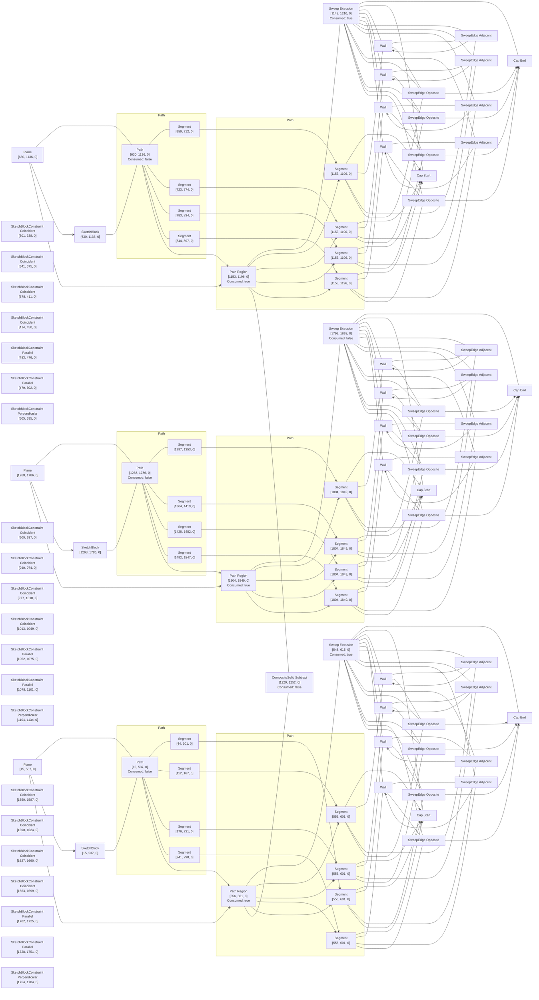

```mermaid
flowchart LR
  subgraph path19 [Path]
    19["Path<br>[15, 537, 0]<br>Consumed: false"]
      %% [ProgramBodyItem { index: 0 }, VariableDeclarationDeclaration, VariableDeclarationInit]
    22["Segment<br>[44, 101, 0]"]
      %% [ProgramBodyItem { index: 0 }, VariableDeclarationDeclaration, VariableDeclarationInit, SketchBlockBody, SketchBlockBodyItem { index: 0 }, VariableDeclarationDeclaration, VariableDeclarationInit]
    23["Segment<br>[112, 167, 0]"]
      %% [ProgramBodyItem { index: 0 }, VariableDeclarationDeclaration, VariableDeclarationInit, SketchBlockBody, SketchBlockBodyItem { index: 1 }, VariableDeclarationDeclaration, VariableDeclarationInit]
    24["Segment<br>[176, 231, 0]"]
      %% [ProgramBodyItem { index: 0 }, VariableDeclarationDeclaration, VariableDeclarationInit, SketchBlockBody, SketchBlockBodyItem { index: 2 }, VariableDeclarationDeclaration, VariableDeclarationInit]
    25["Segment<br>[241, 298, 0]"]
      %% [ProgramBodyItem { index: 0 }, VariableDeclarationDeclaration, VariableDeclarationInit, SketchBlockBody, SketchBlockBodyItem { index: 3 }, VariableDeclarationDeclaration, VariableDeclarationInit]
  end
  subgraph path34 [Path]
    34["Path Region<br>[556, 601, 0]<br>Consumed: true"]
      %% [ProgramBodyItem { index: 1 }, VariableDeclarationDeclaration, VariableDeclarationInit, CallKwUnlabeledArg]
    35["Segment<br>[556, 601, 0]"]
      %% [ProgramBodyItem { index: 1 }, VariableDeclarationDeclaration, VariableDeclarationInit, CallKwUnlabeledArg]
    36["Segment<br>[556, 601, 0]"]
      %% [ProgramBodyItem { index: 1 }, VariableDeclarationDeclaration, VariableDeclarationInit, CallKwUnlabeledArg]
    37["Segment<br>[556, 601, 0]"]
      %% [ProgramBodyItem { index: 1 }, VariableDeclarationDeclaration, VariableDeclarationInit, CallKwUnlabeledArg]
    38["Segment<br>[556, 601, 0]"]
      %% [ProgramBodyItem { index: 1 }, VariableDeclarationDeclaration, VariableDeclarationInit, CallKwUnlabeledArg]
  end
  subgraph path39 [Path]
    39["Path<br>[630, 1136, 0]<br>Consumed: false"]
      %% [ProgramBodyItem { index: 2 }, VariableDeclarationDeclaration, VariableDeclarationInit]
    42["Segment<br>[659, 712, 0]"]
      %% [ProgramBodyItem { index: 2 }, VariableDeclarationDeclaration, VariableDeclarationInit, SketchBlockBody, SketchBlockBodyItem { index: 0 }, VariableDeclarationDeclaration, VariableDeclarationInit]
    43["Segment<br>[723, 774, 0]"]
      %% [ProgramBodyItem { index: 2 }, VariableDeclarationDeclaration, VariableDeclarationInit, SketchBlockBody, SketchBlockBodyItem { index: 1 }, VariableDeclarationDeclaration, VariableDeclarationInit]
    44["Segment<br>[783, 834, 0]"]
      %% [ProgramBodyItem { index: 2 }, VariableDeclarationDeclaration, VariableDeclarationInit, SketchBlockBody, SketchBlockBodyItem { index: 2 }, VariableDeclarationDeclaration, VariableDeclarationInit]
    45["Segment<br>[844, 897, 0]"]
      %% [ProgramBodyItem { index: 2 }, VariableDeclarationDeclaration, VariableDeclarationInit, SketchBlockBody, SketchBlockBodyItem { index: 3 }, VariableDeclarationDeclaration, VariableDeclarationInit]
  end
  subgraph path54 [Path]
    54["Path Region<br>[1153, 1196, 0]<br>Consumed: true"]
      %% [ProgramBodyItem { index: 3 }, VariableDeclarationDeclaration, VariableDeclarationInit, CallKwUnlabeledArg]
    55["Segment<br>[1153, 1196, 0]"]
      %% [ProgramBodyItem { index: 3 }, VariableDeclarationDeclaration, VariableDeclarationInit, CallKwUnlabeledArg]
    56["Segment<br>[1153, 1196, 0]"]
      %% [ProgramBodyItem { index: 3 }, VariableDeclarationDeclaration, VariableDeclarationInit, CallKwUnlabeledArg]
    57["Segment<br>[1153, 1196, 0]"]
      %% [ProgramBodyItem { index: 3 }, VariableDeclarationDeclaration, VariableDeclarationInit, CallKwUnlabeledArg]
    58["Segment<br>[1153, 1196, 0]"]
      %% [ProgramBodyItem { index: 3 }, VariableDeclarationDeclaration, VariableDeclarationInit, CallKwUnlabeledArg]
  end
  subgraph path60 [Path]
    60["Path<br>[1268, 1786, 0]<br>Consumed: false"]
      %% [ProgramBodyItem { index: 5 }, VariableDeclarationDeclaration, VariableDeclarationInit]
    63["Segment<br>[1297, 1353, 0]"]
      %% [ProgramBodyItem { index: 5 }, VariableDeclarationDeclaration, VariableDeclarationInit, SketchBlockBody, SketchBlockBodyItem { index: 0 }, VariableDeclarationDeclaration, VariableDeclarationInit]
    64["Segment<br>[1364, 1419, 0]"]
      %% [ProgramBodyItem { index: 5 }, VariableDeclarationDeclaration, VariableDeclarationInit, SketchBlockBody, SketchBlockBodyItem { index: 1 }, VariableDeclarationDeclaration, VariableDeclarationInit]
    65["Segment<br>[1428, 1482, 0]"]
      %% [ProgramBodyItem { index: 5 }, VariableDeclarationDeclaration, VariableDeclarationInit, SketchBlockBody, SketchBlockBodyItem { index: 2 }, VariableDeclarationDeclaration, VariableDeclarationInit]
    66["Segment<br>[1492, 1547, 0]"]
      %% [ProgramBodyItem { index: 5 }, VariableDeclarationDeclaration, VariableDeclarationInit, SketchBlockBody, SketchBlockBodyItem { index: 3 }, VariableDeclarationDeclaration, VariableDeclarationInit]
  end
  subgraph path75 [Path]
    75["Path Region<br>[1804, 1849, 0]<br>Consumed: true"]
      %% [ProgramBodyItem { index: 6 }, VariableDeclarationDeclaration, VariableDeclarationInit, CallKwUnlabeledArg]
    76["Segment<br>[1804, 1849, 0]"]
      %% [ProgramBodyItem { index: 6 }, VariableDeclarationDeclaration, VariableDeclarationInit, CallKwUnlabeledArg]
    77["Segment<br>[1804, 1849, 0]"]
      %% [ProgramBodyItem { index: 6 }, VariableDeclarationDeclaration, VariableDeclarationInit, CallKwUnlabeledArg]
    78["Segment<br>[1804, 1849, 0]"]
      %% [ProgramBodyItem { index: 6 }, VariableDeclarationDeclaration, VariableDeclarationInit, CallKwUnlabeledArg]
    79["Segment<br>[1804, 1849, 0]"]
      %% [ProgramBodyItem { index: 6 }, VariableDeclarationDeclaration, VariableDeclarationInit, CallKwUnlabeledArg]
  end
  1["Cap End"]
    %% face_code_ref=Missing NodePath
  2["Cap End"]
    %% face_code_ref=Missing NodePath
  3["Cap End"]
    %% face_code_ref=Missing NodePath
  4["Cap Start"]
    %% face_code_ref=Missing NodePath
  5["Cap Start"]
    %% face_code_ref=Missing NodePath
  6["Cap Start"]
    %% face_code_ref=Missing NodePath
  7[Wall]
    %% face_code_ref=Missing NodePath
  8[Wall]
    %% face_code_ref=Missing NodePath
  9[Wall]
    %% face_code_ref=Missing NodePath
  10[Wall]
    %% face_code_ref=Missing NodePath
  11[Wall]
    %% face_code_ref=Missing NodePath
  12[Wall]
    %% face_code_ref=Missing NodePath
  13[Wall]
    %% face_code_ref=Missing NodePath
  14[Wall]
    %% face_code_ref=Missing NodePath
  15[Wall]
    %% face_code_ref=Missing NodePath
  16[Wall]
    %% face_code_ref=Missing NodePath
  17[Wall]
    %% face_code_ref=Missing NodePath
  18[Wall]
    %% face_code_ref=Missing NodePath
  20["Plane<br>[15, 537, 0]"]
    %% [ProgramBodyItem { index: 0 }, VariableDeclarationDeclaration, VariableDeclarationInit]
  21["SketchBlock<br>[15, 537, 0]"]
    %% [ProgramBodyItem { index: 0 }, VariableDeclarationDeclaration, VariableDeclarationInit]
  26["SketchBlockConstraint Coincident<br>[301, 338, 0]"]
    %% [ProgramBodyItem { index: 0 }, VariableDeclarationDeclaration, VariableDeclarationInit, SketchBlockBody, SketchBlockBodyItem { index: 4 }, ExpressionStatementExpr]
  27["SketchBlockConstraint Coincident<br>[341, 375, 0]"]
    %% [ProgramBodyItem { index: 0 }, VariableDeclarationDeclaration, VariableDeclarationInit, SketchBlockBody, SketchBlockBodyItem { index: 5 }, ExpressionStatementExpr]
  28["SketchBlockConstraint Coincident<br>[378, 411, 0]"]
    %% [ProgramBodyItem { index: 0 }, VariableDeclarationDeclaration, VariableDeclarationInit, SketchBlockBody, SketchBlockBodyItem { index: 6 }, ExpressionStatementExpr]
  29["SketchBlockConstraint Coincident<br>[414, 450, 0]"]
    %% [ProgramBodyItem { index: 0 }, VariableDeclarationDeclaration, VariableDeclarationInit, SketchBlockBody, SketchBlockBodyItem { index: 7 }, ExpressionStatementExpr]
  30["SketchBlockConstraint Parallel<br>[453, 476, 0]"]
    %% [ProgramBodyItem { index: 0 }, VariableDeclarationDeclaration, VariableDeclarationInit, SketchBlockBody, SketchBlockBodyItem { index: 8 }, ExpressionStatementExpr]
  31["SketchBlockConstraint Parallel<br>[479, 502, 0]"]
    %% [ProgramBodyItem { index: 0 }, VariableDeclarationDeclaration, VariableDeclarationInit, SketchBlockBody, SketchBlockBodyItem { index: 9 }, ExpressionStatementExpr]
  32["SketchBlockConstraint Perpendicular<br>[505, 535, 0]"]
    %% [ProgramBodyItem { index: 0 }, VariableDeclarationDeclaration, VariableDeclarationInit, SketchBlockBody, SketchBlockBodyItem { index: 10 }, ExpressionStatementExpr]
  33["Sweep Extrusion<br>[548, 615, 0]<br>Consumed: true"]
    %% [ProgramBodyItem { index: 1 }, VariableDeclarationDeclaration, VariableDeclarationInit]
  40["Plane<br>[630, 1136, 0]"]
    %% [ProgramBodyItem { index: 2 }, VariableDeclarationDeclaration, VariableDeclarationInit]
  41["SketchBlock<br>[630, 1136, 0]"]
    %% [ProgramBodyItem { index: 2 }, VariableDeclarationDeclaration, VariableDeclarationInit]
  46["SketchBlockConstraint Coincident<br>[900, 937, 0]"]
    %% [ProgramBodyItem { index: 2 }, VariableDeclarationDeclaration, VariableDeclarationInit, SketchBlockBody, SketchBlockBodyItem { index: 4 }, ExpressionStatementExpr]
  47["SketchBlockConstraint Coincident<br>[940, 974, 0]"]
    %% [ProgramBodyItem { index: 2 }, VariableDeclarationDeclaration, VariableDeclarationInit, SketchBlockBody, SketchBlockBodyItem { index: 5 }, ExpressionStatementExpr]
  48["SketchBlockConstraint Coincident<br>[977, 1010, 0]"]
    %% [ProgramBodyItem { index: 2 }, VariableDeclarationDeclaration, VariableDeclarationInit, SketchBlockBody, SketchBlockBodyItem { index: 6 }, ExpressionStatementExpr]
  49["SketchBlockConstraint Coincident<br>[1013, 1049, 0]"]
    %% [ProgramBodyItem { index: 2 }, VariableDeclarationDeclaration, VariableDeclarationInit, SketchBlockBody, SketchBlockBodyItem { index: 7 }, ExpressionStatementExpr]
  50["SketchBlockConstraint Parallel<br>[1052, 1075, 0]"]
    %% [ProgramBodyItem { index: 2 }, VariableDeclarationDeclaration, VariableDeclarationInit, SketchBlockBody, SketchBlockBodyItem { index: 8 }, ExpressionStatementExpr]
  51["SketchBlockConstraint Parallel<br>[1078, 1101, 0]"]
    %% [ProgramBodyItem { index: 2 }, VariableDeclarationDeclaration, VariableDeclarationInit, SketchBlockBody, SketchBlockBodyItem { index: 9 }, ExpressionStatementExpr]
  52["SketchBlockConstraint Perpendicular<br>[1104, 1134, 0]"]
    %% [ProgramBodyItem { index: 2 }, VariableDeclarationDeclaration, VariableDeclarationInit, SketchBlockBody, SketchBlockBodyItem { index: 10 }, ExpressionStatementExpr]
  53["Sweep Extrusion<br>[1145, 1210, 0]<br>Consumed: true"]
    %% [ProgramBodyItem { index: 3 }, VariableDeclarationDeclaration, VariableDeclarationInit]
  59["CompositeSolid Subtract<br>[1220, 1252, 0]<br>Consumed: false"]
    %% [ProgramBodyItem { index: 4 }, VariableDeclarationDeclaration, VariableDeclarationInit]
  61["Plane<br>[1268, 1786, 0]"]
    %% [ProgramBodyItem { index: 5 }, VariableDeclarationDeclaration, VariableDeclarationInit]
  62["SketchBlock<br>[1268, 1786, 0]"]
    %% [ProgramBodyItem { index: 5 }, VariableDeclarationDeclaration, VariableDeclarationInit]
  67["SketchBlockConstraint Coincident<br>[1550, 1587, 0]"]
    %% [ProgramBodyItem { index: 5 }, VariableDeclarationDeclaration, VariableDeclarationInit, SketchBlockBody, SketchBlockBodyItem { index: 4 }, ExpressionStatementExpr]
  68["SketchBlockConstraint Coincident<br>[1590, 1624, 0]"]
    %% [ProgramBodyItem { index: 5 }, VariableDeclarationDeclaration, VariableDeclarationInit, SketchBlockBody, SketchBlockBodyItem { index: 5 }, ExpressionStatementExpr]
  69["SketchBlockConstraint Coincident<br>[1627, 1660, 0]"]
    %% [ProgramBodyItem { index: 5 }, VariableDeclarationDeclaration, VariableDeclarationInit, SketchBlockBody, SketchBlockBodyItem { index: 6 }, ExpressionStatementExpr]
  70["SketchBlockConstraint Coincident<br>[1663, 1699, 0]"]
    %% [ProgramBodyItem { index: 5 }, VariableDeclarationDeclaration, VariableDeclarationInit, SketchBlockBody, SketchBlockBodyItem { index: 7 }, ExpressionStatementExpr]
  71["SketchBlockConstraint Parallel<br>[1702, 1725, 0]"]
    %% [ProgramBodyItem { index: 5 }, VariableDeclarationDeclaration, VariableDeclarationInit, SketchBlockBody, SketchBlockBodyItem { index: 8 }, ExpressionStatementExpr]
  72["SketchBlockConstraint Parallel<br>[1728, 1751, 0]"]
    %% [ProgramBodyItem { index: 5 }, VariableDeclarationDeclaration, VariableDeclarationInit, SketchBlockBody, SketchBlockBodyItem { index: 9 }, ExpressionStatementExpr]
  73["SketchBlockConstraint Perpendicular<br>[1754, 1784, 0]"]
    %% [ProgramBodyItem { index: 5 }, VariableDeclarationDeclaration, VariableDeclarationInit, SketchBlockBody, SketchBlockBodyItem { index: 10 }, ExpressionStatementExpr]
  74["Sweep Extrusion<br>[1796, 1863, 0]<br>Consumed: false"]
    %% [ProgramBodyItem { index: 6 }, VariableDeclarationDeclaration, VariableDeclarationInit]
  80["SweepEdge Adjacent"]
  81["SweepEdge Adjacent"]
  82["SweepEdge Adjacent"]
  83["SweepEdge Adjacent"]
  84["SweepEdge Adjacent"]
  85["SweepEdge Adjacent"]
  86["SweepEdge Adjacent"]
  87["SweepEdge Adjacent"]
  88["SweepEdge Adjacent"]
  89["SweepEdge Adjacent"]
  90["SweepEdge Adjacent"]
  91["SweepEdge Adjacent"]
  92["SweepEdge Opposite"]
  93["SweepEdge Opposite"]
  94["SweepEdge Opposite"]
  95["SweepEdge Opposite"]
  96["SweepEdge Opposite"]
  97["SweepEdge Opposite"]
  98["SweepEdge Opposite"]
  99["SweepEdge Opposite"]
  100["SweepEdge Opposite"]
  101["SweepEdge Opposite"]
  102["SweepEdge Opposite"]
  103["SweepEdge Opposite"]
  53 --- 1
  92 <--x 1
  93 <--x 1
  94 <--x 1
  95 <--x 1
  74 --- 2
  96 <--x 2
  97 <--x 2
  98 <--x 2
  99 <--x 2
  33 --- 3
  100 <--x 3
  101 <--x 3
  102 <--x 3
  103 <--x 3
  53 --- 4
  55 <--x 4
  56 <--x 4
  57 <--x 4
  58 <--x 4
  74 --- 5
  76 <--x 5
  77 <--x 5
  78 <--x 5
  79 <--x 5
  33 --- 6
  35 <--x 6
  36 <--x 6
  37 <--x 6
  38 <--x 6
  53 --- 7
  55 --- 7
  7 --- 80
  80 <--x 7
  7 --- 92
  53 --- 8
  56 --- 8
  8 --- 81
  81 <--x 8
  8 --- 93
  53 --- 9
  57 --- 9
  9 --- 82
  82 <--x 9
  9 --- 94
  53 --- 10
  58 --- 10
  10 --- 83
  83 <--x 10
  10 --- 95
  74 --- 11
  76 --- 11
  11 --- 84
  84 <--x 11
  11 --- 96
  74 --- 12
  77 --- 12
  12 --- 85
  85 <--x 12
  12 --- 97
  74 --- 13
  78 --- 13
  13 --- 86
  86 <--x 13
  13 --- 98
  74 --- 14
  79 --- 14
  14 --- 87
  87 <--x 14
  14 --- 99
  33 --- 15
  35 --- 15
  15 --- 88
  88 <--x 15
  15 --- 100
  33 --- 16
  36 --- 16
  16 --- 89
  89 <--x 16
  16 --- 101
  33 --- 17
  37 --- 17
  17 --- 90
  90 <--x 17
  17 --- 102
  33 --- 18
  38 --- 18
  18 --- 91
  91 <--x 18
  18 --- 103
  20 --- 19
  21 --- 19
  19 --- 22
  19 --- 23
  19 --- 24
  19 --- 25
  19 <--x 34
  20 <--x 21
  20 <--x 34
  22 <--x 38
  23 <--x 35
  24 <--x 36
  25 <--x 37
  34 ---- 33
  33 --- 88
  33 --- 89
  33 --- 90
  33 --- 91
  33 --- 100
  33 --- 101
  33 --- 102
  33 --- 103
  34 <--x 35
  34 <--x 36
  34 <--x 37
  34 <--x 38
  34 --- 59
  35 --- 88
  35 --- 100
  36 --- 89
  36 --- 101
  37 --- 90
  37 --- 102
  38 --- 91
  38 --- 103
  40 --- 39
  41 --- 39
  39 --- 42
  39 --- 43
  39 --- 44
  39 --- 45
  39 <--x 54
  40 <--x 41
  40 <--x 54
  42 <--x 55
  43 <--x 56
  44 <--x 57
  45 <--x 58
  54 ---- 53
  53 --- 80
  53 --- 81
  53 --- 82
  53 --- 83
  53 --- 92
  53 --- 93
  53 --- 94
  53 --- 95
  54 <--x 55
  54 <--x 56
  54 <--x 57
  54 <--x 58
  54 --- 59
  55 --- 80
  55 --- 92
  56 --- 81
  56 --- 93
  57 --- 82
  57 --- 94
  58 --- 83
  58 --- 95
  61 --- 60
  62 --- 60
  60 --- 63
  60 --- 64
  60 --- 65
  60 --- 66
  60 <--x 75
  61 <--x 62
  61 <--x 75
  63 <--x 76
  64 <--x 77
  65 <--x 78
  66 <--x 79
  75 ---- 74
  74 --- 84
  74 --- 85
  74 --- 86
  74 --- 87
  74 --- 96
  74 --- 97
  74 --- 98
  74 --- 99
  75 <--x 76
  75 <--x 77
  75 <--x 78
  75 <--x 79
  76 --- 84
  76 --- 96
  77 --- 85
  77 --- 97
  78 --- 86
  78 --- 98
  79 --- 87
  79 --- 99
```
