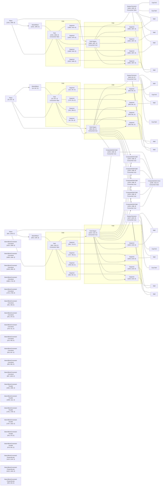

```mermaid
flowchart LR
  subgraph path14 [Path]
    14["Path Region<br>[1165, 1210, 0]<br>Consumed: true"]
      %% [ProgramBodyItem { index: 3 }, VariableDeclarationDeclaration, VariableDeclarationInit, CallKwUnlabeledArg]
    24["Segment<br>[1165, 1210, 0]"]
      %% [ProgramBodyItem { index: 3 }, VariableDeclarationDeclaration, VariableDeclarationInit, CallKwUnlabeledArg]
    25["Segment<br>[1165, 1210, 0]"]
      %% [ProgramBodyItem { index: 3 }, VariableDeclarationDeclaration, VariableDeclarationInit, CallKwUnlabeledArg]
    26["Segment<br>[1165, 1210, 0]"]
      %% [ProgramBodyItem { index: 3 }, VariableDeclarationDeclaration, VariableDeclarationInit, CallKwUnlabeledArg]
    27["Segment<br>[1165, 1210, 0]"]
      %% [ProgramBodyItem { index: 3 }, VariableDeclarationDeclaration, VariableDeclarationInit, CallKwUnlabeledArg]
  end
  subgraph path15 [Path]
    15["Path Region<br>[1862, 1907, 0]<br>Consumed: true"]
      %% [ProgramBodyItem { index: 7 }, VariableDeclarationDeclaration, VariableDeclarationInit, CallKwUnlabeledArg]
    33["Segment<br>[1862, 1907, 0]"]
      %% [ProgramBodyItem { index: 7 }, VariableDeclarationDeclaration, VariableDeclarationInit, CallKwUnlabeledArg]
    34["Segment<br>[1862, 1907, 0]"]
      %% [ProgramBodyItem { index: 7 }, VariableDeclarationDeclaration, VariableDeclarationInit, CallKwUnlabeledArg]
    35["Segment<br>[1862, 1907, 0]"]
      %% [ProgramBodyItem { index: 7 }, VariableDeclarationDeclaration, VariableDeclarationInit, CallKwUnlabeledArg]
    36["Segment<br>[1862, 1907, 0]"]
      %% [ProgramBodyItem { index: 7 }, VariableDeclarationDeclaration, VariableDeclarationInit, CallKwUnlabeledArg]
  end
  subgraph path16 [Path]
    16["Path Region<br>[556, 601, 0]<br>Consumed: true"]
      %% [ProgramBodyItem { index: 1 }, VariableDeclarationDeclaration, VariableDeclarationInit, CallKwUnlabeledArg]
    39["Segment<br>[556, 601, 0]"]
      %% [ProgramBodyItem { index: 1 }, VariableDeclarationDeclaration, VariableDeclarationInit, CallKwUnlabeledArg]
    40["Segment<br>[556, 601, 0]"]
      %% [ProgramBodyItem { index: 1 }, VariableDeclarationDeclaration, VariableDeclarationInit, CallKwUnlabeledArg]
    41["Segment<br>[556, 601, 0]"]
      %% [ProgramBodyItem { index: 1 }, VariableDeclarationDeclaration, VariableDeclarationInit, CallKwUnlabeledArg]
    42["Segment<br>[556, 601, 0]"]
      %% [ProgramBodyItem { index: 1 }, VariableDeclarationDeclaration, VariableDeclarationInit, CallKwUnlabeledArg]
  end
  subgraph path17 [Path]
    17["Path<br>[1331, 1845, 0]<br>Consumed: false"]
      %% [ProgramBodyItem { index: 6 }, VariableDeclarationDeclaration, VariableDeclarationInit]
    28["Segment<br>[1360, 1414, 0]"]
      %% [ProgramBodyItem { index: 6 }, VariableDeclarationDeclaration, VariableDeclarationInit, SketchBlockBody, SketchBlockBodyItem { index: 0 }, VariableDeclarationDeclaration, VariableDeclarationInit]
    29["Segment<br>[1425, 1479, 0]"]
      %% [ProgramBodyItem { index: 6 }, VariableDeclarationDeclaration, VariableDeclarationInit, SketchBlockBody, SketchBlockBodyItem { index: 1 }, VariableDeclarationDeclaration, VariableDeclarationInit]
    30["Segment<br>[1488, 1542, 0]"]
      %% [ProgramBodyItem { index: 6 }, VariableDeclarationDeclaration, VariableDeclarationInit, SketchBlockBody, SketchBlockBodyItem { index: 2 }, VariableDeclarationDeclaration, VariableDeclarationInit]
    31["Segment<br>[1552, 1606, 0]"]
      %% [ProgramBodyItem { index: 6 }, VariableDeclarationDeclaration, VariableDeclarationInit, SketchBlockBody, SketchBlockBodyItem { index: 3 }, VariableDeclarationDeclaration, VariableDeclarationInit]
  end
  subgraph path18 [Path]
    18["Path<br>[15, 537, 0]<br>Consumed: false"]
      %% [ProgramBodyItem { index: 0 }, VariableDeclarationDeclaration, VariableDeclarationInit]
    23["Segment<br>[112, 167, 0]"]
      %% [ProgramBodyItem { index: 0 }, VariableDeclarationDeclaration, VariableDeclarationInit, SketchBlockBody, SketchBlockBodyItem { index: 1 }, VariableDeclarationDeclaration, VariableDeclarationInit]
    32["Segment<br>[176, 231, 0]"]
      %% [ProgramBodyItem { index: 0 }, VariableDeclarationDeclaration, VariableDeclarationInit, SketchBlockBody, SketchBlockBodyItem { index: 2 }, VariableDeclarationDeclaration, VariableDeclarationInit]
    37["Segment<br>[241, 298, 0]"]
      %% [ProgramBodyItem { index: 0 }, VariableDeclarationDeclaration, VariableDeclarationInit, SketchBlockBody, SketchBlockBodyItem { index: 3 }, VariableDeclarationDeclaration, VariableDeclarationInit]
    38["Segment<br>[44, 101, 0]"]
      %% [ProgramBodyItem { index: 0 }, VariableDeclarationDeclaration, VariableDeclarationInit, SketchBlockBody, SketchBlockBodyItem { index: 0 }, VariableDeclarationDeclaration, VariableDeclarationInit]
  end
  subgraph path19 [Path]
    19["Path<br>[632, 1146, 0]<br>Consumed: false"]
      %% [ProgramBodyItem { index: 2 }, VariableDeclarationDeclaration, VariableDeclarationInit]
    43["Segment<br>[661, 716, 0]"]
      %% [ProgramBodyItem { index: 2 }, VariableDeclarationDeclaration, VariableDeclarationInit, SketchBlockBody, SketchBlockBodyItem { index: 0 }, VariableDeclarationDeclaration, VariableDeclarationInit]
    44["Segment<br>[727, 780, 0]"]
      %% [ProgramBodyItem { index: 2 }, VariableDeclarationDeclaration, VariableDeclarationInit, SketchBlockBody, SketchBlockBodyItem { index: 1 }, VariableDeclarationDeclaration, VariableDeclarationInit]
    45["Segment<br>[789, 842, 0]"]
      %% [ProgramBodyItem { index: 2 }, VariableDeclarationDeclaration, VariableDeclarationInit, SketchBlockBody, SketchBlockBodyItem { index: 2 }, VariableDeclarationDeclaration, VariableDeclarationInit]
    46["Segment<br>[852, 907, 0]"]
      %% [ProgramBodyItem { index: 2 }, VariableDeclarationDeclaration, VariableDeclarationInit, SketchBlockBody, SketchBlockBodyItem { index: 3 }, VariableDeclarationDeclaration, VariableDeclarationInit]
  end
  1["Cap End"]
    %% face_code_ref=Missing NodePath
  2["Cap End"]
    %% face_code_ref=Missing NodePath
  3["Cap End"]
    %% face_code_ref=Missing NodePath
  4["Cap Start"]
    %% face_code_ref=Missing NodePath
  5["Cap Start"]
    %% face_code_ref=Missing NodePath
  6["Cap Start"]
    %% face_code_ref=Missing NodePath
  7["CompositeSolid Split<br>[1235, 1286, 0]<br>Consumed: true"]
    %% [ProgramBodyItem { index: 4 }, VariableDeclarationDeclaration, VariableDeclarationInit]
  8["CompositeSolid Split<br>[1235, 1286, 0]<br>Consumed: true"]
    %% [ProgramBodyItem { index: 4 }, VariableDeclarationDeclaration, VariableDeclarationInit]
  9["CompositeSolid Split<br>[1235, 1286, 0]<br>Consumed: true"]
    %% [ProgramBodyItem { index: 4 }, VariableDeclarationDeclaration, VariableDeclarationInit]
  10["CompositeSolid Split<br>[1235, 1286, 0]<br>Consumed: true"]
    %% [ProgramBodyItem { index: 4 }, VariableDeclarationDeclaration, VariableDeclarationInit]
  11["CompositeSolid Split<br>[1235, 1286, 0]<br>Consumed: true"]
    %% [ProgramBodyItem { index: 4 }, VariableDeclarationDeclaration, VariableDeclarationInit]
  12["CompositeSolid Split<br>[1235, 1286, 0]<br>Consumed: true"]
    %% [ProgramBodyItem { index: 4 }, VariableDeclarationDeclaration, VariableDeclarationInit]
  13["CompositeSolid Union<br>[1296, 1316, 0]<br>Consumed: false"]
    %% [ProgramBodyItem { index: 5 }, VariableDeclarationDeclaration, VariableDeclarationInit]
  20["Plane<br>[1331, 1845, 0]"]
    %% [ProgramBodyItem { index: 6 }, VariableDeclarationDeclaration, VariableDeclarationInit]
  21["Plane<br>[15, 537, 0]"]
    %% [ProgramBodyItem { index: 0 }, VariableDeclarationDeclaration, VariableDeclarationInit]
  22["Plane<br>[632, 1146, 0]"]
    %% [ProgramBodyItem { index: 2 }, VariableDeclarationDeclaration, VariableDeclarationInit]
  47["SketchBlock<br>[1331, 1845, 0]"]
    %% [ProgramBodyItem { index: 6 }, VariableDeclarationDeclaration, VariableDeclarationInit]
  48["SketchBlock<br>[15, 537, 0]"]
    %% [ProgramBodyItem { index: 0 }, VariableDeclarationDeclaration, VariableDeclarationInit]
  49["SketchBlock<br>[632, 1146, 0]"]
    %% [ProgramBodyItem { index: 2 }, VariableDeclarationDeclaration, VariableDeclarationInit]
  50["SketchBlockConstraint Coincident<br>[1023, 1059, 0]"]
    %% [ProgramBodyItem { index: 2 }, VariableDeclarationDeclaration, VariableDeclarationInit, SketchBlockBody, SketchBlockBodyItem { index: 7 }, ExpressionStatementExpr]
  51["SketchBlockConstraint Coincident<br>[1609, 1646, 0]"]
    %% [ProgramBodyItem { index: 6 }, VariableDeclarationDeclaration, VariableDeclarationInit, SketchBlockBody, SketchBlockBodyItem { index: 4 }, ExpressionStatementExpr]
  52["SketchBlockConstraint Coincident<br>[1649, 1683, 0]"]
    %% [ProgramBodyItem { index: 6 }, VariableDeclarationDeclaration, VariableDeclarationInit, SketchBlockBody, SketchBlockBodyItem { index: 5 }, ExpressionStatementExpr]
  53["SketchBlockConstraint Coincident<br>[1686, 1719, 0]"]
    %% [ProgramBodyItem { index: 6 }, VariableDeclarationDeclaration, VariableDeclarationInit, SketchBlockBody, SketchBlockBodyItem { index: 6 }, ExpressionStatementExpr]
  54["SketchBlockConstraint Coincident<br>[1722, 1758, 0]"]
    %% [ProgramBodyItem { index: 6 }, VariableDeclarationDeclaration, VariableDeclarationInit, SketchBlockBody, SketchBlockBodyItem { index: 7 }, ExpressionStatementExpr]
  55["SketchBlockConstraint Coincident<br>[301, 338, 0]"]
    %% [ProgramBodyItem { index: 0 }, VariableDeclarationDeclaration, VariableDeclarationInit, SketchBlockBody, SketchBlockBodyItem { index: 4 }, ExpressionStatementExpr]
  56["SketchBlockConstraint Coincident<br>[341, 375, 0]"]
    %% [ProgramBodyItem { index: 0 }, VariableDeclarationDeclaration, VariableDeclarationInit, SketchBlockBody, SketchBlockBodyItem { index: 5 }, ExpressionStatementExpr]
  57["SketchBlockConstraint Coincident<br>[378, 411, 0]"]
    %% [ProgramBodyItem { index: 0 }, VariableDeclarationDeclaration, VariableDeclarationInit, SketchBlockBody, SketchBlockBodyItem { index: 6 }, ExpressionStatementExpr]
  58["SketchBlockConstraint Coincident<br>[414, 450, 0]"]
    %% [ProgramBodyItem { index: 0 }, VariableDeclarationDeclaration, VariableDeclarationInit, SketchBlockBody, SketchBlockBodyItem { index: 7 }, ExpressionStatementExpr]
  59["SketchBlockConstraint Coincident<br>[910, 947, 0]"]
    %% [ProgramBodyItem { index: 2 }, VariableDeclarationDeclaration, VariableDeclarationInit, SketchBlockBody, SketchBlockBodyItem { index: 4 }, ExpressionStatementExpr]
  60["SketchBlockConstraint Coincident<br>[950, 984, 0]"]
    %% [ProgramBodyItem { index: 2 }, VariableDeclarationDeclaration, VariableDeclarationInit, SketchBlockBody, SketchBlockBodyItem { index: 5 }, ExpressionStatementExpr]
  61["SketchBlockConstraint Coincident<br>[987, 1020, 0]"]
    %% [ProgramBodyItem { index: 2 }, VariableDeclarationDeclaration, VariableDeclarationInit, SketchBlockBody, SketchBlockBodyItem { index: 6 }, ExpressionStatementExpr]
  62["SketchBlockConstraint Parallel<br>[1062, 1085, 0]"]
    %% [ProgramBodyItem { index: 2 }, VariableDeclarationDeclaration, VariableDeclarationInit, SketchBlockBody, SketchBlockBodyItem { index: 8 }, ExpressionStatementExpr]
  63["SketchBlockConstraint Parallel<br>[1088, 1111, 0]"]
    %% [ProgramBodyItem { index: 2 }, VariableDeclarationDeclaration, VariableDeclarationInit, SketchBlockBody, SketchBlockBodyItem { index: 9 }, ExpressionStatementExpr]
  64["SketchBlockConstraint Parallel<br>[1761, 1784, 0]"]
    %% [ProgramBodyItem { index: 6 }, VariableDeclarationDeclaration, VariableDeclarationInit, SketchBlockBody, SketchBlockBodyItem { index: 8 }, ExpressionStatementExpr]
  65["SketchBlockConstraint Parallel<br>[1787, 1810, 0]"]
    %% [ProgramBodyItem { index: 6 }, VariableDeclarationDeclaration, VariableDeclarationInit, SketchBlockBody, SketchBlockBodyItem { index: 9 }, ExpressionStatementExpr]
  66["SketchBlockConstraint Parallel<br>[453, 476, 0]"]
    %% [ProgramBodyItem { index: 0 }, VariableDeclarationDeclaration, VariableDeclarationInit, SketchBlockBody, SketchBlockBodyItem { index: 8 }, ExpressionStatementExpr]
  67["SketchBlockConstraint Parallel<br>[479, 502, 0]"]
    %% [ProgramBodyItem { index: 0 }, VariableDeclarationDeclaration, VariableDeclarationInit, SketchBlockBody, SketchBlockBodyItem { index: 9 }, ExpressionStatementExpr]
  68["SketchBlockConstraint Perpendicular<br>[1114, 1144, 0]"]
    %% [ProgramBodyItem { index: 2 }, VariableDeclarationDeclaration, VariableDeclarationInit, SketchBlockBody, SketchBlockBodyItem { index: 10 }, ExpressionStatementExpr]
  69["SketchBlockConstraint Perpendicular<br>[1813, 1843, 0]"]
    %% [ProgramBodyItem { index: 6 }, VariableDeclarationDeclaration, VariableDeclarationInit, SketchBlockBody, SketchBlockBodyItem { index: 10 }, ExpressionStatementExpr]
  70["SketchBlockConstraint Perpendicular<br>[505, 535, 0]"]
    %% [ProgramBodyItem { index: 0 }, VariableDeclarationDeclaration, VariableDeclarationInit, SketchBlockBody, SketchBlockBodyItem { index: 10 }, ExpressionStatementExpr]
  71["Sweep Extrusion<br>[1157, 1224, 0]<br>Consumed: true"]
    %% [ProgramBodyItem { index: 3 }, VariableDeclarationDeclaration, VariableDeclarationInit]
  72["Sweep Extrusion<br>[1854, 1920, 0]<br>Consumed: false"]
    %% [ProgramBodyItem { index: 7 }, VariableDeclarationDeclaration, VariableDeclarationInit]
  73["Sweep Extrusion<br>[548, 615, 0]<br>Consumed: true"]
    %% [ProgramBodyItem { index: 1 }, VariableDeclarationDeclaration, VariableDeclarationInit]
  74[Wall]
    %% face_code_ref=Missing NodePath
  75[Wall]
    %% face_code_ref=Missing NodePath
  76[Wall]
    %% face_code_ref=Missing NodePath
  77[Wall]
    %% face_code_ref=Missing NodePath
  78[Wall]
    %% face_code_ref=Missing NodePath
  79[Wall]
    %% face_code_ref=Missing NodePath
  80[Wall]
    %% face_code_ref=Missing NodePath
  81[Wall]
    %% face_code_ref=Missing NodePath
  82[Wall]
    %% face_code_ref=Missing NodePath
  83[Wall]
    %% face_code_ref=Missing NodePath
  84[Wall]
    %% face_code_ref=Missing NodePath
  85[Wall]
    %% face_code_ref=Missing NodePath
  71 --- 1
  72 --- 2
  73 --- 3
  71 --- 4
  72 --- 5
  73 --- 6
  7 --- 13
  14 x--> 7
  16 x--> 7
  8 --- 13
  14 x--> 8
  16 x--> 8
  9 --- 13
  14 x--> 9
  16 x--> 9
  10 --- 13
  14 x--> 10
  16 x--> 10
  11 --- 13
  14 x--> 11
  16 x--> 11
  12 --- 13
  14 --- 12
  16 --- 12
  19 x--> 14
  22 x--> 14
  14 <--x 24
  14 <--x 25
  14 <--x 26
  14 <--x 27
  14 ---- 71
  17 x--> 15
  20 x--> 15
  15 <--x 33
  15 <--x 34
  15 <--x 35
  15 <--x 36
  15 ---- 72
  18 x--> 16
  21 x--> 16
  16 <--x 39
  16 <--x 40
  16 <--x 41
  16 <--x 42
  16 ---- 73
  20 --- 17
  17 --- 28
  17 --- 29
  17 --- 30
  17 --- 31
  47 --- 17
  21 --- 18
  18 --- 23
  18 --- 32
  18 --- 37
  18 --- 38
  48 --- 18
  22 --- 19
  19 --- 43
  19 --- 44
  19 --- 45
  19 --- 46
  49 --- 19
  20 <--x 47
  21 <--x 48
  22 <--x 49
  23 <--x 39
  43 x--> 24
  24 --- 74
  44 x--> 25
  25 --- 75
  45 x--> 26
  26 --- 76
  46 x--> 27
  27 --- 77
  28 <--x 33
  29 <--x 34
  30 <--x 35
  31 <--x 36
  32 <--x 40
  33 --- 78
  34 --- 79
  35 --- 80
  36 --- 81
  37 <--x 41
  38 <--x 42
  39 --- 82
  40 --- 83
  41 --- 84
  42 --- 85
  71 --- 74
  71 --- 75
  71 --- 76
  71 --- 77
  72 --- 78
  72 --- 79
  72 --- 80
  72 --- 81
  73 --- 82
  73 --- 83
  73 --- 84
  73 --- 85
```
