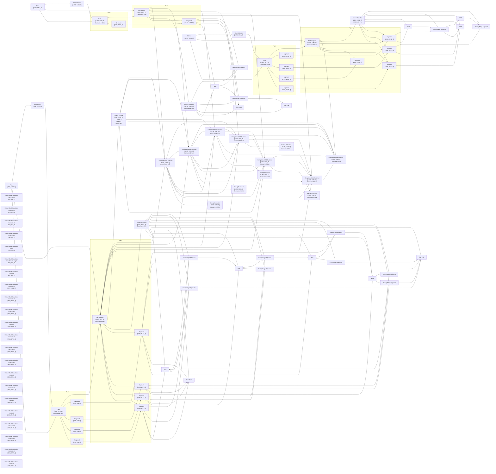

```mermaid
flowchart LR
  subgraph path2 [Path]
    2["Path<br>[386, 1071, 0]<br>Consumed: false"]
      %% [ProgramBodyItem { index: 11 }, VariableDeclarationDeclaration, VariableDeclarationInit]
    3["Segment<br>[414, 473, 0]"]
      %% [ProgramBodyItem { index: 11 }, VariableDeclarationDeclaration, VariableDeclarationInit, SketchBlockBody, SketchBlockBodyItem { index: 0 }, VariableDeclarationDeclaration, VariableDeclarationInit]
    4["Segment<br>[505, 576, 0]"]
      %% [ProgramBodyItem { index: 11 }, VariableDeclarationDeclaration, VariableDeclarationInit, SketchBlockBody, SketchBlockBodyItem { index: 2 }, VariableDeclarationDeclaration, VariableDeclarationInit]
    5["Segment<br>[661, 727, 0]"]
      %% [ProgramBodyItem { index: 11 }, VariableDeclarationDeclaration, VariableDeclarationInit, SketchBlockBody, SketchBlockBodyItem { index: 5 }, VariableDeclarationDeclaration, VariableDeclarationInit]
    6["Segment<br>[894, 994, 0]"]
      %% [ProgramBodyItem { index: 11 }, VariableDeclarationDeclaration, VariableDeclarationInit, SketchBlockBody, SketchBlockBodyItem { index: 10 }, VariableDeclarationDeclaration, VariableDeclarationInit]
  end
  subgraph path7 [Path]
    7["Path Region<br>[1091, 1127, 0]<br>Consumed: true"]
      %% [ProgramBodyItem { index: 12 }, VariableDeclarationDeclaration, VariableDeclarationInit, PipeBodyItem { index: 0 }]
    8["Segment<br>[1091, 1127, 0]"]
      %% [ProgramBodyItem { index: 12 }, VariableDeclarationDeclaration, VariableDeclarationInit, PipeBodyItem { index: 0 }]
    9["Segment<br>[1091, 1127, 0]"]
      %% [ProgramBodyItem { index: 12 }, VariableDeclarationDeclaration, VariableDeclarationInit, PipeBodyItem { index: 0 }]
    10["Segment<br>[1091, 1127, 0]"]
      %% [ProgramBodyItem { index: 12 }, VariableDeclarationDeclaration, VariableDeclarationInit, PipeBodyItem { index: 0 }]
    11["Segment<br>[1091, 1127, 0]"]
      %% [ProgramBodyItem { index: 12 }, VariableDeclarationDeclaration, VariableDeclarationInit, PipeBodyItem { index: 0 }]
  end
  subgraph path34 [Path]
    34["Path<br>[1252, 1418, 0]<br>Consumed: false"]
      %% [ProgramBodyItem { index: 13 }, VariableDeclarationDeclaration, VariableDeclarationInit]
    35["Segment<br>[1282, 1347, 0]"]
      %% [ProgramBodyItem { index: 13 }, VariableDeclarationDeclaration, VariableDeclarationInit, SketchBlockBody, SketchBlockBodyItem { index: 0 }, VariableDeclarationDeclaration, VariableDeclarationInit]
  end
  subgraph path36 [Path]
    36["Path Region<br>[1432, 1469, 0]<br>Consumed: true"]
      %% [ProgramBodyItem { index: 14 }, VariableDeclarationDeclaration, VariableDeclarationInit, PipeBodyItem { index: 0 }]
    37["Segment<br>[1432, 1469, 0]"]
      %% [ProgramBodyItem { index: 14 }, VariableDeclarationDeclaration, VariableDeclarationInit, PipeBodyItem { index: 0 }]
  end
  subgraph path51 [Path]
    51["Path<br>[1595, 2315, 0]<br>Consumed: false"]
      %% [ProgramBodyItem { index: 16 }, VariableDeclarationDeclaration, VariableDeclarationInit]
    52["Segment<br>[1648, 1710, 0]"]
      %% [ProgramBodyItem { index: 16 }, VariableDeclarationDeclaration, VariableDeclarationInit, SketchBlockBody, SketchBlockBodyItem { index: 0 }, VariableDeclarationDeclaration, VariableDeclarationInit]
    53["Segment<br>[1791, 1860, 0]"]
      %% [ProgramBodyItem { index: 16 }, VariableDeclarationDeclaration, VariableDeclarationInit, SketchBlockBody, SketchBlockBodyItem { index: 3 }, VariableDeclarationDeclaration, VariableDeclarationInit]
    54["Segment<br>[1909, 2013, 0]"]
      %% [ProgramBodyItem { index: 16 }, VariableDeclarationDeclaration, VariableDeclarationInit, SketchBlockBody, SketchBlockBodyItem { index: 5 }, VariableDeclarationDeclaration, VariableDeclarationInit]
    55["Segment<br>[2156, 2218, 0]"]
      %% [ProgramBodyItem { index: 16 }, VariableDeclarationDeclaration, VariableDeclarationInit, SketchBlockBody, SketchBlockBodyItem { index: 11 }, VariableDeclarationDeclaration, VariableDeclarationInit]
  end
  subgraph path56 [Path]
    56["Path Region<br>[2356, 2392, 0]<br>Consumed: true"]
      %% [ProgramBodyItem { index: 18 }, VariableDeclarationDeclaration, VariableDeclarationInit]
    57["Segment<br>[2356, 2392, 0]"]
      %% [ProgramBodyItem { index: 18 }, VariableDeclarationDeclaration, VariableDeclarationInit]
    58["Segment<br>[2356, 2392, 0]"]
      %% [ProgramBodyItem { index: 18 }, VariableDeclarationDeclaration, VariableDeclarationInit]
    59["Segment<br>[2356, 2392, 0]"]
      %% [ProgramBodyItem { index: 18 }, VariableDeclarationDeclaration, VariableDeclarationInit]
    60["Segment<br>[2356, 2392, 0]"]
      %% [ProgramBodyItem { index: 18 }, VariableDeclarationDeclaration, VariableDeclarationInit]
  end
  1["Plane<br>[386, 1071, 0]"]
    %% [ProgramBodyItem { index: 11 }, VariableDeclarationDeclaration, VariableDeclarationInit]
  12["Pattern Circular<br>[1133, 1190, 0]<br>Copies: 5<br>Faces: 0<br>Edges: 20"]
    %% [ProgramBodyItem { index: 12 }, VariableDeclarationDeclaration, VariableDeclarationInit, PipeBodyItem { index: 1 }]
  13["Sweep Extrusion<br>[1196, 1237, 0]<br>Consumed: true"]
    %% [ProgramBodyItem { index: 12 }, VariableDeclarationDeclaration, VariableDeclarationInit, PipeBodyItem { index: 2 }]
  14[Wall]
    %% face_code_ref=Missing NodePath
  15[Wall]
    %% face_code_ref=Missing NodePath
  16[Wall]
    %% face_code_ref=Missing NodePath
  17[Wall]
    %% face_code_ref=Missing NodePath
  18["Cap Start"]
    %% face_code_ref=Missing NodePath
  19["Cap End"]
    %% face_code_ref=Missing NodePath
  20["SweepEdge Opposite"]
  21["SweepEdge Adjacent"]
  22["SweepEdge Opposite"]
  23["SweepEdge Adjacent"]
  24["SweepEdge Opposite"]
  25["SweepEdge Adjacent"]
  26["SweepEdge Opposite"]
  27["SweepEdge Adjacent"]
  28["Sweep Extrusion<br>[1196, 1237, 0]<br>Consumed: false"]
    %% [ProgramBodyItem { index: 12 }, VariableDeclarationDeclaration, VariableDeclarationInit, PipeBodyItem { index: 2 }]
  29["Sweep Extrusion<br>[1196, 1237, 0]<br>Consumed: false"]
    %% [ProgramBodyItem { index: 12 }, VariableDeclarationDeclaration, VariableDeclarationInit, PipeBodyItem { index: 2 }]
  30["Sweep Extrusion<br>[1196, 1237, 0]<br>Consumed: false"]
    %% [ProgramBodyItem { index: 12 }, VariableDeclarationDeclaration, VariableDeclarationInit, PipeBodyItem { index: 2 }]
  31["Sweep Extrusion<br>[1196, 1237, 0]<br>Consumed: false"]
    %% [ProgramBodyItem { index: 12 }, VariableDeclarationDeclaration, VariableDeclarationInit, PipeBodyItem { index: 2 }]
  32["Sweep Extrusion<br>[1196, 1237, 0]<br>Consumed: false"]
    %% [ProgramBodyItem { index: 12 }, VariableDeclarationDeclaration, VariableDeclarationInit, PipeBodyItem { index: 2 }]
  33["Plane<br>[1252, 1418, 0]"]
    %% [ProgramBodyItem { index: 13 }, VariableDeclarationDeclaration, VariableDeclarationInit]
  38["Sweep Extrusion<br>[1475, 1521, 0]<br>Consumed: true"]
    %% [ProgramBodyItem { index: 14 }, VariableDeclarationDeclaration, VariableDeclarationInit, PipeBodyItem { index: 1 }]
  39[Wall]
    %% face_code_ref=Missing NodePath
  40["Cap Start"]
    %% face_code_ref=Missing NodePath
  41["Cap End"]
    %% face_code_ref=Missing NodePath
  42["SweepEdge Opposite"]
  43["SweepEdge Adjacent"]
  44["CompositeSolid Subtract<br>[1535, 1581, 0]<br>Consumed: true"]
    %% [ProgramBodyItem { index: 15 }, VariableDeclarationDeclaration, VariableDeclarationInit]
  45["CompositeSolid Subtract<br>[1535, 1581, 0]<br>Consumed: true"]
    %% [ProgramBodyItem { index: 15 }, VariableDeclarationDeclaration, VariableDeclarationInit]
  46["CompositeSolid Subtract<br>[1535, 1581, 0]<br>Consumed: true"]
    %% [ProgramBodyItem { index: 15 }, VariableDeclarationDeclaration, VariableDeclarationInit]
  47["CompositeSolid Subtract<br>[1535, 1581, 0]<br>Consumed: true"]
    %% [ProgramBodyItem { index: 15 }, VariableDeclarationDeclaration, VariableDeclarationInit]
  48["CompositeSolid Subtract<br>[1535, 1581, 0]<br>Consumed: true"]
    %% [ProgramBodyItem { index: 15 }, VariableDeclarationDeclaration, VariableDeclarationInit]
  49["CompositeSolid Subtract<br>[1535, 1581, 0]<br>Consumed: true"]
    %% [ProgramBodyItem { index: 15 }, VariableDeclarationDeclaration, VariableDeclarationInit]
  50["Plane<br>[1607, 1634, 0]"]
    %% [ProgramBodyItem { index: 16 }, VariableDeclarationDeclaration, VariableDeclarationInit, SketchBlockArgs]
  61["Sweep Revolve<br>[2403, 2431, 0]<br>Consumed: true"]
    %% [ProgramBodyItem { index: 19 }, VariableDeclarationDeclaration, VariableDeclarationInit]
  62[Wall]
    %% face_code_ref=Missing NodePath
  63[Wall]
    %% face_code_ref=Missing NodePath
  64[Wall]
    %% face_code_ref=Missing NodePath
  65["SweepEdge Adjacent"]
  66["SweepEdge Adjacent"]
  67["CompositeSolid Intersect<br>[2449, 2480, 0]<br>Consumed: false"]
    %% [ProgramBodyItem { index: 20 }, VariableDeclarationDeclaration, VariableDeclarationInit]
  68["SketchBlock<br>[386, 1071, 0]"]
    %% [ProgramBodyItem { index: 11 }, VariableDeclarationDeclaration, VariableDeclarationInit]
  69["SketchBlockConstraint Horizontal<br>[476, 495, 0]"]
    %% [ProgramBodyItem { index: 11 }, VariableDeclarationDeclaration, VariableDeclarationInit, SketchBlockBody, SketchBlockBodyItem { index: 1 }, ExpressionStatementExpr]
  70["SketchBlockConstraint Coincident<br>[579, 614, 0]"]
    %% [ProgramBodyItem { index: 11 }, VariableDeclarationDeclaration, VariableDeclarationInit, SketchBlockBody, SketchBlockBodyItem { index: 3 }, ExpressionStatementExpr]
  71["SketchBlockConstraint Coincident<br>[617, 650, 0]"]
    %% [ProgramBodyItem { index: 11 }, VariableDeclarationDeclaration, VariableDeclarationInit, SketchBlockBody, SketchBlockBodyItem { index: 4 }, ExpressionStatementExpr]
  72["SketchBlockConstraint Coincident<br>[730, 766, 0]"]
    %% [ProgramBodyItem { index: 11 }, VariableDeclarationDeclaration, VariableDeclarationInit, SketchBlockBody, SketchBlockBodyItem { index: 6 }, ExpressionStatementExpr]
  73["SketchBlockConstraint Angle<br>[769, 804, 0]"]
    %% [ProgramBodyItem { index: 11 }, VariableDeclarationDeclaration, VariableDeclarationInit, SketchBlockBody, SketchBlockBodyItem { index: 7 }, ExpressionStatementExpr]
  74["SketchBlockConstraint LinesEqualLength<br>[807, 834, 0]"]
    %% [ProgramBodyItem { index: 11 }, VariableDeclarationDeclaration, VariableDeclarationInit, SketchBlockBody, SketchBlockBodyItem { index: 8 }, ExpressionStatementExpr]
  75["SketchBlockConstraint Distance<br>[837, 884, 0]"]
    %% [ProgramBodyItem { index: 11 }, VariableDeclarationDeclaration, VariableDeclarationInit, SketchBlockBody, SketchBlockBodyItem { index: 9 }, ExpressionStatementExpr]
  76["SketchBlockConstraint Coincident<br>[997, 1034, 0]"]
    %% [ProgramBodyItem { index: 11 }, VariableDeclarationDeclaration, VariableDeclarationInit, SketchBlockBody, SketchBlockBodyItem { index: 11 }, ExpressionStatementExpr]
  77["SketchBlockConstraint Coincident<br>[1037, 1069, 0]"]
    %% [ProgramBodyItem { index: 11 }, VariableDeclarationDeclaration, VariableDeclarationInit, SketchBlockBody, SketchBlockBodyItem { index: 12 }, ExpressionStatementExpr]
  78["SketchBlock<br>[1252, 1418, 0]"]
    %% [ProgramBodyItem { index: 13 }, VariableDeclarationDeclaration, VariableDeclarationInit]
  79["SketchBlockConstraint Coincident<br>[1350, 1386, 0]"]
    %% [ProgramBodyItem { index: 13 }, VariableDeclarationDeclaration, VariableDeclarationInit, SketchBlockBody, SketchBlockBodyItem { index: 1 }, ExpressionStatementExpr]
  80["SketchBlockConstraint Radius<br>[1389, 1416, 0]"]
    %% [ProgramBodyItem { index: 13 }, VariableDeclarationDeclaration, VariableDeclarationInit, SketchBlockBody, SketchBlockBodyItem { index: 2 }, ExpressionStatementExpr]
  81["SketchBlock<br>[1595, 2315, 0]"]
    %% [ProgramBodyItem { index: 16 }, VariableDeclarationDeclaration, VariableDeclarationInit]
  82["SketchBlockConstraint Coincident<br>[1713, 1746, 0]"]
    %% [ProgramBodyItem { index: 16 }, VariableDeclarationDeclaration, VariableDeclarationInit, SketchBlockBody, SketchBlockBodyItem { index: 1 }, ExpressionStatementExpr]
  83["SketchBlockConstraint Horizontal<br>[1749, 1780, 0]"]
    %% [ProgramBodyItem { index: 16 }, VariableDeclarationDeclaration, VariableDeclarationInit, SketchBlockBody, SketchBlockBodyItem { index: 2 }, ExpressionStatementExpr]
  84["SketchBlockConstraint Coincident<br>[1863, 1899, 0]"]
    %% [ProgramBodyItem { index: 16 }, VariableDeclarationDeclaration, VariableDeclarationInit, SketchBlockBody, SketchBlockBodyItem { index: 4 }, ExpressionStatementExpr]
  85["SketchBlockConstraint Vertical<br>[2016, 2044, 0]"]
    %% [ProgramBodyItem { index: 16 }, VariableDeclarationDeclaration, VariableDeclarationInit, SketchBlockBody, SketchBlockBodyItem { index: 6 }, ExpressionStatementExpr]
  86["SketchBlockConstraint Coincident<br>[2047, 2082, 0]"]
    %% [ProgramBodyItem { index: 16 }, VariableDeclarationDeclaration, VariableDeclarationInit, SketchBlockBody, SketchBlockBodyItem { index: 7 }, ExpressionStatementExpr]
  87["SketchBlockConstraint Tangent<br>[2085, 2107, 0]"]
    %% [ProgramBodyItem { index: 16 }, VariableDeclarationDeclaration, VariableDeclarationInit, SketchBlockBody, SketchBlockBodyItem { index: 8 }, ExpressionStatementExpr]
  88["SketchBlockConstraint Vertical<br>[2110, 2125, 0]"]
    %% [ProgramBodyItem { index: 16 }, VariableDeclarationDeclaration, VariableDeclarationInit, SketchBlockBody, SketchBlockBodyItem { index: 9 }, ExpressionStatementExpr]
  89["SketchBlockConstraint Horizontal<br>[2128, 2145, 0]"]
    %% [ProgramBodyItem { index: 16 }, VariableDeclarationDeclaration, VariableDeclarationInit, SketchBlockBody, SketchBlockBodyItem { index: 10 }, ExpressionStatementExpr]
  90["SketchBlockConstraint Coincident<br>[2221, 2256, 0]"]
    %% [ProgramBodyItem { index: 16 }, VariableDeclarationDeclaration, VariableDeclarationInit, SketchBlockBody, SketchBlockBodyItem { index: 12 }, ExpressionStatementExpr]
  91["SketchBlockConstraint Coincident<br>[2259, 2295, 0]"]
    %% [ProgramBodyItem { index: 16 }, VariableDeclarationDeclaration, VariableDeclarationInit, SketchBlockBody, SketchBlockBodyItem { index: 13 }, ExpressionStatementExpr]
  92["SketchBlockConstraint Vertical<br>[2298, 2313, 0]"]
    %% [ProgramBodyItem { index: 16 }, VariableDeclarationDeclaration, VariableDeclarationInit, SketchBlockBody, SketchBlockBodyItem { index: 14 }, ExpressionStatementExpr]
  1 --- 2
  1 <--x 7
  1 <--x 68
  2 --- 3
  2 --- 4
  2 --- 5
  2 --- 6
  2 <--x 7
  68 --- 2
  3 <--x 8
  4 <--x 9
  5 <--x 10
  6 <--x 11
  7 <--x 8
  7 <--x 9
  7 <--x 10
  7 <--x 11
  7 --- 12
  7 ---- 13
  7 <--x 44
  7 <--x 45
  7 <--x 46
  7 <--x 47
  7 <--x 48
  7 --- 49
  8 --- 17
  8 x--> 18
  8 --- 26
  8 --- 27
  9 --- 16
  9 x--> 18
  9 --- 24
  9 --- 25
  10 --- 14
  10 x--> 18
  10 --- 20
  10 --- 21
  11 --- 15
  11 x--> 18
  11 --- 22
  11 --- 23
  12 x--> 45
  12 x--> 46
  12 x--> 47
  12 x--> 48
  12 x--> 49
  13 --- 14
  13 --- 15
  13 --- 16
  13 --- 17
  13 --- 18
  13 --- 19
  13 --- 20
  13 --- 21
  13 --- 22
  13 --- 23
  13 --- 24
  13 --- 25
  13 --- 26
  13 --- 27
  14 --- 20
  14 --- 21
  23 <--x 14
  15 --- 22
  15 --- 23
  25 <--x 15
  16 --- 24
  16 --- 25
  27 <--x 16
  21 <--x 17
  17 --- 26
  17 --- 27
  20 <--x 19
  22 <--x 19
  24 <--x 19
  26 <--x 19
  45 x--> 28
  46 x--> 29
  47 x--> 30
  48 x--> 31
  49 x--> 32
  33 --- 34
  33 <--x 36
  33 <--x 78
  34 --- 35
  34 <--x 36
  78 --- 34
  35 <--x 37
  36 <--x 37
  36 ---- 38
  36 <--x 44
  36 <--x 45
  36 <--x 46
  36 <--x 47
  36 <--x 48
  36 --- 49
  37 --- 39
  37 x--> 40
  37 --- 42
  37 --- 43
  38 --- 39
  38 --- 40
  38 --- 41
  38 --- 42
  38 --- 43
  39 --- 42
  39 --- 43
  42 <--x 41
  45 x--> 44
  46 x--> 44
  47 x--> 44
  48 x--> 44
  49 x--> 44
  44 --- 67
  46 --- 45
  47 --- 45
  48 --- 45
  49 --- 45
  45 --- 67
  47 --- 46
  48 --- 46
  49 --- 46
  46 --- 67
  48 --- 47
  49 --- 47
  47 --- 67
  49 --- 48
  48 --- 67
  49 --- 67
  50 --- 51
  50 <--x 56
  50 <--x 81
  51 --- 52
  51 --- 53
  51 --- 54
  51 --- 55
  51 <--x 56
  81 --- 51
  52 <--x 57
  53 <--x 58
  54 <--x 59
  55 <--x 60
  56 <--x 57
  56 <--x 58
  56 <--x 59
  56 <--x 60
  56 ---- 61
  56 --- 67
  61 <--x 57
  57 --- 62
  61 <--x 59
  59 --- 64
  59 --- 66
  61 <--x 60
  60 --- 63
  60 --- 65
  61 --- 62
  61 --- 63
  61 --- 64
  61 --- 65
  61 --- 66
  65 <--x 62
  63 x--> 65
  65 <--x 64
  64 x--> 66
```
