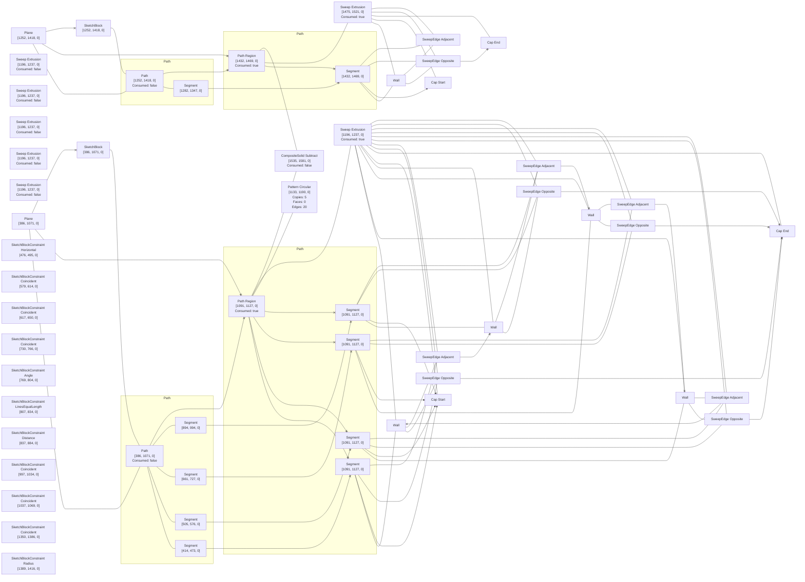

```mermaid
flowchart LR
  subgraph path2 [Path]
    2["Path<br>[386, 1071, 0]<br>Consumed: false"]
      %% [ProgramBodyItem { index: 11 }, VariableDeclarationDeclaration, VariableDeclarationInit]
    3["Segment<br>[414, 473, 0]"]
      %% [ProgramBodyItem { index: 11 }, VariableDeclarationDeclaration, VariableDeclarationInit, SketchBlockBody, SketchBlockBodyItem { index: 0 }, VariableDeclarationDeclaration, VariableDeclarationInit]
    4["Segment<br>[505, 576, 0]"]
      %% [ProgramBodyItem { index: 11 }, VariableDeclarationDeclaration, VariableDeclarationInit, SketchBlockBody, SketchBlockBodyItem { index: 2 }, VariableDeclarationDeclaration, VariableDeclarationInit]
    5["Segment<br>[661, 727, 0]"]
      %% [ProgramBodyItem { index: 11 }, VariableDeclarationDeclaration, VariableDeclarationInit, SketchBlockBody, SketchBlockBodyItem { index: 5 }, VariableDeclarationDeclaration, VariableDeclarationInit]
    6["Segment<br>[894, 994, 0]"]
      %% [ProgramBodyItem { index: 11 }, VariableDeclarationDeclaration, VariableDeclarationInit, SketchBlockBody, SketchBlockBodyItem { index: 10 }, VariableDeclarationDeclaration, VariableDeclarationInit]
  end
  subgraph path7 [Path]
    7["Path Region<br>[1091, 1127, 0]<br>Consumed: true"]
      %% [ProgramBodyItem { index: 12 }, VariableDeclarationDeclaration, VariableDeclarationInit, PipeBodyItem { index: 0 }]
    8["Segment<br>[1091, 1127, 0]"]
      %% [ProgramBodyItem { index: 12 }, VariableDeclarationDeclaration, VariableDeclarationInit, PipeBodyItem { index: 0 }]
    9["Segment<br>[1091, 1127, 0]"]
      %% [ProgramBodyItem { index: 12 }, VariableDeclarationDeclaration, VariableDeclarationInit, PipeBodyItem { index: 0 }]
    10["Segment<br>[1091, 1127, 0]"]
      %% [ProgramBodyItem { index: 12 }, VariableDeclarationDeclaration, VariableDeclarationInit, PipeBodyItem { index: 0 }]
    11["Segment<br>[1091, 1127, 0]"]
      %% [ProgramBodyItem { index: 12 }, VariableDeclarationDeclaration, VariableDeclarationInit, PipeBodyItem { index: 0 }]
  end
  subgraph path34 [Path]
    34["Path<br>[1252, 1418, 0]<br>Consumed: false"]
      %% [ProgramBodyItem { index: 13 }, VariableDeclarationDeclaration, VariableDeclarationInit]
    35["Segment<br>[1282, 1347, 0]"]
      %% [ProgramBodyItem { index: 13 }, VariableDeclarationDeclaration, VariableDeclarationInit, SketchBlockBody, SketchBlockBodyItem { index: 0 }, VariableDeclarationDeclaration, VariableDeclarationInit]
  end
  subgraph path36 [Path]
    36["Path Region<br>[1432, 1469, 0]<br>Consumed: true"]
      %% [ProgramBodyItem { index: 14 }, VariableDeclarationDeclaration, VariableDeclarationInit, PipeBodyItem { index: 0 }]
    37["Segment<br>[1432, 1469, 0]"]
      %% [ProgramBodyItem { index: 14 }, VariableDeclarationDeclaration, VariableDeclarationInit, PipeBodyItem { index: 0 }]
  end
  1["Plane<br>[386, 1071, 0]"]
    %% [ProgramBodyItem { index: 11 }, VariableDeclarationDeclaration, VariableDeclarationInit]
  12["Pattern Circular<br>[1133, 1190, 0]<br>Copies: 5<br>Faces: 0<br>Edges: 20"]
    %% [ProgramBodyItem { index: 12 }, VariableDeclarationDeclaration, VariableDeclarationInit, PipeBodyItem { index: 1 }]
  13["Sweep Extrusion<br>[1196, 1237, 0]<br>Consumed: true"]
    %% [ProgramBodyItem { index: 12 }, VariableDeclarationDeclaration, VariableDeclarationInit, PipeBodyItem { index: 2 }]
  14[Wall]
    %% face_code_ref=Missing NodePath
  15[Wall]
    %% face_code_ref=Missing NodePath
  16[Wall]
    %% face_code_ref=Missing NodePath
  17[Wall]
    %% face_code_ref=Missing NodePath
  18["Cap Start"]
    %% face_code_ref=Missing NodePath
  19["Cap End"]
    %% face_code_ref=Missing NodePath
  20["SweepEdge Opposite"]
  21["SweepEdge Adjacent"]
  22["SweepEdge Opposite"]
  23["SweepEdge Adjacent"]
  24["SweepEdge Opposite"]
  25["SweepEdge Adjacent"]
  26["SweepEdge Opposite"]
  27["SweepEdge Adjacent"]
  28["Sweep Extrusion<br>[1196, 1237, 0]<br>Consumed: false"]
    %% [ProgramBodyItem { index: 12 }, VariableDeclarationDeclaration, VariableDeclarationInit, PipeBodyItem { index: 2 }]
  29["Sweep Extrusion<br>[1196, 1237, 0]<br>Consumed: false"]
    %% [ProgramBodyItem { index: 12 }, VariableDeclarationDeclaration, VariableDeclarationInit, PipeBodyItem { index: 2 }]
  30["Sweep Extrusion<br>[1196, 1237, 0]<br>Consumed: false"]
    %% [ProgramBodyItem { index: 12 }, VariableDeclarationDeclaration, VariableDeclarationInit, PipeBodyItem { index: 2 }]
  31["Sweep Extrusion<br>[1196, 1237, 0]<br>Consumed: false"]
    %% [ProgramBodyItem { index: 12 }, VariableDeclarationDeclaration, VariableDeclarationInit, PipeBodyItem { index: 2 }]
  32["Sweep Extrusion<br>[1196, 1237, 0]<br>Consumed: false"]
    %% [ProgramBodyItem { index: 12 }, VariableDeclarationDeclaration, VariableDeclarationInit, PipeBodyItem { index: 2 }]
  33["Plane<br>[1252, 1418, 0]"]
    %% [ProgramBodyItem { index: 13 }, VariableDeclarationDeclaration, VariableDeclarationInit]
  38["Sweep Extrusion<br>[1475, 1521, 0]<br>Consumed: true"]
    %% [ProgramBodyItem { index: 14 }, VariableDeclarationDeclaration, VariableDeclarationInit, PipeBodyItem { index: 1 }]
  39[Wall]
    %% face_code_ref=Missing NodePath
  40["Cap Start"]
    %% face_code_ref=Missing NodePath
  41["Cap End"]
    %% face_code_ref=Missing NodePath
  42["SweepEdge Opposite"]
  43["SweepEdge Adjacent"]
  44["CompositeSolid Subtract<br>[1535, 1581, 0]<br>Consumed: false"]
    %% [ProgramBodyItem { index: 15 }, VariableDeclarationDeclaration, VariableDeclarationInit]
  45["SketchBlock<br>[386, 1071, 0]"]
    %% [ProgramBodyItem { index: 11 }, VariableDeclarationDeclaration, VariableDeclarationInit]
  46["SketchBlockConstraint Horizontal<br>[476, 495, 0]"]
    %% [ProgramBodyItem { index: 11 }, VariableDeclarationDeclaration, VariableDeclarationInit, SketchBlockBody, SketchBlockBodyItem { index: 1 }, ExpressionStatementExpr]
  47["SketchBlockConstraint Coincident<br>[579, 614, 0]"]
    %% [ProgramBodyItem { index: 11 }, VariableDeclarationDeclaration, VariableDeclarationInit, SketchBlockBody, SketchBlockBodyItem { index: 3 }, ExpressionStatementExpr]
  48["SketchBlockConstraint Coincident<br>[617, 650, 0]"]
    %% [ProgramBodyItem { index: 11 }, VariableDeclarationDeclaration, VariableDeclarationInit, SketchBlockBody, SketchBlockBodyItem { index: 4 }, ExpressionStatementExpr]
  49["SketchBlockConstraint Coincident<br>[730, 766, 0]"]
    %% [ProgramBodyItem { index: 11 }, VariableDeclarationDeclaration, VariableDeclarationInit, SketchBlockBody, SketchBlockBodyItem { index: 6 }, ExpressionStatementExpr]
  50["SketchBlockConstraint Angle<br>[769, 804, 0]"]
    %% [ProgramBodyItem { index: 11 }, VariableDeclarationDeclaration, VariableDeclarationInit, SketchBlockBody, SketchBlockBodyItem { index: 7 }, ExpressionStatementExpr]
  51["SketchBlockConstraint LinesEqualLength<br>[807, 834, 0]"]
    %% [ProgramBodyItem { index: 11 }, VariableDeclarationDeclaration, VariableDeclarationInit, SketchBlockBody, SketchBlockBodyItem { index: 8 }, ExpressionStatementExpr]
  52["SketchBlockConstraint Distance<br>[837, 884, 0]"]
    %% [ProgramBodyItem { index: 11 }, VariableDeclarationDeclaration, VariableDeclarationInit, SketchBlockBody, SketchBlockBodyItem { index: 9 }, ExpressionStatementExpr]
  53["SketchBlockConstraint Coincident<br>[997, 1034, 0]"]
    %% [ProgramBodyItem { index: 11 }, VariableDeclarationDeclaration, VariableDeclarationInit, SketchBlockBody, SketchBlockBodyItem { index: 11 }, ExpressionStatementExpr]
  54["SketchBlockConstraint Coincident<br>[1037, 1069, 0]"]
    %% [ProgramBodyItem { index: 11 }, VariableDeclarationDeclaration, VariableDeclarationInit, SketchBlockBody, SketchBlockBodyItem { index: 12 }, ExpressionStatementExpr]
  55["SketchBlock<br>[1252, 1418, 0]"]
    %% [ProgramBodyItem { index: 13 }, VariableDeclarationDeclaration, VariableDeclarationInit]
  56["SketchBlockConstraint Coincident<br>[1350, 1386, 0]"]
    %% [ProgramBodyItem { index: 13 }, VariableDeclarationDeclaration, VariableDeclarationInit, SketchBlockBody, SketchBlockBodyItem { index: 1 }, ExpressionStatementExpr]
  57["SketchBlockConstraint Radius<br>[1389, 1416, 0]"]
    %% [ProgramBodyItem { index: 13 }, VariableDeclarationDeclaration, VariableDeclarationInit, SketchBlockBody, SketchBlockBodyItem { index: 2 }, ExpressionStatementExpr]
  1 --- 2
  1 <--x 7
  1 <--x 45
  2 --- 3
  2 --- 4
  2 --- 5
  2 --- 6
  2 <--x 7
  45 --- 2
  3 <--x 8
  4 <--x 9
  5 <--x 10
  6 <--x 11
  7 <--x 8
  7 <--x 9
  7 <--x 10
  7 <--x 11
  7 --- 12
  7 ---- 13
  7 --- 44
  8 --- 14
  8 x--> 18
  8 --- 20
  8 --- 21
  9 --- 15
  9 x--> 18
  9 --- 22
  9 --- 23
  10 --- 16
  10 x--> 18
  10 --- 24
  10 --- 25
  11 --- 17
  11 x--> 18
  11 --- 26
  11 --- 27
  13 --- 14
  13 --- 15
  13 --- 16
  13 --- 17
  13 --- 18
  13 --- 19
  13 --- 20
  13 --- 21
  13 --- 22
  13 --- 23
  13 --- 24
  13 --- 25
  13 --- 26
  13 --- 27
  14 --- 20
  14 --- 21
  23 <--x 14
  15 --- 22
  15 --- 23
  25 <--x 15
  16 --- 24
  16 --- 25
  27 <--x 16
  21 <--x 17
  17 --- 26
  17 --- 27
  20 <--x 19
  22 <--x 19
  24 <--x 19
  26 <--x 19
  33 --- 34
  33 <--x 36
  33 <--x 55
  34 --- 35
  34 <--x 36
  55 --- 34
  35 <--x 37
  36 <--x 37
  36 ---- 38
  36 --- 44
  37 --- 39
  37 x--> 40
  37 --- 42
  37 --- 43
  38 --- 39
  38 --- 40
  38 --- 41
  38 --- 42
  38 --- 43
  39 --- 42
  39 --- 43
  42 <--x 41
```
