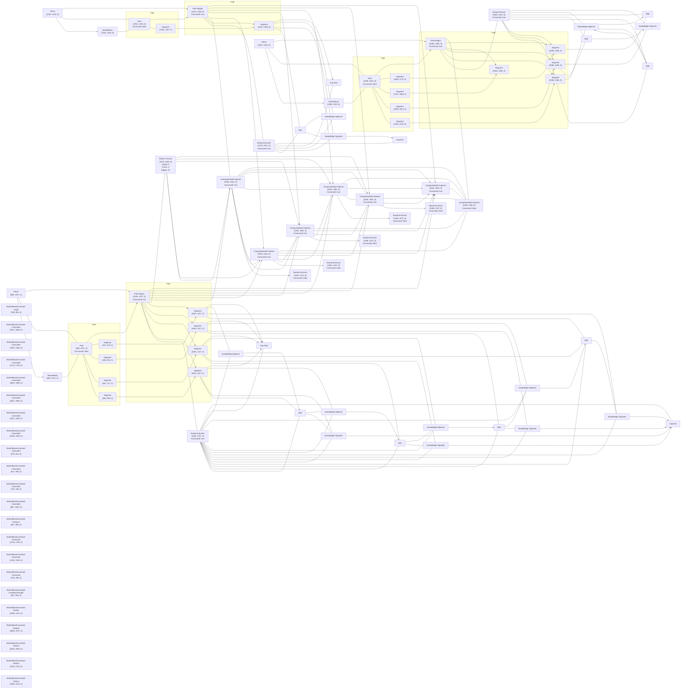

```mermaid
flowchart LR
  subgraph path12 [Path]
    12["Path Region<br>[1091, 1127, 0]<br>Consumed: true"]
      %% [ProgramBodyItem { index: 12 }, VariableDeclarationDeclaration, VariableDeclarationInit, PipeBodyItem { index: 0 }]
    22["Segment<br>[1091, 1127, 0]"]
      %% [ProgramBodyItem { index: 12 }, VariableDeclarationDeclaration, VariableDeclarationInit, PipeBodyItem { index: 0 }]
    23["Segment<br>[1091, 1127, 0]"]
      %% [ProgramBodyItem { index: 12 }, VariableDeclarationDeclaration, VariableDeclarationInit, PipeBodyItem { index: 0 }]
    24["Segment<br>[1091, 1127, 0]"]
      %% [ProgramBodyItem { index: 12 }, VariableDeclarationDeclaration, VariableDeclarationInit, PipeBodyItem { index: 0 }]
    25["Segment<br>[1091, 1127, 0]"]
      %% [ProgramBodyItem { index: 12 }, VariableDeclarationDeclaration, VariableDeclarationInit, PipeBodyItem { index: 0 }]
  end
  subgraph path13 [Path]
    13["Path Region<br>[1432, 1469, 0]<br>Consumed: true"]
      %% [ProgramBodyItem { index: 14 }, VariableDeclarationDeclaration, VariableDeclarationInit, PipeBodyItem { index: 0 }]
    27["Segment<br>[1432, 1469, 0]"]
      %% [ProgramBodyItem { index: 14 }, VariableDeclarationDeclaration, VariableDeclarationInit, PipeBodyItem { index: 0 }]
  end
  subgraph path14 [Path]
    14["Path Region<br>[2356, 2392, 0]<br>Consumed: true"]
      %% [ProgramBodyItem { index: 18 }, VariableDeclarationDeclaration, VariableDeclarationInit]
    32["Segment<br>[2356, 2392, 0]"]
      %% [ProgramBodyItem { index: 18 }, VariableDeclarationDeclaration, VariableDeclarationInit]
    33["Segment<br>[2356, 2392, 0]"]
      %% [ProgramBodyItem { index: 18 }, VariableDeclarationDeclaration, VariableDeclarationInit]
    34["Segment<br>[2356, 2392, 0]"]
      %% [ProgramBodyItem { index: 18 }, VariableDeclarationDeclaration, VariableDeclarationInit]
    35["Segment<br>[2356, 2392, 0]"]
      %% [ProgramBodyItem { index: 18 }, VariableDeclarationDeclaration, VariableDeclarationInit]
  end
  subgraph path15 [Path]
    15["Path<br>[1252, 1418, 0]<br>Consumed: false"]
      %% [ProgramBodyItem { index: 13 }, VariableDeclarationDeclaration, VariableDeclarationInit]
    26["Segment<br>[1282, 1347, 0]"]
      %% [ProgramBodyItem { index: 13 }, VariableDeclarationDeclaration, VariableDeclarationInit, SketchBlockBody, SketchBlockBodyItem { index: 0 }, VariableDeclarationDeclaration, VariableDeclarationInit]
  end
  subgraph path16 [Path]
    16["Path<br>[1595, 2315, 0]<br>Consumed: false"]
      %% [ProgramBodyItem { index: 16 }, VariableDeclarationDeclaration, VariableDeclarationInit]
    28["Segment<br>[1648, 1710, 0]"]
      %% [ProgramBodyItem { index: 16 }, VariableDeclarationDeclaration, VariableDeclarationInit, SketchBlockBody, SketchBlockBodyItem { index: 0 }, VariableDeclarationDeclaration, VariableDeclarationInit]
    29["Segment<br>[1791, 1860, 0]"]
      %% [ProgramBodyItem { index: 16 }, VariableDeclarationDeclaration, VariableDeclarationInit, SketchBlockBody, SketchBlockBodyItem { index: 3 }, VariableDeclarationDeclaration, VariableDeclarationInit]
    30["Segment<br>[1909, 2013, 0]"]
      %% [ProgramBodyItem { index: 16 }, VariableDeclarationDeclaration, VariableDeclarationInit, SketchBlockBody, SketchBlockBodyItem { index: 5 }, VariableDeclarationDeclaration, VariableDeclarationInit]
    31["Segment<br>[2156, 2218, 0]"]
      %% [ProgramBodyItem { index: 16 }, VariableDeclarationDeclaration, VariableDeclarationInit, SketchBlockBody, SketchBlockBodyItem { index: 11 }, VariableDeclarationDeclaration, VariableDeclarationInit]
  end
  subgraph path17 [Path]
    17["Path<br>[386, 1071, 0]<br>Consumed: false"]
      %% [ProgramBodyItem { index: 11 }, VariableDeclarationDeclaration, VariableDeclarationInit]
    36["Segment<br>[414, 473, 0]"]
      %% [ProgramBodyItem { index: 11 }, VariableDeclarationDeclaration, VariableDeclarationInit, SketchBlockBody, SketchBlockBodyItem { index: 0 }, VariableDeclarationDeclaration, VariableDeclarationInit]
    37["Segment<br>[505, 576, 0]"]
      %% [ProgramBodyItem { index: 11 }, VariableDeclarationDeclaration, VariableDeclarationInit, SketchBlockBody, SketchBlockBodyItem { index: 2 }, VariableDeclarationDeclaration, VariableDeclarationInit]
    38["Segment<br>[661, 727, 0]"]
      %% [ProgramBodyItem { index: 11 }, VariableDeclarationDeclaration, VariableDeclarationInit, SketchBlockBody, SketchBlockBodyItem { index: 5 }, VariableDeclarationDeclaration, VariableDeclarationInit]
    39["Segment<br>[894, 994, 0]"]
      %% [ProgramBodyItem { index: 11 }, VariableDeclarationDeclaration, VariableDeclarationInit, SketchBlockBody, SketchBlockBodyItem { index: 10 }, VariableDeclarationDeclaration, VariableDeclarationInit]
  end
  1["Cap End"]
    %% face_code_ref=Missing NodePath
  2["Cap End"]
    %% face_code_ref=Missing NodePath
  3["Cap Start"]
    %% face_code_ref=Missing NodePath
  4["Cap Start"]
    %% face_code_ref=Missing NodePath
  5["CompositeSolid Intersect<br>[2449, 2480, 0]<br>Consumed: false"]
    %% [ProgramBodyItem { index: 20 }, VariableDeclarationDeclaration, VariableDeclarationInit]
  6["CompositeSolid Subtract<br>[1535, 1581, 0]<br>Consumed: true"]
    %% [ProgramBodyItem { index: 15 }, VariableDeclarationDeclaration, VariableDeclarationInit]
  7["CompositeSolid Subtract<br>[1535, 1581, 0]<br>Consumed: true"]
    %% [ProgramBodyItem { index: 15 }, VariableDeclarationDeclaration, VariableDeclarationInit]
  8["CompositeSolid Subtract<br>[1535, 1581, 0]<br>Consumed: true"]
    %% [ProgramBodyItem { index: 15 }, VariableDeclarationDeclaration, VariableDeclarationInit]
  9["CompositeSolid Subtract<br>[1535, 1581, 0]<br>Consumed: true"]
    %% [ProgramBodyItem { index: 15 }, VariableDeclarationDeclaration, VariableDeclarationInit]
  10["CompositeSolid Subtract<br>[1535, 1581, 0]<br>Consumed: true"]
    %% [ProgramBodyItem { index: 15 }, VariableDeclarationDeclaration, VariableDeclarationInit]
  11["CompositeSolid Subtract<br>[1535, 1581, 0]<br>Consumed: true"]
    %% [ProgramBodyItem { index: 15 }, VariableDeclarationDeclaration, VariableDeclarationInit]
  18["Pattern Circular<br>[1133, 1190, 0]<br>Copies: 5<br>Faces: 0<br>Edges: 20"]
    %% [ProgramBodyItem { index: 12 }, VariableDeclarationDeclaration, VariableDeclarationInit, PipeBodyItem { index: 1 }]
  19["Plane<br>[1252, 1418, 0]"]
    %% [ProgramBodyItem { index: 13 }, VariableDeclarationDeclaration, VariableDeclarationInit]
  20["Plane<br>[1607, 1634, 0]"]
    %% [ProgramBodyItem { index: 16 }, VariableDeclarationDeclaration, VariableDeclarationInit, SketchBlockArgs]
  21["Plane<br>[386, 1071, 0]"]
    %% [ProgramBodyItem { index: 11 }, VariableDeclarationDeclaration, VariableDeclarationInit]
  40["SketchBlock<br>[1252, 1418, 0]"]
    %% [ProgramBodyItem { index: 13 }, VariableDeclarationDeclaration, VariableDeclarationInit]
  41["SketchBlock<br>[1595, 2315, 0]"]
    %% [ProgramBodyItem { index: 16 }, VariableDeclarationDeclaration, VariableDeclarationInit]
  42["SketchBlock<br>[386, 1071, 0]"]
    %% [ProgramBodyItem { index: 11 }, VariableDeclarationDeclaration, VariableDeclarationInit]
  43["SketchBlockConstraint Angle<br>[769, 804, 0]"]
    %% [ProgramBodyItem { index: 11 }, VariableDeclarationDeclaration, VariableDeclarationInit, SketchBlockBody, SketchBlockBodyItem { index: 7 }, ExpressionStatementExpr]
  44["SketchBlockConstraint Coincident<br>[1037, 1069, 0]"]
    %% [ProgramBodyItem { index: 11 }, VariableDeclarationDeclaration, VariableDeclarationInit, SketchBlockBody, SketchBlockBodyItem { index: 12 }, ExpressionStatementExpr]
  45["SketchBlockConstraint Coincident<br>[1350, 1386, 0]"]
    %% [ProgramBodyItem { index: 13 }, VariableDeclarationDeclaration, VariableDeclarationInit, SketchBlockBody, SketchBlockBodyItem { index: 1 }, ExpressionStatementExpr]
  46["SketchBlockConstraint Coincident<br>[1713, 1746, 0]"]
    %% [ProgramBodyItem { index: 16 }, VariableDeclarationDeclaration, VariableDeclarationInit, SketchBlockBody, SketchBlockBodyItem { index: 1 }, ExpressionStatementExpr]
  47["SketchBlockConstraint Coincident<br>[1863, 1899, 0]"]
    %% [ProgramBodyItem { index: 16 }, VariableDeclarationDeclaration, VariableDeclarationInit, SketchBlockBody, SketchBlockBodyItem { index: 4 }, ExpressionStatementExpr]
  48["SketchBlockConstraint Coincident<br>[2047, 2082, 0]"]
    %% [ProgramBodyItem { index: 16 }, VariableDeclarationDeclaration, VariableDeclarationInit, SketchBlockBody, SketchBlockBodyItem { index: 7 }, ExpressionStatementExpr]
  49["SketchBlockConstraint Coincident<br>[2221, 2256, 0]"]
    %% [ProgramBodyItem { index: 16 }, VariableDeclarationDeclaration, VariableDeclarationInit, SketchBlockBody, SketchBlockBodyItem { index: 12 }, ExpressionStatementExpr]
  50["SketchBlockConstraint Coincident<br>[2259, 2295, 0]"]
    %% [ProgramBodyItem { index: 16 }, VariableDeclarationDeclaration, VariableDeclarationInit, SketchBlockBody, SketchBlockBodyItem { index: 13 }, ExpressionStatementExpr]
  51["SketchBlockConstraint Coincident<br>[579, 614, 0]"]
    %% [ProgramBodyItem { index: 11 }, VariableDeclarationDeclaration, VariableDeclarationInit, SketchBlockBody, SketchBlockBodyItem { index: 3 }, ExpressionStatementExpr]
  52["SketchBlockConstraint Coincident<br>[617, 650, 0]"]
    %% [ProgramBodyItem { index: 11 }, VariableDeclarationDeclaration, VariableDeclarationInit, SketchBlockBody, SketchBlockBodyItem { index: 4 }, ExpressionStatementExpr]
  53["SketchBlockConstraint Coincident<br>[730, 766, 0]"]
    %% [ProgramBodyItem { index: 11 }, VariableDeclarationDeclaration, VariableDeclarationInit, SketchBlockBody, SketchBlockBodyItem { index: 6 }, ExpressionStatementExpr]
  54["SketchBlockConstraint Coincident<br>[997, 1034, 0]"]
    %% [ProgramBodyItem { index: 11 }, VariableDeclarationDeclaration, VariableDeclarationInit, SketchBlockBody, SketchBlockBodyItem { index: 11 }, ExpressionStatementExpr]
  55["SketchBlockConstraint Distance<br>[837, 884, 0]"]
    %% [ProgramBodyItem { index: 11 }, VariableDeclarationDeclaration, VariableDeclarationInit, SketchBlockBody, SketchBlockBodyItem { index: 9 }, ExpressionStatementExpr]
  56["SketchBlockConstraint Horizontal<br>[1749, 1780, 0]"]
    %% [ProgramBodyItem { index: 16 }, VariableDeclarationDeclaration, VariableDeclarationInit, SketchBlockBody, SketchBlockBodyItem { index: 2 }, ExpressionStatementExpr]
  57["SketchBlockConstraint Horizontal<br>[2128, 2145, 0]"]
    %% [ProgramBodyItem { index: 16 }, VariableDeclarationDeclaration, VariableDeclarationInit, SketchBlockBody, SketchBlockBodyItem { index: 10 }, ExpressionStatementExpr]
  58["SketchBlockConstraint Horizontal<br>[476, 495, 0]"]
    %% [ProgramBodyItem { index: 11 }, VariableDeclarationDeclaration, VariableDeclarationInit, SketchBlockBody, SketchBlockBodyItem { index: 1 }, ExpressionStatementExpr]
  59["SketchBlockConstraint LinesEqualLength<br>[807, 834, 0]"]
    %% [ProgramBodyItem { index: 11 }, VariableDeclarationDeclaration, VariableDeclarationInit, SketchBlockBody, SketchBlockBodyItem { index: 8 }, ExpressionStatementExpr]
  60["SketchBlockConstraint Radius<br>[1389, 1416, 0]"]
    %% [ProgramBodyItem { index: 13 }, VariableDeclarationDeclaration, VariableDeclarationInit, SketchBlockBody, SketchBlockBodyItem { index: 2 }, ExpressionStatementExpr]
  61["SketchBlockConstraint Tangent<br>[2085, 2107, 0]"]
    %% [ProgramBodyItem { index: 16 }, VariableDeclarationDeclaration, VariableDeclarationInit, SketchBlockBody, SketchBlockBodyItem { index: 8 }, ExpressionStatementExpr]
  62["SketchBlockConstraint Vertical<br>[2016, 2044, 0]"]
    %% [ProgramBodyItem { index: 16 }, VariableDeclarationDeclaration, VariableDeclarationInit, SketchBlockBody, SketchBlockBodyItem { index: 6 }, ExpressionStatementExpr]
  63["SketchBlockConstraint Vertical<br>[2110, 2125, 0]"]
    %% [ProgramBodyItem { index: 16 }, VariableDeclarationDeclaration, VariableDeclarationInit, SketchBlockBody, SketchBlockBodyItem { index: 9 }, ExpressionStatementExpr]
  64["SketchBlockConstraint Vertical<br>[2298, 2313, 0]"]
    %% [ProgramBodyItem { index: 16 }, VariableDeclarationDeclaration, VariableDeclarationInit, SketchBlockBody, SketchBlockBodyItem { index: 14 }, ExpressionStatementExpr]
  65["Sweep Extrusion<br>[1196, 1237, 0]<br>Consumed: true"]
    %% [ProgramBodyItem { index: 12 }, VariableDeclarationDeclaration, VariableDeclarationInit, PipeBodyItem { index: 2 }]
  66["Sweep Extrusion<br>[1196, 1237, 0]<br>Consumed: false"]
    %% [ProgramBodyItem { index: 12 }, VariableDeclarationDeclaration, VariableDeclarationInit, PipeBodyItem { index: 2 }]
  67["Sweep Extrusion<br>[1196, 1237, 0]<br>Consumed: false"]
    %% [ProgramBodyItem { index: 12 }, VariableDeclarationDeclaration, VariableDeclarationInit, PipeBodyItem { index: 2 }]
  68["Sweep Extrusion<br>[1196, 1237, 0]<br>Consumed: false"]
    %% [ProgramBodyItem { index: 12 }, VariableDeclarationDeclaration, VariableDeclarationInit, PipeBodyItem { index: 2 }]
  69["Sweep Extrusion<br>[1196, 1237, 0]<br>Consumed: false"]
    %% [ProgramBodyItem { index: 12 }, VariableDeclarationDeclaration, VariableDeclarationInit, PipeBodyItem { index: 2 }]
  70["Sweep Extrusion<br>[1196, 1237, 0]<br>Consumed: false"]
    %% [ProgramBodyItem { index: 12 }, VariableDeclarationDeclaration, VariableDeclarationInit, PipeBodyItem { index: 2 }]
  71["Sweep Extrusion<br>[1475, 1521, 0]<br>Consumed: true"]
    %% [ProgramBodyItem { index: 14 }, VariableDeclarationDeclaration, VariableDeclarationInit, PipeBodyItem { index: 1 }]
  72["Sweep Revolve<br>[2403, 2431, 0]<br>Consumed: true"]
    %% [ProgramBodyItem { index: 19 }, VariableDeclarationDeclaration, VariableDeclarationInit]
  73["SweepEdge Adjacent"]
  74["SweepEdge Adjacent"]
  75["SweepEdge Adjacent"]
  76["SweepEdge Adjacent"]
  77["SweepEdge Adjacent"]
  78["SweepEdge Adjacent"]
  79["SweepEdge Adjacent"]
  80["SweepEdge Opposite"]
  81["SweepEdge Opposite"]
  82["SweepEdge Opposite"]
  83["SweepEdge Opposite"]
  84["SweepEdge Opposite"]
  85[Wall]
    %% face_code_ref=Missing NodePath
  86[Wall]
    %% face_code_ref=Missing NodePath
  87[Wall]
    %% face_code_ref=Missing NodePath
  88[Wall]
    %% face_code_ref=Missing NodePath
  89[Wall]
    %% face_code_ref=Missing NodePath
  90[Wall]
    %% face_code_ref=Missing NodePath
  91[Wall]
    %% face_code_ref=Missing NodePath
  92[Wall]
    %% face_code_ref=Missing NodePath
  65 --- 1
  80 <--x 1
  81 <--x 1
  82 <--x 1
  83 <--x 1
  71 --- 2
  84 <--x 2
  22 <--x 3
  23 <--x 3
  24 <--x 3
  25 <--x 3
  65 --- 3
  27 <--x 4
  71 --- 4
  6 --- 5
  7 --- 5
  8 --- 5
  9 --- 5
  10 --- 5
  11 --- 5
  14 --- 5
  7 x--> 6
  8 x--> 6
  9 x--> 6
  10 x--> 6
  11 x--> 6
  12 x--> 6
  13 x--> 6
  8 --- 7
  9 --- 7
  10 --- 7
  11 --- 7
  12 x--> 7
  13 x--> 7
  18 <--x 7
  7 <--x 66
  9 --- 8
  10 --- 8
  11 --- 8
  12 x--> 8
  13 x--> 8
  18 <--x 8
  8 <--x 67
  10 --- 9
  11 --- 9
  12 x--> 9
  13 x--> 9
  18 <--x 9
  9 <--x 68
  11 --- 10
  12 x--> 10
  13 x--> 10
  18 <--x 10
  10 <--x 69
  12 --- 11
  13 --- 11
  18 <--x 11
  11 <--x 70
  17 x--> 12
  12 --- 18
  21 x--> 12
  12 <--x 22
  12 <--x 23
  12 <--x 24
  12 <--x 25
  12 ---- 65
  15 x--> 13
  19 x--> 13
  13 <--x 27
  13 ---- 71
  16 x--> 14
  20 x--> 14
  14 <--x 32
  14 <--x 33
  14 <--x 34
  14 <--x 35
  14 ---- 72
  19 --- 15
  15 --- 26
  40 --- 15
  20 --- 16
  16 --- 28
  16 --- 29
  16 --- 30
  16 --- 31
  41 --- 16
  21 --- 17
  17 --- 36
  17 --- 37
  17 --- 38
  17 --- 39
  42 --- 17
  19 <--x 40
  20 <--x 41
  21 <--x 42
  36 x--> 22
  22 --- 73
  22 --- 80
  22 --- 85
  37 x--> 23
  23 --- 74
  23 --- 81
  23 --- 86
  38 x--> 24
  24 --- 75
  24 --- 82
  24 --- 87
  39 x--> 25
  25 --- 76
  25 --- 83
  25 --- 88
  26 <--x 27
  27 --- 77
  27 --- 84
  27 --- 89
  28 <--x 32
  29 <--x 33
  30 <--x 34
  31 <--x 35
  72 <--x 32
  32 --- 90
  72 <--x 34
  34 --- 78
  34 --- 91
  72 <--x 35
  35 --- 79
  35 --- 92
  65 --- 73
  65 --- 74
  65 --- 75
  65 --- 76
  65 --- 80
  65 --- 81
  65 --- 82
  65 --- 83
  65 --- 85
  65 --- 86
  65 --- 87
  65 --- 88
  71 --- 77
  71 --- 84
  71 --- 89
  72 --- 78
  72 --- 79
  72 --- 90
  72 --- 91
  72 --- 92
  85 --- 73
  73 x--> 88
  74 x--> 85
  86 --- 74
  75 x--> 86
  87 --- 75
  76 x--> 87
  88 --- 76
  89 --- 77
  91 <--x 78
  79 x--> 90
  92 <--x 79
  79 x--> 92
  85 --- 80
  86 --- 81
  87 --- 82
  88 --- 83
  89 --- 84
```
