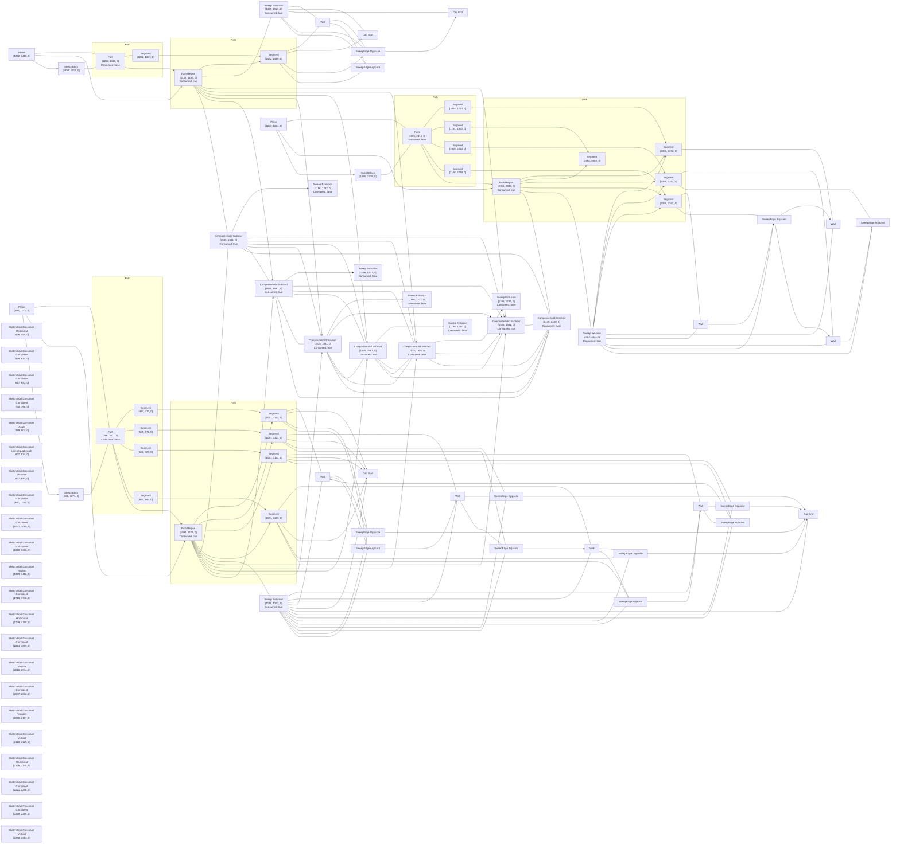

```mermaid
flowchart LR
  subgraph path2 [Path]
    2["Path<br>[386, 1071, 0]<br>Consumed: false"]
      %% [ProgramBodyItem { index: 11 }, VariableDeclarationDeclaration, VariableDeclarationInit]
    3["Segment<br>[414, 473, 0]"]
      %% [ProgramBodyItem { index: 11 }, VariableDeclarationDeclaration, VariableDeclarationInit, SketchBlockBody, SketchBlockBodyItem { index: 0 }, VariableDeclarationDeclaration, VariableDeclarationInit]
    4["Segment<br>[505, 576, 0]"]
      %% [ProgramBodyItem { index: 11 }, VariableDeclarationDeclaration, VariableDeclarationInit, SketchBlockBody, SketchBlockBodyItem { index: 2 }, VariableDeclarationDeclaration, VariableDeclarationInit]
    5["Segment<br>[661, 727, 0]"]
      %% [ProgramBodyItem { index: 11 }, VariableDeclarationDeclaration, VariableDeclarationInit, SketchBlockBody, SketchBlockBodyItem { index: 5 }, VariableDeclarationDeclaration, VariableDeclarationInit]
    6["Segment<br>[894, 994, 0]"]
      %% [ProgramBodyItem { index: 11 }, VariableDeclarationDeclaration, VariableDeclarationInit, SketchBlockBody, SketchBlockBodyItem { index: 10 }, VariableDeclarationDeclaration, VariableDeclarationInit]
  end
  subgraph path7 [Path]
    7["Path Region<br>[1091, 1127, 0]<br>Consumed: true"]
      %% [ProgramBodyItem { index: 12 }, VariableDeclarationDeclaration, VariableDeclarationInit, PipeBodyItem { index: 0 }]
    8["Segment<br>[1091, 1127, 0]"]
      %% [ProgramBodyItem { index: 12 }, VariableDeclarationDeclaration, VariableDeclarationInit, PipeBodyItem { index: 0 }]
    9["Segment<br>[1091, 1127, 0]"]
      %% [ProgramBodyItem { index: 12 }, VariableDeclarationDeclaration, VariableDeclarationInit, PipeBodyItem { index: 0 }]
    10["Segment<br>[1091, 1127, 0]"]
      %% [ProgramBodyItem { index: 12 }, VariableDeclarationDeclaration, VariableDeclarationInit, PipeBodyItem { index: 0 }]
    11["Segment<br>[1091, 1127, 0]"]
      %% [ProgramBodyItem { index: 12 }, VariableDeclarationDeclaration, VariableDeclarationInit, PipeBodyItem { index: 0 }]
  end
  subgraph path33 [Path]
    33["Path<br>[1252, 1418, 0]<br>Consumed: false"]
      %% [ProgramBodyItem { index: 13 }, VariableDeclarationDeclaration, VariableDeclarationInit]
    34["Segment<br>[1282, 1347, 0]"]
      %% [ProgramBodyItem { index: 13 }, VariableDeclarationDeclaration, VariableDeclarationInit, SketchBlockBody, SketchBlockBodyItem { index: 0 }, VariableDeclarationDeclaration, VariableDeclarationInit]
  end
  subgraph path35 [Path]
    35["Path Region<br>[1432, 1469, 0]<br>Consumed: true"]
      %% [ProgramBodyItem { index: 14 }, VariableDeclarationDeclaration, VariableDeclarationInit, PipeBodyItem { index: 0 }]
    36["Segment<br>[1432, 1469, 0]"]
      %% [ProgramBodyItem { index: 14 }, VariableDeclarationDeclaration, VariableDeclarationInit, PipeBodyItem { index: 0 }]
  end
  subgraph path50 [Path]
    50["Path<br>[1595, 2315, 0]<br>Consumed: false"]
      %% [ProgramBodyItem { index: 16 }, VariableDeclarationDeclaration, VariableDeclarationInit]
    51["Segment<br>[1648, 1710, 0]"]
      %% [ProgramBodyItem { index: 16 }, VariableDeclarationDeclaration, VariableDeclarationInit, SketchBlockBody, SketchBlockBodyItem { index: 0 }, VariableDeclarationDeclaration, VariableDeclarationInit]
    52["Segment<br>[1791, 1860, 0]"]
      %% [ProgramBodyItem { index: 16 }, VariableDeclarationDeclaration, VariableDeclarationInit, SketchBlockBody, SketchBlockBodyItem { index: 3 }, VariableDeclarationDeclaration, VariableDeclarationInit]
    53["Segment<br>[1909, 2013, 0]"]
      %% [ProgramBodyItem { index: 16 }, VariableDeclarationDeclaration, VariableDeclarationInit, SketchBlockBody, SketchBlockBodyItem { index: 5 }, VariableDeclarationDeclaration, VariableDeclarationInit]
    54["Segment<br>[2156, 2218, 0]"]
      %% [ProgramBodyItem { index: 16 }, VariableDeclarationDeclaration, VariableDeclarationInit, SketchBlockBody, SketchBlockBodyItem { index: 11 }, VariableDeclarationDeclaration, VariableDeclarationInit]
  end
  subgraph path55 [Path]
    55["Path Region<br>[2356, 2392, 0]<br>Consumed: true"]
      %% [ProgramBodyItem { index: 18 }, VariableDeclarationDeclaration, VariableDeclarationInit]
    56["Segment<br>[2356, 2392, 0]"]
      %% [ProgramBodyItem { index: 18 }, VariableDeclarationDeclaration, VariableDeclarationInit]
    57["Segment<br>[2356, 2392, 0]"]
      %% [ProgramBodyItem { index: 18 }, VariableDeclarationDeclaration, VariableDeclarationInit]
    58["Segment<br>[2356, 2392, 0]"]
      %% [ProgramBodyItem { index: 18 }, VariableDeclarationDeclaration, VariableDeclarationInit]
    59["Segment<br>[2356, 2392, 0]"]
      %% [ProgramBodyItem { index: 18 }, VariableDeclarationDeclaration, VariableDeclarationInit]
  end
  1["Plane<br>[386, 1071, 0]"]
    %% [ProgramBodyItem { index: 11 }, VariableDeclarationDeclaration, VariableDeclarationInit]
  12["Sweep Extrusion<br>[1196, 1237, 0]<br>Consumed: true"]
    %% [ProgramBodyItem { index: 12 }, VariableDeclarationDeclaration, VariableDeclarationInit, PipeBodyItem { index: 2 }]
  13[Wall]
    %% face_code_ref=Missing NodePath
  14[Wall]
    %% face_code_ref=Missing NodePath
  15[Wall]
    %% face_code_ref=Missing NodePath
  16[Wall]
    %% face_code_ref=Missing NodePath
  17["Cap Start"]
    %% face_code_ref=Missing NodePath
  18["Cap End"]
    %% face_code_ref=Missing NodePath
  19["SweepEdge Opposite"]
  20["SweepEdge Adjacent"]
  21["SweepEdge Opposite"]
  22["SweepEdge Adjacent"]
  23["SweepEdge Opposite"]
  24["SweepEdge Adjacent"]
  25["SweepEdge Opposite"]
  26["SweepEdge Adjacent"]
  27["Sweep Extrusion<br>[1196, 1237, 0]<br>Consumed: false"]
    %% [ProgramBodyItem { index: 12 }, VariableDeclarationDeclaration, VariableDeclarationInit, PipeBodyItem { index: 2 }]
  28["Sweep Extrusion<br>[1196, 1237, 0]<br>Consumed: false"]
    %% [ProgramBodyItem { index: 12 }, VariableDeclarationDeclaration, VariableDeclarationInit, PipeBodyItem { index: 2 }]
  29["Sweep Extrusion<br>[1196, 1237, 0]<br>Consumed: false"]
    %% [ProgramBodyItem { index: 12 }, VariableDeclarationDeclaration, VariableDeclarationInit, PipeBodyItem { index: 2 }]
  30["Sweep Extrusion<br>[1196, 1237, 0]<br>Consumed: false"]
    %% [ProgramBodyItem { index: 12 }, VariableDeclarationDeclaration, VariableDeclarationInit, PipeBodyItem { index: 2 }]
  31["Sweep Extrusion<br>[1196, 1237, 0]<br>Consumed: false"]
    %% [ProgramBodyItem { index: 12 }, VariableDeclarationDeclaration, VariableDeclarationInit, PipeBodyItem { index: 2 }]
  32["Plane<br>[1252, 1418, 0]"]
    %% [ProgramBodyItem { index: 13 }, VariableDeclarationDeclaration, VariableDeclarationInit]
  37["Sweep Extrusion<br>[1475, 1521, 0]<br>Consumed: true"]
    %% [ProgramBodyItem { index: 14 }, VariableDeclarationDeclaration, VariableDeclarationInit, PipeBodyItem { index: 1 }]
  38[Wall]
    %% face_code_ref=Missing NodePath
  39["Cap Start"]
    %% face_code_ref=Missing NodePath
  40["Cap End"]
    %% face_code_ref=Missing NodePath
  41["SweepEdge Opposite"]
  42["SweepEdge Adjacent"]
  43["CompositeSolid Subtract<br>[1535, 1581, 0]<br>Consumed: true"]
    %% [ProgramBodyItem { index: 15 }, VariableDeclarationDeclaration, VariableDeclarationInit]
  44["CompositeSolid Subtract<br>[1535, 1581, 0]<br>Consumed: true"]
    %% [ProgramBodyItem { index: 15 }, VariableDeclarationDeclaration, VariableDeclarationInit]
  45["CompositeSolid Subtract<br>[1535, 1581, 0]<br>Consumed: true"]
    %% [ProgramBodyItem { index: 15 }, VariableDeclarationDeclaration, VariableDeclarationInit]
  46["CompositeSolid Subtract<br>[1535, 1581, 0]<br>Consumed: true"]
    %% [ProgramBodyItem { index: 15 }, VariableDeclarationDeclaration, VariableDeclarationInit]
  47["CompositeSolid Subtract<br>[1535, 1581, 0]<br>Consumed: true"]
    %% [ProgramBodyItem { index: 15 }, VariableDeclarationDeclaration, VariableDeclarationInit]
  48["CompositeSolid Subtract<br>[1535, 1581, 0]<br>Consumed: true"]
    %% [ProgramBodyItem { index: 15 }, VariableDeclarationDeclaration, VariableDeclarationInit]
  49["Plane<br>[1607, 1634, 0]"]
    %% [ProgramBodyItem { index: 16 }, VariableDeclarationDeclaration, VariableDeclarationInit, SketchBlockArgs]
  60["Sweep Revolve<br>[2403, 2431, 0]<br>Consumed: true"]
    %% [ProgramBodyItem { index: 19 }, VariableDeclarationDeclaration, VariableDeclarationInit]
  61[Wall]
    %% face_code_ref=Missing NodePath
  62[Wall]
    %% face_code_ref=Missing NodePath
  63[Wall]
    %% face_code_ref=Missing NodePath
  64["SweepEdge Adjacent"]
  65["SweepEdge Adjacent"]
  66["CompositeSolid Intersect<br>[2449, 2480, 0]<br>Consumed: false"]
    %% [ProgramBodyItem { index: 20 }, VariableDeclarationDeclaration, VariableDeclarationInit]
  67["SketchBlock<br>[386, 1071, 0]"]
    %% [ProgramBodyItem { index: 11 }, VariableDeclarationDeclaration, VariableDeclarationInit]
  68["SketchBlockConstraint Horizontal<br>[476, 495, 0]"]
    %% [ProgramBodyItem { index: 11 }, VariableDeclarationDeclaration, VariableDeclarationInit, SketchBlockBody, SketchBlockBodyItem { index: 1 }, ExpressionStatementExpr]
  69["SketchBlockConstraint Coincident<br>[579, 614, 0]"]
    %% [ProgramBodyItem { index: 11 }, VariableDeclarationDeclaration, VariableDeclarationInit, SketchBlockBody, SketchBlockBodyItem { index: 3 }, ExpressionStatementExpr]
  70["SketchBlockConstraint Coincident<br>[617, 650, 0]"]
    %% [ProgramBodyItem { index: 11 }, VariableDeclarationDeclaration, VariableDeclarationInit, SketchBlockBody, SketchBlockBodyItem { index: 4 }, ExpressionStatementExpr]
  71["SketchBlockConstraint Coincident<br>[730, 766, 0]"]
    %% [ProgramBodyItem { index: 11 }, VariableDeclarationDeclaration, VariableDeclarationInit, SketchBlockBody, SketchBlockBodyItem { index: 6 }, ExpressionStatementExpr]
  72["SketchBlockConstraint Angle<br>[769, 804, 0]"]
    %% [ProgramBodyItem { index: 11 }, VariableDeclarationDeclaration, VariableDeclarationInit, SketchBlockBody, SketchBlockBodyItem { index: 7 }, ExpressionStatementExpr]
  73["SketchBlockConstraint LinesEqualLength<br>[807, 834, 0]"]
    %% [ProgramBodyItem { index: 11 }, VariableDeclarationDeclaration, VariableDeclarationInit, SketchBlockBody, SketchBlockBodyItem { index: 8 }, ExpressionStatementExpr]
  74["SketchBlockConstraint Distance<br>[837, 884, 0]"]
    %% [ProgramBodyItem { index: 11 }, VariableDeclarationDeclaration, VariableDeclarationInit, SketchBlockBody, SketchBlockBodyItem { index: 9 }, ExpressionStatementExpr]
  75["SketchBlockConstraint Coincident<br>[997, 1034, 0]"]
    %% [ProgramBodyItem { index: 11 }, VariableDeclarationDeclaration, VariableDeclarationInit, SketchBlockBody, SketchBlockBodyItem { index: 11 }, ExpressionStatementExpr]
  76["SketchBlockConstraint Coincident<br>[1037, 1069, 0]"]
    %% [ProgramBodyItem { index: 11 }, VariableDeclarationDeclaration, VariableDeclarationInit, SketchBlockBody, SketchBlockBodyItem { index: 12 }, ExpressionStatementExpr]
  77["SketchBlock<br>[1252, 1418, 0]"]
    %% [ProgramBodyItem { index: 13 }, VariableDeclarationDeclaration, VariableDeclarationInit]
  78["SketchBlockConstraint Coincident<br>[1350, 1386, 0]"]
    %% [ProgramBodyItem { index: 13 }, VariableDeclarationDeclaration, VariableDeclarationInit, SketchBlockBody, SketchBlockBodyItem { index: 1 }, ExpressionStatementExpr]
  79["SketchBlockConstraint Radius<br>[1389, 1416, 0]"]
    %% [ProgramBodyItem { index: 13 }, VariableDeclarationDeclaration, VariableDeclarationInit, SketchBlockBody, SketchBlockBodyItem { index: 2 }, ExpressionStatementExpr]
  80["SketchBlock<br>[1595, 2315, 0]"]
    %% [ProgramBodyItem { index: 16 }, VariableDeclarationDeclaration, VariableDeclarationInit]
  81["SketchBlockConstraint Coincident<br>[1713, 1746, 0]"]
    %% [ProgramBodyItem { index: 16 }, VariableDeclarationDeclaration, VariableDeclarationInit, SketchBlockBody, SketchBlockBodyItem { index: 1 }, ExpressionStatementExpr]
  82["SketchBlockConstraint Horizontal<br>[1749, 1780, 0]"]
    %% [ProgramBodyItem { index: 16 }, VariableDeclarationDeclaration, VariableDeclarationInit, SketchBlockBody, SketchBlockBodyItem { index: 2 }, ExpressionStatementExpr]
  83["SketchBlockConstraint Coincident<br>[1863, 1899, 0]"]
    %% [ProgramBodyItem { index: 16 }, VariableDeclarationDeclaration, VariableDeclarationInit, SketchBlockBody, SketchBlockBodyItem { index: 4 }, ExpressionStatementExpr]
  84["SketchBlockConstraint Vertical<br>[2016, 2044, 0]"]
    %% [ProgramBodyItem { index: 16 }, VariableDeclarationDeclaration, VariableDeclarationInit, SketchBlockBody, SketchBlockBodyItem { index: 6 }, ExpressionStatementExpr]
  85["SketchBlockConstraint Coincident<br>[2047, 2082, 0]"]
    %% [ProgramBodyItem { index: 16 }, VariableDeclarationDeclaration, VariableDeclarationInit, SketchBlockBody, SketchBlockBodyItem { index: 7 }, ExpressionStatementExpr]
  86["SketchBlockConstraint Tangent<br>[2085, 2107, 0]"]
    %% [ProgramBodyItem { index: 16 }, VariableDeclarationDeclaration, VariableDeclarationInit, SketchBlockBody, SketchBlockBodyItem { index: 8 }, ExpressionStatementExpr]
  87["SketchBlockConstraint Vertical<br>[2110, 2125, 0]"]
    %% [ProgramBodyItem { index: 16 }, VariableDeclarationDeclaration, VariableDeclarationInit, SketchBlockBody, SketchBlockBodyItem { index: 9 }, ExpressionStatementExpr]
  88["SketchBlockConstraint Horizontal<br>[2128, 2145, 0]"]
    %% [ProgramBodyItem { index: 16 }, VariableDeclarationDeclaration, VariableDeclarationInit, SketchBlockBody, SketchBlockBodyItem { index: 10 }, ExpressionStatementExpr]
  89["SketchBlockConstraint Coincident<br>[2221, 2256, 0]"]
    %% [ProgramBodyItem { index: 16 }, VariableDeclarationDeclaration, VariableDeclarationInit, SketchBlockBody, SketchBlockBodyItem { index: 12 }, ExpressionStatementExpr]
  90["SketchBlockConstraint Coincident<br>[2259, 2295, 0]"]
    %% [ProgramBodyItem { index: 16 }, VariableDeclarationDeclaration, VariableDeclarationInit, SketchBlockBody, SketchBlockBodyItem { index: 13 }, ExpressionStatementExpr]
  91["SketchBlockConstraint Vertical<br>[2298, 2313, 0]"]
    %% [ProgramBodyItem { index: 16 }, VariableDeclarationDeclaration, VariableDeclarationInit, SketchBlockBody, SketchBlockBodyItem { index: 14 }, ExpressionStatementExpr]
  1 --- 2
  1 <--x 7
  1 <--x 67
  2 --- 3
  2 --- 4
  2 --- 5
  2 --- 6
  2 <--x 7
  67 --- 2
  3 <--x 8
  4 <--x 9
  5 <--x 10
  6 <--x 11
  7 <--x 8
  7 <--x 9
  7 <--x 10
  7 <--x 11
  7 ---- 12
  7 <--x 43
  7 <--x 44
  7 <--x 45
  7 <--x 46
  7 <--x 47
  7 --- 48
  8 --- 16
  8 x--> 17
  8 --- 25
  8 --- 26
  9 --- 15
  9 x--> 17
  9 --- 23
  9 --- 24
  10 --- 13
  10 x--> 17
  10 --- 19
  10 --- 20
  11 --- 14
  11 x--> 17
  11 --- 21
  11 --- 22
  12 --- 13
  12 --- 14
  12 --- 15
  12 --- 16
  12 --- 17
  12 --- 18
  12 --- 19
  12 --- 20
  12 --- 21
  12 --- 22
  12 --- 23
  12 --- 24
  12 --- 25
  12 --- 26
  13 --- 19
  13 --- 20
  22 <--x 13
  14 --- 21
  14 --- 22
  24 <--x 14
  15 --- 23
  15 --- 24
  26 <--x 15
  20 <--x 16
  16 --- 25
  16 --- 26
  19 <--x 18
  21 <--x 18
  23 <--x 18
  25 <--x 18
  44 x--> 27
  45 x--> 28
  46 x--> 29
  47 x--> 30
  48 x--> 31
  32 --- 33
  32 <--x 35
  32 <--x 77
  33 --- 34
  33 <--x 35
  77 --- 33
  34 <--x 36
  35 <--x 36
  35 ---- 37
  35 <--x 43
  35 <--x 44
  35 <--x 45
  35 <--x 46
  35 <--x 47
  35 --- 48
  36 --- 38
  36 x--> 39
  36 --- 41
  36 --- 42
  37 --- 38
  37 --- 39
  37 --- 40
  37 --- 41
  37 --- 42
  38 --- 41
  38 --- 42
  41 <--x 40
  44 x--> 43
  45 x--> 43
  46 x--> 43
  47 x--> 43
  48 x--> 43
  43 --- 66
  45 --- 44
  46 --- 44
  47 --- 44
  48 --- 44
  44 --- 66
  46 --- 45
  47 --- 45
  48 --- 45
  45 --- 66
  47 --- 46
  48 --- 46
  46 --- 66
  48 --- 47
  47 --- 66
  48 --- 66
  49 --- 50
  49 <--x 55
  49 <--x 80
  50 --- 51
  50 --- 52
  50 --- 53
  50 --- 54
  50 <--x 55
  80 --- 50
  51 <--x 56
  52 <--x 57
  53 <--x 58
  54 <--x 59
  55 <--x 56
  55 <--x 57
  55 <--x 58
  55 <--x 59
  55 ---- 60
  55 --- 66
  60 <--x 56
  56 --- 61
  60 <--x 58
  58 --- 63
  58 --- 65
  60 <--x 59
  59 --- 62
  59 --- 64
  60 --- 61
  60 --- 62
  60 --- 63
  60 --- 64
  60 --- 65
  64 <--x 61
  62 x--> 64
  64 <--x 63
  63 x--> 65
```
