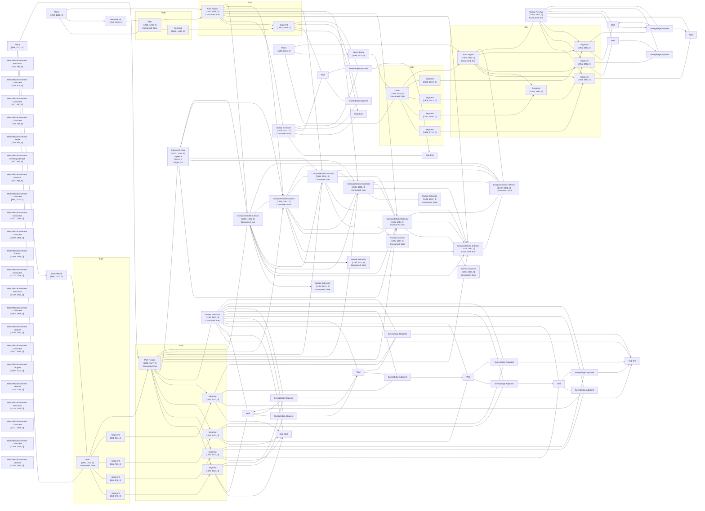

```mermaid
flowchart LR
  subgraph path13 [Path]
    13["Path<br>[386, 1071, 0]<br>Consumed: false"]
      %% [ProgramBodyItem { index: 11 }, VariableDeclarationDeclaration, VariableDeclarationInit]
    16["Segment<br>[414, 473, 0]"]
      %% [ProgramBodyItem { index: 11 }, VariableDeclarationDeclaration, VariableDeclarationInit, SketchBlockBody, SketchBlockBodyItem { index: 0 }, VariableDeclarationDeclaration, VariableDeclarationInit]
    18["Segment<br>[505, 576, 0]"]
      %% [ProgramBodyItem { index: 11 }, VariableDeclarationDeclaration, VariableDeclarationInit, SketchBlockBody, SketchBlockBodyItem { index: 2 }, VariableDeclarationDeclaration, VariableDeclarationInit]
    21["Segment<br>[661, 727, 0]"]
      %% [ProgramBodyItem { index: 11 }, VariableDeclarationDeclaration, VariableDeclarationInit, SketchBlockBody, SketchBlockBodyItem { index: 5 }, VariableDeclarationDeclaration, VariableDeclarationInit]
    26["Segment<br>[894, 994, 0]"]
      %% [ProgramBodyItem { index: 11 }, VariableDeclarationDeclaration, VariableDeclarationInit, SketchBlockBody, SketchBlockBodyItem { index: 10 }, VariableDeclarationDeclaration, VariableDeclarationInit]
  end
  subgraph path29 [Path]
    29["Path Region<br>[1091, 1127, 0]<br>Consumed: true"]
      %% [ProgramBodyItem { index: 12 }, VariableDeclarationDeclaration, VariableDeclarationInit, PipeBodyItem { index: 0 }]
    30["Segment<br>[1091, 1127, 0]"]
      %% [ProgramBodyItem { index: 12 }, VariableDeclarationDeclaration, VariableDeclarationInit, PipeBodyItem { index: 0 }]
    31["Segment<br>[1091, 1127, 0]"]
      %% [ProgramBodyItem { index: 12 }, VariableDeclarationDeclaration, VariableDeclarationInit, PipeBodyItem { index: 0 }]
    32["Segment<br>[1091, 1127, 0]"]
      %% [ProgramBodyItem { index: 12 }, VariableDeclarationDeclaration, VariableDeclarationInit, PipeBodyItem { index: 0 }]
    33["Segment<br>[1091, 1127, 0]"]
      %% [ProgramBodyItem { index: 12 }, VariableDeclarationDeclaration, VariableDeclarationInit, PipeBodyItem { index: 0 }]
  end
  subgraph path41 [Path]
    41["Path<br>[1252, 1418, 0]<br>Consumed: false"]
      %% [ProgramBodyItem { index: 13 }, VariableDeclarationDeclaration, VariableDeclarationInit]
    44["Segment<br>[1282, 1347, 0]"]
      %% [ProgramBodyItem { index: 13 }, VariableDeclarationDeclaration, VariableDeclarationInit, SketchBlockBody, SketchBlockBodyItem { index: 0 }, VariableDeclarationDeclaration, VariableDeclarationInit]
  end
  subgraph path47 [Path]
    47["Path Region<br>[1432, 1469, 0]<br>Consumed: true"]
      %% [ProgramBodyItem { index: 14 }, VariableDeclarationDeclaration, VariableDeclarationInit, PipeBodyItem { index: 0 }]
    48["Segment<br>[1432, 1469, 0]"]
      %% [ProgramBodyItem { index: 14 }, VariableDeclarationDeclaration, VariableDeclarationInit, PipeBodyItem { index: 0 }]
  end
  subgraph path56 [Path]
    56["Path<br>[1595, 2315, 0]<br>Consumed: false"]
      %% [ProgramBodyItem { index: 16 }, VariableDeclarationDeclaration, VariableDeclarationInit]
    59["Segment<br>[1648, 1710, 0]"]
      %% [ProgramBodyItem { index: 16 }, VariableDeclarationDeclaration, VariableDeclarationInit, SketchBlockBody, SketchBlockBodyItem { index: 0 }, VariableDeclarationDeclaration, VariableDeclarationInit]
    62["Segment<br>[1791, 1860, 0]"]
      %% [ProgramBodyItem { index: 16 }, VariableDeclarationDeclaration, VariableDeclarationInit, SketchBlockBody, SketchBlockBodyItem { index: 3 }, VariableDeclarationDeclaration, VariableDeclarationInit]
    64["Segment<br>[1909, 2013, 0]"]
      %% [ProgramBodyItem { index: 16 }, VariableDeclarationDeclaration, VariableDeclarationInit, SketchBlockBody, SketchBlockBodyItem { index: 5 }, VariableDeclarationDeclaration, VariableDeclarationInit]
    70["Segment<br>[2156, 2218, 0]"]
      %% [ProgramBodyItem { index: 16 }, VariableDeclarationDeclaration, VariableDeclarationInit, SketchBlockBody, SketchBlockBodyItem { index: 11 }, VariableDeclarationDeclaration, VariableDeclarationInit]
  end
  subgraph path74 [Path]
    74["Path Region<br>[2356, 2392, 0]<br>Consumed: true"]
      %% [ProgramBodyItem { index: 18 }, VariableDeclarationDeclaration, VariableDeclarationInit]
    75["Segment<br>[2356, 2392, 0]"]
      %% [ProgramBodyItem { index: 18 }, VariableDeclarationDeclaration, VariableDeclarationInit]
    76["Segment<br>[2356, 2392, 0]"]
      %% [ProgramBodyItem { index: 18 }, VariableDeclarationDeclaration, VariableDeclarationInit]
    77["Segment<br>[2356, 2392, 0]"]
      %% [ProgramBodyItem { index: 18 }, VariableDeclarationDeclaration, VariableDeclarationInit]
    78["Segment<br>[2356, 2392, 0]"]
      %% [ProgramBodyItem { index: 18 }, VariableDeclarationDeclaration, VariableDeclarationInit]
  end
  1["Cap End"]
    %% face_code_ref=Missing NodePath
  2["Cap End"]
    %% face_code_ref=Missing NodePath
  3["Cap Start"]
    %% face_code_ref=Missing NodePath
  4["Cap Start"]
    %% face_code_ref=Missing NodePath
  5[Wall]
    %% face_code_ref=Missing NodePath
  6[Wall]
    %% face_code_ref=Missing NodePath
  7[Wall]
    %% face_code_ref=Missing NodePath
  8[Wall]
    %% face_code_ref=Missing NodePath
  9[Wall]
    %% face_code_ref=Missing NodePath
  10[Wall]
    %% face_code_ref=Missing NodePath
  11[Wall]
    %% face_code_ref=Missing NodePath
  12[Wall]
    %% face_code_ref=Missing NodePath
  14["Plane<br>[386, 1071, 0]"]
    %% [ProgramBodyItem { index: 11 }, VariableDeclarationDeclaration, VariableDeclarationInit]
  15["SketchBlock<br>[386, 1071, 0]"]
    %% [ProgramBodyItem { index: 11 }, VariableDeclarationDeclaration, VariableDeclarationInit]
  17["SketchBlockConstraint Horizontal<br>[476, 495, 0]"]
    %% [ProgramBodyItem { index: 11 }, VariableDeclarationDeclaration, VariableDeclarationInit, SketchBlockBody, SketchBlockBodyItem { index: 1 }, ExpressionStatementExpr]
  19["SketchBlockConstraint Coincident<br>[579, 614, 0]"]
    %% [ProgramBodyItem { index: 11 }, VariableDeclarationDeclaration, VariableDeclarationInit, SketchBlockBody, SketchBlockBodyItem { index: 3 }, ExpressionStatementExpr]
  20["SketchBlockConstraint Coincident<br>[617, 650, 0]"]
    %% [ProgramBodyItem { index: 11 }, VariableDeclarationDeclaration, VariableDeclarationInit, SketchBlockBody, SketchBlockBodyItem { index: 4 }, ExpressionStatementExpr]
  22["SketchBlockConstraint Coincident<br>[730, 766, 0]"]
    %% [ProgramBodyItem { index: 11 }, VariableDeclarationDeclaration, VariableDeclarationInit, SketchBlockBody, SketchBlockBodyItem { index: 6 }, ExpressionStatementExpr]
  23["SketchBlockConstraint Angle<br>[769, 804, 0]"]
    %% [ProgramBodyItem { index: 11 }, VariableDeclarationDeclaration, VariableDeclarationInit, SketchBlockBody, SketchBlockBodyItem { index: 7 }, ExpressionStatementExpr]
  24["SketchBlockConstraint LinesEqualLength<br>[807, 834, 0]"]
    %% [ProgramBodyItem { index: 11 }, VariableDeclarationDeclaration, VariableDeclarationInit, SketchBlockBody, SketchBlockBodyItem { index: 8 }, ExpressionStatementExpr]
  25["SketchBlockConstraint Distance<br>[837, 884, 0]"]
    %% [ProgramBodyItem { index: 11 }, VariableDeclarationDeclaration, VariableDeclarationInit, SketchBlockBody, SketchBlockBodyItem { index: 9 }, ExpressionStatementExpr]
  27["SketchBlockConstraint Coincident<br>[997, 1034, 0]"]
    %% [ProgramBodyItem { index: 11 }, VariableDeclarationDeclaration, VariableDeclarationInit, SketchBlockBody, SketchBlockBodyItem { index: 11 }, ExpressionStatementExpr]
  28["SketchBlockConstraint Coincident<br>[1037, 1069, 0]"]
    %% [ProgramBodyItem { index: 11 }, VariableDeclarationDeclaration, VariableDeclarationInit, SketchBlockBody, SketchBlockBodyItem { index: 12 }, ExpressionStatementExpr]
  34["Pattern Circular<br>[1133, 1190, 0]<br>Copies: 5<br>Faces: 0<br>Edges: 20"]
    %% [ProgramBodyItem { index: 12 }, VariableDeclarationDeclaration, VariableDeclarationInit, PipeBodyItem { index: 1 }]
  35["Sweep Extrusion<br>[1196, 1237, 0]<br>Consumed: true"]
    %% [ProgramBodyItem { index: 12 }, VariableDeclarationDeclaration, VariableDeclarationInit, PipeBodyItem { index: 2 }]
  36["Sweep Extrusion<br>[1196, 1237, 0]<br>Consumed: false"]
    %% [ProgramBodyItem { index: 12 }, VariableDeclarationDeclaration, VariableDeclarationInit, PipeBodyItem { index: 2 }]
  37["Sweep Extrusion<br>[1196, 1237, 0]<br>Consumed: false"]
    %% [ProgramBodyItem { index: 12 }, VariableDeclarationDeclaration, VariableDeclarationInit, PipeBodyItem { index: 2 }]
  38["Sweep Extrusion<br>[1196, 1237, 0]<br>Consumed: false"]
    %% [ProgramBodyItem { index: 12 }, VariableDeclarationDeclaration, VariableDeclarationInit, PipeBodyItem { index: 2 }]
  39["Sweep Extrusion<br>[1196, 1237, 0]<br>Consumed: false"]
    %% [ProgramBodyItem { index: 12 }, VariableDeclarationDeclaration, VariableDeclarationInit, PipeBodyItem { index: 2 }]
  40["Sweep Extrusion<br>[1196, 1237, 0]<br>Consumed: false"]
    %% [ProgramBodyItem { index: 12 }, VariableDeclarationDeclaration, VariableDeclarationInit, PipeBodyItem { index: 2 }]
  42["Plane<br>[1252, 1418, 0]"]
    %% [ProgramBodyItem { index: 13 }, VariableDeclarationDeclaration, VariableDeclarationInit]
  43["SketchBlock<br>[1252, 1418, 0]"]
    %% [ProgramBodyItem { index: 13 }, VariableDeclarationDeclaration, VariableDeclarationInit]
  45["SketchBlockConstraint Coincident<br>[1350, 1386, 0]"]
    %% [ProgramBodyItem { index: 13 }, VariableDeclarationDeclaration, VariableDeclarationInit, SketchBlockBody, SketchBlockBodyItem { index: 1 }, ExpressionStatementExpr]
  46["SketchBlockConstraint Radius<br>[1389, 1416, 0]"]
    %% [ProgramBodyItem { index: 13 }, VariableDeclarationDeclaration, VariableDeclarationInit, SketchBlockBody, SketchBlockBodyItem { index: 2 }, ExpressionStatementExpr]
  49["Sweep Extrusion<br>[1475, 1521, 0]<br>Consumed: true"]
    %% [ProgramBodyItem { index: 14 }, VariableDeclarationDeclaration, VariableDeclarationInit, PipeBodyItem { index: 1 }]
  50["CompositeSolid Subtract<br>[1535, 1581, 0]<br>Consumed: true"]
    %% [ProgramBodyItem { index: 15 }, VariableDeclarationDeclaration, VariableDeclarationInit]
  51["CompositeSolid Subtract<br>[1535, 1581, 0]<br>Consumed: true"]
    %% [ProgramBodyItem { index: 15 }, VariableDeclarationDeclaration, VariableDeclarationInit]
  52["CompositeSolid Subtract<br>[1535, 1581, 0]<br>Consumed: true"]
    %% [ProgramBodyItem { index: 15 }, VariableDeclarationDeclaration, VariableDeclarationInit]
  53["CompositeSolid Subtract<br>[1535, 1581, 0]<br>Consumed: true"]
    %% [ProgramBodyItem { index: 15 }, VariableDeclarationDeclaration, VariableDeclarationInit]
  54["CompositeSolid Subtract<br>[1535, 1581, 0]<br>Consumed: true"]
    %% [ProgramBodyItem { index: 15 }, VariableDeclarationDeclaration, VariableDeclarationInit]
  55["CompositeSolid Subtract<br>[1535, 1581, 0]<br>Consumed: true"]
    %% [ProgramBodyItem { index: 15 }, VariableDeclarationDeclaration, VariableDeclarationInit]
  57["SketchBlock<br>[1595, 2315, 0]"]
    %% [ProgramBodyItem { index: 16 }, VariableDeclarationDeclaration, VariableDeclarationInit]
  58["Plane<br>[1607, 1634, 0]"]
    %% [ProgramBodyItem { index: 16 }, VariableDeclarationDeclaration, VariableDeclarationInit, SketchBlockArgs]
  60["SketchBlockConstraint Coincident<br>[1713, 1746, 0]"]
    %% [ProgramBodyItem { index: 16 }, VariableDeclarationDeclaration, VariableDeclarationInit, SketchBlockBody, SketchBlockBodyItem { index: 1 }, ExpressionStatementExpr]
  61["SketchBlockConstraint Horizontal<br>[1749, 1780, 0]"]
    %% [ProgramBodyItem { index: 16 }, VariableDeclarationDeclaration, VariableDeclarationInit, SketchBlockBody, SketchBlockBodyItem { index: 2 }, ExpressionStatementExpr]
  63["SketchBlockConstraint Coincident<br>[1863, 1899, 0]"]
    %% [ProgramBodyItem { index: 16 }, VariableDeclarationDeclaration, VariableDeclarationInit, SketchBlockBody, SketchBlockBodyItem { index: 4 }, ExpressionStatementExpr]
  65["SketchBlockConstraint Vertical<br>[2016, 2044, 0]"]
    %% [ProgramBodyItem { index: 16 }, VariableDeclarationDeclaration, VariableDeclarationInit, SketchBlockBody, SketchBlockBodyItem { index: 6 }, ExpressionStatementExpr]
  66["SketchBlockConstraint Coincident<br>[2047, 2082, 0]"]
    %% [ProgramBodyItem { index: 16 }, VariableDeclarationDeclaration, VariableDeclarationInit, SketchBlockBody, SketchBlockBodyItem { index: 7 }, ExpressionStatementExpr]
  67["SketchBlockConstraint Tangent<br>[2085, 2107, 0]"]
    %% [ProgramBodyItem { index: 16 }, VariableDeclarationDeclaration, VariableDeclarationInit, SketchBlockBody, SketchBlockBodyItem { index: 8 }, ExpressionStatementExpr]
  68["SketchBlockConstraint Vertical<br>[2110, 2125, 0]"]
    %% [ProgramBodyItem { index: 16 }, VariableDeclarationDeclaration, VariableDeclarationInit, SketchBlockBody, SketchBlockBodyItem { index: 9 }, ExpressionStatementExpr]
  69["SketchBlockConstraint Horizontal<br>[2128, 2145, 0]"]
    %% [ProgramBodyItem { index: 16 }, VariableDeclarationDeclaration, VariableDeclarationInit, SketchBlockBody, SketchBlockBodyItem { index: 10 }, ExpressionStatementExpr]
  71["SketchBlockConstraint Coincident<br>[2221, 2256, 0]"]
    %% [ProgramBodyItem { index: 16 }, VariableDeclarationDeclaration, VariableDeclarationInit, SketchBlockBody, SketchBlockBodyItem { index: 12 }, ExpressionStatementExpr]
  72["SketchBlockConstraint Coincident<br>[2259, 2295, 0]"]
    %% [ProgramBodyItem { index: 16 }, VariableDeclarationDeclaration, VariableDeclarationInit, SketchBlockBody, SketchBlockBodyItem { index: 13 }, ExpressionStatementExpr]
  73["SketchBlockConstraint Vertical<br>[2298, 2313, 0]"]
    %% [ProgramBodyItem { index: 16 }, VariableDeclarationDeclaration, VariableDeclarationInit, SketchBlockBody, SketchBlockBodyItem { index: 14 }, ExpressionStatementExpr]
  79["Sweep Revolve<br>[2403, 2431, 0]<br>Consumed: true"]
    %% [ProgramBodyItem { index: 19 }, VariableDeclarationDeclaration, VariableDeclarationInit]
  80["CompositeSolid Intersect<br>[2449, 2480, 0]<br>Consumed: false"]
    %% [ProgramBodyItem { index: 20 }, VariableDeclarationDeclaration, VariableDeclarationInit]
  81["SweepEdge Adjacent"]
  82["SweepEdge Adjacent"]
  83["SweepEdge Adjacent"]
  84["SweepEdge Adjacent"]
  85["SweepEdge Adjacent"]
  86["SweepEdge Adjacent"]
  87["SweepEdge Adjacent"]
  88["SweepEdge Opposite"]
  89["SweepEdge Opposite"]
  90["SweepEdge Opposite"]
  91["SweepEdge Opposite"]
  92["SweepEdge Opposite"]
  35 --- 1
  88 <--x 1
  89 <--x 1
  90 <--x 1
  91 <--x 1
  49 --- 2
  92 <--x 2
  30 <--x 3
  31 <--x 3
  32 <--x 3
  33 <--x 3
  35 --- 3
  48 <--x 4
  49 --- 4
  30 --- 5
  35 --- 5
  5 --- 81
  82 <--x 5
  5 --- 88
  31 --- 6
  35 --- 6
  6 --- 82
  83 <--x 6
  6 --- 89
  32 --- 7
  35 --- 7
  7 --- 83
  84 <--x 7
  7 --- 90
  33 --- 8
  35 --- 8
  81 <--x 8
  8 --- 84
  8 --- 91
  48 --- 9
  49 --- 9
  9 --- 85
  9 --- 92
  75 --- 10
  79 --- 10
  87 <--x 10
  77 --- 11
  79 --- 11
  11 x--> 86
  78 --- 12
  79 --- 12
  12 x--> 87
  87 <--x 12
  14 --- 13
  15 --- 13
  13 --- 16
  13 --- 18
  13 --- 21
  13 --- 26
  13 <--x 29
  14 <--x 15
  14 <--x 29
  16 <--x 30
  18 <--x 31
  21 <--x 32
  26 <--x 33
  29 <--x 30
  29 <--x 31
  29 <--x 32
  29 <--x 33
  29 --- 34
  29 ---- 35
  29 <--x 50
  29 <--x 51
  29 <--x 52
  29 <--x 53
  29 <--x 54
  29 --- 55
  30 --- 81
  30 --- 88
  31 --- 82
  31 --- 89
  32 --- 83
  32 --- 90
  33 --- 84
  33 --- 91
  34 x--> 51
  34 x--> 52
  34 x--> 53
  34 x--> 54
  34 x--> 55
  35 --- 81
  35 --- 82
  35 --- 83
  35 --- 84
  35 --- 88
  35 --- 89
  35 --- 90
  35 --- 91
  51 x--> 36
  52 x--> 37
  53 x--> 38
  54 x--> 39
  55 x--> 40
  42 --- 41
  43 --- 41
  41 --- 44
  41 <--x 47
  42 <--x 43
  42 <--x 47
  44 <--x 48
  47 <--x 48
  47 ---- 49
  47 <--x 50
  47 <--x 51
  47 <--x 52
  47 <--x 53
  47 <--x 54
  47 --- 55
  48 --- 85
  48 --- 92
  49 --- 85
  49 --- 92
  51 x--> 50
  52 x--> 50
  53 x--> 50
  54 x--> 50
  55 x--> 50
  50 --- 80
  52 --- 51
  53 --- 51
  54 --- 51
  55 --- 51
  51 --- 80
  53 --- 52
  54 --- 52
  55 --- 52
  52 --- 80
  54 --- 53
  55 --- 53
  53 --- 80
  55 --- 54
  54 --- 80
  55 --- 80
  57 --- 56
  58 --- 56
  56 --- 59
  56 --- 62
  56 --- 64
  56 --- 70
  56 <--x 74
  58 x--> 57
  58 <--x 74
  59 <--x 75
  62 <--x 76
  64 <--x 77
  70 <--x 78
  74 <--x 75
  74 <--x 76
  74 <--x 77
  74 <--x 78
  74 ---- 79
  74 --- 80
  79 <--x 75
  79 <--x 77
  77 --- 86
  79 <--x 78
  78 --- 87
  79 --- 86
  79 --- 87
```
