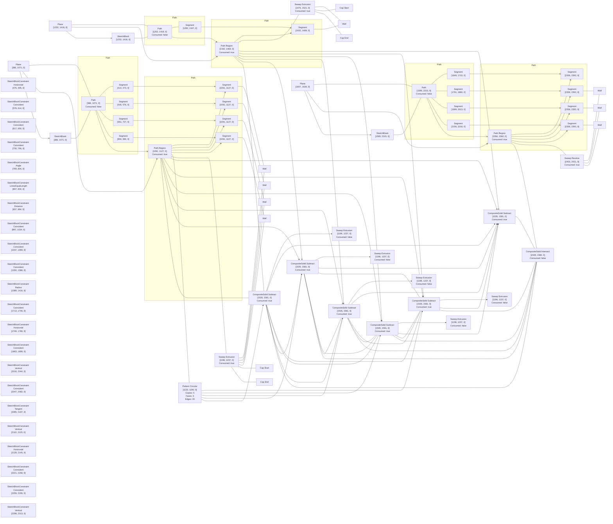

```mermaid
flowchart LR
  subgraph path2 [Path]
    2["Path<br>[386, 1071, 0]<br>Consumed: false"]
      %% [ProgramBodyItem { index: 11 }, VariableDeclarationDeclaration, VariableDeclarationInit]
    3["Segment<br>[414, 473, 0]"]
      %% [ProgramBodyItem { index: 11 }, VariableDeclarationDeclaration, VariableDeclarationInit, SketchBlockBody, SketchBlockBodyItem { index: 0 }, VariableDeclarationDeclaration, VariableDeclarationInit]
    4["Segment<br>[505, 576, 0]"]
      %% [ProgramBodyItem { index: 11 }, VariableDeclarationDeclaration, VariableDeclarationInit, SketchBlockBody, SketchBlockBodyItem { index: 2 }, VariableDeclarationDeclaration, VariableDeclarationInit]
    5["Segment<br>[661, 727, 0]"]
      %% [ProgramBodyItem { index: 11 }, VariableDeclarationDeclaration, VariableDeclarationInit, SketchBlockBody, SketchBlockBodyItem { index: 5 }, VariableDeclarationDeclaration, VariableDeclarationInit]
    6["Segment<br>[894, 994, 0]"]
      %% [ProgramBodyItem { index: 11 }, VariableDeclarationDeclaration, VariableDeclarationInit, SketchBlockBody, SketchBlockBodyItem { index: 10 }, VariableDeclarationDeclaration, VariableDeclarationInit]
  end
  subgraph path7 [Path]
    7["Path Region<br>[1091, 1127, 0]<br>Consumed: true"]
      %% [ProgramBodyItem { index: 12 }, VariableDeclarationDeclaration, VariableDeclarationInit, PipeBodyItem { index: 0 }]
    8["Segment<br>[1091, 1127, 0]"]
      %% [ProgramBodyItem { index: 12 }, VariableDeclarationDeclaration, VariableDeclarationInit, PipeBodyItem { index: 0 }]
    9["Segment<br>[1091, 1127, 0]"]
      %% [ProgramBodyItem { index: 12 }, VariableDeclarationDeclaration, VariableDeclarationInit, PipeBodyItem { index: 0 }]
    10["Segment<br>[1091, 1127, 0]"]
      %% [ProgramBodyItem { index: 12 }, VariableDeclarationDeclaration, VariableDeclarationInit, PipeBodyItem { index: 0 }]
    11["Segment<br>[1091, 1127, 0]"]
      %% [ProgramBodyItem { index: 12 }, VariableDeclarationDeclaration, VariableDeclarationInit, PipeBodyItem { index: 0 }]
  end
  subgraph path26 [Path]
    26["Path<br>[1252, 1418, 0]<br>Consumed: false"]
      %% [ProgramBodyItem { index: 13 }, VariableDeclarationDeclaration, VariableDeclarationInit]
    27["Segment<br>[1282, 1347, 0]"]
      %% [ProgramBodyItem { index: 13 }, VariableDeclarationDeclaration, VariableDeclarationInit, SketchBlockBody, SketchBlockBodyItem { index: 0 }, VariableDeclarationDeclaration, VariableDeclarationInit]
  end
  subgraph path28 [Path]
    28["Path Region<br>[1432, 1469, 0]<br>Consumed: true"]
      %% [ProgramBodyItem { index: 14 }, VariableDeclarationDeclaration, VariableDeclarationInit, PipeBodyItem { index: 0 }]
    29["Segment<br>[1432, 1469, 0]"]
      %% [ProgramBodyItem { index: 14 }, VariableDeclarationDeclaration, VariableDeclarationInit, PipeBodyItem { index: 0 }]
  end
  subgraph path41 [Path]
    41["Path<br>[1595, 2315, 0]<br>Consumed: false"]
      %% [ProgramBodyItem { index: 16 }, VariableDeclarationDeclaration, VariableDeclarationInit]
    42["Segment<br>[1648, 1710, 0]"]
      %% [ProgramBodyItem { index: 16 }, VariableDeclarationDeclaration, VariableDeclarationInit, SketchBlockBody, SketchBlockBodyItem { index: 0 }, VariableDeclarationDeclaration, VariableDeclarationInit]
    43["Segment<br>[1791, 1860, 0]"]
      %% [ProgramBodyItem { index: 16 }, VariableDeclarationDeclaration, VariableDeclarationInit, SketchBlockBody, SketchBlockBodyItem { index: 3 }, VariableDeclarationDeclaration, VariableDeclarationInit]
    44["Segment<br>[1909, 2013, 0]"]
      %% [ProgramBodyItem { index: 16 }, VariableDeclarationDeclaration, VariableDeclarationInit, SketchBlockBody, SketchBlockBodyItem { index: 5 }, VariableDeclarationDeclaration, VariableDeclarationInit]
    45["Segment<br>[2156, 2218, 0]"]
      %% [ProgramBodyItem { index: 16 }, VariableDeclarationDeclaration, VariableDeclarationInit, SketchBlockBody, SketchBlockBodyItem { index: 11 }, VariableDeclarationDeclaration, VariableDeclarationInit]
  end
  subgraph path46 [Path]
    46["Path Region<br>[2356, 2392, 0]<br>Consumed: true"]
      %% [ProgramBodyItem { index: 18 }, VariableDeclarationDeclaration, VariableDeclarationInit]
    47["Segment<br>[2356, 2392, 0]"]
      %% [ProgramBodyItem { index: 18 }, VariableDeclarationDeclaration, VariableDeclarationInit]
    48["Segment<br>[2356, 2392, 0]"]
      %% [ProgramBodyItem { index: 18 }, VariableDeclarationDeclaration, VariableDeclarationInit]
    49["Segment<br>[2356, 2392, 0]"]
      %% [ProgramBodyItem { index: 18 }, VariableDeclarationDeclaration, VariableDeclarationInit]
    50["Segment<br>[2356, 2392, 0]"]
      %% [ProgramBodyItem { index: 18 }, VariableDeclarationDeclaration, VariableDeclarationInit]
  end
  1["Plane<br>[386, 1071, 0]"]
    %% [ProgramBodyItem { index: 11 }, VariableDeclarationDeclaration, VariableDeclarationInit]
  12["Pattern Circular<br>[1133, 1190, 0]<br>Copies: 5<br>Faces: 0<br>Edges: 20"]
    %% [ProgramBodyItem { index: 12 }, VariableDeclarationDeclaration, VariableDeclarationInit, PipeBodyItem { index: 1 }]
  13["Sweep Extrusion<br>[1196, 1237, 0]<br>Consumed: true"]
    %% [ProgramBodyItem { index: 12 }, VariableDeclarationDeclaration, VariableDeclarationInit, PipeBodyItem { index: 2 }]
  14[Wall]
    %% face_code_ref=Missing NodePath
  15[Wall]
    %% face_code_ref=Missing NodePath
  16[Wall]
    %% face_code_ref=Missing NodePath
  17[Wall]
    %% face_code_ref=Missing NodePath
  18["Cap Start"]
    %% face_code_ref=Missing NodePath
  19["Cap End"]
    %% face_code_ref=Missing NodePath
  20["Sweep Extrusion<br>[1196, 1237, 0]<br>Consumed: false"]
    %% [ProgramBodyItem { index: 12 }, VariableDeclarationDeclaration, VariableDeclarationInit, PipeBodyItem { index: 2 }]
  21["Sweep Extrusion<br>[1196, 1237, 0]<br>Consumed: false"]
    %% [ProgramBodyItem { index: 12 }, VariableDeclarationDeclaration, VariableDeclarationInit, PipeBodyItem { index: 2 }]
  22["Sweep Extrusion<br>[1196, 1237, 0]<br>Consumed: false"]
    %% [ProgramBodyItem { index: 12 }, VariableDeclarationDeclaration, VariableDeclarationInit, PipeBodyItem { index: 2 }]
  23["Sweep Extrusion<br>[1196, 1237, 0]<br>Consumed: false"]
    %% [ProgramBodyItem { index: 12 }, VariableDeclarationDeclaration, VariableDeclarationInit, PipeBodyItem { index: 2 }]
  24["Sweep Extrusion<br>[1196, 1237, 0]<br>Consumed: false"]
    %% [ProgramBodyItem { index: 12 }, VariableDeclarationDeclaration, VariableDeclarationInit, PipeBodyItem { index: 2 }]
  25["Plane<br>[1252, 1418, 0]"]
    %% [ProgramBodyItem { index: 13 }, VariableDeclarationDeclaration, VariableDeclarationInit]
  30["Sweep Extrusion<br>[1475, 1521, 0]<br>Consumed: true"]
    %% [ProgramBodyItem { index: 14 }, VariableDeclarationDeclaration, VariableDeclarationInit, PipeBodyItem { index: 1 }]
  31[Wall]
    %% face_code_ref=Missing NodePath
  32["Cap Start"]
    %% face_code_ref=Missing NodePath
  33["Cap End"]
    %% face_code_ref=Missing NodePath
  34["CompositeSolid Subtract<br>[1535, 1581, 0]<br>Consumed: true"]
    %% [ProgramBodyItem { index: 15 }, VariableDeclarationDeclaration, VariableDeclarationInit]
  35["CompositeSolid Subtract<br>[1535, 1581, 0]<br>Consumed: true"]
    %% [ProgramBodyItem { index: 15 }, VariableDeclarationDeclaration, VariableDeclarationInit]
  36["CompositeSolid Subtract<br>[1535, 1581, 0]<br>Consumed: true"]
    %% [ProgramBodyItem { index: 15 }, VariableDeclarationDeclaration, VariableDeclarationInit]
  37["CompositeSolid Subtract<br>[1535, 1581, 0]<br>Consumed: true"]
    %% [ProgramBodyItem { index: 15 }, VariableDeclarationDeclaration, VariableDeclarationInit]
  38["CompositeSolid Subtract<br>[1535, 1581, 0]<br>Consumed: true"]
    %% [ProgramBodyItem { index: 15 }, VariableDeclarationDeclaration, VariableDeclarationInit]
  39["CompositeSolid Subtract<br>[1535, 1581, 0]<br>Consumed: true"]
    %% [ProgramBodyItem { index: 15 }, VariableDeclarationDeclaration, VariableDeclarationInit]
  40["Plane<br>[1607, 1634, 0]"]
    %% [ProgramBodyItem { index: 16 }, VariableDeclarationDeclaration, VariableDeclarationInit, SketchBlockArgs]
  51["Sweep Revolve<br>[2403, 2431, 0]<br>Consumed: true"]
    %% [ProgramBodyItem { index: 19 }, VariableDeclarationDeclaration, VariableDeclarationInit]
  52[Wall]
    %% face_code_ref=Missing NodePath
  53[Wall]
    %% face_code_ref=Missing NodePath
  54[Wall]
    %% face_code_ref=Missing NodePath
  55["CompositeSolid Intersect<br>[2449, 2480, 0]<br>Consumed: false"]
    %% [ProgramBodyItem { index: 20 }, VariableDeclarationDeclaration, VariableDeclarationInit]
  56["SketchBlock<br>[386, 1071, 0]"]
    %% [ProgramBodyItem { index: 11 }, VariableDeclarationDeclaration, VariableDeclarationInit]
  57["SketchBlockConstraint Horizontal<br>[476, 495, 0]"]
    %% [ProgramBodyItem { index: 11 }, VariableDeclarationDeclaration, VariableDeclarationInit, SketchBlockBody, SketchBlockBodyItem { index: 1 }, ExpressionStatementExpr]
  58["SketchBlockConstraint Coincident<br>[579, 614, 0]"]
    %% [ProgramBodyItem { index: 11 }, VariableDeclarationDeclaration, VariableDeclarationInit, SketchBlockBody, SketchBlockBodyItem { index: 3 }, ExpressionStatementExpr]
  59["SketchBlockConstraint Coincident<br>[617, 650, 0]"]
    %% [ProgramBodyItem { index: 11 }, VariableDeclarationDeclaration, VariableDeclarationInit, SketchBlockBody, SketchBlockBodyItem { index: 4 }, ExpressionStatementExpr]
  60["SketchBlockConstraint Coincident<br>[730, 766, 0]"]
    %% [ProgramBodyItem { index: 11 }, VariableDeclarationDeclaration, VariableDeclarationInit, SketchBlockBody, SketchBlockBodyItem { index: 6 }, ExpressionStatementExpr]
  61["SketchBlockConstraint Angle<br>[769, 804, 0]"]
    %% [ProgramBodyItem { index: 11 }, VariableDeclarationDeclaration, VariableDeclarationInit, SketchBlockBody, SketchBlockBodyItem { index: 7 }, ExpressionStatementExpr]
  62["SketchBlockConstraint LinesEqualLength<br>[807, 834, 0]"]
    %% [ProgramBodyItem { index: 11 }, VariableDeclarationDeclaration, VariableDeclarationInit, SketchBlockBody, SketchBlockBodyItem { index: 8 }, ExpressionStatementExpr]
  63["SketchBlockConstraint Distance<br>[837, 884, 0]"]
    %% [ProgramBodyItem { index: 11 }, VariableDeclarationDeclaration, VariableDeclarationInit, SketchBlockBody, SketchBlockBodyItem { index: 9 }, ExpressionStatementExpr]
  64["SketchBlockConstraint Coincident<br>[997, 1034, 0]"]
    %% [ProgramBodyItem { index: 11 }, VariableDeclarationDeclaration, VariableDeclarationInit, SketchBlockBody, SketchBlockBodyItem { index: 11 }, ExpressionStatementExpr]
  65["SketchBlockConstraint Coincident<br>[1037, 1069, 0]"]
    %% [ProgramBodyItem { index: 11 }, VariableDeclarationDeclaration, VariableDeclarationInit, SketchBlockBody, SketchBlockBodyItem { index: 12 }, ExpressionStatementExpr]
  66["SketchBlock<br>[1252, 1418, 0]"]
    %% [ProgramBodyItem { index: 13 }, VariableDeclarationDeclaration, VariableDeclarationInit]
  67["SketchBlockConstraint Coincident<br>[1350, 1386, 0]"]
    %% [ProgramBodyItem { index: 13 }, VariableDeclarationDeclaration, VariableDeclarationInit, SketchBlockBody, SketchBlockBodyItem { index: 1 }, ExpressionStatementExpr]
  68["SketchBlockConstraint Radius<br>[1389, 1416, 0]"]
    %% [ProgramBodyItem { index: 13 }, VariableDeclarationDeclaration, VariableDeclarationInit, SketchBlockBody, SketchBlockBodyItem { index: 2 }, ExpressionStatementExpr]
  69["SketchBlock<br>[1595, 2315, 0]"]
    %% [ProgramBodyItem { index: 16 }, VariableDeclarationDeclaration, VariableDeclarationInit]
  70["SketchBlockConstraint Coincident<br>[1713, 1746, 0]"]
    %% [ProgramBodyItem { index: 16 }, VariableDeclarationDeclaration, VariableDeclarationInit, SketchBlockBody, SketchBlockBodyItem { index: 1 }, ExpressionStatementExpr]
  71["SketchBlockConstraint Horizontal<br>[1749, 1780, 0]"]
    %% [ProgramBodyItem { index: 16 }, VariableDeclarationDeclaration, VariableDeclarationInit, SketchBlockBody, SketchBlockBodyItem { index: 2 }, ExpressionStatementExpr]
  72["SketchBlockConstraint Coincident<br>[1863, 1899, 0]"]
    %% [ProgramBodyItem { index: 16 }, VariableDeclarationDeclaration, VariableDeclarationInit, SketchBlockBody, SketchBlockBodyItem { index: 4 }, ExpressionStatementExpr]
  73["SketchBlockConstraint Vertical<br>[2016, 2044, 0]"]
    %% [ProgramBodyItem { index: 16 }, VariableDeclarationDeclaration, VariableDeclarationInit, SketchBlockBody, SketchBlockBodyItem { index: 6 }, ExpressionStatementExpr]
  74["SketchBlockConstraint Coincident<br>[2047, 2082, 0]"]
    %% [ProgramBodyItem { index: 16 }, VariableDeclarationDeclaration, VariableDeclarationInit, SketchBlockBody, SketchBlockBodyItem { index: 7 }, ExpressionStatementExpr]
  75["SketchBlockConstraint Tangent<br>[2085, 2107, 0]"]
    %% [ProgramBodyItem { index: 16 }, VariableDeclarationDeclaration, VariableDeclarationInit, SketchBlockBody, SketchBlockBodyItem { index: 8 }, ExpressionStatementExpr]
  76["SketchBlockConstraint Vertical<br>[2110, 2125, 0]"]
    %% [ProgramBodyItem { index: 16 }, VariableDeclarationDeclaration, VariableDeclarationInit, SketchBlockBody, SketchBlockBodyItem { index: 9 }, ExpressionStatementExpr]
  77["SketchBlockConstraint Horizontal<br>[2128, 2145, 0]"]
    %% [ProgramBodyItem { index: 16 }, VariableDeclarationDeclaration, VariableDeclarationInit, SketchBlockBody, SketchBlockBodyItem { index: 10 }, ExpressionStatementExpr]
  78["SketchBlockConstraint Coincident<br>[2221, 2256, 0]"]
    %% [ProgramBodyItem { index: 16 }, VariableDeclarationDeclaration, VariableDeclarationInit, SketchBlockBody, SketchBlockBodyItem { index: 12 }, ExpressionStatementExpr]
  79["SketchBlockConstraint Coincident<br>[2259, 2295, 0]"]
    %% [ProgramBodyItem { index: 16 }, VariableDeclarationDeclaration, VariableDeclarationInit, SketchBlockBody, SketchBlockBodyItem { index: 13 }, ExpressionStatementExpr]
  80["SketchBlockConstraint Vertical<br>[2298, 2313, 0]"]
    %% [ProgramBodyItem { index: 16 }, VariableDeclarationDeclaration, VariableDeclarationInit, SketchBlockBody, SketchBlockBodyItem { index: 14 }, ExpressionStatementExpr]
  1 --- 2
  1 <--x 7
  1 <--x 56
  2 --- 3
  2 --- 4
  2 --- 5
  2 --- 6
  2 <--x 7
  56 --- 2
  3 <--x 8
  4 <--x 9
  5 <--x 10
  6 <--x 11
  7 <--x 8
  7 <--x 9
  7 <--x 10
  7 <--x 11
  7 --- 12
  7 ---- 13
  7 <--x 34
  7 <--x 35
  7 <--x 36
  7 <--x 37
  7 <--x 38
  7 --- 39
  8 --- 14
  9 --- 15
  10 --- 16
  11 --- 17
  12 x--> 35
  12 x--> 36
  12 x--> 37
  12 x--> 38
  12 x--> 39
  13 --- 14
  13 --- 15
  13 --- 16
  13 --- 17
  13 --- 18
  13 --- 19
  35 x--> 20
  36 x--> 21
  37 x--> 22
  38 x--> 23
  39 x--> 24
  25 --- 26
  25 <--x 28
  25 <--x 66
  26 --- 27
  26 <--x 28
  66 --- 26
  27 <--x 29
  28 <--x 29
  28 ---- 30
  28 <--x 34
  28 <--x 35
  28 <--x 36
  28 <--x 37
  28 <--x 38
  28 --- 39
  29 --- 31
  30 --- 31
  30 --- 32
  30 --- 33
  35 x--> 34
  36 x--> 34
  37 x--> 34
  38 x--> 34
  39 x--> 34
  34 --- 55
  36 --- 35
  37 --- 35
  38 --- 35
  39 --- 35
  35 --- 55
  37 --- 36
  38 --- 36
  39 --- 36
  36 --- 55
  38 --- 37
  39 --- 37
  37 --- 55
  39 --- 38
  38 --- 55
  39 --- 55
  40 --- 41
  40 <--x 46
  40 <--x 69
  41 --- 42
  41 --- 43
  41 --- 44
  41 --- 45
  41 <--x 46
  69 --- 41
  42 <--x 47
  43 <--x 48
  44 <--x 49
  45 <--x 50
  46 <--x 47
  46 <--x 48
  46 <--x 49
  46 <--x 50
  46 ---- 51
  46 --- 55
  48 --- 52
  49 --- 53
  50 --- 54
  51 --- 52
  51 --- 53
  51 --- 54
```
