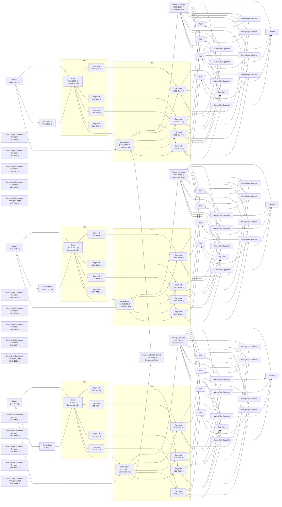

```mermaid
flowchart LR
  subgraph path19 [Path]
    19["Path<br>[15, 502, 0]<br>Consumed: false"]
      %% [ProgramBodyItem { index: 0 }, VariableDeclarationDeclaration, VariableDeclarationInit]
    22["Segment<br>[43, 100, 0]"]
      %% [ProgramBodyItem { index: 0 }, VariableDeclarationDeclaration, VariableDeclarationInit, SketchBlockBody, SketchBlockBodyItem { index: 0 }, VariableDeclarationDeclaration, VariableDeclarationInit]
    23["Segment<br>[111, 166, 0]"]
      %% [ProgramBodyItem { index: 0 }, VariableDeclarationDeclaration, VariableDeclarationInit, SketchBlockBody, SketchBlockBodyItem { index: 1 }, VariableDeclarationDeclaration, VariableDeclarationInit]
    24["Segment<br>[177, 232, 0]"]
      %% [ProgramBodyItem { index: 0 }, VariableDeclarationDeclaration, VariableDeclarationInit, SketchBlockBody, SketchBlockBodyItem { index: 2 }, VariableDeclarationDeclaration, VariableDeclarationInit]
    25["Segment<br>[243, 300, 0]"]
      %% [ProgramBodyItem { index: 0 }, VariableDeclarationDeclaration, VariableDeclarationInit, SketchBlockBody, SketchBlockBodyItem { index: 3 }, VariableDeclarationDeclaration, VariableDeclarationInit]
  end
  subgraph path32 [Path]
    32["Path Region<br>[521, 566, 0]<br>Consumed: true"]
      %% [ProgramBodyItem { index: 1 }, VariableDeclarationDeclaration, VariableDeclarationInit, CallKwUnlabeledArg]
    33["Segment<br>[521, 566, 0]"]
      %% [ProgramBodyItem { index: 1 }, VariableDeclarationDeclaration, VariableDeclarationInit, CallKwUnlabeledArg]
    34["Segment<br>[521, 566, 0]"]
      %% [ProgramBodyItem { index: 1 }, VariableDeclarationDeclaration, VariableDeclarationInit, CallKwUnlabeledArg]
    35["Segment<br>[521, 566, 0]"]
      %% [ProgramBodyItem { index: 1 }, VariableDeclarationDeclaration, VariableDeclarationInit, CallKwUnlabeledArg]
    36["Segment<br>[521, 566, 0]"]
      %% [ProgramBodyItem { index: 1 }, VariableDeclarationDeclaration, VariableDeclarationInit, CallKwUnlabeledArg]
  end
  subgraph path37 [Path]
    37["Path<br>[596, 1083, 0]<br>Consumed: false"]
      %% [ProgramBodyItem { index: 2 }, VariableDeclarationDeclaration, VariableDeclarationInit]
    40["Segment<br>[624, 681, 0]"]
      %% [ProgramBodyItem { index: 2 }, VariableDeclarationDeclaration, VariableDeclarationInit, SketchBlockBody, SketchBlockBodyItem { index: 0 }, VariableDeclarationDeclaration, VariableDeclarationInit]
    41["Segment<br>[692, 747, 0]"]
      %% [ProgramBodyItem { index: 2 }, VariableDeclarationDeclaration, VariableDeclarationInit, SketchBlockBody, SketchBlockBodyItem { index: 1 }, VariableDeclarationDeclaration, VariableDeclarationInit]
    42["Segment<br>[758, 813, 0]"]
      %% [ProgramBodyItem { index: 2 }, VariableDeclarationDeclaration, VariableDeclarationInit, SketchBlockBody, SketchBlockBodyItem { index: 2 }, VariableDeclarationDeclaration, VariableDeclarationInit]
    43["Segment<br>[824, 881, 0]"]
      %% [ProgramBodyItem { index: 2 }, VariableDeclarationDeclaration, VariableDeclarationInit, SketchBlockBody, SketchBlockBodyItem { index: 3 }, VariableDeclarationDeclaration, VariableDeclarationInit]
  end
  subgraph path50 [Path]
    50["Path Region<br>[1101, 1147, 0]<br>Consumed: true"]
      %% [ProgramBodyItem { index: 3 }, VariableDeclarationDeclaration, VariableDeclarationInit, CallKwUnlabeledArg]
    51["Segment<br>[1101, 1147, 0]"]
      %% [ProgramBodyItem { index: 3 }, VariableDeclarationDeclaration, VariableDeclarationInit, CallKwUnlabeledArg]
    52["Segment<br>[1101, 1147, 0]"]
      %% [ProgramBodyItem { index: 3 }, VariableDeclarationDeclaration, VariableDeclarationInit, CallKwUnlabeledArg]
    53["Segment<br>[1101, 1147, 0]"]
      %% [ProgramBodyItem { index: 3 }, VariableDeclarationDeclaration, VariableDeclarationInit, CallKwUnlabeledArg]
    54["Segment<br>[1101, 1147, 0]"]
      %% [ProgramBodyItem { index: 3 }, VariableDeclarationDeclaration, VariableDeclarationInit, CallKwUnlabeledArg]
  end
  subgraph path55 [Path]
    55["Path<br>[1176, 1647, 0]<br>Consumed: false"]
      %% [ProgramBodyItem { index: 4 }, VariableDeclarationDeclaration, VariableDeclarationInit]
    58["Segment<br>[1204, 1255, 0]"]
      %% [ProgramBodyItem { index: 4 }, VariableDeclarationDeclaration, VariableDeclarationInit, SketchBlockBody, SketchBlockBodyItem { index: 0 }, VariableDeclarationDeclaration, VariableDeclarationInit]
    59["Segment<br>[1266, 1319, 0]"]
      %% [ProgramBodyItem { index: 4 }, VariableDeclarationDeclaration, VariableDeclarationInit, SketchBlockBody, SketchBlockBodyItem { index: 1 }, VariableDeclarationDeclaration, VariableDeclarationInit]
    60["Segment<br>[1330, 1383, 0]"]
      %% [ProgramBodyItem { index: 4 }, VariableDeclarationDeclaration, VariableDeclarationInit, SketchBlockBody, SketchBlockBodyItem { index: 2 }, VariableDeclarationDeclaration, VariableDeclarationInit]
    61["Segment<br>[1394, 1445, 0]"]
      %% [ProgramBodyItem { index: 4 }, VariableDeclarationDeclaration, VariableDeclarationInit, SketchBlockBody, SketchBlockBodyItem { index: 3 }, VariableDeclarationDeclaration, VariableDeclarationInit]
  end
  subgraph path68 [Path]
    68["Path Region<br>[1665, 1709, 0]<br>Consumed: true"]
      %% [ProgramBodyItem { index: 5 }, VariableDeclarationDeclaration, VariableDeclarationInit, CallKwUnlabeledArg]
    69["Segment<br>[1665, 1709, 0]"]
      %% [ProgramBodyItem { index: 5 }, VariableDeclarationDeclaration, VariableDeclarationInit, CallKwUnlabeledArg]
    70["Segment<br>[1665, 1709, 0]"]
      %% [ProgramBodyItem { index: 5 }, VariableDeclarationDeclaration, VariableDeclarationInit, CallKwUnlabeledArg]
    71["Segment<br>[1665, 1709, 0]"]
      %% [ProgramBodyItem { index: 5 }, VariableDeclarationDeclaration, VariableDeclarationInit, CallKwUnlabeledArg]
    72["Segment<br>[1665, 1709, 0]"]
      %% [ProgramBodyItem { index: 5 }, VariableDeclarationDeclaration, VariableDeclarationInit, CallKwUnlabeledArg]
  end
  1["Cap End"]
    %% face_code_ref=Missing NodePath
  2["Cap End"]
    %% face_code_ref=Missing NodePath
  3["Cap End"]
    %% face_code_ref=Missing NodePath
  4["Cap Start"]
    %% face_code_ref=Missing NodePath
  5["Cap Start"]
    %% face_code_ref=Missing NodePath
  6["Cap Start"]
    %% face_code_ref=Missing NodePath
  7[Wall]
    %% face_code_ref=Missing NodePath
  8[Wall]
    %% face_code_ref=Missing NodePath
  9[Wall]
    %% face_code_ref=Missing NodePath
  10[Wall]
    %% face_code_ref=Missing NodePath
  11[Wall]
    %% face_code_ref=Missing NodePath
  12[Wall]
    %% face_code_ref=Missing NodePath
  13[Wall]
    %% face_code_ref=Missing NodePath
  14[Wall]
    %% face_code_ref=Missing NodePath
  15[Wall]
    %% face_code_ref=Missing NodePath
  16[Wall]
    %% face_code_ref=Missing NodePath
  17[Wall]
    %% face_code_ref=Missing NodePath
  18[Wall]
    %% face_code_ref=Missing NodePath
  20["Plane<br>[15, 502, 0]"]
    %% [ProgramBodyItem { index: 0 }, VariableDeclarationDeclaration, VariableDeclarationInit]
  21["SketchBlock<br>[15, 502, 0]"]
    %% [ProgramBodyItem { index: 0 }, VariableDeclarationDeclaration, VariableDeclarationInit]
  26["SketchBlockConstraint Coincident<br>[303, 339, 0]"]
    %% [ProgramBodyItem { index: 0 }, VariableDeclarationDeclaration, VariableDeclarationInit, SketchBlockBody, SketchBlockBodyItem { index: 4 }, ExpressionStatementExpr]
  27["SketchBlockConstraint Coincident<br>[342, 378, 0]"]
    %% [ProgramBodyItem { index: 0 }, VariableDeclarationDeclaration, VariableDeclarationInit, SketchBlockBody, SketchBlockBodyItem { index: 5 }, ExpressionStatementExpr]
  28["SketchBlockConstraint Coincident<br>[381, 417, 0]"]
    %% [ProgramBodyItem { index: 0 }, VariableDeclarationDeclaration, VariableDeclarationInit, SketchBlockBody, SketchBlockBodyItem { index: 6 }, ExpressionStatementExpr]
  29["SketchBlockConstraint Coincident<br>[420, 456, 0]"]
    %% [ProgramBodyItem { index: 0 }, VariableDeclarationDeclaration, VariableDeclarationInit, SketchBlockBody, SketchBlockBodyItem { index: 7 }, ExpressionStatementExpr]
  30["SketchBlockConstraint LinesEqualLength<br>[459, 500, 0]"]
    %% [ProgramBodyItem { index: 0 }, VariableDeclarationDeclaration, VariableDeclarationInit, SketchBlockBody, SketchBlockBodyItem { index: 8 }, ExpressionStatementExpr]
  31["Sweep Extrusion<br>[513, 580, 0]<br>Consumed: true"]
    %% [ProgramBodyItem { index: 1 }, VariableDeclarationDeclaration, VariableDeclarationInit]
  38["Plane<br>[596, 1083, 0]"]
    %% [ProgramBodyItem { index: 2 }, VariableDeclarationDeclaration, VariableDeclarationInit]
  39["SketchBlock<br>[596, 1083, 0]"]
    %% [ProgramBodyItem { index: 2 }, VariableDeclarationDeclaration, VariableDeclarationInit]
  44["SketchBlockConstraint Coincident<br>[884, 920, 0]"]
    %% [ProgramBodyItem { index: 2 }, VariableDeclarationDeclaration, VariableDeclarationInit, SketchBlockBody, SketchBlockBodyItem { index: 4 }, ExpressionStatementExpr]
  45["SketchBlockConstraint Coincident<br>[923, 959, 0]"]
    %% [ProgramBodyItem { index: 2 }, VariableDeclarationDeclaration, VariableDeclarationInit, SketchBlockBody, SketchBlockBodyItem { index: 5 }, ExpressionStatementExpr]
  46["SketchBlockConstraint Coincident<br>[962, 998, 0]"]
    %% [ProgramBodyItem { index: 2 }, VariableDeclarationDeclaration, VariableDeclarationInit, SketchBlockBody, SketchBlockBodyItem { index: 6 }, ExpressionStatementExpr]
  47["SketchBlockConstraint Coincident<br>[1001, 1037, 0]"]
    %% [ProgramBodyItem { index: 2 }, VariableDeclarationDeclaration, VariableDeclarationInit, SketchBlockBody, SketchBlockBodyItem { index: 7 }, ExpressionStatementExpr]
  48["SketchBlockConstraint LinesEqualLength<br>[1040, 1081, 0]"]
    %% [ProgramBodyItem { index: 2 }, VariableDeclarationDeclaration, VariableDeclarationInit, SketchBlockBody, SketchBlockBodyItem { index: 8 }, ExpressionStatementExpr]
  49["Sweep Extrusion<br>[1093, 1160, 0]<br>Consumed: true"]
    %% [ProgramBodyItem { index: 3 }, VariableDeclarationDeclaration, VariableDeclarationInit]
  56["Plane<br>[1176, 1647, 0]"]
    %% [ProgramBodyItem { index: 4 }, VariableDeclarationDeclaration, VariableDeclarationInit]
  57["SketchBlock<br>[1176, 1647, 0]"]
    %% [ProgramBodyItem { index: 4 }, VariableDeclarationDeclaration, VariableDeclarationInit]
  62["SketchBlockConstraint Coincident<br>[1448, 1484, 0]"]
    %% [ProgramBodyItem { index: 4 }, VariableDeclarationDeclaration, VariableDeclarationInit, SketchBlockBody, SketchBlockBodyItem { index: 4 }, ExpressionStatementExpr]
  63["SketchBlockConstraint Coincident<br>[1487, 1523, 0]"]
    %% [ProgramBodyItem { index: 4 }, VariableDeclarationDeclaration, VariableDeclarationInit, SketchBlockBody, SketchBlockBodyItem { index: 5 }, ExpressionStatementExpr]
  64["SketchBlockConstraint Coincident<br>[1526, 1562, 0]"]
    %% [ProgramBodyItem { index: 4 }, VariableDeclarationDeclaration, VariableDeclarationInit, SketchBlockBody, SketchBlockBodyItem { index: 6 }, ExpressionStatementExpr]
  65["SketchBlockConstraint Coincident<br>[1565, 1601, 0]"]
    %% [ProgramBodyItem { index: 4 }, VariableDeclarationDeclaration, VariableDeclarationInit, SketchBlockBody, SketchBlockBodyItem { index: 7 }, ExpressionStatementExpr]
  66["SketchBlockConstraint LinesEqualLength<br>[1604, 1645, 0]"]
    %% [ProgramBodyItem { index: 4 }, VariableDeclarationDeclaration, VariableDeclarationInit, SketchBlockBody, SketchBlockBodyItem { index: 8 }, ExpressionStatementExpr]
  67["Sweep Extrusion<br>[1657, 1722, 0]<br>Consumed: false"]
    %% [ProgramBodyItem { index: 5 }, VariableDeclarationDeclaration, VariableDeclarationInit]
  73["CompositeSolid Subtract<br>[1732, 1765, 0]<br>Consumed: false"]
    %% [ProgramBodyItem { index: 6 }, VariableDeclarationDeclaration, VariableDeclarationInit]
  74["SweepEdge Adjacent"]
  75["SweepEdge Adjacent"]
  76["SweepEdge Adjacent"]
  77["SweepEdge Adjacent"]
  78["SweepEdge Adjacent"]
  79["SweepEdge Adjacent"]
  80["SweepEdge Adjacent"]
  81["SweepEdge Adjacent"]
  82["SweepEdge Adjacent"]
  83["SweepEdge Adjacent"]
  84["SweepEdge Adjacent"]
  85["SweepEdge Adjacent"]
  86["SweepEdge Opposite"]
  87["SweepEdge Opposite"]
  88["SweepEdge Opposite"]
  89["SweepEdge Opposite"]
  90["SweepEdge Opposite"]
  91["SweepEdge Opposite"]
  92["SweepEdge Opposite"]
  93["SweepEdge Opposite"]
  94["SweepEdge Opposite"]
  95["SweepEdge Opposite"]
  96["SweepEdge Opposite"]
  97["SweepEdge Opposite"]
  49 --- 1
  86 <--x 1
  87 <--x 1
  88 <--x 1
  89 <--x 1
  67 --- 2
  90 <--x 2
  91 <--x 2
  92 <--x 2
  93 <--x 2
  31 --- 3
  94 <--x 3
  95 <--x 3
  96 <--x 3
  97 <--x 3
  49 --- 4
  51 <--x 4
  52 <--x 4
  53 <--x 4
  54 <--x 4
  67 --- 5
  69 <--x 5
  70 <--x 5
  71 <--x 5
  72 <--x 5
  31 --- 6
  33 <--x 6
  34 <--x 6
  35 <--x 6
  36 <--x 6
  49 --- 7
  51 --- 7
  7 --- 74
  74 <--x 7
  7 --- 86
  49 --- 8
  52 --- 8
  8 --- 75
  75 <--x 8
  8 --- 87
  49 --- 9
  53 --- 9
  9 --- 76
  76 <--x 9
  9 --- 88
  49 --- 10
  54 --- 10
  10 --- 77
  77 <--x 10
  10 --- 89
  67 --- 11
  69 --- 11
  11 --- 78
  78 <--x 11
  11 --- 90
  67 --- 12
  70 --- 12
  12 --- 79
  79 <--x 12
  12 --- 91
  67 --- 13
  71 --- 13
  13 --- 80
  80 <--x 13
  13 --- 92
  67 --- 14
  72 --- 14
  14 --- 81
  81 <--x 14
  14 --- 93
  31 --- 15
  33 --- 15
  15 --- 82
  82 <--x 15
  15 --- 94
  31 --- 16
  34 --- 16
  16 --- 83
  83 <--x 16
  16 --- 95
  31 --- 17
  35 --- 17
  17 --- 84
  84 <--x 17
  17 --- 96
  31 --- 18
  36 --- 18
  18 --- 85
  85 <--x 18
  18 --- 97
  20 --- 19
  21 --- 19
  19 --- 22
  19 --- 23
  19 --- 24
  19 --- 25
  19 <--x 32
  20 <--x 21
  20 <--x 32
  22 <--x 36
  23 <--x 33
  24 <--x 34
  25 <--x 35
  32 ---- 31
  31 --- 82
  31 --- 83
  31 --- 84
  31 --- 85
  31 --- 94
  31 --- 95
  31 --- 96
  31 --- 97
  32 <--x 33
  32 <--x 34
  32 <--x 35
  32 <--x 36
  32 --- 73
  33 --- 82
  33 --- 94
  34 --- 83
  34 --- 95
  35 --- 84
  35 --- 96
  36 --- 85
  36 --- 97
  38 --- 37
  39 --- 37
  37 --- 40
  37 --- 41
  37 --- 42
  37 --- 43
  37 <--x 50
  38 <--x 39
  38 <--x 50
  40 <--x 51
  41 <--x 52
  42 <--x 53
  43 <--x 54
  50 ---- 49
  49 --- 74
  49 --- 75
  49 --- 76
  49 --- 77
  49 --- 86
  49 --- 87
  49 --- 88
  49 --- 89
  50 <--x 51
  50 <--x 52
  50 <--x 53
  50 <--x 54
  50 --- 73
  51 --- 74
  51 --- 86
  52 --- 75
  52 --- 87
  53 --- 76
  53 --- 88
  54 --- 77
  54 --- 89
  56 --- 55
  57 --- 55
  55 --- 58
  55 --- 59
  55 --- 60
  55 --- 61
  55 <--x 68
  56 <--x 57
  56 <--x 68
  58 <--x 69
  59 <--x 70
  60 <--x 71
  61 <--x 72
  68 ---- 67
  67 --- 78
  67 --- 79
  67 --- 80
  67 --- 81
  67 --- 90
  67 --- 91
  67 --- 92
  67 --- 93
  68 <--x 69
  68 <--x 70
  68 <--x 71
  68 <--x 72
  69 --- 78
  69 --- 90
  70 --- 79
  70 --- 91
  71 --- 80
  71 --- 92
  72 --- 81
  72 --- 93
```
