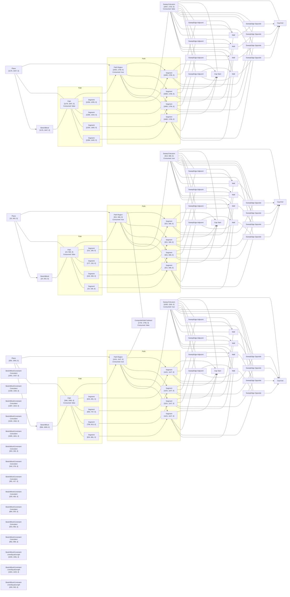

```mermaid
flowchart LR
  subgraph path12 [Path]
    12["Path<br>[15, 502, 0]<br>Consumed: false"]
      %% [ProgramBodyItem { index: 0 }, VariableDeclarationDeclaration, VariableDeclarationInit]
    32["Segment<br>[43, 100, 0]"]
      %% [ProgramBodyItem { index: 0 }, VariableDeclarationDeclaration, VariableDeclarationInit, SketchBlockBody, SketchBlockBodyItem { index: 0 }, VariableDeclarationDeclaration, VariableDeclarationInit]
    21["Segment<br>[111, 166, 0]"]
      %% [ProgramBodyItem { index: 0 }, VariableDeclarationDeclaration, VariableDeclarationInit, SketchBlockBody, SketchBlockBodyItem { index: 1 }, VariableDeclarationDeclaration, VariableDeclarationInit]
    30["Segment<br>[177, 232, 0]"]
      %% [ProgramBodyItem { index: 0 }, VariableDeclarationDeclaration, VariableDeclarationInit, SketchBlockBody, SketchBlockBodyItem { index: 2 }, VariableDeclarationDeclaration, VariableDeclarationInit]
    31["Segment<br>[243, 300, 0]"]
      %% [ProgramBodyItem { index: 0 }, VariableDeclarationDeclaration, VariableDeclarationInit, SketchBlockBody, SketchBlockBodyItem { index: 3 }, VariableDeclarationDeclaration, VariableDeclarationInit]
  end
  subgraph path10 [Path]
    10["Path Region<br>[521, 566, 0]<br>Consumed: true"]
      %% [ProgramBodyItem { index: 1 }, VariableDeclarationDeclaration, VariableDeclarationInit, CallKwUnlabeledArg]
    36["Segment<br>[521, 566, 0]"]
      %% [ProgramBodyItem { index: 1 }, VariableDeclarationDeclaration, VariableDeclarationInit, CallKwUnlabeledArg]
    33["Segment<br>[521, 566, 0]"]
      %% [ProgramBodyItem { index: 1 }, VariableDeclarationDeclaration, VariableDeclarationInit, CallKwUnlabeledArg]
    34["Segment<br>[521, 566, 0]"]
      %% [ProgramBodyItem { index: 1 }, VariableDeclarationDeclaration, VariableDeclarationInit, CallKwUnlabeledArg]
    35["Segment<br>[521, 566, 0]"]
      %% [ProgramBodyItem { index: 1 }, VariableDeclarationDeclaration, VariableDeclarationInit, CallKwUnlabeledArg]
  end
  subgraph path13 [Path]
    13["Path<br>[596, 1083, 0]<br>Consumed: false"]
      %% [ProgramBodyItem { index: 2 }, VariableDeclarationDeclaration, VariableDeclarationInit]
    37["Segment<br>[624, 681, 0]"]
      %% [ProgramBodyItem { index: 2 }, VariableDeclarationDeclaration, VariableDeclarationInit, SketchBlockBody, SketchBlockBodyItem { index: 0 }, VariableDeclarationDeclaration, VariableDeclarationInit]
    38["Segment<br>[692, 747, 0]"]
      %% [ProgramBodyItem { index: 2 }, VariableDeclarationDeclaration, VariableDeclarationInit, SketchBlockBody, SketchBlockBodyItem { index: 1 }, VariableDeclarationDeclaration, VariableDeclarationInit]
    39["Segment<br>[758, 813, 0]"]
      %% [ProgramBodyItem { index: 2 }, VariableDeclarationDeclaration, VariableDeclarationInit, SketchBlockBody, SketchBlockBodyItem { index: 2 }, VariableDeclarationDeclaration, VariableDeclarationInit]
    40["Segment<br>[824, 881, 0]"]
      %% [ProgramBodyItem { index: 2 }, VariableDeclarationDeclaration, VariableDeclarationInit, SketchBlockBody, SketchBlockBodyItem { index: 3 }, VariableDeclarationDeclaration, VariableDeclarationInit]
  end
  subgraph path8 [Path]
    8["Path Region<br>[1101, 1147, 0]<br>Consumed: true"]
      %% [ProgramBodyItem { index: 3 }, VariableDeclarationDeclaration, VariableDeclarationInit, CallKwUnlabeledArg]
    17["Segment<br>[1101, 1147, 0]"]
      %% [ProgramBodyItem { index: 3 }, VariableDeclarationDeclaration, VariableDeclarationInit, CallKwUnlabeledArg]
    18["Segment<br>[1101, 1147, 0]"]
      %% [ProgramBodyItem { index: 3 }, VariableDeclarationDeclaration, VariableDeclarationInit, CallKwUnlabeledArg]
    19["Segment<br>[1101, 1147, 0]"]
      %% [ProgramBodyItem { index: 3 }, VariableDeclarationDeclaration, VariableDeclarationInit, CallKwUnlabeledArg]
    20["Segment<br>[1101, 1147, 0]"]
      %% [ProgramBodyItem { index: 3 }, VariableDeclarationDeclaration, VariableDeclarationInit, CallKwUnlabeledArg]
  end
  subgraph path11 [Path]
    11["Path<br>[1176, 1647, 0]<br>Consumed: false"]
      %% [ProgramBodyItem { index: 4 }, VariableDeclarationDeclaration, VariableDeclarationInit]
    22["Segment<br>[1204, 1255, 0]"]
      %% [ProgramBodyItem { index: 4 }, VariableDeclarationDeclaration, VariableDeclarationInit, SketchBlockBody, SketchBlockBodyItem { index: 0 }, VariableDeclarationDeclaration, VariableDeclarationInit]
    23["Segment<br>[1266, 1319, 0]"]
      %% [ProgramBodyItem { index: 4 }, VariableDeclarationDeclaration, VariableDeclarationInit, SketchBlockBody, SketchBlockBodyItem { index: 1 }, VariableDeclarationDeclaration, VariableDeclarationInit]
    24["Segment<br>[1330, 1383, 0]"]
      %% [ProgramBodyItem { index: 4 }, VariableDeclarationDeclaration, VariableDeclarationInit, SketchBlockBody, SketchBlockBodyItem { index: 2 }, VariableDeclarationDeclaration, VariableDeclarationInit]
    25["Segment<br>[1394, 1445, 0]"]
      %% [ProgramBodyItem { index: 4 }, VariableDeclarationDeclaration, VariableDeclarationInit, SketchBlockBody, SketchBlockBodyItem { index: 3 }, VariableDeclarationDeclaration, VariableDeclarationInit]
  end
  subgraph path9 [Path]
    9["Path Region<br>[1665, 1709, 0]<br>Consumed: true"]
      %% [ProgramBodyItem { index: 5 }, VariableDeclarationDeclaration, VariableDeclarationInit, CallKwUnlabeledArg]
    26["Segment<br>[1665, 1709, 0]"]
      %% [ProgramBodyItem { index: 5 }, VariableDeclarationDeclaration, VariableDeclarationInit, CallKwUnlabeledArg]
    27["Segment<br>[1665, 1709, 0]"]
      %% [ProgramBodyItem { index: 5 }, VariableDeclarationDeclaration, VariableDeclarationInit, CallKwUnlabeledArg]
    28["Segment<br>[1665, 1709, 0]"]
      %% [ProgramBodyItem { index: 5 }, VariableDeclarationDeclaration, VariableDeclarationInit, CallKwUnlabeledArg]
    29["Segment<br>[1665, 1709, 0]"]
      %% [ProgramBodyItem { index: 5 }, VariableDeclarationDeclaration, VariableDeclarationInit, CallKwUnlabeledArg]
  end
  15["Plane<br>[15, 502, 0]"]
    %% [ProgramBodyItem { index: 0 }, VariableDeclarationDeclaration, VariableDeclarationInit]
  61["Sweep Extrusion<br>[513, 580, 0]<br>Consumed: true"]
    %% [ProgramBodyItem { index: 1 }, VariableDeclarationDeclaration, VariableDeclarationInit]
  94[Wall]
    %% face_code_ref=Missing NodePath
  95[Wall]
    %% face_code_ref=Missing NodePath
  96[Wall]
    %% face_code_ref=Missing NodePath
  97[Wall]
    %% face_code_ref=Missing NodePath
  6["Cap Start"]
    %% face_code_ref=Missing NodePath
  3["Cap End"]
    %% face_code_ref=Missing NodePath
  82["SweepEdge Opposite"]
  70["SweepEdge Adjacent"]
  83["SweepEdge Opposite"]
  71["SweepEdge Adjacent"]
  84["SweepEdge Opposite"]
  72["SweepEdge Adjacent"]
  85["SweepEdge Opposite"]
  73["SweepEdge Adjacent"]
  16["Plane<br>[596, 1083, 0]"]
    %% [ProgramBodyItem { index: 2 }, VariableDeclarationDeclaration, VariableDeclarationInit]
  59["Sweep Extrusion<br>[1093, 1160, 0]<br>Consumed: true"]
    %% [ProgramBodyItem { index: 3 }, VariableDeclarationDeclaration, VariableDeclarationInit]
  86[Wall]
    %% face_code_ref=Missing NodePath
  87[Wall]
    %% face_code_ref=Missing NodePath
  88[Wall]
    %% face_code_ref=Missing NodePath
  89[Wall]
    %% face_code_ref=Missing NodePath
  4["Cap Start"]
    %% face_code_ref=Missing NodePath
  1["Cap End"]
    %% face_code_ref=Missing NodePath
  74["SweepEdge Opposite"]
  62["SweepEdge Adjacent"]
  75["SweepEdge Opposite"]
  63["SweepEdge Adjacent"]
  76["SweepEdge Opposite"]
  64["SweepEdge Adjacent"]
  77["SweepEdge Opposite"]
  65["SweepEdge Adjacent"]
  14["Plane<br>[1176, 1647, 0]"]
    %% [ProgramBodyItem { index: 4 }, VariableDeclarationDeclaration, VariableDeclarationInit]
  60["Sweep Extrusion<br>[1657, 1722, 0]<br>Consumed: false"]
    %% [ProgramBodyItem { index: 5 }, VariableDeclarationDeclaration, VariableDeclarationInit]
  90[Wall]
    %% face_code_ref=Missing NodePath
  91[Wall]
    %% face_code_ref=Missing NodePath
  92[Wall]
    %% face_code_ref=Missing NodePath
  93[Wall]
    %% face_code_ref=Missing NodePath
  5["Cap Start"]
    %% face_code_ref=Missing NodePath
  2["Cap End"]
    %% face_code_ref=Missing NodePath
  78["SweepEdge Opposite"]
  66["SweepEdge Adjacent"]
  79["SweepEdge Opposite"]
  67["SweepEdge Adjacent"]
  80["SweepEdge Opposite"]
  68["SweepEdge Adjacent"]
  81["SweepEdge Opposite"]
  69["SweepEdge Adjacent"]
  7["CompositeSolid Subtract<br>[1732, 1765, 0]<br>Consumed: false"]
    %% [ProgramBodyItem { index: 6 }, VariableDeclarationDeclaration, VariableDeclarationInit]
  42["SketchBlock<br>[15, 502, 0]"]
    %% [ProgramBodyItem { index: 0 }, VariableDeclarationDeclaration, VariableDeclarationInit]
  49["SketchBlockConstraint Coincident<br>[303, 339, 0]"]
    %% [ProgramBodyItem { index: 0 }, VariableDeclarationDeclaration, VariableDeclarationInit, SketchBlockBody, SketchBlockBodyItem { index: 4 }, ExpressionStatementExpr]
  50["SketchBlockConstraint Coincident<br>[342, 378, 0]"]
    %% [ProgramBodyItem { index: 0 }, VariableDeclarationDeclaration, VariableDeclarationInit, SketchBlockBody, SketchBlockBodyItem { index: 5 }, ExpressionStatementExpr]
  51["SketchBlockConstraint Coincident<br>[381, 417, 0]"]
    %% [ProgramBodyItem { index: 0 }, VariableDeclarationDeclaration, VariableDeclarationInit, SketchBlockBody, SketchBlockBodyItem { index: 6 }, ExpressionStatementExpr]
  52["SketchBlockConstraint Coincident<br>[420, 456, 0]"]
    %% [ProgramBodyItem { index: 0 }, VariableDeclarationDeclaration, VariableDeclarationInit, SketchBlockBody, SketchBlockBodyItem { index: 7 }, ExpressionStatementExpr]
  58["SketchBlockConstraint LinesEqualLength<br>[459, 500, 0]"]
    %% [ProgramBodyItem { index: 0 }, VariableDeclarationDeclaration, VariableDeclarationInit, SketchBlockBody, SketchBlockBodyItem { index: 8 }, ExpressionStatementExpr]
  43["SketchBlock<br>[596, 1083, 0]"]
    %% [ProgramBodyItem { index: 2 }, VariableDeclarationDeclaration, VariableDeclarationInit]
  53["SketchBlockConstraint Coincident<br>[884, 920, 0]"]
    %% [ProgramBodyItem { index: 2 }, VariableDeclarationDeclaration, VariableDeclarationInit, SketchBlockBody, SketchBlockBodyItem { index: 4 }, ExpressionStatementExpr]
  54["SketchBlockConstraint Coincident<br>[923, 959, 0]"]
    %% [ProgramBodyItem { index: 2 }, VariableDeclarationDeclaration, VariableDeclarationInit, SketchBlockBody, SketchBlockBodyItem { index: 5 }, ExpressionStatementExpr]
  55["SketchBlockConstraint Coincident<br>[962, 998, 0]"]
    %% [ProgramBodyItem { index: 2 }, VariableDeclarationDeclaration, VariableDeclarationInit, SketchBlockBody, SketchBlockBodyItem { index: 6 }, ExpressionStatementExpr]
  44["SketchBlockConstraint Coincident<br>[1001, 1037, 0]"]
    %% [ProgramBodyItem { index: 2 }, VariableDeclarationDeclaration, VariableDeclarationInit, SketchBlockBody, SketchBlockBodyItem { index: 7 }, ExpressionStatementExpr]
  56["SketchBlockConstraint LinesEqualLength<br>[1040, 1081, 0]"]
    %% [ProgramBodyItem { index: 2 }, VariableDeclarationDeclaration, VariableDeclarationInit, SketchBlockBody, SketchBlockBodyItem { index: 8 }, ExpressionStatementExpr]
  41["SketchBlock<br>[1176, 1647, 0]"]
    %% [ProgramBodyItem { index: 4 }, VariableDeclarationDeclaration, VariableDeclarationInit]
  45["SketchBlockConstraint Coincident<br>[1448, 1484, 0]"]
    %% [ProgramBodyItem { index: 4 }, VariableDeclarationDeclaration, VariableDeclarationInit, SketchBlockBody, SketchBlockBodyItem { index: 4 }, ExpressionStatementExpr]
  46["SketchBlockConstraint Coincident<br>[1487, 1523, 0]"]
    %% [ProgramBodyItem { index: 4 }, VariableDeclarationDeclaration, VariableDeclarationInit, SketchBlockBody, SketchBlockBodyItem { index: 5 }, ExpressionStatementExpr]
  47["SketchBlockConstraint Coincident<br>[1526, 1562, 0]"]
    %% [ProgramBodyItem { index: 4 }, VariableDeclarationDeclaration, VariableDeclarationInit, SketchBlockBody, SketchBlockBodyItem { index: 6 }, ExpressionStatementExpr]
  48["SketchBlockConstraint Coincident<br>[1565, 1601, 0]"]
    %% [ProgramBodyItem { index: 4 }, VariableDeclarationDeclaration, VariableDeclarationInit, SketchBlockBody, SketchBlockBodyItem { index: 7 }, ExpressionStatementExpr]
  57["SketchBlockConstraint LinesEqualLength<br>[1604, 1645, 0]"]
    %% [ProgramBodyItem { index: 4 }, VariableDeclarationDeclaration, VariableDeclarationInit, SketchBlockBody, SketchBlockBodyItem { index: 8 }, ExpressionStatementExpr]
  59 --- 1
  74 <--x 1
  75 <--x 1
  76 <--x 1
  77 <--x 1
  60 --- 2
  78 <--x 2
  79 <--x 2
  80 <--x 2
  81 <--x 2
  61 --- 3
  82 <--x 3
  83 <--x 3
  84 <--x 3
  85 <--x 3
  17 <--x 4
  18 <--x 4
  19 <--x 4
  20 <--x 4
  59 --- 4
  26 <--x 5
  27 <--x 5
  28 <--x 5
  29 <--x 5
  60 --- 5
  33 <--x 6
  34 <--x 6
  35 <--x 6
  36 <--x 6
  61 --- 6
  8 --- 7
  10 --- 7
  13 x--> 8
  16 x--> 8
  8 <--x 17
  8 <--x 18
  8 <--x 19
  8 <--x 20
  8 ---- 59
  11 x--> 9
  14 x--> 9
  9 <--x 26
  9 <--x 27
  9 <--x 28
  9 <--x 29
  9 ---- 60
  12 x--> 10
  15 x--> 10
  10 <--x 33
  10 <--x 34
  10 <--x 35
  10 <--x 36
  10 ---- 61
  14 --- 11
  11 --- 22
  11 --- 23
  11 --- 24
  11 --- 25
  41 --- 11
  15 --- 12
  12 --- 21
  12 --- 30
  12 --- 31
  12 --- 32
  42 --- 12
  16 --- 13
  13 --- 37
  13 --- 38
  13 --- 39
  13 --- 40
  43 --- 13
  14 <--x 41
  15 <--x 42
  16 <--x 43
  37 x--> 17
  17 --- 62
  17 --- 74
  17 --- 86
  38 x--> 18
  18 --- 63
  18 --- 75
  18 --- 87
  39 x--> 19
  19 --- 64
  19 --- 76
  19 --- 88
  40 x--> 20
  20 --- 65
  20 --- 77
  20 --- 89
  21 <--x 33
  22 <--x 26
  23 <--x 27
  24 <--x 28
  25 <--x 29
  26 --- 66
  26 --- 78
  26 --- 90
  27 --- 67
  27 --- 79
  27 --- 91
  28 --- 68
  28 --- 80
  28 --- 92
  29 --- 69
  29 --- 81
  29 --- 93
  30 <--x 34
  31 <--x 35
  32 <--x 36
  33 --- 70
  33 --- 82
  33 --- 94
  34 --- 71
  34 --- 83
  34 --- 95
  35 --- 72
  35 --- 84
  35 --- 96
  36 --- 73
  36 --- 85
  36 --- 97
  59 --- 62
  59 --- 63
  59 --- 64
  59 --- 65
  59 --- 74
  59 --- 75
  59 --- 76
  59 --- 77
  59 --- 86
  59 --- 87
  59 --- 88
  59 --- 89
  60 --- 66
  60 --- 67
  60 --- 68
  60 --- 69
  60 --- 78
  60 --- 79
  60 --- 80
  60 --- 81
  60 --- 90
  60 --- 91
  60 --- 92
  60 --- 93
  61 --- 70
  61 --- 71
  61 --- 72
  61 --- 73
  61 --- 82
  61 --- 83
  61 --- 84
  61 --- 85
  61 --- 94
  61 --- 95
  61 --- 96
  61 --- 97
  86 --- 62
  62 x--> 86
  87 --- 63
  63 x--> 87
  88 --- 64
  64 x--> 88
  89 --- 65
  65 x--> 89
  90 --- 66
  66 x--> 90
  91 --- 67
  67 x--> 91
  92 --- 68
  68 x--> 92
  93 --- 69
  69 x--> 93
  94 --- 70
  70 x--> 94
  95 --- 71
  71 x--> 95
  96 --- 72
  72 x--> 96
  97 --- 73
  73 x--> 97
  86 --- 74
  87 --- 75
  88 --- 76
  89 --- 77
  90 --- 78
  91 --- 79
  92 --- 80
  93 --- 81
  94 --- 82
  95 --- 83
  96 --- 84
  97 --- 85
```
