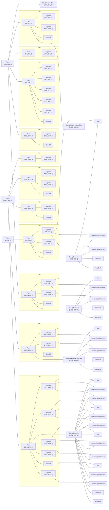

```mermaid
flowchart LR
  subgraph path2 [Path]
    2["Path<br>[45, 85, 0]"]
    3["Segment<br>[91, 129, 0]"]
    4["Segment<br>[242, 249, 0]"]
    5[Solid2d]
  end
  subgraph path13 [Path]
    13["Path<br>[354, 394, 0]"]
    14["Segment<br>[400, 424, 0]"]
  end
  subgraph path15 [Path]
    15["Path<br>[469, 508, 0]"]
    16["Segment<br>[514, 561, 0]"]
    17["Segment<br>[567, 644, 0]"]
    18["Segment<br>[650, 747, 0]"]
    19["Segment<br>[753, 809, 0]"]
    20["Segment<br>[815, 822, 0]"]
    21[Solid2d]
  end
  subgraph path22 [Path]
    22["Path<br>[836, 875, 0]"]
    23["Segment<br>[881, 901, 0]"]
    24["Segment<br>[1001, 1008, 0]"]
    25[Solid2d]
  end
  subgraph path26 [Path]
    26["Path<br>[1022, 1077, 0]"]
    27["Segment<br>[1022, 1077, 0]"]
    28[Solid2d]
  end
  subgraph path29 [Path]
    29["Path<br>[1091, 1130, 0]"]
    30["Segment<br>[1136, 1160, 0]"]
    31["Segment<br>[1259, 1266, 0]"]
    32[Solid2d]
  end
  subgraph path41 [Path]
    41["Path<br>[1446, 1484, 0]"]
    42["Segment<br>[1490, 1514, 0]"]
  end
  subgraph path43 [Path]
    43["Path<br>[1559, 1598, 0]"]
    44["Segment<br>[1604, 1628, 0]"]
    45["Segment<br>[1727, 1734, 0]"]
    46[Solid2d]
  end
  subgraph path47 [Path]
    47["Path<br>[1748, 1787, 0]"]
    48["Segment<br>[1793, 1816, 0]"]
    49["Segment<br>[1915, 1922, 0]"]
    50[Solid2d]
  end
  subgraph path51 [Path]
    51["Path<br>[1936, 1992, 0]"]
    52["Segment<br>[1936, 1992, 0]"]
    53[Solid2d]
  end
  subgraph path54 [Path]
    54["Path<br>[2006, 2046, 0]"]
    55["Segment<br>[2052, 2099, 0]"]
    56["Segment<br>[2105, 2182, 0]"]
    57["Segment<br>[2188, 2285, 0]"]
    58["Segment<br>[2291, 2347, 0]"]
    59["Segment<br>[2353, 2360, 0]"]
    60[Solid2d]
  end
  1["Plane<br>[12, 31, 0]"]
  6["Sweep Extrusion<br>[263, 295, 0]"]
  7[Wall]
  8["Cap Start"]
  9["Cap End"]
  10["SweepEdge Opposite"]
  11["SweepEdge Adjacent"]
  12["Plane<br>[354, 394, 0]"]
  33["Sweep RevolveAboutEdge<br>[1280, 1354, 0]"]
  34["Sweep Extrusion<br>[1368, 1399, 0]"]
  35[Wall]
  36["Cap Start"]
  37["Cap End"]
  38["SweepEdge Opposite"]
  39["SweepEdge Adjacent"]
  40["Plane<br>[1412, 1432, 0]"]
  61["Sweep Extrusion<br>[2374, 2407, 0]"]
  62[Wall]
  63[Wall]
  64[Wall]
  65[Wall]
  66["Cap Start"]
  67["Cap End"]
  68["SweepEdge Opposite"]
  69["SweepEdge Adjacent"]
  70["SweepEdge Opposite"]
  71["SweepEdge Adjacent"]
  72["SweepEdge Opposite"]
  73["SweepEdge Adjacent"]
  74["SweepEdge Opposite"]
  75["SweepEdge Adjacent"]
  76["Sweep RevolveAboutEdge<br>[2421, 2470, 0]"]
  77[Wall]
  78["Cap Start"]
  79["Cap End"]
  80["SweepEdge Opposite"]
  81["SweepEdge Adjacent"]
  82["StartSketchOnFace<br>[308, 340, 0]"]
  1 --- 2
  2 --- 3
  2 --- 4
  2 ---- 6
  2 --- 5
  3 --- 7
  3 --- 10
  3 --- 11
  6 --- 7
  6 --- 8
  6 --- 9
  6 --- 10
  6 --- 11
  12 --- 13
  12 --- 15
  12 --- 22
  12 --- 26
  12 --- 29
  13 --- 14
  15 --- 16
  15 --- 17
  15 --- 18
  15 --- 19
  15 --- 20
  15 --- 21
  22 --- 23
  22 --- 24
  22 ---- 33
  22 --- 25
  26 --- 27
  26 --- 28
  29 --- 30
  29 --- 31
  29 ---- 34
  29 --- 32
  30 --- 35
  30 --- 38
  30 --- 39
  34 --- 35
  34 --- 36
  34 --- 37
  34 --- 38
  34 --- 39
  40 --- 41
  40 --- 43
  40 --- 47
  40 --- 51
  40 --- 54
  41 --- 42
  43 --- 44
  43 --- 45
  43 ---- 76
  43 --- 46
  44 --- 77
  44 --- 80
  44 --- 81
  47 --- 48
  47 --- 49
  47 --- 50
  51 --- 52
  51 --- 53
  54 --- 55
  54 --- 56
  54 --- 57
  54 --- 58
  54 --- 59
  54 ---- 61
  54 --- 60
  55 --- 65
  55 --- 74
  55 --- 75
  56 --- 64
  56 --- 72
  56 --- 73
  57 --- 63
  57 --- 70
  57 --- 71
  58 --- 62
  58 --- 68
  58 --- 69
  61 --- 62
  61 --- 63
  61 --- 64
  61 --- 65
  61 --- 66
  61 --- 67
  61 --- 68
  61 --- 69
  61 --- 70
  61 --- 71
  61 --- 72
  61 --- 73
  61 --- 74
  61 --- 75
  76 --- 77
  76 --- 78
  76 --- 79
  76 --- 80
  76 --- 81
  12 <--x 82
```
