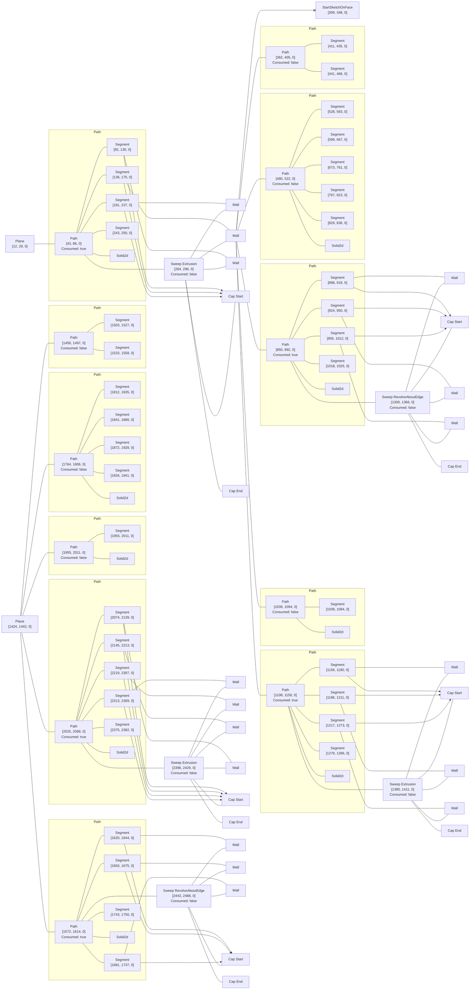

```mermaid
flowchart LR
  subgraph path2 [Path]
    2["Path<br>[43, 86, 0]<br>Consumed: true"]
      %% [ProgramBodyItem { index: 1 }, VariableDeclarationDeclaration, VariableDeclarationInit, PipeBodyItem { index: 0 }]
    3["Segment<br>[92, 130, 0]"]
      %% [ProgramBodyItem { index: 1 }, VariableDeclarationDeclaration, VariableDeclarationInit, PipeBodyItem { index: 1 }]
    4["Segment<br>[136, 175, 0]"]
      %% [ProgramBodyItem { index: 1 }, VariableDeclarationDeclaration, VariableDeclarationInit, PipeBodyItem { index: 2 }]
    5["Segment<br>[181, 237, 0]"]
      %% [ProgramBodyItem { index: 1 }, VariableDeclarationDeclaration, VariableDeclarationInit, PipeBodyItem { index: 3 }]
    6["Segment<br>[243, 250, 0]"]
      %% [ProgramBodyItem { index: 1 }, VariableDeclarationDeclaration, VariableDeclarationInit, PipeBodyItem { index: 4 }]
    7[Solid2d]
  end
  subgraph path14 [Path]
    14["Path<br>[362, 405, 0]<br>Consumed: false"]
      %% [ProgramBodyItem { index: 4 }, VariableDeclarationDeclaration, VariableDeclarationInit, PipeBodyItem { index: 0 }]
    15["Segment<br>[411, 435, 0]"]
      %% [ProgramBodyItem { index: 4 }, VariableDeclarationDeclaration, VariableDeclarationInit, PipeBodyItem { index: 1 }]
    16["Segment<br>[441, 466, 0]"]
      %% [ProgramBodyItem { index: 4 }, VariableDeclarationDeclaration, VariableDeclarationInit, PipeBodyItem { index: 2 }]
  end
  subgraph path17 [Path]
    17["Path<br>[480, 522, 0]<br>Consumed: false"]
      %% [ProgramBodyItem { index: 5 }, VariableDeclarationDeclaration, VariableDeclarationInit, PipeBodyItem { index: 0 }]
    18["Segment<br>[528, 593, 0]"]
      %% [ProgramBodyItem { index: 5 }, VariableDeclarationDeclaration, VariableDeclarationInit, PipeBodyItem { index: 1 }]
    19["Segment<br>[599, 667, 0]"]
      %% [ProgramBodyItem { index: 5 }, VariableDeclarationDeclaration, VariableDeclarationInit, PipeBodyItem { index: 2 }]
    20["Segment<br>[673, 761, 0]"]
      %% [ProgramBodyItem { index: 5 }, VariableDeclarationDeclaration, VariableDeclarationInit, PipeBodyItem { index: 3 }]
    21["Segment<br>[767, 823, 0]"]
      %% [ProgramBodyItem { index: 5 }, VariableDeclarationDeclaration, VariableDeclarationInit, PipeBodyItem { index: 4 }]
    22["Segment<br>[829, 836, 0]"]
      %% [ProgramBodyItem { index: 5 }, VariableDeclarationDeclaration, VariableDeclarationInit, PipeBodyItem { index: 5 }]
    23[Solid2d]
  end
  subgraph path24 [Path]
    24["Path<br>[850, 892, 0]<br>Consumed: true"]
      %% [ProgramBodyItem { index: 6 }, VariableDeclarationDeclaration, VariableDeclarationInit, PipeBodyItem { index: 0 }]
    25["Segment<br>[898, 918, 0]"]
      %% [ProgramBodyItem { index: 6 }, VariableDeclarationDeclaration, VariableDeclarationInit, PipeBodyItem { index: 1 }]
    26["Segment<br>[924, 950, 0]"]
      %% [ProgramBodyItem { index: 6 }, VariableDeclarationDeclaration, VariableDeclarationInit, PipeBodyItem { index: 2 }]
    27["Segment<br>[956, 1012, 0]"]
      %% [ProgramBodyItem { index: 6 }, VariableDeclarationDeclaration, VariableDeclarationInit, PipeBodyItem { index: 3 }]
    28["Segment<br>[1018, 1025, 0]"]
      %% [ProgramBodyItem { index: 6 }, VariableDeclarationDeclaration, VariableDeclarationInit, PipeBodyItem { index: 4 }]
    29[Solid2d]
  end
  subgraph path30 [Path]
    30["Path<br>[1039, 1094, 0]<br>Consumed: false"]
      %% [ProgramBodyItem { index: 7 }, VariableDeclarationDeclaration, VariableDeclarationInit]
    31["Segment<br>[1039, 1094, 0]"]
      %% [ProgramBodyItem { index: 7 }, VariableDeclarationDeclaration, VariableDeclarationInit]
    32[Solid2d]
  end
  subgraph path33 [Path]
    33["Path<br>[1108, 1150, 0]<br>Consumed: true"]
      %% [ProgramBodyItem { index: 8 }, VariableDeclarationDeclaration, VariableDeclarationInit, PipeBodyItem { index: 0 }]
    34["Segment<br>[1156, 1180, 0]"]
      %% [ProgramBodyItem { index: 8 }, VariableDeclarationDeclaration, VariableDeclarationInit, PipeBodyItem { index: 1 }]
    35["Segment<br>[1186, 1211, 0]"]
      %% [ProgramBodyItem { index: 8 }, VariableDeclarationDeclaration, VariableDeclarationInit, PipeBodyItem { index: 2 }]
    36["Segment<br>[1217, 1273, 0]"]
      %% [ProgramBodyItem { index: 8 }, VariableDeclarationDeclaration, VariableDeclarationInit, PipeBodyItem { index: 3 }]
    37["Segment<br>[1279, 1286, 0]"]
      %% [ProgramBodyItem { index: 8 }, VariableDeclarationDeclaration, VariableDeclarationInit, PipeBodyItem { index: 4 }]
    38[Solid2d]
  end
  subgraph path52 [Path]
    52["Path<br>[1456, 1497, 0]<br>Consumed: false"]
      %% [ProgramBodyItem { index: 12 }, VariableDeclarationDeclaration, VariableDeclarationInit, PipeBodyItem { index: 0 }]
    53["Segment<br>[1503, 1527, 0]"]
      %% [ProgramBodyItem { index: 12 }, VariableDeclarationDeclaration, VariableDeclarationInit, PipeBodyItem { index: 1 }]
    54["Segment<br>[1533, 1558, 0]"]
      %% [ProgramBodyItem { index: 12 }, VariableDeclarationDeclaration, VariableDeclarationInit, PipeBodyItem { index: 2 }]
  end
  subgraph path55 [Path]
    55["Path<br>[1572, 1614, 0]<br>Consumed: true"]
      %% [ProgramBodyItem { index: 13 }, VariableDeclarationDeclaration, VariableDeclarationInit, PipeBodyItem { index: 0 }]
    56["Segment<br>[1620, 1644, 0]"]
      %% [ProgramBodyItem { index: 13 }, VariableDeclarationDeclaration, VariableDeclarationInit, PipeBodyItem { index: 1 }]
    57["Segment<br>[1650, 1675, 0]"]
      %% [ProgramBodyItem { index: 13 }, VariableDeclarationDeclaration, VariableDeclarationInit, PipeBodyItem { index: 2 }]
    58["Segment<br>[1681, 1737, 0]"]
      %% [ProgramBodyItem { index: 13 }, VariableDeclarationDeclaration, VariableDeclarationInit, PipeBodyItem { index: 3 }]
    59["Segment<br>[1743, 1750, 0]"]
      %% [ProgramBodyItem { index: 13 }, VariableDeclarationDeclaration, VariableDeclarationInit, PipeBodyItem { index: 4 }]
    60[Solid2d]
  end
  subgraph path61 [Path]
    61["Path<br>[1764, 1806, 0]<br>Consumed: false"]
      %% [ProgramBodyItem { index: 14 }, VariableDeclarationDeclaration, VariableDeclarationInit, PipeBodyItem { index: 0 }]
    62["Segment<br>[1812, 1835, 0]"]
      %% [ProgramBodyItem { index: 14 }, VariableDeclarationDeclaration, VariableDeclarationInit, PipeBodyItem { index: 1 }]
    63["Segment<br>[1841, 1866, 0]"]
      %% [ProgramBodyItem { index: 14 }, VariableDeclarationDeclaration, VariableDeclarationInit, PipeBodyItem { index: 2 }]
    64["Segment<br>[1872, 1928, 0]"]
      %% [ProgramBodyItem { index: 14 }, VariableDeclarationDeclaration, VariableDeclarationInit, PipeBodyItem { index: 3 }]
    65["Segment<br>[1934, 1941, 0]"]
      %% [ProgramBodyItem { index: 14 }, VariableDeclarationDeclaration, VariableDeclarationInit, PipeBodyItem { index: 4 }]
    66[Solid2d]
  end
  subgraph path67 [Path]
    67["Path<br>[1955, 2011, 0]<br>Consumed: false"]
      %% [ProgramBodyItem { index: 15 }, VariableDeclarationDeclaration, VariableDeclarationInit]
    68["Segment<br>[1955, 2011, 0]"]
      %% [ProgramBodyItem { index: 15 }, VariableDeclarationDeclaration, VariableDeclarationInit]
    69[Solid2d]
  end
  subgraph path70 [Path]
    70["Path<br>[2025, 2068, 0]<br>Consumed: true"]
      %% [ProgramBodyItem { index: 16 }, VariableDeclarationDeclaration, VariableDeclarationInit, PipeBodyItem { index: 0 }]
    71["Segment<br>[2074, 2139, 0]"]
      %% [ProgramBodyItem { index: 16 }, VariableDeclarationDeclaration, VariableDeclarationInit, PipeBodyItem { index: 1 }]
    72["Segment<br>[2145, 2213, 0]"]
      %% [ProgramBodyItem { index: 16 }, VariableDeclarationDeclaration, VariableDeclarationInit, PipeBodyItem { index: 2 }]
    73["Segment<br>[2219, 2307, 0]"]
      %% [ProgramBodyItem { index: 16 }, VariableDeclarationDeclaration, VariableDeclarationInit, PipeBodyItem { index: 3 }]
    74["Segment<br>[2313, 2369, 0]"]
      %% [ProgramBodyItem { index: 16 }, VariableDeclarationDeclaration, VariableDeclarationInit, PipeBodyItem { index: 4 }]
    75["Segment<br>[2375, 2382, 0]"]
      %% [ProgramBodyItem { index: 16 }, VariableDeclarationDeclaration, VariableDeclarationInit, PipeBodyItem { index: 5 }]
    76[Solid2d]
  end
  1["Plane<br>[12, 29, 0]"]
    %% [ProgramBodyItem { index: 0 }, VariableDeclarationDeclaration, VariableDeclarationInit]
  8["Sweep Extrusion<br>[264, 296, 0]<br>Consumed: false"]
    %% [ProgramBodyItem { index: 2 }, VariableDeclarationDeclaration, VariableDeclarationInit]
  9[Wall]
    %% face_code_ref=Missing NodePath
  10[Wall]
    %% face_code_ref=[ProgramBodyItem { index: 3 }, VariableDeclarationDeclaration, VariableDeclarationInit]
  11[Wall]
    %% face_code_ref=Missing NodePath
  12["Cap Start"]
    %% face_code_ref=Missing NodePath
  13["Cap End"]
    %% face_code_ref=Missing NodePath
  39["Sweep RevolveAboutEdge<br>[1300, 1366, 0]<br>Consumed: false"]
    %% [ProgramBodyItem { index: 9 }, VariableDeclarationDeclaration, VariableDeclarationInit]
  40[Wall]
    %% face_code_ref=Missing NodePath
  41[Wall]
    %% face_code_ref=Missing NodePath
  42[Wall]
    %% face_code_ref=Missing NodePath
  43["Cap Start"]
    %% face_code_ref=Missing NodePath
  44["Cap End"]
    %% face_code_ref=Missing NodePath
  45["Sweep Extrusion<br>[1380, 1411, 0]<br>Consumed: false"]
    %% [ProgramBodyItem { index: 10 }, VariableDeclarationDeclaration, VariableDeclarationInit]
  46[Wall]
    %% face_code_ref=Missing NodePath
  47[Wall]
    %% face_code_ref=Missing NodePath
  48[Wall]
    %% face_code_ref=Missing NodePath
  49["Cap Start"]
    %% face_code_ref=Missing NodePath
  50["Cap End"]
    %% face_code_ref=Missing NodePath
  51["Plane<br>[1424, 1442, 0]"]
    %% [ProgramBodyItem { index: 11 }, VariableDeclarationDeclaration, VariableDeclarationInit]
  77["Sweep Extrusion<br>[2396, 2429, 0]<br>Consumed: false"]
    %% [ProgramBodyItem { index: 17 }, VariableDeclarationDeclaration, VariableDeclarationInit]
  78[Wall]
    %% face_code_ref=Missing NodePath
  79[Wall]
    %% face_code_ref=Missing NodePath
  80[Wall]
    %% face_code_ref=Missing NodePath
  81[Wall]
    %% face_code_ref=Missing NodePath
  82["Cap Start"]
    %% face_code_ref=Missing NodePath
  83["Cap End"]
    %% face_code_ref=Missing NodePath
  84["Sweep RevolveAboutEdge<br>[2443, 2488, 0]<br>Consumed: false"]
    %% [ProgramBodyItem { index: 18 }, VariableDeclarationDeclaration, VariableDeclarationInit]
  85[Wall]
    %% face_code_ref=Missing NodePath
  86[Wall]
    %% face_code_ref=Missing NodePath
  87[Wall]
    %% face_code_ref=Missing NodePath
  88["Cap Start"]
    %% face_code_ref=Missing NodePath
  89["Cap End"]
    %% face_code_ref=Missing NodePath
  90["StartSketchOnFace<br>[309, 348, 0]"]
    %% [ProgramBodyItem { index: 3 }, VariableDeclarationDeclaration, VariableDeclarationInit]
  1 --- 2
  2 --- 3
  2 --- 4
  2 --- 5
  2 --- 6
  2 --- 7
  2 ---- 8
  3 --- 11
  3 x--> 12
  4 --- 10
  4 x--> 12
  5 --- 9
  5 x--> 12
  8 --- 9
  8 --- 10
  8 --- 11
  8 --- 12
  8 --- 13
  10 --- 14
  10 --- 17
  10 --- 24
  10 --- 30
  10 --- 33
  10 <--x 90
  14 --- 15
  14 --- 16
  17 --- 18
  17 --- 19
  17 --- 20
  17 --- 21
  17 --- 22
  17 --- 23
  24 --- 25
  24 --- 26
  24 --- 27
  24 --- 28
  24 --- 29
  24 ---- 39
  25 --- 40
  25 x--> 43
  26 --- 41
  26 x--> 43
  27 --- 42
  27 x--> 43
  30 --- 31
  30 --- 32
  33 --- 34
  33 --- 35
  33 --- 36
  33 --- 37
  33 --- 38
  33 ---- 45
  34 --- 48
  34 x--> 49
  35 --- 47
  35 x--> 49
  36 --- 46
  36 x--> 49
  39 --- 40
  39 --- 41
  39 --- 42
  39 --- 43
  39 --- 44
  45 --- 46
  45 --- 47
  45 --- 48
  45 --- 49
  45 --- 50
  51 --- 52
  51 --- 55
  51 --- 61
  51 --- 67
  51 --- 70
  52 --- 53
  52 --- 54
  55 --- 56
  55 --- 57
  55 --- 58
  55 --- 59
  55 --- 60
  55 ---- 84
  56 --- 85
  56 x--> 88
  57 --- 86
  57 x--> 88
  58 --- 87
  58 x--> 88
  61 --- 62
  61 --- 63
  61 --- 64
  61 --- 65
  61 --- 66
  67 --- 68
  67 --- 69
  70 --- 71
  70 --- 72
  70 --- 73
  70 --- 74
  70 --- 75
  70 --- 76
  70 ---- 77
  71 --- 81
  71 x--> 82
  72 --- 80
  72 x--> 82
  73 --- 79
  73 x--> 82
  74 --- 78
  74 x--> 82
  77 --- 78
  77 --- 79
  77 --- 80
  77 --- 81
  77 --- 82
  77 --- 83
  84 --- 85
  84 --- 86
  84 --- 87
  84 --- 88
  84 --- 89
```
