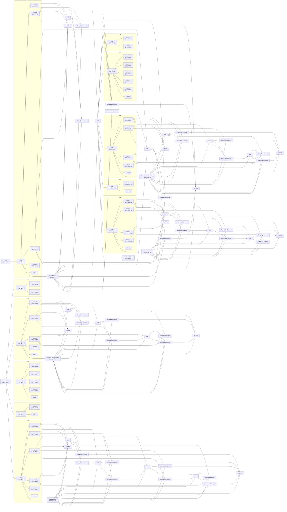

```mermaid
flowchart LR
  subgraph path2 [Path]
    2["Path<br>[43, 86, 0]"]
      %% [ProgramBodyItem { index: 1 }, VariableDeclarationDeclaration, VariableDeclarationInit, PipeBodyItem { index: 0 }]
    3["Segment<br>[92, 130, 0]"]
      %% [ProgramBodyItem { index: 1 }, VariableDeclarationDeclaration, VariableDeclarationInit, PipeBodyItem { index: 1 }]
    4["Segment<br>[136, 175, 0]"]
      %% [ProgramBodyItem { index: 1 }, VariableDeclarationDeclaration, VariableDeclarationInit, PipeBodyItem { index: 2 }]
    5["Segment<br>[181, 237, 0]"]
      %% [ProgramBodyItem { index: 1 }, VariableDeclarationDeclaration, VariableDeclarationInit, PipeBodyItem { index: 3 }]
    6["Segment<br>[243, 250, 0]"]
      %% [ProgramBodyItem { index: 1 }, VariableDeclarationDeclaration, VariableDeclarationInit, PipeBodyItem { index: 4 }]
    7[Solid2d]
  end
  subgraph path20 [Path]
    20["Path<br>[362, 405, 0]"]
      %% [ProgramBodyItem { index: 4 }, VariableDeclarationDeclaration, VariableDeclarationInit, PipeBodyItem { index: 0 }]
    21["Segment<br>[411, 435, 0]"]
      %% [ProgramBodyItem { index: 4 }, VariableDeclarationDeclaration, VariableDeclarationInit, PipeBodyItem { index: 1 }]
    22["Segment<br>[441, 466, 0]"]
      %% [ProgramBodyItem { index: 4 }, VariableDeclarationDeclaration, VariableDeclarationInit, PipeBodyItem { index: 2 }]
  end
  subgraph path23 [Path]
    23["Path<br>[480, 522, 0]"]
      %% [ProgramBodyItem { index: 5 }, VariableDeclarationDeclaration, VariableDeclarationInit, PipeBodyItem { index: 0 }]
    24["Segment<br>[528, 593, 0]"]
      %% [ProgramBodyItem { index: 5 }, VariableDeclarationDeclaration, VariableDeclarationInit, PipeBodyItem { index: 1 }]
    25["Segment<br>[599, 667, 0]"]
      %% [ProgramBodyItem { index: 5 }, VariableDeclarationDeclaration, VariableDeclarationInit, PipeBodyItem { index: 2 }]
    26["Segment<br>[673, 761, 0]"]
      %% [ProgramBodyItem { index: 5 }, VariableDeclarationDeclaration, VariableDeclarationInit, PipeBodyItem { index: 3 }]
    27["Segment<br>[767, 823, 0]"]
      %% [ProgramBodyItem { index: 5 }, VariableDeclarationDeclaration, VariableDeclarationInit, PipeBodyItem { index: 4 }]
    28["Segment<br>[829, 836, 0]"]
      %% [ProgramBodyItem { index: 5 }, VariableDeclarationDeclaration, VariableDeclarationInit, PipeBodyItem { index: 5 }]
    29[Solid2d]
  end
  subgraph path30 [Path]
    30["Path<br>[850, 892, 0]"]
      %% [ProgramBodyItem { index: 6 }, VariableDeclarationDeclaration, VariableDeclarationInit, PipeBodyItem { index: 0 }]
    31["Segment<br>[898, 918, 0]"]
      %% [ProgramBodyItem { index: 6 }, VariableDeclarationDeclaration, VariableDeclarationInit, PipeBodyItem { index: 1 }]
    32["Segment<br>[924, 950, 0]"]
      %% [ProgramBodyItem { index: 6 }, VariableDeclarationDeclaration, VariableDeclarationInit, PipeBodyItem { index: 2 }]
    33["Segment<br>[956, 1012, 0]"]
      %% [ProgramBodyItem { index: 6 }, VariableDeclarationDeclaration, VariableDeclarationInit, PipeBodyItem { index: 3 }]
    34["Segment<br>[1018, 1025, 0]"]
      %% [ProgramBodyItem { index: 6 }, VariableDeclarationDeclaration, VariableDeclarationInit, PipeBodyItem { index: 4 }]
    35[Solid2d]
  end
  subgraph path36 [Path]
    36["Path<br>[1039, 1094, 0]"]
      %% [ProgramBodyItem { index: 7 }, VariableDeclarationDeclaration, VariableDeclarationInit]
    37["Segment<br>[1039, 1094, 0]"]
      %% [ProgramBodyItem { index: 7 }, VariableDeclarationDeclaration, VariableDeclarationInit]
    38[Solid2d]
  end
  subgraph path39 [Path]
    39["Path<br>[1108, 1150, 0]"]
      %% [ProgramBodyItem { index: 8 }, VariableDeclarationDeclaration, VariableDeclarationInit, PipeBodyItem { index: 0 }]
    40["Segment<br>[1156, 1180, 0]"]
      %% [ProgramBodyItem { index: 8 }, VariableDeclarationDeclaration, VariableDeclarationInit, PipeBodyItem { index: 1 }]
    41["Segment<br>[1186, 1211, 0]"]
      %% [ProgramBodyItem { index: 8 }, VariableDeclarationDeclaration, VariableDeclarationInit, PipeBodyItem { index: 2 }]
    42["Segment<br>[1217, 1273, 0]"]
      %% [ProgramBodyItem { index: 8 }, VariableDeclarationDeclaration, VariableDeclarationInit, PipeBodyItem { index: 3 }]
    43["Segment<br>[1279, 1286, 0]"]
      %% [ProgramBodyItem { index: 8 }, VariableDeclarationDeclaration, VariableDeclarationInit, PipeBodyItem { index: 4 }]
    44[Solid2d]
  end
  subgraph path70 [Path]
    70["Path<br>[1456, 1497, 0]"]
      %% [ProgramBodyItem { index: 12 }, VariableDeclarationDeclaration, VariableDeclarationInit, PipeBodyItem { index: 0 }]
    71["Segment<br>[1503, 1527, 0]"]
      %% [ProgramBodyItem { index: 12 }, VariableDeclarationDeclaration, VariableDeclarationInit, PipeBodyItem { index: 1 }]
    72["Segment<br>[1533, 1558, 0]"]
      %% [ProgramBodyItem { index: 12 }, VariableDeclarationDeclaration, VariableDeclarationInit, PipeBodyItem { index: 2 }]
  end
  subgraph path73 [Path]
    73["Path<br>[1572, 1614, 0]"]
      %% [ProgramBodyItem { index: 13 }, VariableDeclarationDeclaration, VariableDeclarationInit, PipeBodyItem { index: 0 }]
    74["Segment<br>[1620, 1644, 0]"]
      %% [ProgramBodyItem { index: 13 }, VariableDeclarationDeclaration, VariableDeclarationInit, PipeBodyItem { index: 1 }]
    75["Segment<br>[1650, 1675, 0]"]
      %% [ProgramBodyItem { index: 13 }, VariableDeclarationDeclaration, VariableDeclarationInit, PipeBodyItem { index: 2 }]
    76["Segment<br>[1681, 1737, 0]"]
      %% [ProgramBodyItem { index: 13 }, VariableDeclarationDeclaration, VariableDeclarationInit, PipeBodyItem { index: 3 }]
    77["Segment<br>[1743, 1750, 0]"]
      %% [ProgramBodyItem { index: 13 }, VariableDeclarationDeclaration, VariableDeclarationInit, PipeBodyItem { index: 4 }]
    78[Solid2d]
  end
  subgraph path79 [Path]
    79["Path<br>[1764, 1806, 0]"]
      %% [ProgramBodyItem { index: 14 }, VariableDeclarationDeclaration, VariableDeclarationInit, PipeBodyItem { index: 0 }]
    80["Segment<br>[1812, 1835, 0]"]
      %% [ProgramBodyItem { index: 14 }, VariableDeclarationDeclaration, VariableDeclarationInit, PipeBodyItem { index: 1 }]
    81["Segment<br>[1841, 1866, 0]"]
      %% [ProgramBodyItem { index: 14 }, VariableDeclarationDeclaration, VariableDeclarationInit, PipeBodyItem { index: 2 }]
    82["Segment<br>[1872, 1928, 0]"]
      %% [ProgramBodyItem { index: 14 }, VariableDeclarationDeclaration, VariableDeclarationInit, PipeBodyItem { index: 3 }]
    83["Segment<br>[1934, 1941, 0]"]
      %% [ProgramBodyItem { index: 14 }, VariableDeclarationDeclaration, VariableDeclarationInit, PipeBodyItem { index: 4 }]
    84[Solid2d]
  end
  subgraph path85 [Path]
    85["Path<br>[1955, 2011, 0]"]
      %% [ProgramBodyItem { index: 15 }, VariableDeclarationDeclaration, VariableDeclarationInit]
    86["Segment<br>[1955, 2011, 0]"]
      %% [ProgramBodyItem { index: 15 }, VariableDeclarationDeclaration, VariableDeclarationInit]
    87[Solid2d]
  end
  subgraph path88 [Path]
    88["Path<br>[2025, 2068, 0]"]
      %% [ProgramBodyItem { index: 16 }, VariableDeclarationDeclaration, VariableDeclarationInit, PipeBodyItem { index: 0 }]
    89["Segment<br>[2074, 2139, 0]"]
      %% [ProgramBodyItem { index: 16 }, VariableDeclarationDeclaration, VariableDeclarationInit, PipeBodyItem { index: 1 }]
    90["Segment<br>[2145, 2213, 0]"]
      %% [ProgramBodyItem { index: 16 }, VariableDeclarationDeclaration, VariableDeclarationInit, PipeBodyItem { index: 2 }]
    91["Segment<br>[2219, 2307, 0]"]
      %% [ProgramBodyItem { index: 16 }, VariableDeclarationDeclaration, VariableDeclarationInit, PipeBodyItem { index: 3 }]
    92["Segment<br>[2313, 2369, 0]"]
      %% [ProgramBodyItem { index: 16 }, VariableDeclarationDeclaration, VariableDeclarationInit, PipeBodyItem { index: 4 }]
    93["Segment<br>[2375, 2382, 0]"]
      %% [ProgramBodyItem { index: 16 }, VariableDeclarationDeclaration, VariableDeclarationInit, PipeBodyItem { index: 5 }]
    94[Solid2d]
  end
  1["Plane<br>[12, 29, 0]"]
    %% [ProgramBodyItem { index: 0 }, VariableDeclarationDeclaration, VariableDeclarationInit]
  8["Sweep Extrusion<br>[264, 296, 0]"]
    %% [ProgramBodyItem { index: 2 }, VariableDeclarationDeclaration, VariableDeclarationInit]
  9[Wall]
    %% face_code_ref=Missing NodePath
  10[Wall]
    %% face_code_ref=[ProgramBodyItem { index: 3 }, VariableDeclarationDeclaration, VariableDeclarationInit]
  11[Wall]
    %% face_code_ref=Missing NodePath
  12["Cap Start"]
    %% face_code_ref=Missing NodePath
  13["Cap End"]
    %% face_code_ref=Missing NodePath
  14["SweepEdge Opposite"]
  15["SweepEdge Adjacent"]
  16["SweepEdge Opposite"]
  17["SweepEdge Adjacent"]
  18["SweepEdge Opposite"]
  19["SweepEdge Adjacent"]
  45["Sweep RevolveAboutEdge<br>[1300, 1366, 0]"]
    %% [ProgramBodyItem { index: 9 }, VariableDeclarationDeclaration, VariableDeclarationInit]
  46[Wall]
    %% face_code_ref=Missing NodePath
  47[Wall]
    %% face_code_ref=Missing NodePath
  48[Wall]
    %% face_code_ref=Missing NodePath
  49["Cap Start"]
    %% face_code_ref=Missing NodePath
  50["Cap End"]
    %% face_code_ref=Missing NodePath
  51["SweepEdge Opposite"]
  52["SweepEdge Adjacent"]
  53["SweepEdge Opposite"]
  54["SweepEdge Adjacent"]
  55["SweepEdge Opposite"]
  56["SweepEdge Adjacent"]
  57["Sweep Extrusion<br>[1380, 1411, 0]"]
    %% [ProgramBodyItem { index: 10 }, VariableDeclarationDeclaration, VariableDeclarationInit]
  58[Wall]
    %% face_code_ref=Missing NodePath
  59[Wall]
    %% face_code_ref=Missing NodePath
  60[Wall]
    %% face_code_ref=Missing NodePath
  61["Cap Start"]
    %% face_code_ref=Missing NodePath
  62["Cap End"]
    %% face_code_ref=Missing NodePath
  63["SweepEdge Opposite"]
  64["SweepEdge Adjacent"]
  65["SweepEdge Opposite"]
  66["SweepEdge Adjacent"]
  67["SweepEdge Opposite"]
  68["SweepEdge Adjacent"]
  69["Plane<br>[1424, 1442, 0]"]
    %% [ProgramBodyItem { index: 11 }, VariableDeclarationDeclaration, VariableDeclarationInit]
  95["Sweep Extrusion<br>[2396, 2429, 0]"]
    %% [ProgramBodyItem { index: 17 }, VariableDeclarationDeclaration, VariableDeclarationInit]
  96[Wall]
    %% face_code_ref=Missing NodePath
  97[Wall]
    %% face_code_ref=Missing NodePath
  98[Wall]
    %% face_code_ref=Missing NodePath
  99[Wall]
    %% face_code_ref=Missing NodePath
  100["Cap Start"]
    %% face_code_ref=Missing NodePath
  101["Cap End"]
    %% face_code_ref=Missing NodePath
  102["SweepEdge Opposite"]
  103["SweepEdge Adjacent"]
  104["SweepEdge Opposite"]
  105["SweepEdge Adjacent"]
  106["SweepEdge Opposite"]
  107["SweepEdge Adjacent"]
  108["SweepEdge Opposite"]
  109["SweepEdge Adjacent"]
  110["Sweep RevolveAboutEdge<br>[2443, 2488, 0]"]
    %% [ProgramBodyItem { index: 18 }, VariableDeclarationDeclaration, VariableDeclarationInit]
  111[Wall]
    %% face_code_ref=Missing NodePath
  112[Wall]
    %% face_code_ref=Missing NodePath
  113[Wall]
    %% face_code_ref=Missing NodePath
  114["Cap Start"]
    %% face_code_ref=Missing NodePath
  115["Cap End"]
    %% face_code_ref=Missing NodePath
  116["SweepEdge Opposite"]
  117["SweepEdge Adjacent"]
  118["SweepEdge Opposite"]
  119["SweepEdge Adjacent"]
  120["SweepEdge Opposite"]
  121["SweepEdge Adjacent"]
  122["StartSketchOnFace<br>[309, 348, 0]"]
    %% [ProgramBodyItem { index: 3 }, VariableDeclarationDeclaration, VariableDeclarationInit]
  1 --- 2
  2 --- 3
  2 --- 4
  2 --- 5
  2 --- 6
  2 --- 7
  2 ---- 8
  3 --- 11
  3 x--> 12
  3 --- 18
  3 --- 19
  4 --- 10
  4 x--> 12
  4 --- 16
  4 --- 17
  5 --- 9
  5 x--> 12
  5 --- 14
  5 --- 15
  8 --- 9
  8 --- 10
  8 --- 11
  8 --- 12
  8 --- 13
  8 --- 14
  8 --- 15
  8 --- 16
  8 --- 17
  8 --- 18
  8 --- 19
  9 --- 14
  9 --- 15
  17 <--x 9
  10 --- 16
  10 --- 17
  19 <--x 10
  10 --- 20
  10 --- 23
  10 --- 30
  10 --- 36
  10 --- 39
  10 <--x 122
  15 <--x 11
  11 --- 18
  11 --- 19
  14 <--x 13
  16 <--x 13
  18 <--x 13
  20 --- 21
  20 --- 22
  23 --- 24
  23 --- 25
  23 --- 26
  23 --- 27
  23 --- 28
  23 --- 29
  30 --- 31
  30 --- 32
  30 --- 33
  30 --- 34
  30 --- 35
  30 ---- 45
  31 --- 46
  31 x--> 49
  31 --- 51
  31 --- 52
  32 --- 47
  32 x--> 49
  32 --- 53
  32 --- 54
  33 --- 48
  33 x--> 49
  33 --- 55
  33 --- 56
  36 --- 37
  36 --- 38
  39 --- 40
  39 --- 41
  39 --- 42
  39 --- 43
  39 --- 44
  39 ---- 57
  40 --- 60
  40 x--> 61
  40 --- 67
  40 --- 68
  41 --- 59
  41 x--> 61
  41 --- 65
  41 --- 66
  42 --- 58
  42 x--> 61
  42 --- 63
  42 --- 64
  45 --- 46
  45 --- 47
  45 --- 48
  45 --- 49
  45 --- 50
  45 --- 51
  45 --- 52
  45 --- 53
  45 --- 54
  45 --- 55
  45 --- 56
  46 --- 51
  46 --- 52
  56 <--x 46
  52 <--x 47
  47 --- 53
  47 --- 54
  54 <--x 48
  48 --- 55
  48 --- 56
  51 <--x 50
  53 <--x 50
  55 <--x 50
  57 --- 58
  57 --- 59
  57 --- 60
  57 --- 61
  57 --- 62
  57 --- 63
  57 --- 64
  57 --- 65
  57 --- 66
  57 --- 67
  57 --- 68
  58 --- 63
  58 --- 64
  66 <--x 58
  59 --- 65
  59 --- 66
  68 <--x 59
  64 <--x 60
  60 --- 67
  60 --- 68
  63 <--x 62
  65 <--x 62
  67 <--x 62
  69 --- 70
  69 --- 73
  69 --- 79
  69 --- 85
  69 --- 88
  70 --- 71
  70 --- 72
  73 --- 74
  73 --- 75
  73 --- 76
  73 --- 77
  73 --- 78
  73 ---- 110
  74 --- 111
  74 x--> 114
  74 --- 116
  74 --- 117
  75 --- 112
  75 x--> 114
  75 --- 118
  75 --- 119
  76 --- 113
  76 x--> 114
  76 --- 120
  76 --- 121
  79 --- 80
  79 --- 81
  79 --- 82
  79 --- 83
  79 --- 84
  85 --- 86
  85 --- 87
  88 --- 89
  88 --- 90
  88 --- 91
  88 --- 92
  88 --- 93
  88 --- 94
  88 ---- 95
  89 --- 99
  89 x--> 100
  89 --- 108
  89 --- 109
  90 --- 98
  90 x--> 100
  90 --- 106
  90 --- 107
  91 --- 97
  91 x--> 100
  91 --- 104
  91 --- 105
  92 --- 96
  92 x--> 100
  92 --- 102
  92 --- 103
  95 --- 96
  95 --- 97
  95 --- 98
  95 --- 99
  95 --- 100
  95 --- 101
  95 --- 102
  95 --- 103
  95 --- 104
  95 --- 105
  95 --- 106
  95 --- 107
  95 --- 108
  95 --- 109
  96 --- 102
  96 --- 103
  105 <--x 96
  97 --- 104
  97 --- 105
  107 <--x 97
  98 --- 106
  98 --- 107
  109 <--x 98
  103 <--x 99
  99 --- 108
  99 --- 109
  102 <--x 101
  104 <--x 101
  106 <--x 101
  108 <--x 101
  110 --- 111
  110 --- 112
  110 --- 113
  110 --- 114
  110 --- 115
  110 --- 116
  110 --- 117
  110 --- 118
  110 --- 119
  110 --- 120
  110 --- 121
  111 --- 116
  111 --- 117
  121 <--x 111
  117 <--x 112
  112 --- 118
  112 --- 119
  119 <--x 113
  113 --- 120
  113 --- 121
  116 <--x 115
  118 <--x 115
  120 <--x 115
```
