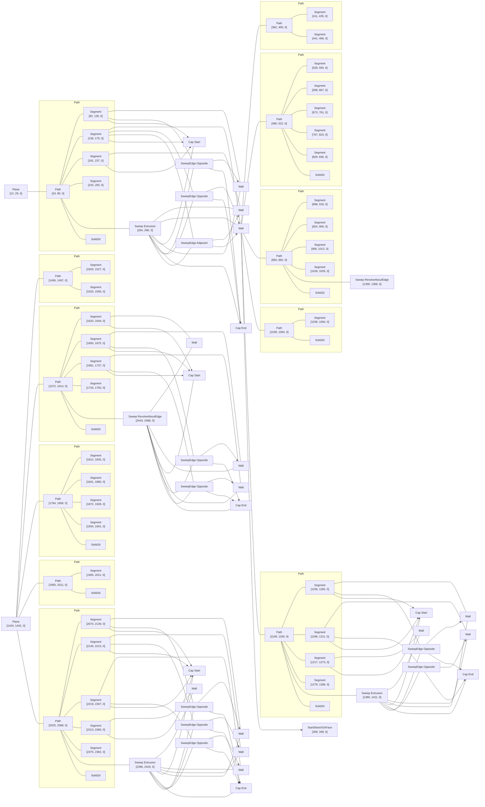

```mermaid
flowchart LR
  subgraph path2 [Path]
    2["Path<br>[43, 86, 0]"]
    3["Segment<br>[92, 130, 0]"]
    4["Segment<br>[136, 175, 0]"]
    5["Segment<br>[181, 237, 0]"]
    6["Segment<br>[243, 250, 0]"]
    7[Solid2d]
  end
  subgraph path16 [Path]
    16["Path<br>[362, 405, 0]"]
    17["Segment<br>[411, 435, 0]"]
    18["Segment<br>[441, 466, 0]"]
  end
  subgraph path19 [Path]
    19["Path<br>[480, 522, 0]"]
    20["Segment<br>[528, 593, 0]"]
    21["Segment<br>[599, 667, 0]"]
    22["Segment<br>[673, 761, 0]"]
    23["Segment<br>[767, 823, 0]"]
    24["Segment<br>[829, 836, 0]"]
    25[Solid2d]
  end
  subgraph path26 [Path]
    26["Path<br>[850, 892, 0]"]
    27["Segment<br>[898, 918, 0]"]
    28["Segment<br>[924, 950, 0]"]
    29["Segment<br>[956, 1012, 0]"]
    30["Segment<br>[1018, 1025, 0]"]
    31[Solid2d]
  end
  subgraph path32 [Path]
    32["Path<br>[1039, 1094, 0]"]
    33["Segment<br>[1039, 1094, 0]"]
    34[Solid2d]
  end
  subgraph path35 [Path]
    35["Path<br>[1108, 1150, 0]"]
    36["Segment<br>[1156, 1180, 0]"]
    37["Segment<br>[1186, 1211, 0]"]
    38["Segment<br>[1217, 1273, 0]"]
    39["Segment<br>[1279, 1286, 0]"]
    40[Solid2d]
  end
  subgraph path52 [Path]
    52["Path<br>[1456, 1497, 0]"]
    53["Segment<br>[1503, 1527, 0]"]
    54["Segment<br>[1533, 1558, 0]"]
  end
  subgraph path55 [Path]
    55["Path<br>[1572, 1614, 0]"]
    56["Segment<br>[1620, 1644, 0]"]
    57["Segment<br>[1650, 1675, 0]"]
    58["Segment<br>[1681, 1737, 0]"]
    59["Segment<br>[1743, 1750, 0]"]
    60[Solid2d]
  end
  subgraph path61 [Path]
    61["Path<br>[1764, 1806, 0]"]
    62["Segment<br>[1812, 1835, 0]"]
    63["Segment<br>[1841, 1866, 0]"]
    64["Segment<br>[1872, 1928, 0]"]
    65["Segment<br>[1934, 1941, 0]"]
    66[Solid2d]
  end
  subgraph path67 [Path]
    67["Path<br>[1955, 2011, 0]"]
    68["Segment<br>[1955, 2011, 0]"]
    69[Solid2d]
  end
  subgraph path70 [Path]
    70["Path<br>[2025, 2068, 0]"]
    71["Segment<br>[2074, 2139, 0]"]
    72["Segment<br>[2145, 2213, 0]"]
    73["Segment<br>[2219, 2307, 0]"]
    74["Segment<br>[2313, 2369, 0]"]
    75["Segment<br>[2375, 2382, 0]"]
    76[Solid2d]
  end
  1["Plane<br>[12, 29, 0]"]
  8["Sweep Extrusion<br>[264, 296, 0]"]
  9[Wall]
  10[Wall]
  11[Wall]
  12["Cap Start"]
  13["Cap End"]
  14["SweepEdge Opposite"]
  15["SweepEdge Opposite"]
  41["SweepEdge Adjacent"]
  42["Sweep RevolveAboutEdge<br>[1300, 1366, 0]"]
  43["Sweep Extrusion<br>[1380, 1411, 0]"]
  44[Wall]
  45[Wall]
  46[Wall]
  47["Cap Start"]
  48["Cap End"]
  49["SweepEdge Opposite"]
  50["SweepEdge Opposite"]
  51["Plane<br>[1424, 1442, 0]"]
  77["Sweep Extrusion<br>[2396, 2429, 0]"]
  78[Wall]
  79[Wall]
  80[Wall]
  81[Wall]
  82["Cap Start"]
  83["Cap End"]
  84["SweepEdge Opposite"]
  85["SweepEdge Opposite"]
  86["SweepEdge Opposite"]
  87["Sweep RevolveAboutEdge<br>[2443, 2488, 0]"]
  88[Wall]
  89[Wall]
  90[Wall]
  91["Cap Start"]
  92["Cap End"]
  93["SweepEdge Opposite"]
  94["SweepEdge Opposite"]
  95["StartSketchOnFace<br>[309, 348, 0]"]
  1 --- 2
  2 --- 3
  2 --- 4
  2 --- 5
  2 --- 6
  2 ---- 8
  2 --- 7
  3 --- 11
  3 --- 15
  3 x--> 12
  4 --- 10
  4 --- 14
  4 --- 41
  4 x--> 12
  5 --- 9
  5 x--> 12
  8 --- 9
  8 --- 10
  8 --- 11
  8 --- 12
  8 --- 13
  8 --- 14
  8 --- 15
  8 --- 41
  10 --- 16
  10 --- 19
  10 --- 26
  10 --- 32
  10 --- 35
  14 <--x 10
  14 <--x 13
  15 <--x 11
  15 <--x 13
  16 --- 17
  16 --- 18
  19 --- 20
  19 --- 21
  19 --- 22
  19 --- 23
  19 --- 24
  19 --- 25
  26 --- 27
  26 --- 28
  26 --- 29
  26 --- 30
  26 ---- 42
  26 --- 31
  32 --- 33
  32 --- 34
  35 --- 36
  35 --- 37
  35 --- 38
  35 --- 39
  35 ---- 43
  35 --- 40
  36 --- 46
  36 --- 50
  36 x--> 47
  37 --- 45
  37 --- 49
  37 x--> 47
  38 --- 44
  38 x--> 47
  41 <--x 9
  41 <--x 10
  43 --- 44
  43 --- 45
  43 --- 46
  43 --- 47
  43 --- 48
  43 --- 49
  43 --- 50
  49 <--x 45
  49 <--x 48
  50 <--x 46
  50 <--x 48
  51 --- 52
  51 --- 55
  51 --- 61
  51 --- 67
  51 --- 70
  52 --- 53
  52 --- 54
  55 --- 56
  55 --- 57
  55 --- 58
  55 --- 59
  55 ---- 87
  55 --- 60
  56 --- 88
  56 x--> 91
  57 --- 89
  57 --- 93
  57 x--> 91
  58 --- 90
  58 --- 94
  58 x--> 91
  61 --- 62
  61 --- 63
  61 --- 64
  61 --- 65
  61 --- 66
  67 --- 68
  67 --- 69
  70 --- 71
  70 --- 72
  70 --- 73
  70 --- 74
  70 --- 75
  70 ---- 77
  70 --- 76
  71 --- 81
  71 --- 86
  71 x--> 82
  72 --- 80
  72 --- 85
  72 x--> 82
  73 --- 79
  73 --- 84
  73 x--> 82
  74 --- 78
  74 x--> 82
  77 --- 78
  77 --- 79
  77 --- 80
  77 --- 81
  77 --- 82
  77 --- 83
  77 --- 84
  77 --- 85
  77 --- 86
  84 <--x 79
  84 <--x 83
  85 <--x 80
  85 <--x 83
  86 <--x 81
  86 <--x 83
  87 --- 88
  87 --- 89
  87 --- 90
  87 --- 91
  87 --- 92
  87 --- 93
  87 --- 94
  93 <--x 89
  93 <--x 92
  94 <--x 90
  94 <--x 92
  10 <--x 95
```
