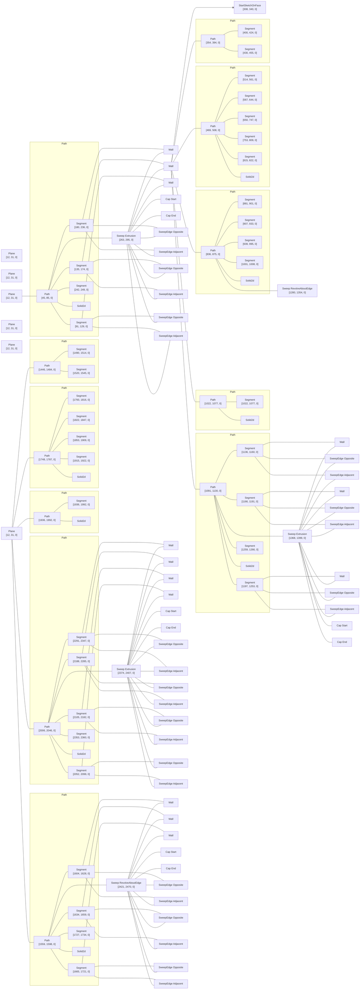

```mermaid
flowchart LR
  subgraph path7 [Path]
    7["Path<br>[45, 85, 0]"]
    8["Segment<br>[91, 129, 0]"]
    9["Segment<br>[135, 174, 0]"]
    10["Segment<br>[180, 236, 0]"]
    11["Segment<br>[242, 249, 0]"]
    12[Solid2d]
  end
  subgraph path25 [Path]
    25["Path<br>[354, 394, 0]"]
    26["Segment<br>[400, 424, 0]"]
    27["Segment<br>[430, 455, 0]"]
  end
  subgraph path28 [Path]
    28["Path<br>[469, 508, 0]"]
    29["Segment<br>[514, 561, 0]"]
    30["Segment<br>[567, 644, 0]"]
    31["Segment<br>[650, 747, 0]"]
    32["Segment<br>[753, 809, 0]"]
    33["Segment<br>[815, 822, 0]"]
    34[Solid2d]
  end
  subgraph path35 [Path]
    35["Path<br>[836, 875, 0]"]
    36["Segment<br>[881, 901, 0]"]
    37["Segment<br>[907, 933, 0]"]
    38["Segment<br>[939, 995, 0]"]
    39["Segment<br>[1001, 1008, 0]"]
    40[Solid2d]
  end
  subgraph path41 [Path]
    41["Path<br>[1022, 1077, 0]"]
    42["Segment<br>[1022, 1077, 0]"]
    43[Solid2d]
  end
  subgraph path44 [Path]
    44["Path<br>[1091, 1130, 0]"]
    45["Segment<br>[1136, 1160, 0]"]
    46["Segment<br>[1166, 1191, 0]"]
    47["Segment<br>[1197, 1253, 0]"]
    48["Segment<br>[1259, 1266, 0]"]
    49[Solid2d]
  end
  subgraph path63 [Path]
    63["Path<br>[1446, 1484, 0]"]
    64["Segment<br>[1490, 1514, 0]"]
    65["Segment<br>[1520, 1545, 0]"]
  end
  subgraph path66 [Path]
    66["Path<br>[1559, 1598, 0]"]
    67["Segment<br>[1604, 1628, 0]"]
    68["Segment<br>[1634, 1659, 0]"]
    69["Segment<br>[1665, 1721, 0]"]
    70["Segment<br>[1727, 1734, 0]"]
    71[Solid2d]
  end
  subgraph path72 [Path]
    72["Path<br>[1748, 1787, 0]"]
    73["Segment<br>[1793, 1816, 0]"]
    74["Segment<br>[1822, 1847, 0]"]
    75["Segment<br>[1853, 1909, 0]"]
    76["Segment<br>[1915, 1922, 0]"]
    77[Solid2d]
  end
  subgraph path78 [Path]
    78["Path<br>[1936, 1992, 0]"]
    79["Segment<br>[1936, 1992, 0]"]
    80[Solid2d]
  end
  subgraph path81 [Path]
    81["Path<br>[2006, 2046, 0]"]
    82["Segment<br>[2052, 2099, 0]"]
    83["Segment<br>[2105, 2182, 0]"]
    84["Segment<br>[2188, 2285, 0]"]
    85["Segment<br>[2291, 2347, 0]"]
    86["Segment<br>[2353, 2360, 0]"]
    87[Solid2d]
  end
  1["Plane<br>[12, 31, 0]"]
  2["Plane<br>[12, 31, 0]"]
  3["Plane<br>[12, 31, 0]"]
  4["Plane<br>[12, 31, 0]"]
  5["Plane<br>[12, 31, 0]"]
  6["Plane<br>[12, 31, 0]"]
  13["Sweep Extrusion<br>[263, 295, 0]"]
  14[Wall]
  15[Wall]
  16[Wall]
  17["Cap Start"]
  18["Cap End"]
  19["SweepEdge Opposite"]
  20["SweepEdge Adjacent"]
  21["SweepEdge Opposite"]
  22["SweepEdge Adjacent"]
  23["SweepEdge Opposite"]
  24["SweepEdge Adjacent"]
  50["Sweep RevolveAboutEdge<br>[1280, 1354, 0]"]
  51["Sweep Extrusion<br>[1368, 1399, 0]"]
  52[Wall]
  53[Wall]
  54[Wall]
  55["Cap Start"]
  56["Cap End"]
  57["SweepEdge Opposite"]
  58["SweepEdge Adjacent"]
  59["SweepEdge Opposite"]
  60["SweepEdge Adjacent"]
  61["SweepEdge Opposite"]
  62["SweepEdge Adjacent"]
  88["Sweep Extrusion<br>[2374, 2407, 0]"]
  89[Wall]
  90[Wall]
  91[Wall]
  92[Wall]
  93["Cap Start"]
  94["Cap End"]
  95["SweepEdge Opposite"]
  96["SweepEdge Adjacent"]
  97["SweepEdge Opposite"]
  98["SweepEdge Adjacent"]
  99["SweepEdge Opposite"]
  100["SweepEdge Adjacent"]
  101["SweepEdge Opposite"]
  102["SweepEdge Adjacent"]
  103["Sweep RevolveAboutEdge<br>[2421, 2470, 0]"]
  104[Wall]
  105[Wall]
  106[Wall]
  107["Cap Start"]
  108["Cap End"]
  109["SweepEdge Opposite"]
  110["SweepEdge Adjacent"]
  111["SweepEdge Opposite"]
  112["SweepEdge Adjacent"]
  113["SweepEdge Opposite"]
  114["SweepEdge Adjacent"]
  115["StartSketchOnFace<br>[308, 340, 0]"]
  3 --- 7
  6 --- 63
  6 --- 66
  6 --- 72
  6 --- 78
  6 --- 81
  7 --- 8
  7 --- 9
  7 --- 10
  7 --- 11
  7 ---- 13
  7 --- 12
  8 --- 16
  8 --- 23
  8 --- 24
  9 --- 15
  9 --- 21
  9 --- 22
  10 --- 14
  10 --- 19
  10 --- 20
  13 --- 14
  13 --- 15
  13 --- 16
  13 --- 17
  13 --- 18
  13 --- 19
  13 --- 20
  13 --- 21
  13 --- 22
  13 --- 23
  13 --- 24
  15 --- 25
  15 --- 28
  15 --- 35
  15 --- 41
  15 --- 44
  25 --- 26
  25 --- 27
  28 --- 29
  28 --- 30
  28 --- 31
  28 --- 32
  28 --- 33
  28 --- 34
  35 --- 36
  35 --- 37
  35 --- 38
  35 --- 39
  35 ---- 50
  35 --- 40
  41 --- 42
  41 --- 43
  44 --- 45
  44 --- 46
  44 --- 47
  44 --- 48
  44 ---- 51
  44 --- 49
  45 --- 54
  45 --- 61
  45 --- 62
  46 --- 53
  46 --- 59
  46 --- 60
  47 --- 52
  47 --- 57
  47 --- 58
  51 --- 52
  51 --- 53
  51 --- 54
  51 --- 55
  51 --- 56
  51 --- 57
  51 --- 58
  51 --- 59
  51 --- 60
  51 --- 61
  51 --- 62
  63 --- 64
  63 --- 65
  66 --- 67
  66 --- 68
  66 --- 69
  66 --- 70
  66 ---- 103
  66 --- 71
  67 --- 104
  67 --- 109
  67 --- 110
  68 --- 105
  68 --- 111
  68 --- 112
  69 --- 106
  69 --- 113
  69 --- 114
  72 --- 73
  72 --- 74
  72 --- 75
  72 --- 76
  72 --- 77
  78 --- 79
  78 --- 80
  81 --- 82
  81 --- 83
  81 --- 84
  81 --- 85
  81 --- 86
  81 ---- 88
  81 --- 87
  82 --- 92
  82 --- 101
  82 --- 102
  83 --- 91
  83 --- 99
  83 --- 100
  84 --- 90
  84 --- 97
  84 --- 98
  85 --- 89
  85 --- 95
  85 --- 96
  88 --- 89
  88 --- 90
  88 --- 91
  88 --- 92
  88 --- 93
  88 --- 94
  88 --- 95
  88 --- 96
  88 --- 97
  88 --- 98
  88 --- 99
  88 --- 100
  88 --- 101
  88 --- 102
  103 --- 104
  103 --- 105
  103 --- 106
  103 --- 107
  103 --- 108
  103 --- 109
  103 --- 110
  103 --- 111
  103 --- 112
  103 --- 113
  103 --- 114
  15 <--x 115
```
