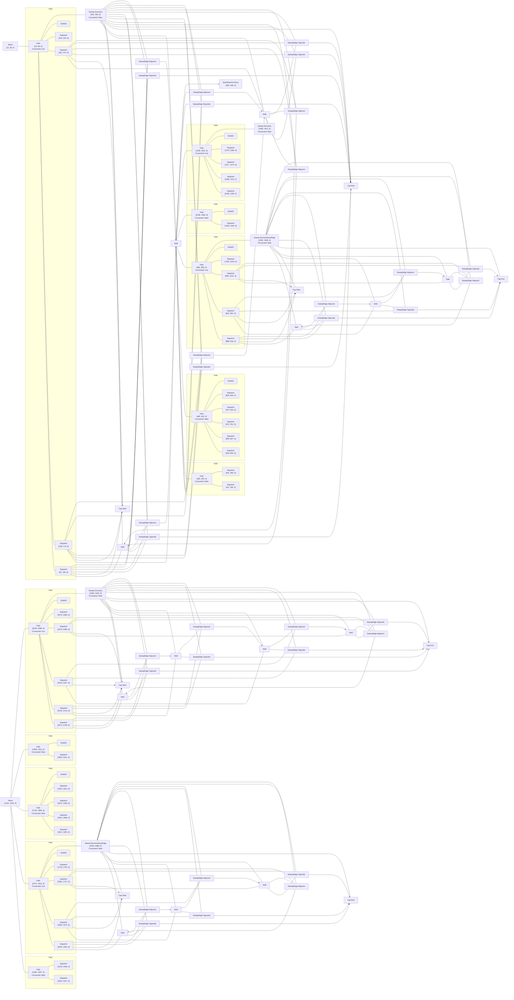

```mermaid
flowchart LR
  subgraph path2 [Path]
    2["Path<br>[43, 86, 0]<br>Consumed: true"]
      %% [ProgramBodyItem { index: 1 }, VariableDeclarationDeclaration, VariableDeclarationInit, PipeBodyItem { index: 0 }]
    3["Segment<br>[92, 130, 0]"]
      %% [ProgramBodyItem { index: 1 }, VariableDeclarationDeclaration, VariableDeclarationInit, PipeBodyItem { index: 1 }]
    4["Segment<br>[136, 175, 0]"]
      %% [ProgramBodyItem { index: 1 }, VariableDeclarationDeclaration, VariableDeclarationInit, PipeBodyItem { index: 2 }]
    5["Segment<br>[181, 237, 0]"]
      %% [ProgramBodyItem { index: 1 }, VariableDeclarationDeclaration, VariableDeclarationInit, PipeBodyItem { index: 3 }]
    6["Segment<br>[243, 250, 0]"]
      %% [ProgramBodyItem { index: 1 }, VariableDeclarationDeclaration, VariableDeclarationInit, PipeBodyItem { index: 4 }]
    7[Solid2d]
  end
  subgraph path20 [Path]
    20["Path<br>[362, 405, 0]<br>Consumed: false"]
      %% [ProgramBodyItem { index: 4 }, VariableDeclarationDeclaration, VariableDeclarationInit, PipeBodyItem { index: 0 }]
    21["Segment<br>[411, 435, 0]"]
      %% [ProgramBodyItem { index: 4 }, VariableDeclarationDeclaration, VariableDeclarationInit, PipeBodyItem { index: 1 }]
    22["Segment<br>[441, 466, 0]"]
      %% [ProgramBodyItem { index: 4 }, VariableDeclarationDeclaration, VariableDeclarationInit, PipeBodyItem { index: 2 }]
  end
  subgraph path23 [Path]
    23["Path<br>[480, 522, 0]<br>Consumed: false"]
      %% [ProgramBodyItem { index: 5 }, VariableDeclarationDeclaration, VariableDeclarationInit, PipeBodyItem { index: 0 }]
    24["Segment<br>[528, 593, 0]"]
      %% [ProgramBodyItem { index: 5 }, VariableDeclarationDeclaration, VariableDeclarationInit, PipeBodyItem { index: 1 }]
    25["Segment<br>[599, 667, 0]"]
      %% [ProgramBodyItem { index: 5 }, VariableDeclarationDeclaration, VariableDeclarationInit, PipeBodyItem { index: 2 }]
    26["Segment<br>[673, 761, 0]"]
      %% [ProgramBodyItem { index: 5 }, VariableDeclarationDeclaration, VariableDeclarationInit, PipeBodyItem { index: 3 }]
    27["Segment<br>[767, 823, 0]"]
      %% [ProgramBodyItem { index: 5 }, VariableDeclarationDeclaration, VariableDeclarationInit, PipeBodyItem { index: 4 }]
    28["Segment<br>[829, 836, 0]"]
      %% [ProgramBodyItem { index: 5 }, VariableDeclarationDeclaration, VariableDeclarationInit, PipeBodyItem { index: 5 }]
    29[Solid2d]
  end
  subgraph path30 [Path]
    30["Path<br>[850, 892, 0]<br>Consumed: true"]
      %% [ProgramBodyItem { index: 6 }, VariableDeclarationDeclaration, VariableDeclarationInit, PipeBodyItem { index: 0 }]
    31["Segment<br>[898, 918, 0]"]
      %% [ProgramBodyItem { index: 6 }, VariableDeclarationDeclaration, VariableDeclarationInit, PipeBodyItem { index: 1 }]
    32["Segment<br>[924, 950, 0]"]
      %% [ProgramBodyItem { index: 6 }, VariableDeclarationDeclaration, VariableDeclarationInit, PipeBodyItem { index: 2 }]
    33["Segment<br>[956, 1012, 0]"]
      %% [ProgramBodyItem { index: 6 }, VariableDeclarationDeclaration, VariableDeclarationInit, PipeBodyItem { index: 3 }]
    34["Segment<br>[1018, 1025, 0]"]
      %% [ProgramBodyItem { index: 6 }, VariableDeclarationDeclaration, VariableDeclarationInit, PipeBodyItem { index: 4 }]
    35[Solid2d]
  end
  subgraph path36 [Path]
    36["Path<br>[1039, 1094, 0]<br>Consumed: false"]
      %% [ProgramBodyItem { index: 7 }, VariableDeclarationDeclaration, VariableDeclarationInit]
    37["Segment<br>[1039, 1094, 0]"]
      %% [ProgramBodyItem { index: 7 }, VariableDeclarationDeclaration, VariableDeclarationInit]
    38[Solid2d]
  end
  subgraph path39 [Path]
    39["Path<br>[1108, 1150, 0]<br>Consumed: true"]
      %% [ProgramBodyItem { index: 8 }, VariableDeclarationDeclaration, VariableDeclarationInit, PipeBodyItem { index: 0 }]
    40["Segment<br>[1156, 1180, 0]"]
      %% [ProgramBodyItem { index: 8 }, VariableDeclarationDeclaration, VariableDeclarationInit, PipeBodyItem { index: 1 }]
    41["Segment<br>[1186, 1211, 0]"]
      %% [ProgramBodyItem { index: 8 }, VariableDeclarationDeclaration, VariableDeclarationInit, PipeBodyItem { index: 2 }]
    42["Segment<br>[1217, 1273, 0]"]
      %% [ProgramBodyItem { index: 8 }, VariableDeclarationDeclaration, VariableDeclarationInit, PipeBodyItem { index: 3 }]
    43["Segment<br>[1279, 1286, 0]"]
      %% [ProgramBodyItem { index: 8 }, VariableDeclarationDeclaration, VariableDeclarationInit, PipeBodyItem { index: 4 }]
    44[Solid2d]
  end
  subgraph path65 [Path]
    65["Path<br>[1456, 1497, 0]<br>Consumed: false"]
      %% [ProgramBodyItem { index: 12 }, VariableDeclarationDeclaration, VariableDeclarationInit, PipeBodyItem { index: 0 }]
    66["Segment<br>[1503, 1527, 0]"]
      %% [ProgramBodyItem { index: 12 }, VariableDeclarationDeclaration, VariableDeclarationInit, PipeBodyItem { index: 1 }]
    67["Segment<br>[1533, 1558, 0]"]
      %% [ProgramBodyItem { index: 12 }, VariableDeclarationDeclaration, VariableDeclarationInit, PipeBodyItem { index: 2 }]
  end
  subgraph path68 [Path]
    68["Path<br>[1572, 1614, 0]<br>Consumed: true"]
      %% [ProgramBodyItem { index: 13 }, VariableDeclarationDeclaration, VariableDeclarationInit, PipeBodyItem { index: 0 }]
    69["Segment<br>[1620, 1644, 0]"]
      %% [ProgramBodyItem { index: 13 }, VariableDeclarationDeclaration, VariableDeclarationInit, PipeBodyItem { index: 1 }]
    70["Segment<br>[1650, 1675, 0]"]
      %% [ProgramBodyItem { index: 13 }, VariableDeclarationDeclaration, VariableDeclarationInit, PipeBodyItem { index: 2 }]
    71["Segment<br>[1681, 1737, 0]"]
      %% [ProgramBodyItem { index: 13 }, VariableDeclarationDeclaration, VariableDeclarationInit, PipeBodyItem { index: 3 }]
    72["Segment<br>[1743, 1750, 0]"]
      %% [ProgramBodyItem { index: 13 }, VariableDeclarationDeclaration, VariableDeclarationInit, PipeBodyItem { index: 4 }]
    73[Solid2d]
  end
  subgraph path74 [Path]
    74["Path<br>[1764, 1806, 0]<br>Consumed: false"]
      %% [ProgramBodyItem { index: 14 }, VariableDeclarationDeclaration, VariableDeclarationInit, PipeBodyItem { index: 0 }]
    75["Segment<br>[1812, 1835, 0]"]
      %% [ProgramBodyItem { index: 14 }, VariableDeclarationDeclaration, VariableDeclarationInit, PipeBodyItem { index: 1 }]
    76["Segment<br>[1841, 1866, 0]"]
      %% [ProgramBodyItem { index: 14 }, VariableDeclarationDeclaration, VariableDeclarationInit, PipeBodyItem { index: 2 }]
    77["Segment<br>[1872, 1928, 0]"]
      %% [ProgramBodyItem { index: 14 }, VariableDeclarationDeclaration, VariableDeclarationInit, PipeBodyItem { index: 3 }]
    78["Segment<br>[1934, 1941, 0]"]
      %% [ProgramBodyItem { index: 14 }, VariableDeclarationDeclaration, VariableDeclarationInit, PipeBodyItem { index: 4 }]
    79[Solid2d]
  end
  subgraph path80 [Path]
    80["Path<br>[1955, 2011, 0]<br>Consumed: false"]
      %% [ProgramBodyItem { index: 15 }, VariableDeclarationDeclaration, VariableDeclarationInit]
    81["Segment<br>[1955, 2011, 0]"]
      %% [ProgramBodyItem { index: 15 }, VariableDeclarationDeclaration, VariableDeclarationInit]
    82[Solid2d]
  end
  subgraph path83 [Path]
    83["Path<br>[2025, 2068, 0]<br>Consumed: true"]
      %% [ProgramBodyItem { index: 16 }, VariableDeclarationDeclaration, VariableDeclarationInit, PipeBodyItem { index: 0 }]
    84["Segment<br>[2074, 2139, 0]"]
      %% [ProgramBodyItem { index: 16 }, VariableDeclarationDeclaration, VariableDeclarationInit, PipeBodyItem { index: 1 }]
    85["Segment<br>[2145, 2213, 0]"]
      %% [ProgramBodyItem { index: 16 }, VariableDeclarationDeclaration, VariableDeclarationInit, PipeBodyItem { index: 2 }]
    86["Segment<br>[2219, 2307, 0]"]
      %% [ProgramBodyItem { index: 16 }, VariableDeclarationDeclaration, VariableDeclarationInit, PipeBodyItem { index: 3 }]
    87["Segment<br>[2313, 2369, 0]"]
      %% [ProgramBodyItem { index: 16 }, VariableDeclarationDeclaration, VariableDeclarationInit, PipeBodyItem { index: 4 }]
    88["Segment<br>[2375, 2382, 0]"]
      %% [ProgramBodyItem { index: 16 }, VariableDeclarationDeclaration, VariableDeclarationInit, PipeBodyItem { index: 5 }]
    89[Solid2d]
  end
  1["Plane<br>[12, 29, 0]"]
    %% [ProgramBodyItem { index: 0 }, VariableDeclarationDeclaration, VariableDeclarationInit]
  8["Sweep Extrusion<br>[264, 296, 0]<br>Consumed: false"]
    %% [ProgramBodyItem { index: 2 }, VariableDeclarationDeclaration, VariableDeclarationInit]
  9[Wall]
    %% face_code_ref=Missing NodePath
  10[Wall]
    %% face_code_ref=[ProgramBodyItem { index: 3 }, VariableDeclarationDeclaration, VariableDeclarationInit]
  11[Wall]
    %% face_code_ref=Missing NodePath
  12["Cap Start"]
    %% face_code_ref=Missing NodePath
  13["Cap End"]
    %% face_code_ref=Missing NodePath
  14["SweepEdge Opposite"]
  15["SweepEdge Adjacent"]
  16["SweepEdge Opposite"]
  17["SweepEdge Adjacent"]
  18["SweepEdge Opposite"]
  19["SweepEdge Adjacent"]
  45["Sweep RevolveAboutEdge<br>[1300, 1366, 0]<br>Consumed: false"]
    %% [ProgramBodyItem { index: 9 }, VariableDeclarationDeclaration, VariableDeclarationInit]
  46[Wall]
    %% face_code_ref=Missing NodePath
  47[Wall]
    %% face_code_ref=Missing NodePath
  48[Wall]
    %% face_code_ref=Missing NodePath
  49["Cap Start"]
    %% face_code_ref=Missing NodePath
  50["Cap End"]
    %% face_code_ref=Missing NodePath
  51["SweepEdge Opposite"]
  52["SweepEdge Adjacent"]
  53["SweepEdge Opposite"]
  54["SweepEdge Adjacent"]
  55["SweepEdge Opposite"]
  56["SweepEdge Adjacent"]
  57["Sweep Extrusion<br>[1380, 1411, 0]<br>Consumed: false"]
    %% [ProgramBodyItem { index: 10 }, VariableDeclarationDeclaration, VariableDeclarationInit]
  58["SweepEdge Opposite"]
  59["SweepEdge Adjacent"]
  60["SweepEdge Opposite"]
  61["SweepEdge Adjacent"]
  62["SweepEdge Opposite"]
  63["SweepEdge Adjacent"]
  64["Plane<br>[1424, 1442, 0]"]
    %% [ProgramBodyItem { index: 11 }, VariableDeclarationDeclaration, VariableDeclarationInit]
  90["Sweep Extrusion<br>[2396, 2429, 0]<br>Consumed: false"]
    %% [ProgramBodyItem { index: 17 }, VariableDeclarationDeclaration, VariableDeclarationInit]
  91[Wall]
    %% face_code_ref=Missing NodePath
  92[Wall]
    %% face_code_ref=Missing NodePath
  93[Wall]
    %% face_code_ref=Missing NodePath
  94[Wall]
    %% face_code_ref=Missing NodePath
  95["Cap Start"]
    %% face_code_ref=Missing NodePath
  96["Cap End"]
    %% face_code_ref=Missing NodePath
  97["SweepEdge Opposite"]
  98["SweepEdge Adjacent"]
  99["SweepEdge Opposite"]
  100["SweepEdge Adjacent"]
  101["SweepEdge Opposite"]
  102["SweepEdge Adjacent"]
  103["SweepEdge Opposite"]
  104["SweepEdge Adjacent"]
  105["Sweep RevolveAboutEdge<br>[2443, 2488, 0]<br>Consumed: false"]
    %% [ProgramBodyItem { index: 18 }, VariableDeclarationDeclaration, VariableDeclarationInit]
  106[Wall]
    %% face_code_ref=Missing NodePath
  107[Wall]
    %% face_code_ref=Missing NodePath
  108[Wall]
    %% face_code_ref=Missing NodePath
  109["Cap Start"]
    %% face_code_ref=Missing NodePath
  110["Cap End"]
    %% face_code_ref=Missing NodePath
  111["SweepEdge Opposite"]
  112["SweepEdge Adjacent"]
  113["SweepEdge Opposite"]
  114["SweepEdge Adjacent"]
  115["SweepEdge Opposite"]
  116["SweepEdge Adjacent"]
  117["StartSketchOnFace<br>[309, 348, 0]"]
    %% [ProgramBodyItem { index: 3 }, VariableDeclarationDeclaration, VariableDeclarationInit]
  1 --- 2
  2 --- 3
  2 --- 4
  2 --- 5
  2 --- 6
  2 --- 7
  2 ---- 8
  3 --- 11
  3 x--> 12
  3 --- 18
  3 --- 19
  3 --- 62
  3 --- 63
  4 --- 10
  4 x--> 12
  4 --- 16
  4 --- 17
  4 --- 60
  4 --- 61
  5 --- 9
  5 x--> 12
  5 --- 14
  5 --- 15
  5 --- 58
  5 --- 59
  8 --- 9
  8 --- 10
  8 --- 11
  8 --- 12
  8 --- 13
  8 --- 14
  8 --- 15
  8 --- 16
  8 --- 17
  8 --- 18
  8 --- 19
  8 --- 58
  8 --- 59
  8 --- 60
  8 --- 61
  8 --- 62
  8 --- 63
  9 --- 14
  9 --- 15
  17 <--x 9
  9 --- 58
  9 --- 59
  61 <--x 9
  10 --- 16
  10 --- 17
  19 <--x 10
  10 --- 20
  10 --- 23
  10 --- 30
  10 --- 36
  10 --- 39
  10 --- 60
  10 --- 61
  63 <--x 10
  10 <--x 117
  15 <--x 11
  11 --- 18
  11 --- 19
  59 <--x 11
  11 --- 62
  11 --- 63
  14 <--x 13
  16 <--x 13
  18 <--x 13
  58 <--x 13
  60 <--x 13
  62 <--x 13
  20 --- 21
  20 --- 22
  23 --- 24
  23 --- 25
  23 --- 26
  23 --- 27
  23 --- 28
  23 --- 29
  30 --- 31
  30 --- 32
  30 --- 33
  30 --- 34
  30 --- 35
  30 ---- 45
  31 --- 46
  31 x--> 49
  31 --- 51
  31 --- 52
  32 --- 47
  32 x--> 49
  32 --- 53
  32 --- 54
  33 --- 48
  33 x--> 49
  33 --- 55
  33 --- 56
  36 --- 37
  36 --- 38
  39 --- 40
  39 --- 41
  39 --- 42
  39 --- 43
  39 --- 44
  39 ---- 57
  45 --- 46
  45 --- 47
  45 --- 48
  45 --- 49
  45 --- 50
  45 --- 51
  45 --- 52
  45 --- 53
  45 --- 54
  45 --- 55
  45 --- 56
  46 --- 51
  46 --- 52
  56 <--x 46
  52 <--x 47
  47 --- 53
  47 --- 54
  54 <--x 48
  48 --- 55
  48 --- 56
  51 <--x 50
  53 <--x 50
  55 <--x 50
  64 --- 65
  64 --- 68
  64 --- 74
  64 --- 80
  64 --- 83
  65 --- 66
  65 --- 67
  68 --- 69
  68 --- 70
  68 --- 71
  68 --- 72
  68 --- 73
  68 ---- 105
  69 --- 106
  69 x--> 109
  69 --- 111
  69 --- 112
  70 --- 107
  70 x--> 109
  70 --- 113
  70 --- 114
  71 --- 108
  71 x--> 109
  71 --- 115
  71 --- 116
  74 --- 75
  74 --- 76
  74 --- 77
  74 --- 78
  74 --- 79
  80 --- 81
  80 --- 82
  83 --- 84
  83 --- 85
  83 --- 86
  83 --- 87
  83 --- 88
  83 --- 89
  83 ---- 90
  84 --- 94
  84 x--> 95
  84 --- 103
  84 --- 104
  85 --- 93
  85 x--> 95
  85 --- 101
  85 --- 102
  86 --- 92
  86 x--> 95
  86 --- 99
  86 --- 100
  87 --- 91
  87 x--> 95
  87 --- 97
  87 --- 98
  90 --- 91
  90 --- 92
  90 --- 93
  90 --- 94
  90 --- 95
  90 --- 96
  90 --- 97
  90 --- 98
  90 --- 99
  90 --- 100
  90 --- 101
  90 --- 102
  90 --- 103
  90 --- 104
  91 --- 97
  91 --- 98
  100 <--x 91
  92 --- 99
  92 --- 100
  102 <--x 92
  93 --- 101
  93 --- 102
  104 <--x 93
  98 <--x 94
  94 --- 103
  94 --- 104
  97 <--x 96
  99 <--x 96
  101 <--x 96
  103 <--x 96
  105 --- 106
  105 --- 107
  105 --- 108
  105 --- 109
  105 --- 110
  105 --- 111
  105 --- 112
  105 --- 113
  105 --- 114
  105 --- 115
  105 --- 116
  106 --- 111
  106 --- 112
  116 <--x 106
  112 <--x 107
  107 --- 113
  107 --- 114
  114 <--x 108
  108 --- 115
  108 --- 116
  111 <--x 110
  113 <--x 110
  115 <--x 110
```
