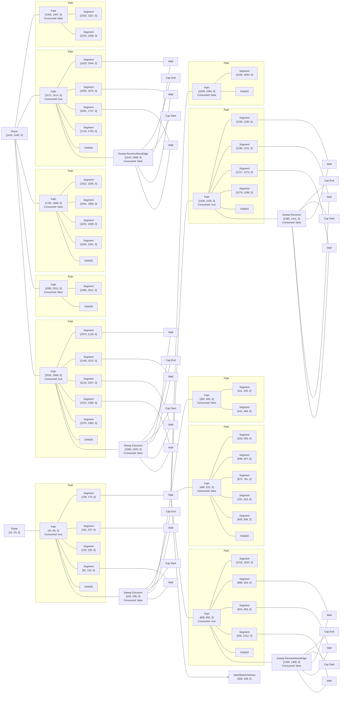

```mermaid
flowchart LR
  subgraph path11 [Path]
    11["Path<br>[1039, 1094, 0]<br>Consumed: false"]
      %% [ProgramBodyItem { index: 7 }, VariableDeclarationDeclaration, VariableDeclarationInit]
    25["Segment<br>[1039, 1094, 0]"]
      %% [ProgramBodyItem { index: 7 }, VariableDeclarationDeclaration, VariableDeclarationInit]
    60[Solid2d]
  end
  subgraph path12 [Path]
    12["Path<br>[1108, 1150, 0]<br>Consumed: true"]
      %% [ProgramBodyItem { index: 8 }, VariableDeclarationDeclaration, VariableDeclarationInit, PipeBodyItem { index: 0 }]
    26["Segment<br>[1156, 1180, 0]"]
      %% [ProgramBodyItem { index: 8 }, VariableDeclarationDeclaration, VariableDeclarationInit, PipeBodyItem { index: 1 }]
    27["Segment<br>[1186, 1211, 0]"]
      %% [ProgramBodyItem { index: 8 }, VariableDeclarationDeclaration, VariableDeclarationInit, PipeBodyItem { index: 2 }]
    28["Segment<br>[1217, 1273, 0]"]
      %% [ProgramBodyItem { index: 8 }, VariableDeclarationDeclaration, VariableDeclarationInit, PipeBodyItem { index: 3 }]
    29["Segment<br>[1279, 1286, 0]"]
      %% [ProgramBodyItem { index: 8 }, VariableDeclarationDeclaration, VariableDeclarationInit, PipeBodyItem { index: 4 }]
    61[Solid2d]
  end
  subgraph path13 [Path]
    13["Path<br>[1456, 1497, 0]<br>Consumed: false"]
      %% [ProgramBodyItem { index: 12 }, VariableDeclarationDeclaration, VariableDeclarationInit, PipeBodyItem { index: 0 }]
    31["Segment<br>[1503, 1527, 0]"]
      %% [ProgramBodyItem { index: 12 }, VariableDeclarationDeclaration, VariableDeclarationInit, PipeBodyItem { index: 1 }]
    32["Segment<br>[1533, 1558, 0]"]
      %% [ProgramBodyItem { index: 12 }, VariableDeclarationDeclaration, VariableDeclarationInit, PipeBodyItem { index: 2 }]
  end
  subgraph path14 [Path]
    14["Path<br>[1572, 1614, 0]<br>Consumed: true"]
      %% [ProgramBodyItem { index: 13 }, VariableDeclarationDeclaration, VariableDeclarationInit, PipeBodyItem { index: 0 }]
    33["Segment<br>[1620, 1644, 0]"]
      %% [ProgramBodyItem { index: 13 }, VariableDeclarationDeclaration, VariableDeclarationInit, PipeBodyItem { index: 1 }]
    34["Segment<br>[1650, 1675, 0]"]
      %% [ProgramBodyItem { index: 13 }, VariableDeclarationDeclaration, VariableDeclarationInit, PipeBodyItem { index: 2 }]
    35["Segment<br>[1681, 1737, 0]"]
      %% [ProgramBodyItem { index: 13 }, VariableDeclarationDeclaration, VariableDeclarationInit, PipeBodyItem { index: 3 }]
    36["Segment<br>[1743, 1750, 0]"]
      %% [ProgramBodyItem { index: 13 }, VariableDeclarationDeclaration, VariableDeclarationInit, PipeBodyItem { index: 4 }]
    62[Solid2d]
  end
  subgraph path15 [Path]
    15["Path<br>[1764, 1806, 0]<br>Consumed: false"]
      %% [ProgramBodyItem { index: 14 }, VariableDeclarationDeclaration, VariableDeclarationInit, PipeBodyItem { index: 0 }]
    37["Segment<br>[1812, 1835, 0]"]
      %% [ProgramBodyItem { index: 14 }, VariableDeclarationDeclaration, VariableDeclarationInit, PipeBodyItem { index: 1 }]
    39["Segment<br>[1841, 1866, 0]"]
      %% [ProgramBodyItem { index: 14 }, VariableDeclarationDeclaration, VariableDeclarationInit, PipeBodyItem { index: 2 }]
    40["Segment<br>[1872, 1928, 0]"]
      %% [ProgramBodyItem { index: 14 }, VariableDeclarationDeclaration, VariableDeclarationInit, PipeBodyItem { index: 3 }]
    41["Segment<br>[1934, 1941, 0]"]
      %% [ProgramBodyItem { index: 14 }, VariableDeclarationDeclaration, VariableDeclarationInit, PipeBodyItem { index: 4 }]
    63[Solid2d]
  end
  subgraph path16 [Path]
    16["Path<br>[1955, 2011, 0]<br>Consumed: false"]
      %% [ProgramBodyItem { index: 15 }, VariableDeclarationDeclaration, VariableDeclarationInit]
    42["Segment<br>[1955, 2011, 0]"]
      %% [ProgramBodyItem { index: 15 }, VariableDeclarationDeclaration, VariableDeclarationInit]
    64[Solid2d]
  end
  subgraph path17 [Path]
    17["Path<br>[2025, 2068, 0]<br>Consumed: true"]
      %% [ProgramBodyItem { index: 16 }, VariableDeclarationDeclaration, VariableDeclarationInit, PipeBodyItem { index: 0 }]
    43["Segment<br>[2074, 2139, 0]"]
      %% [ProgramBodyItem { index: 16 }, VariableDeclarationDeclaration, VariableDeclarationInit, PipeBodyItem { index: 1 }]
    44["Segment<br>[2145, 2213, 0]"]
      %% [ProgramBodyItem { index: 16 }, VariableDeclarationDeclaration, VariableDeclarationInit, PipeBodyItem { index: 2 }]
    45["Segment<br>[2219, 2307, 0]"]
      %% [ProgramBodyItem { index: 16 }, VariableDeclarationDeclaration, VariableDeclarationInit, PipeBodyItem { index: 3 }]
    46["Segment<br>[2313, 2369, 0]"]
      %% [ProgramBodyItem { index: 16 }, VariableDeclarationDeclaration, VariableDeclarationInit, PipeBodyItem { index: 4 }]
    47["Segment<br>[2375, 2382, 0]"]
      %% [ProgramBodyItem { index: 16 }, VariableDeclarationDeclaration, VariableDeclarationInit, PipeBodyItem { index: 5 }]
    65[Solid2d]
  end
  subgraph path18 [Path]
    18["Path<br>[362, 405, 0]<br>Consumed: false"]
      %% [ProgramBodyItem { index: 4 }, VariableDeclarationDeclaration, VariableDeclarationInit, PipeBodyItem { index: 0 }]
    49["Segment<br>[411, 435, 0]"]
      %% [ProgramBodyItem { index: 4 }, VariableDeclarationDeclaration, VariableDeclarationInit, PipeBodyItem { index: 1 }]
    50["Segment<br>[441, 466, 0]"]
      %% [ProgramBodyItem { index: 4 }, VariableDeclarationDeclaration, VariableDeclarationInit, PipeBodyItem { index: 2 }]
  end
  subgraph path19 [Path]
    19["Path<br>[43, 86, 0]<br>Consumed: true"]
      %% [ProgramBodyItem { index: 1 }, VariableDeclarationDeclaration, VariableDeclarationInit, PipeBodyItem { index: 0 }]
    30["Segment<br>[136, 175, 0]"]
      %% [ProgramBodyItem { index: 1 }, VariableDeclarationDeclaration, VariableDeclarationInit, PipeBodyItem { index: 2 }]
    38["Segment<br>[181, 237, 0]"]
      %% [ProgramBodyItem { index: 1 }, VariableDeclarationDeclaration, VariableDeclarationInit, PipeBodyItem { index: 3 }]
    48["Segment<br>[243, 250, 0]"]
      %% [ProgramBodyItem { index: 1 }, VariableDeclarationDeclaration, VariableDeclarationInit, PipeBodyItem { index: 4 }]
    58["Segment<br>[92, 130, 0]"]
      %% [ProgramBodyItem { index: 1 }, VariableDeclarationDeclaration, VariableDeclarationInit, PipeBodyItem { index: 1 }]
    66[Solid2d]
  end
  subgraph path20 [Path]
    20["Path<br>[480, 522, 0]<br>Consumed: false"]
      %% [ProgramBodyItem { index: 5 }, VariableDeclarationDeclaration, VariableDeclarationInit, PipeBodyItem { index: 0 }]
    51["Segment<br>[528, 593, 0]"]
      %% [ProgramBodyItem { index: 5 }, VariableDeclarationDeclaration, VariableDeclarationInit, PipeBodyItem { index: 1 }]
    52["Segment<br>[599, 667, 0]"]
      %% [ProgramBodyItem { index: 5 }, VariableDeclarationDeclaration, VariableDeclarationInit, PipeBodyItem { index: 2 }]
    53["Segment<br>[673, 761, 0]"]
      %% [ProgramBodyItem { index: 5 }, VariableDeclarationDeclaration, VariableDeclarationInit, PipeBodyItem { index: 3 }]
    54["Segment<br>[767, 823, 0]"]
      %% [ProgramBodyItem { index: 5 }, VariableDeclarationDeclaration, VariableDeclarationInit, PipeBodyItem { index: 4 }]
    55["Segment<br>[829, 836, 0]"]
      %% [ProgramBodyItem { index: 5 }, VariableDeclarationDeclaration, VariableDeclarationInit, PipeBodyItem { index: 5 }]
    67[Solid2d]
  end
  subgraph path21 [Path]
    21["Path<br>[850, 892, 0]<br>Consumed: true"]
      %% [ProgramBodyItem { index: 6 }, VariableDeclarationDeclaration, VariableDeclarationInit, PipeBodyItem { index: 0 }]
    24["Segment<br>[1018, 1025, 0]"]
      %% [ProgramBodyItem { index: 6 }, VariableDeclarationDeclaration, VariableDeclarationInit, PipeBodyItem { index: 4 }]
    56["Segment<br>[898, 918, 0]"]
      %% [ProgramBodyItem { index: 6 }, VariableDeclarationDeclaration, VariableDeclarationInit, PipeBodyItem { index: 1 }]
    57["Segment<br>[924, 950, 0]"]
      %% [ProgramBodyItem { index: 6 }, VariableDeclarationDeclaration, VariableDeclarationInit, PipeBodyItem { index: 2 }]
    59["Segment<br>[956, 1012, 0]"]
      %% [ProgramBodyItem { index: 6 }, VariableDeclarationDeclaration, VariableDeclarationInit, PipeBodyItem { index: 3 }]
    68[Solid2d]
  end
  1["Cap End"]
    %% face_code_ref=Missing NodePath
  2["Cap End"]
    %% face_code_ref=Missing NodePath
  3["Cap End"]
    %% face_code_ref=Missing NodePath
  4["Cap End"]
    %% face_code_ref=Missing NodePath
  5["Cap End"]
    %% face_code_ref=Missing NodePath
  6["Cap Start"]
    %% face_code_ref=Missing NodePath
  7["Cap Start"]
    %% face_code_ref=Missing NodePath
  8["Cap Start"]
    %% face_code_ref=Missing NodePath
  9["Cap Start"]
    %% face_code_ref=Missing NodePath
  10["Cap Start"]
    %% face_code_ref=Missing NodePath
  22["Plane<br>[12, 29, 0]"]
    %% [ProgramBodyItem { index: 0 }, VariableDeclarationDeclaration, VariableDeclarationInit]
  23["Plane<br>[1424, 1442, 0]"]
    %% [ProgramBodyItem { index: 11 }, VariableDeclarationDeclaration, VariableDeclarationInit]
  69["StartSketchOnFace<br>[309, 348, 0]"]
    %% [ProgramBodyItem { index: 3 }, VariableDeclarationDeclaration, VariableDeclarationInit]
  70["Sweep Extrusion<br>[1380, 1411, 0]<br>Consumed: false"]
    %% [ProgramBodyItem { index: 10 }, VariableDeclarationDeclaration, VariableDeclarationInit]
  71["Sweep Extrusion<br>[2396, 2429, 0]<br>Consumed: false"]
    %% [ProgramBodyItem { index: 17 }, VariableDeclarationDeclaration, VariableDeclarationInit]
  72["Sweep Extrusion<br>[264, 296, 0]<br>Consumed: false"]
    %% [ProgramBodyItem { index: 2 }, VariableDeclarationDeclaration, VariableDeclarationInit]
  73["Sweep RevolveAboutEdge<br>[1300, 1366, 0]<br>Consumed: false"]
    %% [ProgramBodyItem { index: 9 }, VariableDeclarationDeclaration, VariableDeclarationInit]
  74["Sweep RevolveAboutEdge<br>[2443, 2488, 0]<br>Consumed: false"]
    %% [ProgramBodyItem { index: 18 }, VariableDeclarationDeclaration, VariableDeclarationInit]
  75[Wall]
    %% face_code_ref=[ProgramBodyItem { index: 3 }, VariableDeclarationDeclaration, VariableDeclarationInit]
  76[Wall]
    %% face_code_ref=Missing NodePath
  77[Wall]
    %% face_code_ref=Missing NodePath
  78[Wall]
    %% face_code_ref=Missing NodePath
  79[Wall]
    %% face_code_ref=Missing NodePath
  80[Wall]
    %% face_code_ref=Missing NodePath
  81[Wall]
    %% face_code_ref=Missing NodePath
  82[Wall]
    %% face_code_ref=Missing NodePath
  83[Wall]
    %% face_code_ref=Missing NodePath
  84[Wall]
    %% face_code_ref=Missing NodePath
  85[Wall]
    %% face_code_ref=Missing NodePath
  86[Wall]
    %% face_code_ref=Missing NodePath
  87[Wall]
    %% face_code_ref=Missing NodePath
  88[Wall]
    %% face_code_ref=Missing NodePath
  89[Wall]
    %% face_code_ref=Missing NodePath
  90[Wall]
    %% face_code_ref=Missing NodePath
  70 --- 1
  71 --- 2
  72 --- 3
  73 --- 4
  74 --- 5
  70 --- 6
  71 --- 7
  72 --- 8
  73 --- 9
  74 --- 10
  11 --- 25
  11 --- 60
  75 --- 11
  12 --- 26
  12 --- 27
  12 --- 28
  12 --- 29
  12 --- 61
  12 ---- 70
  75 --- 12
  23 --- 13
  13 --- 31
  13 --- 32
  23 --- 14
  14 --- 33
  14 --- 34
  14 --- 35
  14 --- 36
  14 --- 62
  14 ---- 74
  23 --- 15
  15 --- 37
  15 --- 39
  15 --- 40
  15 --- 41
  15 --- 63
  23 --- 16
  16 --- 42
  16 --- 64
  23 --- 17
  17 --- 43
  17 --- 44
  17 --- 45
  17 --- 46
  17 --- 47
  17 --- 65
  17 ---- 71
  18 --- 49
  18 --- 50
  75 --- 18
  22 --- 19
  19 --- 30
  19 --- 38
  19 --- 48
  19 --- 58
  19 --- 66
  19 ---- 72
  20 --- 51
  20 --- 52
  20 --- 53
  20 --- 54
  20 --- 55
  20 --- 67
  75 --- 20
  21 --- 24
  21 --- 56
  21 --- 57
  21 --- 59
  21 --- 68
  21 ---- 73
  75 --- 21
  26 --- 76
  27 --- 77
  28 --- 78
  30 --- 75
  33 --- 79
  34 --- 80
  35 --- 81
  38 --- 82
  43 --- 83
  44 --- 84
  45 --- 85
  46 --- 86
  56 --- 87
  57 --- 88
  58 --- 89
  59 --- 90
  75 x--> 69
  70 --- 76
  70 --- 77
  70 --- 78
  71 --- 83
  71 --- 84
  71 --- 85
  71 --- 86
  72 --- 75
  72 --- 82
  72 --- 89
  73 --- 87
  73 --- 88
  73 --- 90
  74 --- 79
  74 --- 80
  74 --- 81
```
