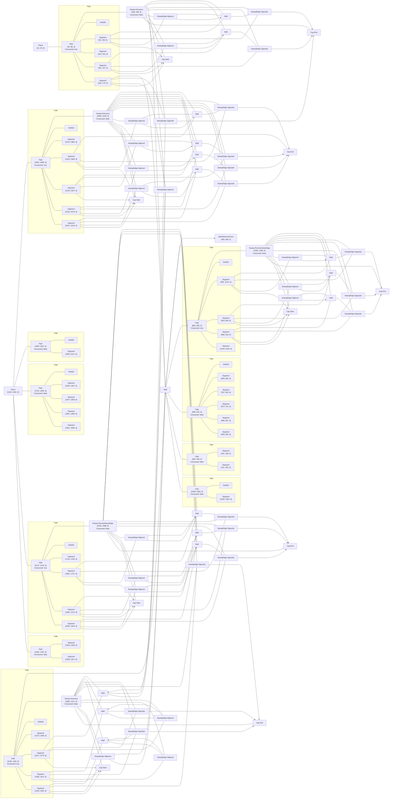

```mermaid
flowchart LR
  subgraph path11 [Path]
    11["Path<br>[1039, 1094, 0]<br>Consumed: false"]
      %% [ProgramBodyItem { index: 7 }, VariableDeclarationDeclaration, VariableDeclarationInit]
    25["Segment<br>[1039, 1094, 0]"]
      %% [ProgramBodyItem { index: 7 }, VariableDeclarationDeclaration, VariableDeclarationInit]
    60[Solid2d]
  end
  subgraph path12 [Path]
    12["Path<br>[1108, 1150, 0]<br>Consumed: true"]
      %% [ProgramBodyItem { index: 8 }, VariableDeclarationDeclaration, VariableDeclarationInit, PipeBodyItem { index: 0 }]
    26["Segment<br>[1156, 1180, 0]"]
      %% [ProgramBodyItem { index: 8 }, VariableDeclarationDeclaration, VariableDeclarationInit, PipeBodyItem { index: 1 }]
    27["Segment<br>[1186, 1211, 0]"]
      %% [ProgramBodyItem { index: 8 }, VariableDeclarationDeclaration, VariableDeclarationInit, PipeBodyItem { index: 2 }]
    28["Segment<br>[1217, 1273, 0]"]
      %% [ProgramBodyItem { index: 8 }, VariableDeclarationDeclaration, VariableDeclarationInit, PipeBodyItem { index: 3 }]
    29["Segment<br>[1279, 1286, 0]"]
      %% [ProgramBodyItem { index: 8 }, VariableDeclarationDeclaration, VariableDeclarationInit, PipeBodyItem { index: 4 }]
    61[Solid2d]
  end
  subgraph path13 [Path]
    13["Path<br>[1456, 1497, 0]<br>Consumed: false"]
      %% [ProgramBodyItem { index: 12 }, VariableDeclarationDeclaration, VariableDeclarationInit, PipeBodyItem { index: 0 }]
    31["Segment<br>[1503, 1527, 0]"]
      %% [ProgramBodyItem { index: 12 }, VariableDeclarationDeclaration, VariableDeclarationInit, PipeBodyItem { index: 1 }]
    32["Segment<br>[1533, 1558, 0]"]
      %% [ProgramBodyItem { index: 12 }, VariableDeclarationDeclaration, VariableDeclarationInit, PipeBodyItem { index: 2 }]
  end
  subgraph path14 [Path]
    14["Path<br>[1572, 1614, 0]<br>Consumed: true"]
      %% [ProgramBodyItem { index: 13 }, VariableDeclarationDeclaration, VariableDeclarationInit, PipeBodyItem { index: 0 }]
    33["Segment<br>[1620, 1644, 0]"]
      %% [ProgramBodyItem { index: 13 }, VariableDeclarationDeclaration, VariableDeclarationInit, PipeBodyItem { index: 1 }]
    34["Segment<br>[1650, 1675, 0]"]
      %% [ProgramBodyItem { index: 13 }, VariableDeclarationDeclaration, VariableDeclarationInit, PipeBodyItem { index: 2 }]
    35["Segment<br>[1681, 1737, 0]"]
      %% [ProgramBodyItem { index: 13 }, VariableDeclarationDeclaration, VariableDeclarationInit, PipeBodyItem { index: 3 }]
    36["Segment<br>[1743, 1750, 0]"]
      %% [ProgramBodyItem { index: 13 }, VariableDeclarationDeclaration, VariableDeclarationInit, PipeBodyItem { index: 4 }]
    62[Solid2d]
  end
  subgraph path15 [Path]
    15["Path<br>[1764, 1806, 0]<br>Consumed: false"]
      %% [ProgramBodyItem { index: 14 }, VariableDeclarationDeclaration, VariableDeclarationInit, PipeBodyItem { index: 0 }]
    37["Segment<br>[1812, 1835, 0]"]
      %% [ProgramBodyItem { index: 14 }, VariableDeclarationDeclaration, VariableDeclarationInit, PipeBodyItem { index: 1 }]
    39["Segment<br>[1841, 1866, 0]"]
      %% [ProgramBodyItem { index: 14 }, VariableDeclarationDeclaration, VariableDeclarationInit, PipeBodyItem { index: 2 }]
    40["Segment<br>[1872, 1928, 0]"]
      %% [ProgramBodyItem { index: 14 }, VariableDeclarationDeclaration, VariableDeclarationInit, PipeBodyItem { index: 3 }]
    41["Segment<br>[1934, 1941, 0]"]
      %% [ProgramBodyItem { index: 14 }, VariableDeclarationDeclaration, VariableDeclarationInit, PipeBodyItem { index: 4 }]
    63[Solid2d]
  end
  subgraph path16 [Path]
    16["Path<br>[1955, 2011, 0]<br>Consumed: false"]
      %% [ProgramBodyItem { index: 15 }, VariableDeclarationDeclaration, VariableDeclarationInit]
    42["Segment<br>[1955, 2011, 0]"]
      %% [ProgramBodyItem { index: 15 }, VariableDeclarationDeclaration, VariableDeclarationInit]
    64[Solid2d]
  end
  subgraph path17 [Path]
    17["Path<br>[2025, 2068, 0]<br>Consumed: true"]
      %% [ProgramBodyItem { index: 16 }, VariableDeclarationDeclaration, VariableDeclarationInit, PipeBodyItem { index: 0 }]
    43["Segment<br>[2074, 2139, 0]"]
      %% [ProgramBodyItem { index: 16 }, VariableDeclarationDeclaration, VariableDeclarationInit, PipeBodyItem { index: 1 }]
    44["Segment<br>[2145, 2213, 0]"]
      %% [ProgramBodyItem { index: 16 }, VariableDeclarationDeclaration, VariableDeclarationInit, PipeBodyItem { index: 2 }]
    45["Segment<br>[2219, 2307, 0]"]
      %% [ProgramBodyItem { index: 16 }, VariableDeclarationDeclaration, VariableDeclarationInit, PipeBodyItem { index: 3 }]
    46["Segment<br>[2313, 2369, 0]"]
      %% [ProgramBodyItem { index: 16 }, VariableDeclarationDeclaration, VariableDeclarationInit, PipeBodyItem { index: 4 }]
    47["Segment<br>[2375, 2382, 0]"]
      %% [ProgramBodyItem { index: 16 }, VariableDeclarationDeclaration, VariableDeclarationInit, PipeBodyItem { index: 5 }]
    65[Solid2d]
  end
  subgraph path18 [Path]
    18["Path<br>[362, 405, 0]<br>Consumed: false"]
      %% [ProgramBodyItem { index: 4 }, VariableDeclarationDeclaration, VariableDeclarationInit, PipeBodyItem { index: 0 }]
    49["Segment<br>[411, 435, 0]"]
      %% [ProgramBodyItem { index: 4 }, VariableDeclarationDeclaration, VariableDeclarationInit, PipeBodyItem { index: 1 }]
    50["Segment<br>[441, 466, 0]"]
      %% [ProgramBodyItem { index: 4 }, VariableDeclarationDeclaration, VariableDeclarationInit, PipeBodyItem { index: 2 }]
  end
  subgraph path19 [Path]
    19["Path<br>[43, 86, 0]<br>Consumed: true"]
      %% [ProgramBodyItem { index: 1 }, VariableDeclarationDeclaration, VariableDeclarationInit, PipeBodyItem { index: 0 }]
    30["Segment<br>[136, 175, 0]"]
      %% [ProgramBodyItem { index: 1 }, VariableDeclarationDeclaration, VariableDeclarationInit, PipeBodyItem { index: 2 }]
    38["Segment<br>[181, 237, 0]"]
      %% [ProgramBodyItem { index: 1 }, VariableDeclarationDeclaration, VariableDeclarationInit, PipeBodyItem { index: 3 }]
    48["Segment<br>[243, 250, 0]"]
      %% [ProgramBodyItem { index: 1 }, VariableDeclarationDeclaration, VariableDeclarationInit, PipeBodyItem { index: 4 }]
    58["Segment<br>[92, 130, 0]"]
      %% [ProgramBodyItem { index: 1 }, VariableDeclarationDeclaration, VariableDeclarationInit, PipeBodyItem { index: 1 }]
    66[Solid2d]
  end
  subgraph path20 [Path]
    20["Path<br>[480, 522, 0]<br>Consumed: false"]
      %% [ProgramBodyItem { index: 5 }, VariableDeclarationDeclaration, VariableDeclarationInit, PipeBodyItem { index: 0 }]
    51["Segment<br>[528, 593, 0]"]
      %% [ProgramBodyItem { index: 5 }, VariableDeclarationDeclaration, VariableDeclarationInit, PipeBodyItem { index: 1 }]
    52["Segment<br>[599, 667, 0]"]
      %% [ProgramBodyItem { index: 5 }, VariableDeclarationDeclaration, VariableDeclarationInit, PipeBodyItem { index: 2 }]
    53["Segment<br>[673, 761, 0]"]
      %% [ProgramBodyItem { index: 5 }, VariableDeclarationDeclaration, VariableDeclarationInit, PipeBodyItem { index: 3 }]
    54["Segment<br>[767, 823, 0]"]
      %% [ProgramBodyItem { index: 5 }, VariableDeclarationDeclaration, VariableDeclarationInit, PipeBodyItem { index: 4 }]
    55["Segment<br>[829, 836, 0]"]
      %% [ProgramBodyItem { index: 5 }, VariableDeclarationDeclaration, VariableDeclarationInit, PipeBodyItem { index: 5 }]
    67[Solid2d]
  end
  subgraph path21 [Path]
    21["Path<br>[850, 892, 0]<br>Consumed: true"]
      %% [ProgramBodyItem { index: 6 }, VariableDeclarationDeclaration, VariableDeclarationInit, PipeBodyItem { index: 0 }]
    24["Segment<br>[1018, 1025, 0]"]
      %% [ProgramBodyItem { index: 6 }, VariableDeclarationDeclaration, VariableDeclarationInit, PipeBodyItem { index: 4 }]
    56["Segment<br>[898, 918, 0]"]
      %% [ProgramBodyItem { index: 6 }, VariableDeclarationDeclaration, VariableDeclarationInit, PipeBodyItem { index: 1 }]
    57["Segment<br>[924, 950, 0]"]
      %% [ProgramBodyItem { index: 6 }, VariableDeclarationDeclaration, VariableDeclarationInit, PipeBodyItem { index: 2 }]
    59["Segment<br>[956, 1012, 0]"]
      %% [ProgramBodyItem { index: 6 }, VariableDeclarationDeclaration, VariableDeclarationInit, PipeBodyItem { index: 3 }]
    68[Solid2d]
  end
  1["Cap End"]
    %% face_code_ref=Missing NodePath
  2["Cap End"]
    %% face_code_ref=Missing NodePath
  3["Cap End"]
    %% face_code_ref=Missing NodePath
  4["Cap End"]
    %% face_code_ref=Missing NodePath
  5["Cap End"]
    %% face_code_ref=Missing NodePath
  6["Cap Start"]
    %% face_code_ref=Missing NodePath
  7["Cap Start"]
    %% face_code_ref=Missing NodePath
  8["Cap Start"]
    %% face_code_ref=Missing NodePath
  9["Cap Start"]
    %% face_code_ref=Missing NodePath
  10["Cap Start"]
    %% face_code_ref=Missing NodePath
  22["Plane<br>[12, 29, 0]"]
    %% [ProgramBodyItem { index: 0 }, VariableDeclarationDeclaration, VariableDeclarationInit]
  23["Plane<br>[1424, 1442, 0]"]
    %% [ProgramBodyItem { index: 11 }, VariableDeclarationDeclaration, VariableDeclarationInit]
  69["StartSketchOnFace<br>[309, 348, 0]"]
    %% [ProgramBodyItem { index: 3 }, VariableDeclarationDeclaration, VariableDeclarationInit]
  70["Sweep Extrusion<br>[1380, 1411, 0]<br>Consumed: false"]
    %% [ProgramBodyItem { index: 10 }, VariableDeclarationDeclaration, VariableDeclarationInit]
  71["Sweep Extrusion<br>[2396, 2429, 0]<br>Consumed: false"]
    %% [ProgramBodyItem { index: 17 }, VariableDeclarationDeclaration, VariableDeclarationInit]
  72["Sweep Extrusion<br>[264, 296, 0]<br>Consumed: false"]
    %% [ProgramBodyItem { index: 2 }, VariableDeclarationDeclaration, VariableDeclarationInit]
  73["Sweep RevolveAboutEdge<br>[1300, 1366, 0]<br>Consumed: false"]
    %% [ProgramBodyItem { index: 9 }, VariableDeclarationDeclaration, VariableDeclarationInit]
  74["Sweep RevolveAboutEdge<br>[2443, 2488, 0]<br>Consumed: false"]
    %% [ProgramBodyItem { index: 18 }, VariableDeclarationDeclaration, VariableDeclarationInit]
  75["SweepEdge Adjacent"]
  76["SweepEdge Adjacent"]
  77["SweepEdge Adjacent"]
  78["SweepEdge Adjacent"]
  79["SweepEdge Adjacent"]
  80["SweepEdge Adjacent"]
  81["SweepEdge Adjacent"]
  82["SweepEdge Adjacent"]
  83["SweepEdge Adjacent"]
  84["SweepEdge Adjacent"]
  85["SweepEdge Adjacent"]
  86["SweepEdge Adjacent"]
  87["SweepEdge Adjacent"]
  88["SweepEdge Adjacent"]
  89["SweepEdge Adjacent"]
  90["SweepEdge Adjacent"]
  91["SweepEdge Opposite"]
  92["SweepEdge Opposite"]
  93["SweepEdge Opposite"]
  94["SweepEdge Opposite"]
  95["SweepEdge Opposite"]
  96["SweepEdge Opposite"]
  97["SweepEdge Opposite"]
  98["SweepEdge Opposite"]
  99["SweepEdge Opposite"]
  100["SweepEdge Opposite"]
  101["SweepEdge Opposite"]
  102["SweepEdge Opposite"]
  103["SweepEdge Opposite"]
  104["SweepEdge Opposite"]
  105["SweepEdge Opposite"]
  106["SweepEdge Opposite"]
  107[Wall]
    %% face_code_ref=[ProgramBodyItem { index: 3 }, VariableDeclarationDeclaration, VariableDeclarationInit]
  108[Wall]
    %% face_code_ref=Missing NodePath
  109[Wall]
    %% face_code_ref=Missing NodePath
  110[Wall]
    %% face_code_ref=Missing NodePath
  111[Wall]
    %% face_code_ref=Missing NodePath
  112[Wall]
    %% face_code_ref=Missing NodePath
  113[Wall]
    %% face_code_ref=Missing NodePath
  114[Wall]
    %% face_code_ref=Missing NodePath
  115[Wall]
    %% face_code_ref=Missing NodePath
  116[Wall]
    %% face_code_ref=Missing NodePath
  117[Wall]
    %% face_code_ref=Missing NodePath
  118[Wall]
    %% face_code_ref=Missing NodePath
  119[Wall]
    %% face_code_ref=Missing NodePath
  120[Wall]
    %% face_code_ref=Missing NodePath
  121[Wall]
    %% face_code_ref=Missing NodePath
  122[Wall]
    %% face_code_ref=Missing NodePath
  70 --- 1
  91 <--x 1
  92 <--x 1
  93 <--x 1
  71 --- 2
  99 <--x 2
  100 <--x 2
  101 <--x 2
  102 <--x 2
  72 --- 3
  94 <--x 3
  98 <--x 3
  105 <--x 3
  73 --- 4
  103 <--x 4
  104 <--x 4
  106 <--x 4
  74 --- 5
  95 <--x 5
  96 <--x 5
  97 <--x 5
  26 <--x 6
  27 <--x 6
  28 <--x 6
  70 --- 6
  43 <--x 7
  44 <--x 7
  45 <--x 7
  46 <--x 7
  71 --- 7
  30 <--x 8
  38 <--x 8
  58 <--x 8
  72 --- 8
  56 <--x 9
  57 <--x 9
  59 <--x 9
  73 --- 9
  33 <--x 10
  34 <--x 10
  35 <--x 10
  74 --- 10
  11 --- 25
  11 --- 60
  107 --- 11
  12 --- 26
  12 --- 27
  12 --- 28
  12 --- 29
  12 --- 61
  12 ---- 70
  107 --- 12
  23 --- 13
  13 --- 31
  13 --- 32
  23 --- 14
  14 --- 33
  14 --- 34
  14 --- 35
  14 --- 36
  14 --- 62
  14 ---- 74
  23 --- 15
  15 --- 37
  15 --- 39
  15 --- 40
  15 --- 41
  15 --- 63
  23 --- 16
  16 --- 42
  16 --- 64
  23 --- 17
  17 --- 43
  17 --- 44
  17 --- 45
  17 --- 46
  17 --- 47
  17 --- 65
  17 ---- 71
  18 --- 49
  18 --- 50
  107 --- 18
  22 --- 19
  19 --- 30
  19 --- 38
  19 --- 48
  19 --- 58
  19 --- 66
  19 ---- 72
  20 --- 51
  20 --- 52
  20 --- 53
  20 --- 54
  20 --- 55
  20 --- 67
  107 --- 20
  21 --- 24
  21 --- 56
  21 --- 57
  21 --- 59
  21 --- 68
  21 ---- 73
  107 --- 21
  26 --- 75
  26 --- 91
  26 --- 108
  27 --- 76
  27 --- 92
  27 --- 109
  28 --- 77
  28 --- 93
  28 --- 110
  30 --- 78
  30 --- 94
  30 --- 107
  33 --- 79
  33 --- 95
  33 --- 111
  34 --- 80
  34 --- 96
  34 --- 112
  35 --- 81
  35 --- 97
  35 --- 113
  38 --- 82
  38 --- 98
  38 --- 114
  43 --- 83
  43 --- 99
  43 --- 115
  44 --- 84
  44 --- 100
  44 --- 116
  45 --- 85
  45 --- 101
  45 --- 117
  46 --- 86
  46 --- 102
  46 --- 118
  56 --- 87
  56 --- 103
  56 --- 119
  57 --- 88
  57 --- 104
  57 --- 120
  58 --- 89
  58 --- 105
  58 --- 121
  59 --- 90
  59 --- 106
  59 --- 122
  107 x--> 69
  70 --- 75
  70 --- 76
  70 --- 77
  70 --- 91
  70 --- 92
  70 --- 93
  70 --- 108
  70 --- 109
  70 --- 110
  71 --- 83
  71 --- 84
  71 --- 85
  71 --- 86
  71 --- 99
  71 --- 100
  71 --- 101
  71 --- 102
  71 --- 115
  71 --- 116
  71 --- 117
  71 --- 118
  72 --- 78
  72 --- 82
  72 --- 89
  72 --- 94
  72 --- 98
  72 --- 105
  72 --- 107
  72 --- 114
  72 --- 121
  73 --- 87
  73 --- 88
  73 --- 90
  73 --- 103
  73 --- 104
  73 --- 106
  73 --- 119
  73 --- 120
  73 --- 122
  74 --- 79
  74 --- 80
  74 --- 81
  74 --- 95
  74 --- 96
  74 --- 97
  74 --- 111
  74 --- 112
  74 --- 113
  107 --- 75
  75 x--> 107
  108 --- 76
  76 x--> 108
  77 x--> 109
  109 --- 77
  110 --- 78
  78 x--> 110
  111 --- 79
  79 x--> 111
  112 --- 80
  80 x--> 112
  81 x--> 113
  113 --- 81
  114 --- 82
  82 x--> 114
  115 --- 83
  83 x--> 115
  116 --- 84
  84 x--> 116
  117 --- 85
  85 x--> 117
  86 x--> 118
  118 --- 86
  119 --- 87
  87 x--> 119
  120 --- 88
  88 x--> 120
  89 x--> 121
  121 --- 89
  90 x--> 122
  122 --- 90
  107 --- 91
  108 --- 92
  109 --- 93
  110 --- 94
  111 --- 95
  112 --- 96
  113 --- 97
  114 --- 98
  115 --- 99
  116 --- 100
  117 --- 101
  118 --- 102
  119 --- 103
  120 --- 104
  121 --- 105
  122 --- 106
```
