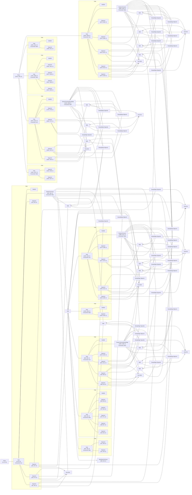

```mermaid
flowchart LR
  subgraph path27 [Path]
    27["Path<br>[43, 86, 0]<br>Consumed: true"]
      %% [ProgramBodyItem { index: 1 }, VariableDeclarationDeclaration, VariableDeclarationInit, PipeBodyItem { index: 0 }]
    28["Segment<br>[92, 130, 0]"]
      %% [ProgramBodyItem { index: 1 }, VariableDeclarationDeclaration, VariableDeclarationInit, PipeBodyItem { index: 1 }]
    29["Segment<br>[136, 175, 0]"]
      %% [ProgramBodyItem { index: 1 }, VariableDeclarationDeclaration, VariableDeclarationInit, PipeBodyItem { index: 2 }]
    30["Segment<br>[181, 237, 0]"]
      %% [ProgramBodyItem { index: 1 }, VariableDeclarationDeclaration, VariableDeclarationInit, PipeBodyItem { index: 3 }]
    31["Segment<br>[243, 250, 0]"]
      %% [ProgramBodyItem { index: 1 }, VariableDeclarationDeclaration, VariableDeclarationInit, PipeBodyItem { index: 4 }]
    88[Solid2d]
  end
  subgraph path35 [Path]
    35["Path<br>[362, 405, 0]<br>Consumed: false"]
      %% [ProgramBodyItem { index: 4 }, VariableDeclarationDeclaration, VariableDeclarationInit, PipeBodyItem { index: 0 }]
    36["Segment<br>[411, 435, 0]"]
      %% [ProgramBodyItem { index: 4 }, VariableDeclarationDeclaration, VariableDeclarationInit, PipeBodyItem { index: 1 }]
    37["Segment<br>[441, 466, 0]"]
      %% [ProgramBodyItem { index: 4 }, VariableDeclarationDeclaration, VariableDeclarationInit, PipeBodyItem { index: 2 }]
  end
  subgraph path38 [Path]
    38["Path<br>[480, 522, 0]<br>Consumed: false"]
      %% [ProgramBodyItem { index: 5 }, VariableDeclarationDeclaration, VariableDeclarationInit, PipeBodyItem { index: 0 }]
    39["Segment<br>[528, 593, 0]"]
      %% [ProgramBodyItem { index: 5 }, VariableDeclarationDeclaration, VariableDeclarationInit, PipeBodyItem { index: 1 }]
    40["Segment<br>[599, 667, 0]"]
      %% [ProgramBodyItem { index: 5 }, VariableDeclarationDeclaration, VariableDeclarationInit, PipeBodyItem { index: 2 }]
    41["Segment<br>[673, 761, 0]"]
      %% [ProgramBodyItem { index: 5 }, VariableDeclarationDeclaration, VariableDeclarationInit, PipeBodyItem { index: 3 }]
    42["Segment<br>[767, 823, 0]"]
      %% [ProgramBodyItem { index: 5 }, VariableDeclarationDeclaration, VariableDeclarationInit, PipeBodyItem { index: 4 }]
    43["Segment<br>[829, 836, 0]"]
      %% [ProgramBodyItem { index: 5 }, VariableDeclarationDeclaration, VariableDeclarationInit, PipeBodyItem { index: 5 }]
    89[Solid2d]
  end
  subgraph path44 [Path]
    44["Path<br>[850, 892, 0]<br>Consumed: true"]
      %% [ProgramBodyItem { index: 6 }, VariableDeclarationDeclaration, VariableDeclarationInit, PipeBodyItem { index: 0 }]
    45["Segment<br>[898, 918, 0]"]
      %% [ProgramBodyItem { index: 6 }, VariableDeclarationDeclaration, VariableDeclarationInit, PipeBodyItem { index: 1 }]
    46["Segment<br>[924, 950, 0]"]
      %% [ProgramBodyItem { index: 6 }, VariableDeclarationDeclaration, VariableDeclarationInit, PipeBodyItem { index: 2 }]
    47["Segment<br>[956, 1012, 0]"]
      %% [ProgramBodyItem { index: 6 }, VariableDeclarationDeclaration, VariableDeclarationInit, PipeBodyItem { index: 3 }]
    48["Segment<br>[1018, 1025, 0]"]
      %% [ProgramBodyItem { index: 6 }, VariableDeclarationDeclaration, VariableDeclarationInit, PipeBodyItem { index: 4 }]
    90[Solid2d]
  end
  subgraph path49 [Path]
    49["Path<br>[1039, 1094, 0]<br>Consumed: false"]
      %% [ProgramBodyItem { index: 7 }, VariableDeclarationDeclaration, VariableDeclarationInit]
    50["Segment<br>[1039, 1094, 0]"]
      %% [ProgramBodyItem { index: 7 }, VariableDeclarationDeclaration, VariableDeclarationInit]
    82[Solid2d]
  end
  subgraph path51 [Path]
    51["Path<br>[1108, 1150, 0]<br>Consumed: true"]
      %% [ProgramBodyItem { index: 8 }, VariableDeclarationDeclaration, VariableDeclarationInit, PipeBodyItem { index: 0 }]
    52["Segment<br>[1156, 1180, 0]"]
      %% [ProgramBodyItem { index: 8 }, VariableDeclarationDeclaration, VariableDeclarationInit, PipeBodyItem { index: 1 }]
    53["Segment<br>[1186, 1211, 0]"]
      %% [ProgramBodyItem { index: 8 }, VariableDeclarationDeclaration, VariableDeclarationInit, PipeBodyItem { index: 2 }]
    54["Segment<br>[1217, 1273, 0]"]
      %% [ProgramBodyItem { index: 8 }, VariableDeclarationDeclaration, VariableDeclarationInit, PipeBodyItem { index: 3 }]
    55["Segment<br>[1279, 1286, 0]"]
      %% [ProgramBodyItem { index: 8 }, VariableDeclarationDeclaration, VariableDeclarationInit, PipeBodyItem { index: 4 }]
    83[Solid2d]
  end
  subgraph path59 [Path]
    59["Path<br>[1456, 1497, 0]<br>Consumed: false"]
      %% [ProgramBodyItem { index: 12 }, VariableDeclarationDeclaration, VariableDeclarationInit, PipeBodyItem { index: 0 }]
    60["Segment<br>[1503, 1527, 0]"]
      %% [ProgramBodyItem { index: 12 }, VariableDeclarationDeclaration, VariableDeclarationInit, PipeBodyItem { index: 1 }]
    61["Segment<br>[1533, 1558, 0]"]
      %% [ProgramBodyItem { index: 12 }, VariableDeclarationDeclaration, VariableDeclarationInit, PipeBodyItem { index: 2 }]
  end
  subgraph path62 [Path]
    62["Path<br>[1572, 1614, 0]<br>Consumed: true"]
      %% [ProgramBodyItem { index: 13 }, VariableDeclarationDeclaration, VariableDeclarationInit, PipeBodyItem { index: 0 }]
    63["Segment<br>[1620, 1644, 0]"]
      %% [ProgramBodyItem { index: 13 }, VariableDeclarationDeclaration, VariableDeclarationInit, PipeBodyItem { index: 1 }]
    64["Segment<br>[1650, 1675, 0]"]
      %% [ProgramBodyItem { index: 13 }, VariableDeclarationDeclaration, VariableDeclarationInit, PipeBodyItem { index: 2 }]
    65["Segment<br>[1681, 1737, 0]"]
      %% [ProgramBodyItem { index: 13 }, VariableDeclarationDeclaration, VariableDeclarationInit, PipeBodyItem { index: 3 }]
    66["Segment<br>[1743, 1750, 0]"]
      %% [ProgramBodyItem { index: 13 }, VariableDeclarationDeclaration, VariableDeclarationInit, PipeBodyItem { index: 4 }]
    84[Solid2d]
  end
  subgraph path67 [Path]
    67["Path<br>[1764, 1806, 0]<br>Consumed: false"]
      %% [ProgramBodyItem { index: 14 }, VariableDeclarationDeclaration, VariableDeclarationInit, PipeBodyItem { index: 0 }]
    68["Segment<br>[1812, 1835, 0]"]
      %% [ProgramBodyItem { index: 14 }, VariableDeclarationDeclaration, VariableDeclarationInit, PipeBodyItem { index: 1 }]
    69["Segment<br>[1841, 1866, 0]"]
      %% [ProgramBodyItem { index: 14 }, VariableDeclarationDeclaration, VariableDeclarationInit, PipeBodyItem { index: 2 }]
    70["Segment<br>[1872, 1928, 0]"]
      %% [ProgramBodyItem { index: 14 }, VariableDeclarationDeclaration, VariableDeclarationInit, PipeBodyItem { index: 3 }]
    71["Segment<br>[1934, 1941, 0]"]
      %% [ProgramBodyItem { index: 14 }, VariableDeclarationDeclaration, VariableDeclarationInit, PipeBodyItem { index: 4 }]
    85[Solid2d]
  end
  subgraph path72 [Path]
    72["Path<br>[1955, 2011, 0]<br>Consumed: false"]
      %% [ProgramBodyItem { index: 15 }, VariableDeclarationDeclaration, VariableDeclarationInit]
    73["Segment<br>[1955, 2011, 0]"]
      %% [ProgramBodyItem { index: 15 }, VariableDeclarationDeclaration, VariableDeclarationInit]
    86[Solid2d]
  end
  subgraph path74 [Path]
    74["Path<br>[2025, 2068, 0]<br>Consumed: true"]
      %% [ProgramBodyItem { index: 16 }, VariableDeclarationDeclaration, VariableDeclarationInit, PipeBodyItem { index: 0 }]
    75["Segment<br>[2074, 2139, 0]"]
      %% [ProgramBodyItem { index: 16 }, VariableDeclarationDeclaration, VariableDeclarationInit, PipeBodyItem { index: 1 }]
    76["Segment<br>[2145, 2213, 0]"]
      %% [ProgramBodyItem { index: 16 }, VariableDeclarationDeclaration, VariableDeclarationInit, PipeBodyItem { index: 2 }]
    77["Segment<br>[2219, 2307, 0]"]
      %% [ProgramBodyItem { index: 16 }, VariableDeclarationDeclaration, VariableDeclarationInit, PipeBodyItem { index: 3 }]
    78["Segment<br>[2313, 2369, 0]"]
      %% [ProgramBodyItem { index: 16 }, VariableDeclarationDeclaration, VariableDeclarationInit, PipeBodyItem { index: 4 }]
    79["Segment<br>[2375, 2382, 0]"]
      %% [ProgramBodyItem { index: 16 }, VariableDeclarationDeclaration, VariableDeclarationInit, PipeBodyItem { index: 5 }]
    87[Solid2d]
  end
  1["Cap End"]
    %% face_code_ref=Missing NodePath
  2["Cap End"]
    %% face_code_ref=Missing NodePath
  3["Cap End"]
    %% face_code_ref=Missing NodePath
  4["Cap End"]
    %% face_code_ref=Missing NodePath
  5["Cap End"]
    %% face_code_ref=Missing NodePath
  6["Cap Start"]
    %% face_code_ref=Missing NodePath
  7["Cap Start"]
    %% face_code_ref=Missing NodePath
  8["Cap Start"]
    %% face_code_ref=Missing NodePath
  9["Cap Start"]
    %% face_code_ref=Missing NodePath
  10["Cap Start"]
    %% face_code_ref=Missing NodePath
  11[Wall]
    %% face_code_ref=Missing NodePath
  12[Wall]
    %% face_code_ref=Missing NodePath
  13[Wall]
    %% face_code_ref=Missing NodePath
  14[Wall]
    %% face_code_ref=Missing NodePath
  15[Wall]
    %% face_code_ref=Missing NodePath
  16[Wall]
    %% face_code_ref=Missing NodePath
  17[Wall]
    %% face_code_ref=Missing NodePath
  18[Wall]
    %% face_code_ref=Missing NodePath
  19[Wall]
    %% face_code_ref=Missing NodePath
  20[Wall]
    %% face_code_ref=Missing NodePath
  21[Wall]
    %% face_code_ref=Missing NodePath
  22[Wall]
    %% face_code_ref=Missing NodePath
  23[Wall]
    %% face_code_ref=Missing NodePath
  24[Wall]
    %% face_code_ref=Missing NodePath
  25[Wall]
    %% face_code_ref=Missing NodePath
  26["Plane<br>[12, 29, 0]"]
    %% [ProgramBodyItem { index: 0 }, VariableDeclarationDeclaration, VariableDeclarationInit]
  32["Sweep Extrusion<br>[264, 296, 0]<br>Consumed: false"]
    %% [ProgramBodyItem { index: 2 }, VariableDeclarationDeclaration, VariableDeclarationInit]
  33["StartSketchOnFace<br>[309, 348, 0]"]
    %% [ProgramBodyItem { index: 3 }, VariableDeclarationDeclaration, VariableDeclarationInit]
  34[Wall]
    %% face_code_ref=[ProgramBodyItem { index: 3 }, VariableDeclarationDeclaration, VariableDeclarationInit]
  56["Sweep RevolveAboutEdge<br>[1300, 1366, 0]<br>Consumed: false"]
    %% [ProgramBodyItem { index: 9 }, VariableDeclarationDeclaration, VariableDeclarationInit]
  57["Sweep Extrusion<br>[1380, 1411, 0]<br>Consumed: false"]
    %% [ProgramBodyItem { index: 10 }, VariableDeclarationDeclaration, VariableDeclarationInit]
  58["Plane<br>[1424, 1442, 0]"]
    %% [ProgramBodyItem { index: 11 }, VariableDeclarationDeclaration, VariableDeclarationInit]
  80["Sweep Extrusion<br>[2396, 2429, 0]<br>Consumed: false"]
    %% [ProgramBodyItem { index: 17 }, VariableDeclarationDeclaration, VariableDeclarationInit]
  81["Sweep RevolveAboutEdge<br>[2443, 2488, 0]<br>Consumed: false"]
    %% [ProgramBodyItem { index: 18 }, VariableDeclarationDeclaration, VariableDeclarationInit]
  91["SweepEdge Adjacent"]
  92["SweepEdge Adjacent"]
  93["SweepEdge Adjacent"]
  94["SweepEdge Adjacent"]
  95["SweepEdge Adjacent"]
  96["SweepEdge Adjacent"]
  97["SweepEdge Adjacent"]
  98["SweepEdge Adjacent"]
  99["SweepEdge Adjacent"]
  100["SweepEdge Adjacent"]
  101["SweepEdge Adjacent"]
  102["SweepEdge Adjacent"]
  103["SweepEdge Adjacent"]
  104["SweepEdge Adjacent"]
  105["SweepEdge Adjacent"]
  106["SweepEdge Adjacent"]
  107["SweepEdge Opposite"]
  108["SweepEdge Opposite"]
  109["SweepEdge Opposite"]
  110["SweepEdge Opposite"]
  111["SweepEdge Opposite"]
  112["SweepEdge Opposite"]
  113["SweepEdge Opposite"]
  114["SweepEdge Opposite"]
  115["SweepEdge Opposite"]
  116["SweepEdge Opposite"]
  117["SweepEdge Opposite"]
  118["SweepEdge Opposite"]
  119["SweepEdge Opposite"]
  120["SweepEdge Opposite"]
  121["SweepEdge Opposite"]
  122["SweepEdge Opposite"]
  57 --- 1
  107 <--x 1
  108 <--x 1
  109 <--x 1
  80 --- 2
  115 <--x 2
  116 <--x 2
  117 <--x 2
  118 <--x 2
  32 --- 3
  110 <--x 3
  114 <--x 3
  121 <--x 3
  56 --- 4
  119 <--x 4
  120 <--x 4
  122 <--x 4
  81 --- 5
  111 <--x 5
  112 <--x 5
  113 <--x 5
  52 <--x 6
  53 <--x 6
  54 <--x 6
  57 --- 6
  75 <--x 7
  76 <--x 7
  77 <--x 7
  78 <--x 7
  80 --- 7
  28 <--x 8
  29 <--x 8
  30 <--x 8
  32 --- 8
  45 <--x 9
  46 <--x 9
  47 <--x 9
  56 --- 9
  63 <--x 10
  64 <--x 10
  65 <--x 10
  81 --- 10
  52 --- 11
  57 --- 11
  11 --- 91
  91 <--x 11
  11 --- 107
  53 --- 12
  57 --- 12
  12 --- 92
  92 <--x 12
  12 --- 108
  54 --- 13
  57 --- 13
  13 --- 93
  93 <--x 13
  13 --- 109
  63 --- 14
  81 --- 14
  14 --- 94
  94 <--x 14
  14 --- 110
  64 --- 15
  81 --- 15
  15 --- 95
  95 <--x 15
  15 --- 111
  65 --- 16
  81 --- 16
  16 --- 96
  96 <--x 16
  16 --- 112
  30 --- 17
  32 --- 17
  17 --- 97
  97 <--x 17
  17 --- 113
  75 --- 18
  80 --- 18
  18 --- 98
  98 <--x 18
  18 --- 114
  76 --- 19
  80 --- 19
  19 --- 99
  99 <--x 19
  19 --- 115
  77 --- 20
  80 --- 20
  20 --- 100
  100 <--x 20
  20 --- 116
  78 --- 21
  80 --- 21
  21 --- 101
  101 <--x 21
  21 --- 117
  45 --- 22
  56 --- 22
  22 --- 102
  102 <--x 22
  22 --- 118
  46 --- 23
  56 --- 23
  23 --- 103
  103 <--x 23
  23 --- 119
  28 --- 24
  32 --- 24
  24 --- 104
  104 <--x 24
  24 --- 120
  47 --- 25
  56 --- 25
  25 --- 105
  105 <--x 25
  25 --- 121
  26 --- 27
  27 --- 28
  27 --- 29
  27 --- 30
  27 --- 31
  27 ---- 32
  27 --- 88
  28 --- 105
  28 --- 121
  29 --- 34
  29 --- 94
  29 --- 110
  30 --- 98
  30 --- 114
  32 --- 34
  32 --- 94
  32 --- 98
  32 --- 105
  32 --- 110
  32 --- 114
  32 --- 121
  34 x--> 33
  34 --- 35
  34 --- 38
  34 --- 44
  34 --- 49
  34 --- 51
  34 --- 106
  106 <--x 34
  34 --- 122
  35 --- 36
  35 --- 37
  38 --- 39
  38 --- 40
  38 --- 41
  38 --- 42
  38 --- 43
  38 --- 89
  44 --- 45
  44 --- 46
  44 --- 47
  44 --- 48
  44 ---- 56
  44 --- 90
  45 --- 103
  45 --- 119
  46 --- 104
  46 --- 120
  47 --- 106
  47 --- 122
  49 --- 50
  49 --- 82
  51 --- 52
  51 --- 53
  51 --- 54
  51 --- 55
  51 ---- 57
  51 --- 83
  52 --- 91
  52 --- 107
  53 --- 92
  53 --- 108
  54 --- 93
  54 --- 109
  56 --- 103
  56 --- 104
  56 --- 106
  56 --- 119
  56 --- 120
  56 --- 122
  57 --- 91
  57 --- 92
  57 --- 93
  57 --- 107
  57 --- 108
  57 --- 109
  58 --- 59
  58 --- 62
  58 --- 67
  58 --- 72
  58 --- 74
  59 --- 60
  59 --- 61
  62 --- 63
  62 --- 64
  62 --- 65
  62 --- 66
  62 ---- 81
  62 --- 84
  63 --- 95
  63 --- 111
  64 --- 96
  64 --- 112
  65 --- 97
  65 --- 113
  67 --- 68
  67 --- 69
  67 --- 70
  67 --- 71
  67 --- 85
  72 --- 73
  72 --- 86
  74 --- 75
  74 --- 76
  74 --- 77
  74 --- 78
  74 --- 79
  74 ---- 80
  74 --- 87
  75 --- 99
  75 --- 115
  76 --- 100
  76 --- 116
  77 --- 101
  77 --- 117
  78 --- 102
  78 --- 118
  80 --- 99
  80 --- 100
  80 --- 101
  80 --- 102
  80 --- 115
  80 --- 116
  80 --- 117
  80 --- 118
  81 --- 95
  81 --- 96
  81 --- 97
  81 --- 111
  81 --- 112
  81 --- 113
```
