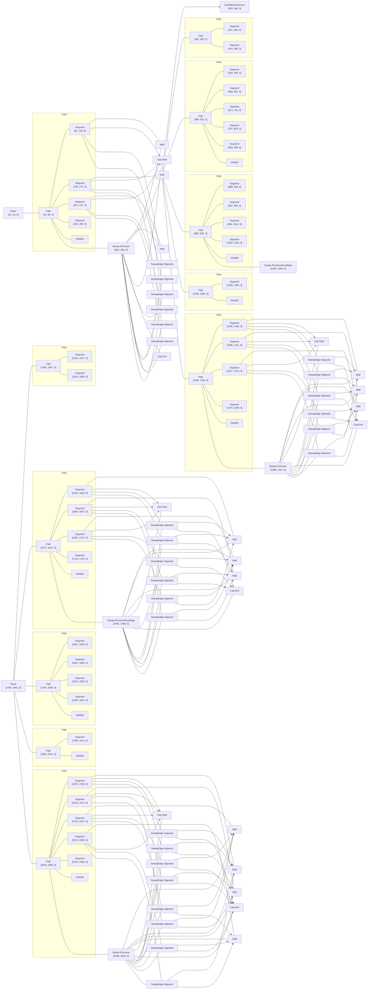

```mermaid
flowchart LR
  subgraph path4 [Path]
    4["Path<br>[43, 86, 0]"]
    15["Segment<br>[92, 130, 0]"]
    16["Segment<br>[136, 175, 0]"]
    17["Segment<br>[181, 237, 0]"]
    18["Segment<br>[243, 250, 0]"]
    55[Solid2d]
  end
  subgraph path5 [Path]
    5["Path<br>[362, 405, 0]"]
    19["Segment<br>[411, 435, 0]"]
    20["Segment<br>[441, 466, 0]"]
  end
  subgraph path6 [Path]
    6["Path<br>[480, 522, 0]"]
    21["Segment<br>[528, 593, 0]"]
    22["Segment<br>[599, 667, 0]"]
    23["Segment<br>[673, 761, 0]"]
    24["Segment<br>[767, 823, 0]"]
    25["Segment<br>[829, 836, 0]"]
    56[Solid2d]
  end
  subgraph path7 [Path]
    7["Path<br>[850, 892, 0]"]
    26["Segment<br>[898, 918, 0]"]
    27["Segment<br>[924, 950, 0]"]
    28["Segment<br>[956, 1012, 0]"]
    29["Segment<br>[1018, 1025, 0]"]
    52[Solid2d]
  end
  subgraph path8 [Path]
    8["Path<br>[1039, 1094, 0]"]
    30["Segment<br>[1039, 1094, 0]"]
    57[Solid2d]
  end
  subgraph path9 [Path]
    9["Path<br>[1108, 1150, 0]"]
    31["Segment<br>[1156, 1180, 0]"]
    32["Segment<br>[1186, 1211, 0]"]
    33["Segment<br>[1217, 1273, 0]"]
    34["Segment<br>[1279, 1286, 0]"]
    54[Solid2d]
  end
  subgraph path10 [Path]
    10["Path<br>[1456, 1497, 0]"]
    35["Segment<br>[1503, 1527, 0]"]
    36["Segment<br>[1533, 1558, 0]"]
  end
  subgraph path11 [Path]
    11["Path<br>[1572, 1614, 0]"]
    37["Segment<br>[1620, 1644, 0]"]
    38["Segment<br>[1650, 1675, 0]"]
    39["Segment<br>[1681, 1737, 0]"]
    40["Segment<br>[1743, 1750, 0]"]
    51[Solid2d]
  end
  subgraph path12 [Path]
    12["Path<br>[1764, 1806, 0]"]
    41["Segment<br>[1812, 1835, 0]"]
    42["Segment<br>[1841, 1866, 0]"]
    43["Segment<br>[1872, 1928, 0]"]
    44["Segment<br>[1934, 1941, 0]"]
    53[Solid2d]
  end
  subgraph path13 [Path]
    13["Path<br>[1955, 2011, 0]"]
    45["Segment<br>[1955, 2011, 0]"]
    59[Solid2d]
  end
  subgraph path14 [Path]
    14["Path<br>[2025, 2068, 0]"]
    46["Segment<br>[2074, 2139, 0]"]
    47["Segment<br>[2145, 2213, 0]"]
    48["Segment<br>[2219, 2307, 0]"]
    49["Segment<br>[2313, 2369, 0]"]
    50["Segment<br>[2375, 2382, 0]"]
    58[Solid2d]
  end
  1["Plane<br>[12, 29, 0]"]
  2["Plane<br>[1424, 1442, 0]"]
  3["StartSketchOnFace<br>[309, 348, 0]"]
  60["Sweep Extrusion<br>[264, 296, 0]"]
  61["Sweep RevolveAboutEdge<br>[1300, 1366, 0]"]
  62["Sweep Extrusion<br>[1380, 1411, 0]"]
  63["Sweep Extrusion<br>[2396, 2429, 0]"]
  64["Sweep RevolveAboutEdge<br>[2443, 2488, 0]"]
  65[Wall]
  66[Wall]
  67[Wall]
  68[Wall]
  69[Wall]
  70[Wall]
  71[Wall]
  72[Wall]
  73[Wall]
  74[Wall]
  75[Wall]
  76[Wall]
  77[Wall]
  78["Cap Start"]
  79["Cap Start"]
  80["Cap Start"]
  81["Cap Start"]
  82["Cap End"]
  83["Cap End"]
  84["Cap End"]
  85["Cap End"]
  86["SweepEdge Opposite"]
  87["SweepEdge Adjacent"]
  88["SweepEdge Opposite"]
  89["SweepEdge Adjacent"]
  90["SweepEdge Opposite"]
  91["SweepEdge Adjacent"]
  92["SweepEdge Opposite"]
  93["SweepEdge Adjacent"]
  94["SweepEdge Opposite"]
  95["SweepEdge Adjacent"]
  96["SweepEdge Opposite"]
  97["SweepEdge Adjacent"]
  98["SweepEdge Opposite"]
  99["SweepEdge Adjacent"]
  100["SweepEdge Opposite"]
  101["SweepEdge Adjacent"]
  102["SweepEdge Opposite"]
  103["SweepEdge Adjacent"]
  104["SweepEdge Opposite"]
  105["SweepEdge Adjacent"]
  106["SweepEdge Opposite"]
  107["SweepEdge Adjacent"]
  108["SweepEdge Opposite"]
  109["SweepEdge Adjacent"]
  110["SweepEdge Opposite"]
  111["SweepEdge Adjacent"]
  1 --- 4
  2 --- 10
  2 --- 11
  2 --- 12
  2 --- 13
  2 --- 14
  70 x--> 3
  4 --- 15
  4 --- 16
  4 --- 17
  4 --- 18
  4 --- 55
  4 ---- 60
  5 --- 19
  5 --- 20
  70 --- 5
  6 --- 21
  6 --- 22
  6 --- 23
  6 --- 24
  6 --- 25
  6 --- 56
  70 --- 6
  7 --- 26
  7 --- 27
  7 --- 28
  7 --- 29
  7 --- 52
  7 ---- 61
  70 --- 7
  8 --- 30
  8 --- 57
  70 --- 8
  9 --- 31
  9 --- 32
  9 --- 33
  9 --- 34
  9 --- 54
  9 ---- 62
  70 --- 9
  10 --- 35
  10 --- 36
  11 --- 37
  11 --- 38
  11 --- 39
  11 --- 40
  11 --- 51
  11 ---- 64
  12 --- 41
  12 --- 42
  12 --- 43
  12 --- 44
  12 --- 53
  13 --- 45
  13 --- 59
  14 --- 46
  14 --- 47
  14 --- 48
  14 --- 49
  14 --- 50
  14 --- 58
  14 ---- 63
  15 --- 69
  15 x--> 78
  15 --- 96
  15 --- 97
  16 --- 70
  16 x--> 78
  16 --- 94
  16 --- 95
  17 --- 68
  17 x--> 78
  17 --- 92
  17 --- 93
  31 --- 65
  31 x--> 79
  31 --- 86
  31 --- 87
  32 --- 67
  32 x--> 79
  32 --- 90
  32 --- 91
  33 --- 66
  33 x--> 79
  33 --- 88
  33 --- 89
  37 --- 72
  37 x--> 81
  37 --- 100
  37 --- 101
  38 --- 73
  38 x--> 81
  38 --- 102
  38 --- 103
  39 --- 71
  39 x--> 81
  39 --- 98
  39 --- 99
  46 --- 75
  46 x--> 80
  46 --- 106
  46 --- 107
  47 --- 76
  47 x--> 80
  47 --- 108
  47 --- 109
  48 --- 74
  48 x--> 80
  48 --- 104
  48 --- 105
  49 --- 77
  49 x--> 80
  49 --- 110
  49 --- 111
  60 --- 68
  60 --- 69
  60 --- 70
  60 --- 78
  60 --- 82
  60 --- 92
  60 --- 93
  60 --- 94
  60 --- 95
  60 --- 96
  60 --- 97
  62 --- 65
  62 --- 66
  62 --- 67
  62 --- 79
  62 --- 83
  62 --- 86
  62 --- 87
  62 --- 88
  62 --- 89
  62 --- 90
  62 --- 91
  63 --- 74
  63 --- 75
  63 --- 76
  63 --- 77
  63 --- 80
  63 --- 84
  63 --- 104
  63 --- 105
  63 --- 106
  63 --- 107
  63 --- 108
  63 --- 109
  63 --- 110
  63 --- 111
  64 --- 71
  64 --- 72
  64 --- 73
  64 --- 81
  64 --- 85
  64 --- 98
  64 --- 99
  64 --- 100
  64 --- 101
  64 --- 102
  64 --- 103
  86 <--x 65
  87 <--x 65
  89 <--x 65
  88 <--x 66
  89 <--x 66
  91 <--x 66
  87 <--x 67
  90 <--x 67
  91 <--x 67
  98 <--x 71
  99 <--x 71
  103 <--x 71
  99 <--x 72
  100 <--x 72
  101 <--x 72
  101 <--x 73
  102 <--x 73
  103 <--x 73
  104 <--x 74
  105 <--x 74
  109 <--x 74
  106 <--x 75
  107 <--x 75
  111 <--x 75
  107 <--x 76
  108 <--x 76
  109 <--x 76
  105 <--x 77
  110 <--x 77
  111 <--x 77
  86 <--x 83
  88 <--x 83
  90 <--x 83
  104 <--x 84
  106 <--x 84
  108 <--x 84
  110 <--x 84
  98 <--x 85
  100 <--x 85
  102 <--x 85
```
