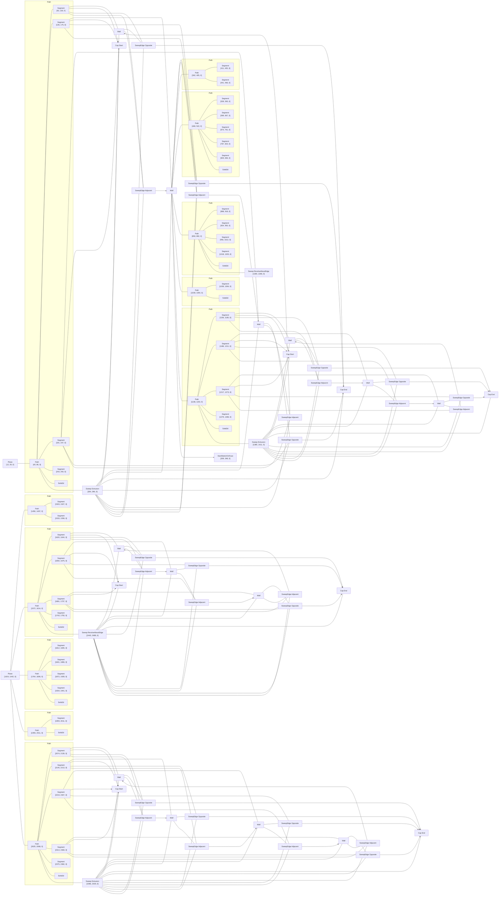

```mermaid
flowchart LR
  subgraph path2 [Path]
    2["Path<br>[43, 86, 0]"]
      %% [ProgramBodyItem { index: 1 }, VariableDeclarationDeclaration, VariableDeclarationInit, PipeBodyItem { index: 0 }]
    3["Segment<br>[92, 130, 0]"]
      %% [ProgramBodyItem { index: 1 }, VariableDeclarationDeclaration, VariableDeclarationInit, PipeBodyItem { index: 1 }]
    4["Segment<br>[136, 175, 0]"]
      %% [ProgramBodyItem { index: 1 }, VariableDeclarationDeclaration, VariableDeclarationInit, PipeBodyItem { index: 2 }]
    5["Segment<br>[181, 237, 0]"]
      %% [ProgramBodyItem { index: 1 }, VariableDeclarationDeclaration, VariableDeclarationInit, PipeBodyItem { index: 3 }]
    6["Segment<br>[243, 250, 0]"]
      %% [ProgramBodyItem { index: 1 }, VariableDeclarationDeclaration, VariableDeclarationInit, PipeBodyItem { index: 4 }]
    7[Solid2d]
  end
  subgraph path20 [Path]
    20["Path<br>[362, 405, 0]"]
      %% [ProgramBodyItem { index: 4 }, VariableDeclarationDeclaration, VariableDeclarationInit, PipeBodyItem { index: 0 }]
    21["Segment<br>[411, 435, 0]"]
      %% [ProgramBodyItem { index: 4 }, VariableDeclarationDeclaration, VariableDeclarationInit, PipeBodyItem { index: 1 }]
    22["Segment<br>[441, 466, 0]"]
      %% [ProgramBodyItem { index: 4 }, VariableDeclarationDeclaration, VariableDeclarationInit, PipeBodyItem { index: 2 }]
  end
  subgraph path23 [Path]
    23["Path<br>[480, 522, 0]"]
      %% [ProgramBodyItem { index: 5 }, VariableDeclarationDeclaration, VariableDeclarationInit, PipeBodyItem { index: 0 }]
    24["Segment<br>[528, 593, 0]"]
      %% [ProgramBodyItem { index: 5 }, VariableDeclarationDeclaration, VariableDeclarationInit, PipeBodyItem { index: 1 }]
    25["Segment<br>[599, 667, 0]"]
      %% [ProgramBodyItem { index: 5 }, VariableDeclarationDeclaration, VariableDeclarationInit, PipeBodyItem { index: 2 }]
    26["Segment<br>[673, 761, 0]"]
      %% [ProgramBodyItem { index: 5 }, VariableDeclarationDeclaration, VariableDeclarationInit, PipeBodyItem { index: 3 }]
    27["Segment<br>[767, 823, 0]"]
      %% [ProgramBodyItem { index: 5 }, VariableDeclarationDeclaration, VariableDeclarationInit, PipeBodyItem { index: 4 }]
    28["Segment<br>[829, 836, 0]"]
      %% [ProgramBodyItem { index: 5 }, VariableDeclarationDeclaration, VariableDeclarationInit, PipeBodyItem { index: 5 }]
    29[Solid2d]
  end
  subgraph path30 [Path]
    30["Path<br>[850, 892, 0]"]
      %% [ProgramBodyItem { index: 6 }, VariableDeclarationDeclaration, VariableDeclarationInit, PipeBodyItem { index: 0 }]
    31["Segment<br>[898, 918, 0]"]
      %% [ProgramBodyItem { index: 6 }, VariableDeclarationDeclaration, VariableDeclarationInit, PipeBodyItem { index: 1 }]
    32["Segment<br>[924, 950, 0]"]
      %% [ProgramBodyItem { index: 6 }, VariableDeclarationDeclaration, VariableDeclarationInit, PipeBodyItem { index: 2 }]
    33["Segment<br>[956, 1012, 0]"]
      %% [ProgramBodyItem { index: 6 }, VariableDeclarationDeclaration, VariableDeclarationInit, PipeBodyItem { index: 3 }]
    34["Segment<br>[1018, 1025, 0]"]
      %% [ProgramBodyItem { index: 6 }, VariableDeclarationDeclaration, VariableDeclarationInit, PipeBodyItem { index: 4 }]
    35[Solid2d]
  end
  subgraph path36 [Path]
    36["Path<br>[1039, 1094, 0]"]
      %% [ProgramBodyItem { index: 7 }, VariableDeclarationDeclaration, VariableDeclarationInit]
    37["Segment<br>[1039, 1094, 0]"]
      %% [ProgramBodyItem { index: 7 }, VariableDeclarationDeclaration, VariableDeclarationInit]
    38[Solid2d]
  end
  subgraph path39 [Path]
    39["Path<br>[1108, 1150, 0]"]
      %% [ProgramBodyItem { index: 8 }, VariableDeclarationDeclaration, VariableDeclarationInit, PipeBodyItem { index: 0 }]
    40["Segment<br>[1156, 1180, 0]"]
      %% [ProgramBodyItem { index: 8 }, VariableDeclarationDeclaration, VariableDeclarationInit, PipeBodyItem { index: 1 }]
    41["Segment<br>[1186, 1211, 0]"]
      %% [ProgramBodyItem { index: 8 }, VariableDeclarationDeclaration, VariableDeclarationInit, PipeBodyItem { index: 2 }]
    42["Segment<br>[1217, 1273, 0]"]
      %% [ProgramBodyItem { index: 8 }, VariableDeclarationDeclaration, VariableDeclarationInit, PipeBodyItem { index: 3 }]
    43["Segment<br>[1279, 1286, 0]"]
      %% [ProgramBodyItem { index: 8 }, VariableDeclarationDeclaration, VariableDeclarationInit, PipeBodyItem { index: 4 }]
    44[Solid2d]
  end
  subgraph path59 [Path]
    59["Path<br>[1456, 1497, 0]"]
      %% [ProgramBodyItem { index: 12 }, VariableDeclarationDeclaration, VariableDeclarationInit, PipeBodyItem { index: 0 }]
    60["Segment<br>[1503, 1527, 0]"]
      %% [ProgramBodyItem { index: 12 }, VariableDeclarationDeclaration, VariableDeclarationInit, PipeBodyItem { index: 1 }]
    61["Segment<br>[1533, 1558, 0]"]
      %% [ProgramBodyItem { index: 12 }, VariableDeclarationDeclaration, VariableDeclarationInit, PipeBodyItem { index: 2 }]
  end
  subgraph path62 [Path]
    62["Path<br>[1572, 1614, 0]"]
      %% [ProgramBodyItem { index: 13 }, VariableDeclarationDeclaration, VariableDeclarationInit, PipeBodyItem { index: 0 }]
    63["Segment<br>[1620, 1644, 0]"]
      %% [ProgramBodyItem { index: 13 }, VariableDeclarationDeclaration, VariableDeclarationInit, PipeBodyItem { index: 1 }]
    64["Segment<br>[1650, 1675, 0]"]
      %% [ProgramBodyItem { index: 13 }, VariableDeclarationDeclaration, VariableDeclarationInit, PipeBodyItem { index: 2 }]
    65["Segment<br>[1681, 1737, 0]"]
      %% [ProgramBodyItem { index: 13 }, VariableDeclarationDeclaration, VariableDeclarationInit, PipeBodyItem { index: 3 }]
    66["Segment<br>[1743, 1750, 0]"]
      %% [ProgramBodyItem { index: 13 }, VariableDeclarationDeclaration, VariableDeclarationInit, PipeBodyItem { index: 4 }]
    67[Solid2d]
  end
  subgraph path68 [Path]
    68["Path<br>[1764, 1806, 0]"]
      %% [ProgramBodyItem { index: 14 }, VariableDeclarationDeclaration, VariableDeclarationInit, PipeBodyItem { index: 0 }]
    69["Segment<br>[1812, 1835, 0]"]
      %% [ProgramBodyItem { index: 14 }, VariableDeclarationDeclaration, VariableDeclarationInit, PipeBodyItem { index: 1 }]
    70["Segment<br>[1841, 1866, 0]"]
      %% [ProgramBodyItem { index: 14 }, VariableDeclarationDeclaration, VariableDeclarationInit, PipeBodyItem { index: 2 }]
    71["Segment<br>[1872, 1928, 0]"]
      %% [ProgramBodyItem { index: 14 }, VariableDeclarationDeclaration, VariableDeclarationInit, PipeBodyItem { index: 3 }]
    72["Segment<br>[1934, 1941, 0]"]
      %% [ProgramBodyItem { index: 14 }, VariableDeclarationDeclaration, VariableDeclarationInit, PipeBodyItem { index: 4 }]
    73[Solid2d]
  end
  subgraph path74 [Path]
    74["Path<br>[1955, 2011, 0]"]
      %% [ProgramBodyItem { index: 15 }, VariableDeclarationDeclaration, VariableDeclarationInit]
    75["Segment<br>[1955, 2011, 0]"]
      %% [ProgramBodyItem { index: 15 }, VariableDeclarationDeclaration, VariableDeclarationInit]
    76[Solid2d]
  end
  subgraph path77 [Path]
    77["Path<br>[2025, 2068, 0]"]
      %% [ProgramBodyItem { index: 16 }, VariableDeclarationDeclaration, VariableDeclarationInit, PipeBodyItem { index: 0 }]
    78["Segment<br>[2074, 2139, 0]"]
      %% [ProgramBodyItem { index: 16 }, VariableDeclarationDeclaration, VariableDeclarationInit, PipeBodyItem { index: 1 }]
    79["Segment<br>[2145, 2213, 0]"]
      %% [ProgramBodyItem { index: 16 }, VariableDeclarationDeclaration, VariableDeclarationInit, PipeBodyItem { index: 2 }]
    80["Segment<br>[2219, 2307, 0]"]
      %% [ProgramBodyItem { index: 16 }, VariableDeclarationDeclaration, VariableDeclarationInit, PipeBodyItem { index: 3 }]
    81["Segment<br>[2313, 2369, 0]"]
      %% [ProgramBodyItem { index: 16 }, VariableDeclarationDeclaration, VariableDeclarationInit, PipeBodyItem { index: 4 }]
    82["Segment<br>[2375, 2382, 0]"]
      %% [ProgramBodyItem { index: 16 }, VariableDeclarationDeclaration, VariableDeclarationInit, PipeBodyItem { index: 5 }]
    83[Solid2d]
  end
  1["Plane<br>[12, 29, 0]"]
    %% [ProgramBodyItem { index: 0 }, VariableDeclarationDeclaration, VariableDeclarationInit]
  8["Sweep Extrusion<br>[264, 296, 0]"]
    %% [ProgramBodyItem { index: 2 }, VariableDeclarationDeclaration, VariableDeclarationInit]
  9[Wall]
    %% face_code_ref=Missing NodePath
  10[Wall]
    %% face_code_ref=[ProgramBodyItem { index: 3 }, VariableDeclarationDeclaration, VariableDeclarationInit]
  11[Wall]
    %% face_code_ref=Missing NodePath
  12["Cap Start"]
    %% face_code_ref=Missing NodePath
  13["Cap End"]
    %% face_code_ref=Missing NodePath
  14["SweepEdge Opposite"]
  15["SweepEdge Adjacent"]
  16["SweepEdge Opposite"]
  17["SweepEdge Adjacent"]
  18["SweepEdge Opposite"]
  19["SweepEdge Adjacent"]
  45["Sweep RevolveAboutEdge<br>[1300, 1366, 0]"]
    %% [ProgramBodyItem { index: 9 }, VariableDeclarationDeclaration, VariableDeclarationInit]
  46["Sweep Extrusion<br>[1380, 1411, 0]"]
    %% [ProgramBodyItem { index: 10 }, VariableDeclarationDeclaration, VariableDeclarationInit]
  47[Wall]
    %% face_code_ref=Missing NodePath
  48[Wall]
    %% face_code_ref=Missing NodePath
  49[Wall]
    %% face_code_ref=Missing NodePath
  50["Cap Start"]
    %% face_code_ref=Missing NodePath
  51["Cap End"]
    %% face_code_ref=Missing NodePath
  52["SweepEdge Opposite"]
  53["SweepEdge Adjacent"]
  54["SweepEdge Opposite"]
  55["SweepEdge Adjacent"]
  56["SweepEdge Opposite"]
  57["SweepEdge Adjacent"]
  58["Plane<br>[1424, 1442, 0]"]
    %% [ProgramBodyItem { index: 11 }, VariableDeclarationDeclaration, VariableDeclarationInit]
  84["Sweep Extrusion<br>[2396, 2429, 0]"]
    %% [ProgramBodyItem { index: 17 }, VariableDeclarationDeclaration, VariableDeclarationInit]
  85[Wall]
    %% face_code_ref=Missing NodePath
  86[Wall]
    %% face_code_ref=Missing NodePath
  87[Wall]
    %% face_code_ref=Missing NodePath
  88[Wall]
    %% face_code_ref=Missing NodePath
  89["Cap Start"]
    %% face_code_ref=Missing NodePath
  90["Cap End"]
    %% face_code_ref=Missing NodePath
  91["SweepEdge Opposite"]
  92["SweepEdge Adjacent"]
  93["SweepEdge Opposite"]
  94["SweepEdge Adjacent"]
  95["SweepEdge Opposite"]
  96["SweepEdge Adjacent"]
  97["SweepEdge Opposite"]
  98["SweepEdge Adjacent"]
  99["Sweep RevolveAboutEdge<br>[2443, 2488, 0]"]
    %% [ProgramBodyItem { index: 18 }, VariableDeclarationDeclaration, VariableDeclarationInit]
  100[Wall]
    %% face_code_ref=Missing NodePath
  101[Wall]
    %% face_code_ref=Missing NodePath
  102[Wall]
    %% face_code_ref=Missing NodePath
  103["Cap Start"]
    %% face_code_ref=Missing NodePath
  104["Cap End"]
    %% face_code_ref=Missing NodePath
  105["SweepEdge Opposite"]
  106["SweepEdge Adjacent"]
  107["SweepEdge Opposite"]
  108["SweepEdge Adjacent"]
  109["SweepEdge Opposite"]
  110["SweepEdge Adjacent"]
  111["StartSketchOnFace<br>[309, 348, 0]"]
    %% [ProgramBodyItem { index: 3 }, VariableDeclarationDeclaration, VariableDeclarationInit]
  1 --- 2
  2 --- 3
  2 --- 4
  2 --- 5
  2 --- 6
  2 --- 7
  2 ---- 8
  3 --- 11
  3 x--> 12
  3 --- 18
  3 --- 19
  4 --- 10
  4 x--> 12
  4 --- 16
  4 --- 17
  5 --- 9
  5 x--> 12
  5 --- 14
  5 --- 15
  8 --- 9
  8 --- 10
  8 --- 11
  8 --- 12
  8 --- 13
  8 --- 14
  8 --- 15
  8 --- 16
  8 --- 17
  8 --- 18
  8 --- 19
  9 --- 14
  9 --- 15
  17 <--x 9
  10 --- 16
  10 --- 17
  19 <--x 10
  10 --- 20
  10 --- 23
  10 --- 30
  10 --- 36
  10 --- 39
  10 <--x 111
  15 <--x 11
  11 --- 18
  11 --- 19
  14 <--x 13
  16 <--x 13
  18 <--x 13
  20 --- 21
  20 --- 22
  23 --- 24
  23 --- 25
  23 --- 26
  23 --- 27
  23 --- 28
  23 --- 29
  30 --- 31
  30 --- 32
  30 --- 33
  30 --- 34
  30 --- 35
  30 ---- 45
  36 --- 37
  36 --- 38
  39 --- 40
  39 --- 41
  39 --- 42
  39 --- 43
  39 --- 44
  39 ---- 46
  40 --- 49
  40 x--> 50
  40 --- 56
  40 --- 57
  41 --- 48
  41 x--> 50
  41 --- 54
  41 --- 55
  42 --- 47
  42 x--> 50
  42 --- 52
  42 --- 53
  46 --- 47
  46 --- 48
  46 --- 49
  46 --- 50
  46 --- 51
  46 --- 52
  46 --- 53
  46 --- 54
  46 --- 55
  46 --- 56
  46 --- 57
  47 --- 52
  47 --- 53
  55 <--x 47
  48 --- 54
  48 --- 55
  57 <--x 48
  53 <--x 49
  49 --- 56
  49 --- 57
  52 <--x 51
  54 <--x 51
  56 <--x 51
  58 --- 59
  58 --- 62
  58 --- 68
  58 --- 74
  58 --- 77
  59 --- 60
  59 --- 61
  62 --- 63
  62 --- 64
  62 --- 65
  62 --- 66
  62 --- 67
  62 ---- 99
  63 --- 100
  63 x--> 103
  63 --- 105
  63 --- 106
  64 --- 101
  64 x--> 103
  64 --- 107
  64 --- 108
  65 --- 102
  65 x--> 103
  65 --- 109
  65 --- 110
  68 --- 69
  68 --- 70
  68 --- 71
  68 --- 72
  68 --- 73
  74 --- 75
  74 --- 76
  77 --- 78
  77 --- 79
  77 --- 80
  77 --- 81
  77 --- 82
  77 --- 83
  77 ---- 84
  78 --- 88
  78 x--> 89
  78 --- 97
  78 --- 98
  79 --- 87
  79 x--> 89
  79 --- 95
  79 --- 96
  80 --- 86
  80 x--> 89
  80 --- 93
  80 --- 94
  81 --- 85
  81 x--> 89
  81 --- 91
  81 --- 92
  84 --- 85
  84 --- 86
  84 --- 87
  84 --- 88
  84 --- 89
  84 --- 90
  84 --- 91
  84 --- 92
  84 --- 93
  84 --- 94
  84 --- 95
  84 --- 96
  84 --- 97
  84 --- 98
  85 --- 91
  85 --- 92
  94 <--x 85
  86 --- 93
  86 --- 94
  96 <--x 86
  87 --- 95
  87 --- 96
  98 <--x 87
  92 <--x 88
  88 --- 97
  88 --- 98
  91 <--x 90
  93 <--x 90
  95 <--x 90
  97 <--x 90
  99 --- 100
  99 --- 101
  99 --- 102
  99 --- 103
  99 --- 104
  99 --- 105
  99 --- 106
  99 --- 107
  99 --- 108
  99 --- 109
  99 --- 110
  100 --- 105
  100 --- 106
  110 <--x 100
  106 <--x 101
  101 --- 107
  101 --- 108
  108 <--x 102
  102 --- 109
  102 --- 110
  105 <--x 104
  107 <--x 104
  109 <--x 104
```
