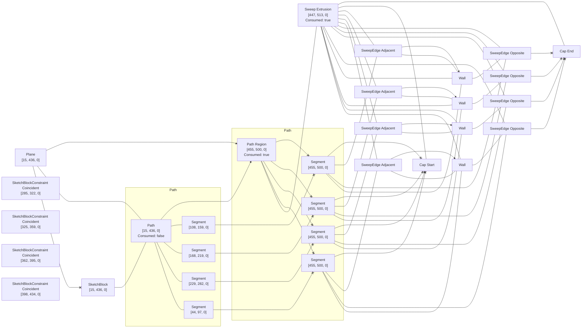

```mermaid
flowchart LR
  subgraph path4 [Path]
    4["Path<br>[15, 436, 0]<br>Consumed: false"]
      %% [ProgramBodyItem { index: 0 }, VariableDeclarationDeclaration, VariableDeclarationInit]
    9["Segment<br>[44, 97, 0]"]
      %% [ProgramBodyItem { index: 0 }, VariableDeclarationDeclaration, VariableDeclarationInit, SketchBlockBody, SketchBlockBodyItem { index: 0 }, VariableDeclarationDeclaration, VariableDeclarationInit]
    6["Segment<br>[108, 159, 0]"]
      %% [ProgramBodyItem { index: 0 }, VariableDeclarationDeclaration, VariableDeclarationInit, SketchBlockBody, SketchBlockBodyItem { index: 1 }, VariableDeclarationDeclaration, VariableDeclarationInit]
    7["Segment<br>[168, 219, 0]"]
      %% [ProgramBodyItem { index: 0 }, VariableDeclarationDeclaration, VariableDeclarationInit, SketchBlockBody, SketchBlockBodyItem { index: 2 }, VariableDeclarationDeclaration, VariableDeclarationInit]
    8["Segment<br>[229, 282, 0]"]
      %% [ProgramBodyItem { index: 0 }, VariableDeclarationDeclaration, VariableDeclarationInit, SketchBlockBody, SketchBlockBodyItem { index: 3 }, VariableDeclarationDeclaration, VariableDeclarationInit]
  end
  subgraph path3 [Path]
    3["Path Region<br>[455, 500, 0]<br>Consumed: true"]
      %% [ProgramBodyItem { index: 1 }, VariableDeclarationDeclaration, VariableDeclarationInit, CallKwUnlabeledArg]
    13["Segment<br>[455, 500, 0]"]
      %% [ProgramBodyItem { index: 1 }, VariableDeclarationDeclaration, VariableDeclarationInit, CallKwUnlabeledArg]
    10["Segment<br>[455, 500, 0]"]
      %% [ProgramBodyItem { index: 1 }, VariableDeclarationDeclaration, VariableDeclarationInit, CallKwUnlabeledArg]
    11["Segment<br>[455, 500, 0]"]
      %% [ProgramBodyItem { index: 1 }, VariableDeclarationDeclaration, VariableDeclarationInit, CallKwUnlabeledArg]
    12["Segment<br>[455, 500, 0]"]
      %% [ProgramBodyItem { index: 1 }, VariableDeclarationDeclaration, VariableDeclarationInit, CallKwUnlabeledArg]
  end
  5["Plane<br>[15, 436, 0]"]
    %% [ProgramBodyItem { index: 0 }, VariableDeclarationDeclaration, VariableDeclarationInit]
  19["Sweep Extrusion<br>[447, 513, 0]<br>Consumed: true"]
    %% [ProgramBodyItem { index: 1 }, VariableDeclarationDeclaration, VariableDeclarationInit]
  28[Wall]
    %% face_code_ref=Missing NodePath
  29[Wall]
    %% face_code_ref=Missing NodePath
  30[Wall]
    %% face_code_ref=Missing NodePath
  31[Wall]
    %% face_code_ref=Missing NodePath
  2["Cap Start"]
    %% face_code_ref=Missing NodePath
  1["Cap End"]
    %% face_code_ref=Missing NodePath
  24["SweepEdge Opposite"]
  20["SweepEdge Adjacent"]
  25["SweepEdge Opposite"]
  21["SweepEdge Adjacent"]
  26["SweepEdge Opposite"]
  22["SweepEdge Adjacent"]
  27["SweepEdge Opposite"]
  23["SweepEdge Adjacent"]
  14["SketchBlock<br>[15, 436, 0]"]
    %% [ProgramBodyItem { index: 0 }, VariableDeclarationDeclaration, VariableDeclarationInit]
  15["SketchBlockConstraint Coincident<br>[285, 322, 0]"]
    %% [ProgramBodyItem { index: 0 }, VariableDeclarationDeclaration, VariableDeclarationInit, SketchBlockBody, SketchBlockBodyItem { index: 4 }, ExpressionStatementExpr]
  16["SketchBlockConstraint Coincident<br>[325, 359, 0]"]
    %% [ProgramBodyItem { index: 0 }, VariableDeclarationDeclaration, VariableDeclarationInit, SketchBlockBody, SketchBlockBodyItem { index: 5 }, ExpressionStatementExpr]
  17["SketchBlockConstraint Coincident<br>[362, 395, 0]"]
    %% [ProgramBodyItem { index: 0 }, VariableDeclarationDeclaration, VariableDeclarationInit, SketchBlockBody, SketchBlockBodyItem { index: 6 }, ExpressionStatementExpr]
  18["SketchBlockConstraint Coincident<br>[398, 434, 0]"]
    %% [ProgramBodyItem { index: 0 }, VariableDeclarationDeclaration, VariableDeclarationInit, SketchBlockBody, SketchBlockBodyItem { index: 7 }, ExpressionStatementExpr]
  19 --- 1
  24 <--x 1
  25 <--x 1
  26 <--x 1
  27 <--x 1
  10 <--x 2
  11 <--x 2
  12 <--x 2
  13 <--x 2
  19 --- 2
  4 x--> 3
  5 x--> 3
  3 <--x 10
  3 <--x 11
  3 <--x 12
  3 <--x 13
  3 ---- 19
  5 --- 4
  4 --- 6
  4 --- 7
  4 --- 8
  4 --- 9
  14 --- 4
  5 <--x 14
  6 <--x 10
  7 <--x 11
  8 <--x 12
  9 <--x 13
  10 --- 20
  10 --- 24
  10 --- 28
  11 --- 21
  11 --- 25
  11 --- 29
  12 --- 22
  12 --- 26
  12 --- 30
  13 --- 23
  13 --- 27
  13 --- 31
  19 --- 20
  19 --- 21
  19 --- 22
  19 --- 23
  19 --- 24
  19 --- 25
  19 --- 26
  19 --- 27
  19 --- 28
  19 --- 29
  19 --- 30
  19 --- 31
  28 --- 20
  20 x--> 28
  29 --- 21
  21 x--> 29
  30 --- 22
  22 x--> 30
  31 --- 23
  23 x--> 31
  28 --- 24
  29 --- 25
  30 --- 26
  31 --- 27
```
