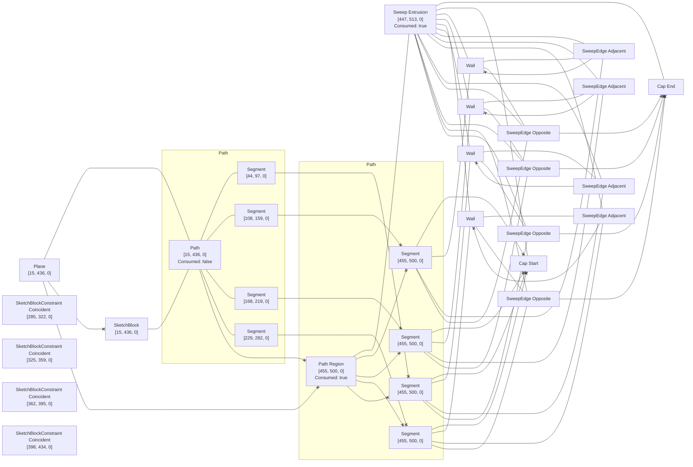

```mermaid
flowchart LR
  subgraph path7 [Path]
    7["Path<br>[15, 436, 0]<br>Consumed: false"]
      %% [ProgramBodyItem { index: 0 }, VariableDeclarationDeclaration, VariableDeclarationInit]
    10["Segment<br>[44, 97, 0]"]
      %% [ProgramBodyItem { index: 0 }, VariableDeclarationDeclaration, VariableDeclarationInit, SketchBlockBody, SketchBlockBodyItem { index: 0 }, VariableDeclarationDeclaration, VariableDeclarationInit]
    11["Segment<br>[108, 159, 0]"]
      %% [ProgramBodyItem { index: 0 }, VariableDeclarationDeclaration, VariableDeclarationInit, SketchBlockBody, SketchBlockBodyItem { index: 1 }, VariableDeclarationDeclaration, VariableDeclarationInit]
    12["Segment<br>[168, 219, 0]"]
      %% [ProgramBodyItem { index: 0 }, VariableDeclarationDeclaration, VariableDeclarationInit, SketchBlockBody, SketchBlockBodyItem { index: 2 }, VariableDeclarationDeclaration, VariableDeclarationInit]
    13["Segment<br>[229, 282, 0]"]
      %% [ProgramBodyItem { index: 0 }, VariableDeclarationDeclaration, VariableDeclarationInit, SketchBlockBody, SketchBlockBodyItem { index: 3 }, VariableDeclarationDeclaration, VariableDeclarationInit]
  end
  subgraph path19 [Path]
    19["Path Region<br>[455, 500, 0]<br>Consumed: true"]
      %% [ProgramBodyItem { index: 1 }, VariableDeclarationDeclaration, VariableDeclarationInit, CallKwUnlabeledArg]
    20["Segment<br>[455, 500, 0]"]
      %% [ProgramBodyItem { index: 1 }, VariableDeclarationDeclaration, VariableDeclarationInit, CallKwUnlabeledArg]
    21["Segment<br>[455, 500, 0]"]
      %% [ProgramBodyItem { index: 1 }, VariableDeclarationDeclaration, VariableDeclarationInit, CallKwUnlabeledArg]
    22["Segment<br>[455, 500, 0]"]
      %% [ProgramBodyItem { index: 1 }, VariableDeclarationDeclaration, VariableDeclarationInit, CallKwUnlabeledArg]
    23["Segment<br>[455, 500, 0]"]
      %% [ProgramBodyItem { index: 1 }, VariableDeclarationDeclaration, VariableDeclarationInit, CallKwUnlabeledArg]
  end
  1["Cap End"]
    %% face_code_ref=Missing NodePath
  2["Cap Start"]
    %% face_code_ref=Missing NodePath
  3[Wall]
    %% face_code_ref=Missing NodePath
  4[Wall]
    %% face_code_ref=Missing NodePath
  5[Wall]
    %% face_code_ref=Missing NodePath
  6[Wall]
    %% face_code_ref=Missing NodePath
  8["Plane<br>[15, 436, 0]"]
    %% [ProgramBodyItem { index: 0 }, VariableDeclarationDeclaration, VariableDeclarationInit]
  9["SketchBlock<br>[15, 436, 0]"]
    %% [ProgramBodyItem { index: 0 }, VariableDeclarationDeclaration, VariableDeclarationInit]
  14["SketchBlockConstraint Coincident<br>[285, 322, 0]"]
    %% [ProgramBodyItem { index: 0 }, VariableDeclarationDeclaration, VariableDeclarationInit, SketchBlockBody, SketchBlockBodyItem { index: 4 }, ExpressionStatementExpr]
  15["SketchBlockConstraint Coincident<br>[325, 359, 0]"]
    %% [ProgramBodyItem { index: 0 }, VariableDeclarationDeclaration, VariableDeclarationInit, SketchBlockBody, SketchBlockBodyItem { index: 5 }, ExpressionStatementExpr]
  16["SketchBlockConstraint Coincident<br>[362, 395, 0]"]
    %% [ProgramBodyItem { index: 0 }, VariableDeclarationDeclaration, VariableDeclarationInit, SketchBlockBody, SketchBlockBodyItem { index: 6 }, ExpressionStatementExpr]
  17["SketchBlockConstraint Coincident<br>[398, 434, 0]"]
    %% [ProgramBodyItem { index: 0 }, VariableDeclarationDeclaration, VariableDeclarationInit, SketchBlockBody, SketchBlockBodyItem { index: 7 }, ExpressionStatementExpr]
  18["Sweep Extrusion<br>[447, 513, 0]<br>Consumed: true"]
    %% [ProgramBodyItem { index: 1 }, VariableDeclarationDeclaration, VariableDeclarationInit]
  24["SweepEdge Adjacent"]
  25["SweepEdge Adjacent"]
  26["SweepEdge Adjacent"]
  27["SweepEdge Adjacent"]
  28["SweepEdge Opposite"]
  29["SweepEdge Opposite"]
  30["SweepEdge Opposite"]
  31["SweepEdge Opposite"]
  18 --- 1
  28 <--x 1
  29 <--x 1
  30 <--x 1
  31 <--x 1
  18 --- 2
  20 <--x 2
  21 <--x 2
  22 <--x 2
  23 <--x 2
  18 --- 3
  20 --- 3
  3 --- 24
  24 <--x 3
  3 --- 28
  18 --- 4
  21 --- 4
  4 --- 25
  25 <--x 4
  4 --- 29
  18 --- 5
  22 --- 5
  5 --- 26
  26 <--x 5
  5 --- 30
  18 --- 6
  23 --- 6
  6 --- 27
  27 <--x 6
  6 --- 31
  8 --- 7
  9 --- 7
  7 --- 10
  7 --- 11
  7 --- 12
  7 --- 13
  7 <--x 19
  8 <--x 9
  8 <--x 19
  10 <--x 23
  11 <--x 20
  12 <--x 21
  13 <--x 22
  19 ---- 18
  18 --- 24
  18 --- 25
  18 --- 26
  18 --- 27
  18 --- 28
  18 --- 29
  18 --- 30
  18 --- 31
  19 <--x 20
  19 <--x 21
  19 <--x 22
  19 <--x 23
  20 --- 24
  20 --- 28
  21 --- 25
  21 --- 29
  22 --- 26
  22 --- 30
  23 --- 27
  23 --- 31
```
