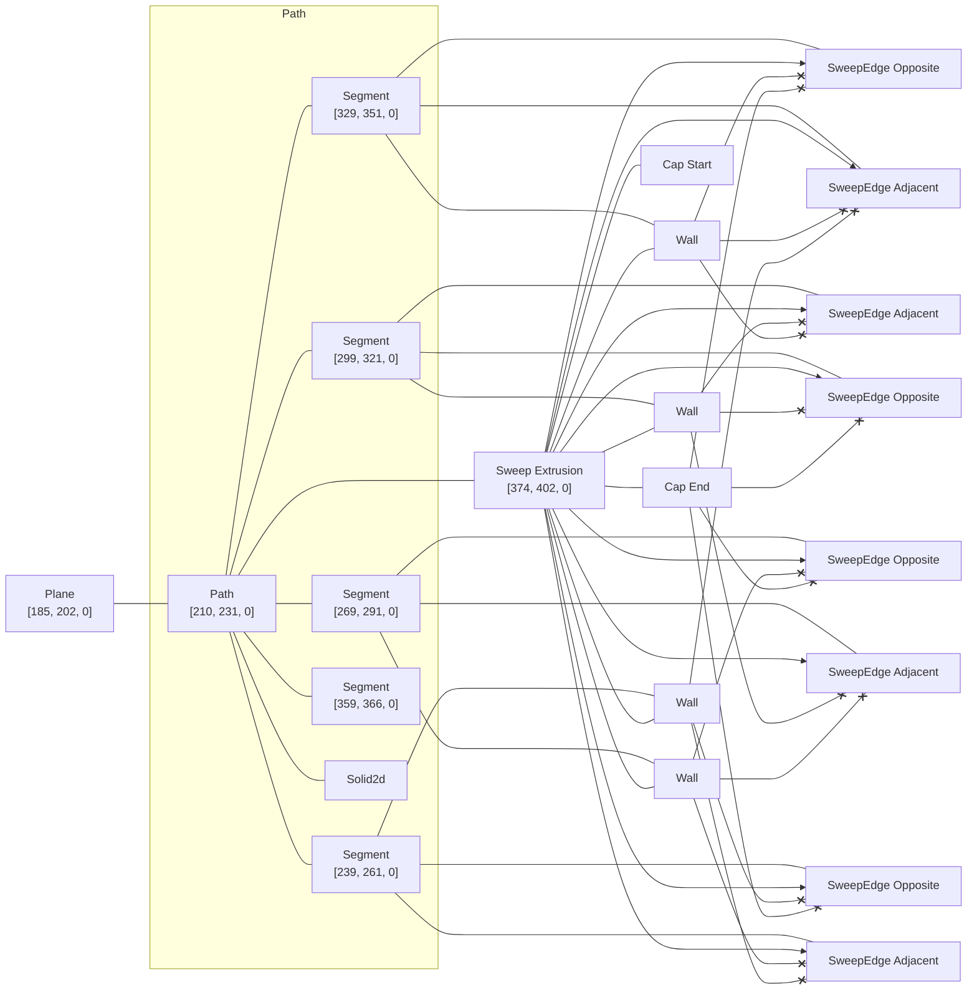

```mermaid
flowchart LR
  subgraph path2 [Path]
    2["Path<br>[210, 231, 0]"]
    3["Segment<br>[239, 261, 0]"]
    4["Segment<br>[269, 291, 0]"]
    5["Segment<br>[299, 321, 0]"]
    6["Segment<br>[329, 351, 0]"]
    7["Segment<br>[359, 366, 0]"]
    8[Solid2d]
  end
  1["Plane<br>[185, 202, 0]"]
  9["Sweep Extrusion<br>[374, 402, 0]"]
  10[Wall]
  11[Wall]
  12[Wall]
  13[Wall]
  14["Cap Start"]
  15["Cap End"]
  16["SweepEdge Opposite"]
  17["SweepEdge Opposite"]
  18["SweepEdge Opposite"]
  19["SweepEdge Opposite"]
  20["SweepEdge Adjacent"]
  21["SweepEdge Adjacent"]
  22["SweepEdge Adjacent"]
  23["SweepEdge Adjacent"]
  1 --- 2
  2 --- 3
  2 --- 4
  2 --- 5
  2 --- 6
  2 --- 7
  2 --- 8
  2 ---- 9
  3 --- 13
  3 --- 16
  3 --- 22
  4 --- 11
  4 --- 17
  4 --- 20
  5 --- 10
  5 --- 18
  5 --- 21
  6 --- 12
  6 --- 19
  6 --- 23
  9 --- 10
  9 --- 11
  9 --- 12
  9 --- 13
  9 --- 14
  9 --- 15
  9 x--> 16
  9 x--> 17
  9 x--> 18
  9 x--> 19
  9 x--> 20
  9 x--> 21
  9 x--> 22
  9 x--> 23
  10 <--x 18
  10 <--x 20
  10 <--x 21
  11 <--x 17
  11 <--x 20
  11 <--x 22
  12 <--x 19
  12 <--x 21
  12 <--x 23
  13 <--x 16
  13 <--x 22
  13 <--x 23
  15 <--x 16
  15 <--x 17
  15 <--x 18
  15 <--x 19
```
