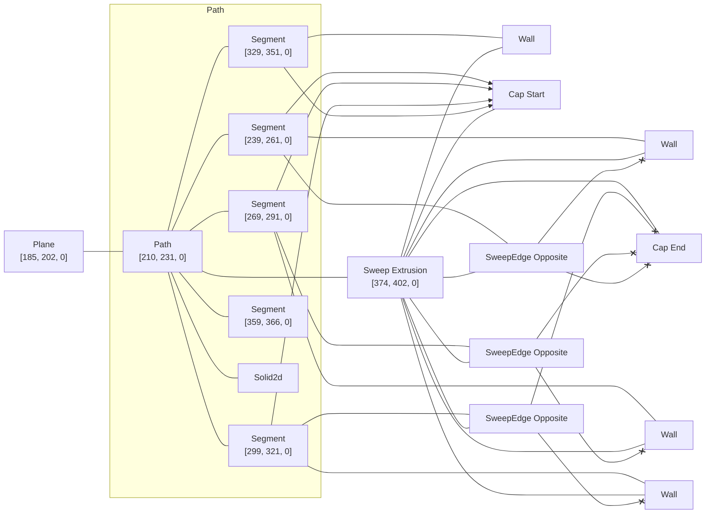

```mermaid
flowchart LR
  subgraph path2 [Path]
    2["Path<br>[210, 231, 0]"]
    3["Segment<br>[239, 261, 0]"]
    4["Segment<br>[269, 291, 0]"]
    5["Segment<br>[299, 321, 0]"]
    6["Segment<br>[329, 351, 0]"]
    7["Segment<br>[359, 366, 0]"]
    8[Solid2d]
  end
  1["Plane<br>[185, 202, 0]"]
  9["Sweep Extrusion<br>[374, 402, 0]"]
  10[Wall]
  11[Wall]
  12[Wall]
  13[Wall]
  14["Cap Start"]
  15["Cap End"]
  16["SweepEdge Opposite"]
  17["SweepEdge Opposite"]
  18["SweepEdge Opposite"]
  1 --- 2
  2 --- 3
  2 --- 4
  2 --- 5
  2 --- 6
  2 --- 7
  2 ---- 9
  2 --- 8
  3 --- 13
  3 --- 18
  3 x--> 14
  4 --- 12
  4 --- 17
  4 x--> 14
  5 --- 11
  5 --- 16
  5 x--> 14
  6 --- 10
  6 x--> 14
  9 --- 10
  9 --- 11
  9 --- 12
  9 --- 13
  9 --- 14
  9 --- 15
  9 --- 16
  9 --- 17
  9 --- 18
  16 <--x 11
  16 <--x 15
  17 <--x 12
  17 <--x 15
  18 <--x 13
  18 <--x 15
```
