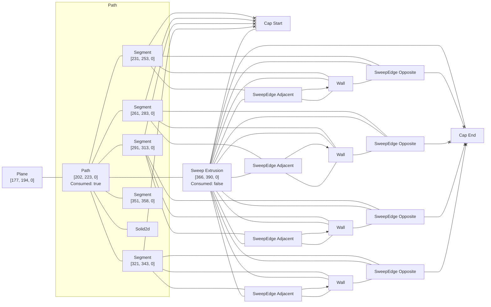

```mermaid
flowchart LR
  subgraph path3 [Path]
    3["Path<br>[202, 223, 0]<br>Consumed: true"]
      %% [ProgramBodyItem { index: 0 }, VariableDeclarationDeclaration, VariableDeclarationInit, FunctionExpressionBody, FunctionExpressionBodyItem { index: 7 }, ReturnStatementArg, PipeBodyItem { index: 1 }]
    5["Segment<br>[231, 253, 0]"]
      %% [ProgramBodyItem { index: 0 }, VariableDeclarationDeclaration, VariableDeclarationInit, FunctionExpressionBody, FunctionExpressionBodyItem { index: 7 }, ReturnStatementArg, PipeBodyItem { index: 2 }]
    6["Segment<br>[261, 283, 0]"]
      %% [ProgramBodyItem { index: 0 }, VariableDeclarationDeclaration, VariableDeclarationInit, FunctionExpressionBody, FunctionExpressionBodyItem { index: 7 }, ReturnStatementArg, PipeBodyItem { index: 3 }]
    7["Segment<br>[291, 313, 0]"]
      %% [ProgramBodyItem { index: 0 }, VariableDeclarationDeclaration, VariableDeclarationInit, FunctionExpressionBody, FunctionExpressionBodyItem { index: 7 }, ReturnStatementArg, PipeBodyItem { index: 4 }]
    8["Segment<br>[321, 343, 0]"]
      %% [ProgramBodyItem { index: 0 }, VariableDeclarationDeclaration, VariableDeclarationInit, FunctionExpressionBody, FunctionExpressionBodyItem { index: 7 }, ReturnStatementArg, PipeBodyItem { index: 5 }]
    9["Segment<br>[351, 358, 0]"]
      %% [ProgramBodyItem { index: 0 }, VariableDeclarationDeclaration, VariableDeclarationInit, FunctionExpressionBody, FunctionExpressionBodyItem { index: 7 }, ReturnStatementArg, PipeBodyItem { index: 6 }]
    10[Solid2d]
  end
  1["Cap End"]
    %% face_code_ref=Missing NodePath
  2["Cap Start"]
    %% face_code_ref=Missing NodePath
  4["Plane<br>[177, 194, 0]"]
    %% [ProgramBodyItem { index: 0 }, VariableDeclarationDeclaration, VariableDeclarationInit, FunctionExpressionBody, FunctionExpressionBodyItem { index: 7 }, ReturnStatementArg, PipeBodyItem { index: 0 }]
  11["Sweep Extrusion<br>[366, 390, 0]<br>Consumed: false"]
    %% [ProgramBodyItem { index: 0 }, VariableDeclarationDeclaration, VariableDeclarationInit, FunctionExpressionBody, FunctionExpressionBodyItem { index: 7 }, ReturnStatementArg, PipeBodyItem { index: 7 }]
  12["SweepEdge Adjacent"]
  13["SweepEdge Adjacent"]
  14["SweepEdge Adjacent"]
  15["SweepEdge Adjacent"]
  16["SweepEdge Opposite"]
  17["SweepEdge Opposite"]
  18["SweepEdge Opposite"]
  19["SweepEdge Opposite"]
  20[Wall]
    %% face_code_ref=Missing NodePath
  21[Wall]
    %% face_code_ref=Missing NodePath
  22[Wall]
    %% face_code_ref=Missing NodePath
  23[Wall]
    %% face_code_ref=Missing NodePath
  11 --- 1
  16 <--x 1
  17 <--x 1
  18 <--x 1
  19 <--x 1
  5 <--x 2
  6 <--x 2
  7 <--x 2
  8 <--x 2
  11 --- 2
  4 --- 3
  3 --- 5
  3 --- 6
  3 --- 7
  3 --- 8
  3 --- 9
  3 --- 10
  3 ---- 11
  5 --- 12
  5 --- 16
  5 --- 20
  6 --- 13
  6 --- 17
  6 --- 21
  7 --- 14
  7 --- 18
  7 --- 22
  8 --- 15
  8 --- 19
  8 --- 23
  11 --- 12
  11 --- 13
  11 --- 14
  11 --- 15
  11 --- 16
  11 --- 17
  11 --- 18
  11 --- 19
  11 --- 20
  11 --- 21
  11 --- 22
  11 --- 23
  20 --- 12
  12 x--> 20
  21 --- 13
  13 x--> 21
  22 --- 14
  14 x--> 22
  15 x--> 23
  23 --- 15
  20 --- 16
  21 --- 17
  22 --- 18
  23 --- 19
```
