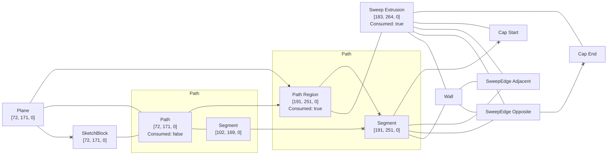

```mermaid
flowchart LR
  subgraph path3 [Path]
    3["Path Region<br>[191, 251, 0]<br>Consumed: true"]
      %% [ProgramBodyItem { index: 1 }, VariableDeclarationDeclaration, VariableDeclarationInit, CallKwUnlabeledArg]
    7["Segment<br>[191, 251, 0]"]
      %% [ProgramBodyItem { index: 1 }, VariableDeclarationDeclaration, VariableDeclarationInit, CallKwUnlabeledArg]
  end
  subgraph path4 [Path]
    4["Path<br>[72, 171, 0]<br>Consumed: false"]
      %% [ProgramBodyItem { index: 0 }, VariableDeclarationDeclaration, VariableDeclarationInit]
    6["Segment<br>[102, 169, 0]"]
      %% [ProgramBodyItem { index: 0 }, VariableDeclarationDeclaration, VariableDeclarationInit, SketchBlockBody, SketchBlockBodyItem { index: 0 }, VariableDeclarationDeclaration, VariableDeclarationInit]
  end
  1["Cap End"]
    %% face_code_ref=Missing NodePath
  2["Cap Start"]
    %% face_code_ref=Missing NodePath
  5["Plane<br>[72, 171, 0]"]
    %% [ProgramBodyItem { index: 0 }, VariableDeclarationDeclaration, VariableDeclarationInit]
  8["SketchBlock<br>[72, 171, 0]"]
    %% [ProgramBodyItem { index: 0 }, VariableDeclarationDeclaration, VariableDeclarationInit]
  9["Sweep Extrusion<br>[183, 264, 0]<br>Consumed: true"]
    %% [ProgramBodyItem { index: 1 }, VariableDeclarationDeclaration, VariableDeclarationInit]
  10["SweepEdge Adjacent"]
  11["SweepEdge Opposite"]
  12[Wall]
    %% face_code_ref=Missing NodePath
  9 --- 1
  11 <--x 1
  7 <--x 2
  9 --- 2
  4 x--> 3
  5 x--> 3
  3 <--x 7
  3 ---- 9
  5 --- 4
  4 --- 6
  8 --- 4
  5 <--x 8
  6 <--x 7
  7 --- 10
  7 --- 11
  7 --- 12
  9 --- 10
  9 --- 11
  9 --- 12
  12 --- 10
  12 --- 11
```
