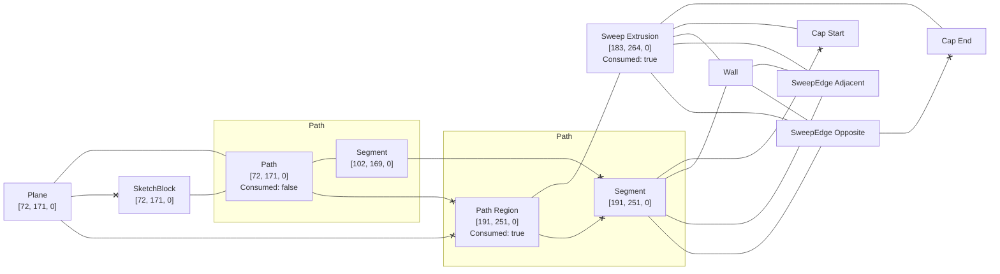

```mermaid
flowchart LR
  subgraph path4 [Path]
    4["Path<br>[72, 171, 0]<br>Consumed: false"]
      %% [ProgramBodyItem { index: 0 }, VariableDeclarationDeclaration, VariableDeclarationInit]
    7["Segment<br>[102, 169, 0]"]
      %% [ProgramBodyItem { index: 0 }, VariableDeclarationDeclaration, VariableDeclarationInit, SketchBlockBody, SketchBlockBodyItem { index: 0 }, VariableDeclarationDeclaration, VariableDeclarationInit]
  end
  subgraph path9 [Path]
    9["Path Region<br>[191, 251, 0]<br>Consumed: true"]
      %% [ProgramBodyItem { index: 1 }, VariableDeclarationDeclaration, VariableDeclarationInit, CallKwUnlabeledArg]
    10["Segment<br>[191, 251, 0]"]
      %% [ProgramBodyItem { index: 1 }, VariableDeclarationDeclaration, VariableDeclarationInit, CallKwUnlabeledArg]
  end
  1["Cap End"]
    %% face_code_ref=Missing NodePath
  2["Cap Start"]
    %% face_code_ref=Missing NodePath
  3[Wall]
    %% face_code_ref=Missing NodePath
  5["Plane<br>[72, 171, 0]"]
    %% [ProgramBodyItem { index: 0 }, VariableDeclarationDeclaration, VariableDeclarationInit]
  6["SketchBlock<br>[72, 171, 0]"]
    %% [ProgramBodyItem { index: 0 }, VariableDeclarationDeclaration, VariableDeclarationInit]
  8["Sweep Extrusion<br>[183, 264, 0]<br>Consumed: true"]
    %% [ProgramBodyItem { index: 1 }, VariableDeclarationDeclaration, VariableDeclarationInit]
  11["SweepEdge Adjacent"]
  12["SweepEdge Opposite"]
  8 --- 1
  12 <--x 1
  8 --- 2
  10 <--x 2
  8 --- 3
  10 --- 3
  3 --- 11
  3 --- 12
  5 --- 4
  6 --- 4
  4 --- 7
  4 <--x 9
  5 <--x 6
  5 <--x 9
  7 <--x 10
  9 ---- 8
  8 --- 11
  8 --- 12
  9 <--x 10
  10 --- 11
  10 --- 12
```
