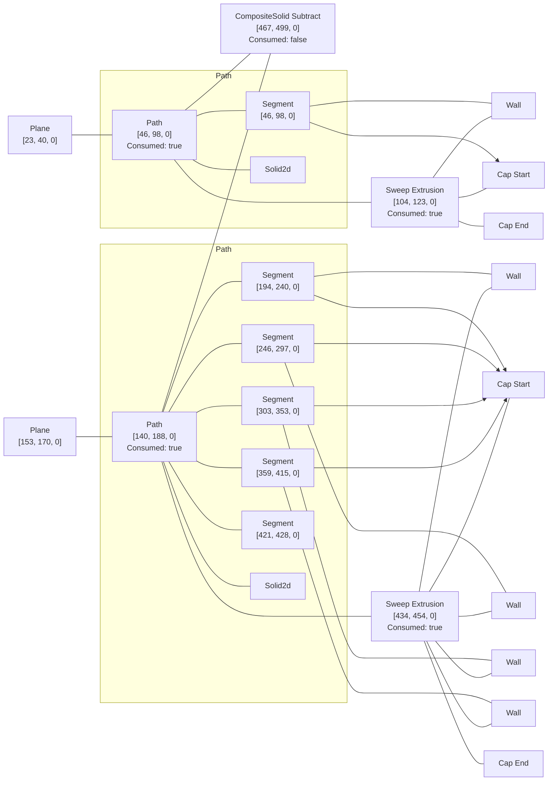

```mermaid
flowchart LR
  subgraph path2 [Path]
    2["Path<br>[46, 98, 0]<br>Consumed: true"]
      %% [ProgramBodyItem { index: 0 }, VariableDeclarationDeclaration, VariableDeclarationInit, PipeBodyItem { index: 1 }]
    3["Segment<br>[46, 98, 0]"]
      %% [ProgramBodyItem { index: 0 }, VariableDeclarationDeclaration, VariableDeclarationInit, PipeBodyItem { index: 1 }]
    4[Solid2d]
  end
  subgraph path10 [Path]
    10["Path<br>[140, 188, 0]<br>Consumed: true"]
      %% [ProgramBodyItem { index: 1 }, VariableDeclarationDeclaration, VariableDeclarationInit, PipeBodyItem { index: 0 }]
    11["Segment<br>[194, 240, 0]"]
      %% [ProgramBodyItem { index: 1 }, VariableDeclarationDeclaration, VariableDeclarationInit, PipeBodyItem { index: 1 }]
    12["Segment<br>[246, 297, 0]"]
      %% [ProgramBodyItem { index: 1 }, VariableDeclarationDeclaration, VariableDeclarationInit, PipeBodyItem { index: 2 }]
    13["Segment<br>[303, 353, 0]"]
      %% [ProgramBodyItem { index: 1 }, VariableDeclarationDeclaration, VariableDeclarationInit, PipeBodyItem { index: 3 }]
    14["Segment<br>[359, 415, 0]"]
      %% [ProgramBodyItem { index: 1 }, VariableDeclarationDeclaration, VariableDeclarationInit, PipeBodyItem { index: 4 }]
    15["Segment<br>[421, 428, 0]"]
      %% [ProgramBodyItem { index: 1 }, VariableDeclarationDeclaration, VariableDeclarationInit, PipeBodyItem { index: 5 }]
    16[Solid2d]
  end
  1["Plane<br>[23, 40, 0]"]
    %% [ProgramBodyItem { index: 0 }, VariableDeclarationDeclaration, VariableDeclarationInit, PipeBodyItem { index: 0 }]
  5["Sweep Extrusion<br>[104, 123, 0]<br>Consumed: true"]
    %% [ProgramBodyItem { index: 0 }, VariableDeclarationDeclaration, VariableDeclarationInit, PipeBodyItem { index: 2 }]
  6[Wall]
    %% face_code_ref=Missing NodePath
  7["Cap Start"]
    %% face_code_ref=Missing NodePath
  8["Cap End"]
    %% face_code_ref=Missing NodePath
  9["Plane<br>[153, 170, 0]"]
    %% [ProgramBodyItem { index: 1 }, VariableDeclarationDeclaration, VariableDeclarationInit, PipeBodyItem { index: 0 }, CallKwUnlabeledArg]
  17["Sweep Extrusion<br>[434, 454, 0]<br>Consumed: true"]
    %% [ProgramBodyItem { index: 1 }, VariableDeclarationDeclaration, VariableDeclarationInit, PipeBodyItem { index: 6 }]
  18[Wall]
    %% face_code_ref=Missing NodePath
  19[Wall]
    %% face_code_ref=Missing NodePath
  20[Wall]
    %% face_code_ref=Missing NodePath
  21[Wall]
    %% face_code_ref=Missing NodePath
  22["Cap Start"]
    %% face_code_ref=Missing NodePath
  23["Cap End"]
    %% face_code_ref=Missing NodePath
  24["CompositeSolid Subtract<br>[467, 499, 0]<br>Consumed: false"]
    %% [ProgramBodyItem { index: 2 }, VariableDeclarationDeclaration, VariableDeclarationInit]
  1 --- 2
  2 --- 3
  2 --- 4
  2 ---- 5
  2 --- 24
  3 --- 6
  3 x--> 7
  5 --- 6
  5 --- 7
  5 --- 8
  9 --- 10
  10 --- 11
  10 --- 12
  10 --- 13
  10 --- 14
  10 --- 15
  10 --- 16
  10 ---- 17
  10 --- 24
  11 --- 18
  11 x--> 22
  12 --- 19
  12 x--> 22
  13 --- 20
  13 x--> 22
  14 --- 21
  14 x--> 22
  17 --- 18
  17 --- 19
  17 --- 20
  17 --- 21
  17 --- 22
  17 --- 23
```
