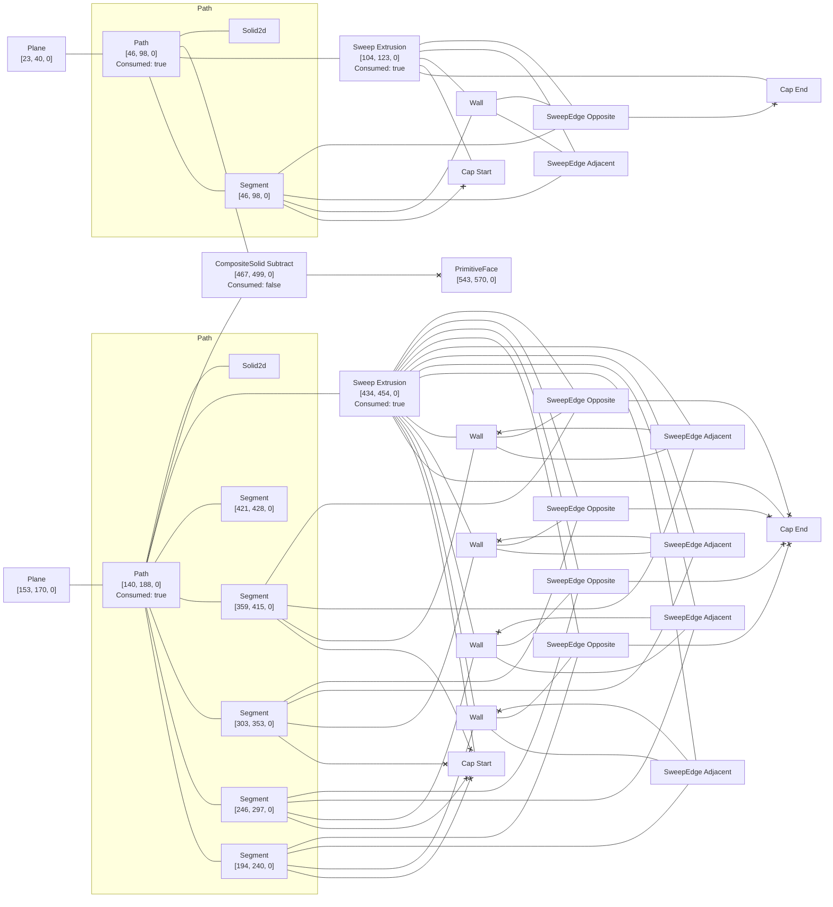

```mermaid
flowchart LR
  subgraph path11 [Path]
    11["Path<br>[46, 98, 0]<br>Consumed: true"]
      %% [ProgramBodyItem { index: 0 }, VariableDeclarationDeclaration, VariableDeclarationInit, PipeBodyItem { index: 1 }]
    12["Segment<br>[46, 98, 0]"]
      %% [ProgramBodyItem { index: 0 }, VariableDeclarationDeclaration, VariableDeclarationInit, PipeBodyItem { index: 1 }]
    25[Solid2d]
  end
  subgraph path14 [Path]
    14["Path<br>[140, 188, 0]<br>Consumed: true"]
      %% [ProgramBodyItem { index: 1 }, VariableDeclarationDeclaration, VariableDeclarationInit, PipeBodyItem { index: 0 }]
    16["Segment<br>[194, 240, 0]"]
      %% [ProgramBodyItem { index: 1 }, VariableDeclarationDeclaration, VariableDeclarationInit, PipeBodyItem { index: 1 }]
    17["Segment<br>[246, 297, 0]"]
      %% [ProgramBodyItem { index: 1 }, VariableDeclarationDeclaration, VariableDeclarationInit, PipeBodyItem { index: 2 }]
    18["Segment<br>[303, 353, 0]"]
      %% [ProgramBodyItem { index: 1 }, VariableDeclarationDeclaration, VariableDeclarationInit, PipeBodyItem { index: 3 }]
    19["Segment<br>[359, 415, 0]"]
      %% [ProgramBodyItem { index: 1 }, VariableDeclarationDeclaration, VariableDeclarationInit, PipeBodyItem { index: 4 }]
    20["Segment<br>[421, 428, 0]"]
      %% [ProgramBodyItem { index: 1 }, VariableDeclarationDeclaration, VariableDeclarationInit, PipeBodyItem { index: 5 }]
    24[Solid2d]
  end
  1["Cap End"]
    %% face_code_ref=Missing NodePath
  2["Cap End"]
    %% face_code_ref=Missing NodePath
  3["Cap Start"]
    %% face_code_ref=Missing NodePath
  4["Cap Start"]
    %% face_code_ref=Missing NodePath
  5[Wall]
    %% face_code_ref=Missing NodePath
  6[Wall]
    %% face_code_ref=Missing NodePath
  7[Wall]
    %% face_code_ref=Missing NodePath
  8[Wall]
    %% face_code_ref=Missing NodePath
  9[Wall]
    %% face_code_ref=Missing NodePath
  10["Plane<br>[23, 40, 0]"]
    %% [ProgramBodyItem { index: 0 }, VariableDeclarationDeclaration, VariableDeclarationInit, PipeBodyItem { index: 0 }]
  13["Sweep Extrusion<br>[104, 123, 0]<br>Consumed: true"]
    %% [ProgramBodyItem { index: 0 }, VariableDeclarationDeclaration, VariableDeclarationInit, PipeBodyItem { index: 2 }]
  15["Plane<br>[153, 170, 0]"]
    %% [ProgramBodyItem { index: 1 }, VariableDeclarationDeclaration, VariableDeclarationInit, PipeBodyItem { index: 0 }, CallKwUnlabeledArg]
  21["Sweep Extrusion<br>[434, 454, 0]<br>Consumed: true"]
    %% [ProgramBodyItem { index: 1 }, VariableDeclarationDeclaration, VariableDeclarationInit, PipeBodyItem { index: 6 }]
  22["CompositeSolid Subtract<br>[467, 499, 0]<br>Consumed: false"]
    %% [ProgramBodyItem { index: 2 }, VariableDeclarationDeclaration, VariableDeclarationInit]
  23["PrimitiveFace<br>[543, 570, 0]"]
    %% [ProgramBodyItem { index: 3 }, VariableDeclarationDeclaration, VariableDeclarationInit, CallKwArg { index: 0 }, ArrayElement { index: 0 }]
  26["SweepEdge Adjacent"]
  27["SweepEdge Adjacent"]
  28["SweepEdge Adjacent"]
  29["SweepEdge Adjacent"]
  30["SweepEdge Adjacent"]
  31["SweepEdge Opposite"]
  32["SweepEdge Opposite"]
  33["SweepEdge Opposite"]
  34["SweepEdge Opposite"]
  35["SweepEdge Opposite"]
  13 --- 1
  35 <--x 1
  21 --- 2
  31 <--x 2
  32 <--x 2
  33 <--x 2
  34 <--x 2
  12 <--x 3
  13 --- 3
  16 <--x 4
  17 <--x 4
  18 <--x 4
  19 <--x 4
  21 --- 4
  16 --- 5
  21 --- 5
  5 --- 26
  26 <--x 5
  5 --- 31
  17 --- 6
  21 --- 6
  6 --- 27
  27 <--x 6
  6 --- 32
  18 --- 7
  21 --- 7
  7 --- 28
  28 <--x 7
  7 --- 33
  19 --- 8
  21 --- 8
  8 --- 29
  29 <--x 8
  8 --- 34
  12 --- 9
  13 --- 9
  9 --- 30
  9 --- 35
  10 --- 11
  11 --- 12
  11 ---- 13
  11 --- 22
  11 --- 25
  12 --- 30
  12 --- 35
  13 --- 30
  13 --- 35
  15 --- 14
  14 --- 16
  14 --- 17
  14 --- 18
  14 --- 19
  14 --- 20
  14 ---- 21
  14 --- 22
  14 --- 24
  16 --- 26
  16 --- 31
  17 --- 27
  17 --- 32
  18 --- 28
  18 --- 33
  19 --- 29
  19 --- 34
  21 --- 26
  21 --- 27
  21 --- 28
  21 --- 29
  21 --- 31
  21 --- 32
  21 --- 33
  21 --- 34
  22 <--x 23
```
