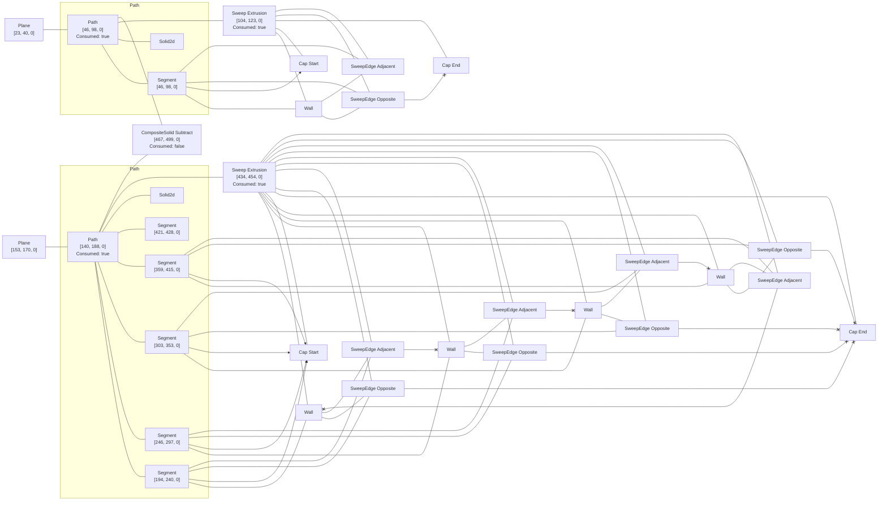

```mermaid
flowchart LR
  subgraph path2 [Path]
    2["Path<br>[46, 98, 0]<br>Consumed: true"]
      %% [ProgramBodyItem { index: 0 }, VariableDeclarationDeclaration, VariableDeclarationInit, PipeBodyItem { index: 1 }]
    3["Segment<br>[46, 98, 0]"]
      %% [ProgramBodyItem { index: 0 }, VariableDeclarationDeclaration, VariableDeclarationInit, PipeBodyItem { index: 1 }]
    4[Solid2d]
  end
  subgraph path12 [Path]
    12["Path<br>[140, 188, 0]<br>Consumed: true"]
      %% [ProgramBodyItem { index: 1 }, VariableDeclarationDeclaration, VariableDeclarationInit, PipeBodyItem { index: 0 }]
    13["Segment<br>[194, 240, 0]"]
      %% [ProgramBodyItem { index: 1 }, VariableDeclarationDeclaration, VariableDeclarationInit, PipeBodyItem { index: 1 }]
    14["Segment<br>[246, 297, 0]"]
      %% [ProgramBodyItem { index: 1 }, VariableDeclarationDeclaration, VariableDeclarationInit, PipeBodyItem { index: 2 }]
    15["Segment<br>[303, 353, 0]"]
      %% [ProgramBodyItem { index: 1 }, VariableDeclarationDeclaration, VariableDeclarationInit, PipeBodyItem { index: 3 }]
    16["Segment<br>[359, 415, 0]"]
      %% [ProgramBodyItem { index: 1 }, VariableDeclarationDeclaration, VariableDeclarationInit, PipeBodyItem { index: 4 }]
    17["Segment<br>[421, 428, 0]"]
      %% [ProgramBodyItem { index: 1 }, VariableDeclarationDeclaration, VariableDeclarationInit, PipeBodyItem { index: 5 }]
    18[Solid2d]
  end
  1["Plane<br>[23, 40, 0]"]
    %% [ProgramBodyItem { index: 0 }, VariableDeclarationDeclaration, VariableDeclarationInit, PipeBodyItem { index: 0 }]
  5["Sweep Extrusion<br>[104, 123, 0]<br>Consumed: true"]
    %% [ProgramBodyItem { index: 0 }, VariableDeclarationDeclaration, VariableDeclarationInit, PipeBodyItem { index: 2 }]
  6[Wall]
    %% face_code_ref=Missing NodePath
  7["Cap Start"]
    %% face_code_ref=Missing NodePath
  8["Cap End"]
    %% face_code_ref=Missing NodePath
  9["SweepEdge Opposite"]
  10["SweepEdge Adjacent"]
  11["Plane<br>[153, 170, 0]"]
    %% [ProgramBodyItem { index: 1 }, VariableDeclarationDeclaration, VariableDeclarationInit, PipeBodyItem { index: 0 }, CallKwUnlabeledArg]
  19["Sweep Extrusion<br>[434, 454, 0]<br>Consumed: true"]
    %% [ProgramBodyItem { index: 1 }, VariableDeclarationDeclaration, VariableDeclarationInit, PipeBodyItem { index: 6 }]
  20[Wall]
    %% face_code_ref=Missing NodePath
  21[Wall]
    %% face_code_ref=Missing NodePath
  22[Wall]
    %% face_code_ref=Missing NodePath
  23[Wall]
    %% face_code_ref=Missing NodePath
  24["Cap Start"]
    %% face_code_ref=Missing NodePath
  25["Cap End"]
    %% face_code_ref=Missing NodePath
  26["SweepEdge Opposite"]
  27["SweepEdge Adjacent"]
  28["SweepEdge Opposite"]
  29["SweepEdge Adjacent"]
  30["SweepEdge Opposite"]
  31["SweepEdge Adjacent"]
  32["SweepEdge Opposite"]
  33["SweepEdge Adjacent"]
  34["CompositeSolid Subtract<br>[467, 499, 0]<br>Consumed: false"]
    %% [ProgramBodyItem { index: 2 }, VariableDeclarationDeclaration, VariableDeclarationInit]
  1 --- 2
  2 --- 3
  2 --- 4
  2 ---- 5
  2 --- 34
  3 --- 6
  3 x--> 7
  3 --- 9
  3 --- 10
  5 --- 6
  5 --- 7
  5 --- 8
  5 --- 9
  5 --- 10
  6 --- 9
  6 --- 10
  9 <--x 8
  11 --- 12
  12 --- 13
  12 --- 14
  12 --- 15
  12 --- 16
  12 --- 17
  12 --- 18
  12 ---- 19
  12 --- 34
  13 --- 20
  13 x--> 24
  13 --- 26
  13 --- 27
  14 --- 21
  14 x--> 24
  14 --- 28
  14 --- 29
  15 --- 22
  15 x--> 24
  15 --- 30
  15 --- 31
  16 --- 23
  16 x--> 24
  16 --- 32
  16 --- 33
  19 --- 20
  19 --- 21
  19 --- 22
  19 --- 23
  19 --- 24
  19 --- 25
  19 --- 26
  19 --- 27
  19 --- 28
  19 --- 29
  19 --- 30
  19 --- 31
  19 --- 32
  19 --- 33
  20 --- 26
  20 --- 27
  33 <--x 20
  27 <--x 21
  21 --- 28
  21 --- 29
  29 <--x 22
  22 --- 30
  22 --- 31
  31 <--x 23
  23 --- 32
  23 --- 33
  26 <--x 25
  28 <--x 25
  30 <--x 25
  32 <--x 25
```
