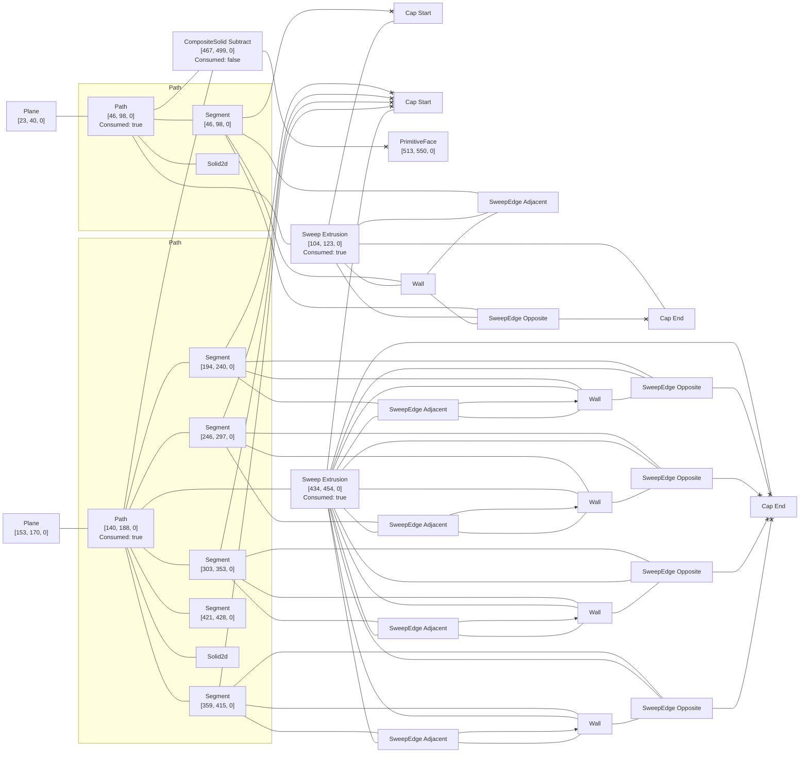

```mermaid
flowchart LR
  subgraph path6 [Path]
    6["Path<br>[140, 188, 0]<br>Consumed: true"]
      %% [ProgramBodyItem { index: 1 }, VariableDeclarationDeclaration, VariableDeclarationInit, PipeBodyItem { index: 0 }]
    11["Segment<br>[194, 240, 0]"]
      %% [ProgramBodyItem { index: 1 }, VariableDeclarationDeclaration, VariableDeclarationInit, PipeBodyItem { index: 1 }]
    12["Segment<br>[246, 297, 0]"]
      %% [ProgramBodyItem { index: 1 }, VariableDeclarationDeclaration, VariableDeclarationInit, PipeBodyItem { index: 2 }]
    13["Segment<br>[303, 353, 0]"]
      %% [ProgramBodyItem { index: 1 }, VariableDeclarationDeclaration, VariableDeclarationInit, PipeBodyItem { index: 3 }]
    14["Segment<br>[359, 415, 0]"]
      %% [ProgramBodyItem { index: 1 }, VariableDeclarationDeclaration, VariableDeclarationInit, PipeBodyItem { index: 4 }]
    15["Segment<br>[421, 428, 0]"]
      %% [ProgramBodyItem { index: 1 }, VariableDeclarationDeclaration, VariableDeclarationInit, PipeBodyItem { index: 5 }]
    17[Solid2d]
  end
  subgraph path7 [Path]
    7["Path<br>[46, 98, 0]<br>Consumed: true"]
      %% [ProgramBodyItem { index: 0 }, VariableDeclarationDeclaration, VariableDeclarationInit, PipeBodyItem { index: 1 }]
    16["Segment<br>[46, 98, 0]"]
      %% [ProgramBodyItem { index: 0 }, VariableDeclarationDeclaration, VariableDeclarationInit, PipeBodyItem { index: 1 }]
    18[Solid2d]
  end
  1["Cap End"]
    %% face_code_ref=Missing NodePath
  2["Cap End"]
    %% face_code_ref=Missing NodePath
  3["Cap Start"]
    %% face_code_ref=Missing NodePath
  4["Cap Start"]
    %% face_code_ref=Missing NodePath
  5["CompositeSolid Subtract<br>[467, 499, 0]<br>Consumed: false"]
    %% [ProgramBodyItem { index: 2 }, VariableDeclarationDeclaration, VariableDeclarationInit]
  8["Plane<br>[153, 170, 0]"]
    %% [ProgramBodyItem { index: 1 }, VariableDeclarationDeclaration, VariableDeclarationInit, PipeBodyItem { index: 0 }, CallKwUnlabeledArg]
  9["Plane<br>[23, 40, 0]"]
    %% [ProgramBodyItem { index: 0 }, VariableDeclarationDeclaration, VariableDeclarationInit, PipeBodyItem { index: 0 }]
  10["PrimitiveFace<br>[513, 550, 0]"]
    %% [ProgramBodyItem { index: 3 }, VariableDeclarationDeclaration, VariableDeclarationInit]
  19["Sweep Extrusion<br>[104, 123, 0]<br>Consumed: true"]
    %% [ProgramBodyItem { index: 0 }, VariableDeclarationDeclaration, VariableDeclarationInit, PipeBodyItem { index: 2 }]
  20["Sweep Extrusion<br>[434, 454, 0]<br>Consumed: true"]
    %% [ProgramBodyItem { index: 1 }, VariableDeclarationDeclaration, VariableDeclarationInit, PipeBodyItem { index: 6 }]
  21["SweepEdge Adjacent"]
  22["SweepEdge Adjacent"]
  23["SweepEdge Adjacent"]
  24["SweepEdge Adjacent"]
  25["SweepEdge Adjacent"]
  26["SweepEdge Opposite"]
  27["SweepEdge Opposite"]
  28["SweepEdge Opposite"]
  29["SweepEdge Opposite"]
  30["SweepEdge Opposite"]
  31[Wall]
    %% face_code_ref=Missing NodePath
  32[Wall]
    %% face_code_ref=Missing NodePath
  33[Wall]
    %% face_code_ref=Missing NodePath
  34[Wall]
    %% face_code_ref=Missing NodePath
  35[Wall]
    %% face_code_ref=Missing NodePath
  19 --- 1
  30 <--x 1
  20 --- 2
  26 <--x 2
  27 <--x 2
  28 <--x 2
  29 <--x 2
  16 <--x 3
  19 --- 3
  11 <--x 4
  12 <--x 4
  13 <--x 4
  14 <--x 4
  20 --- 4
  6 --- 5
  7 --- 5
  5 <--x 10
  8 --- 6
  6 --- 11
  6 --- 12
  6 --- 13
  6 --- 14
  6 --- 15
  6 --- 17
  6 ---- 20
  9 --- 7
  7 --- 16
  7 --- 18
  7 ---- 19
  11 --- 21
  11 --- 26
  11 --- 31
  12 --- 22
  12 --- 27
  12 --- 32
  13 --- 23
  13 --- 28
  13 --- 33
  14 --- 24
  14 --- 29
  14 --- 34
  16 --- 25
  16 --- 30
  16 --- 35
  19 --- 25
  19 --- 30
  19 --- 35
  20 --- 21
  20 --- 22
  20 --- 23
  20 --- 24
  20 --- 26
  20 --- 27
  20 --- 28
  20 --- 29
  20 --- 31
  20 --- 32
  20 --- 33
  20 --- 34
  31 --- 21
  21 x--> 31
  32 --- 22
  22 x--> 32
  33 --- 23
  23 x--> 33
  24 x--> 34
  34 --- 24
  35 --- 25
  31 --- 26
  32 --- 27
  33 --- 28
  34 --- 29
  35 --- 30
```
