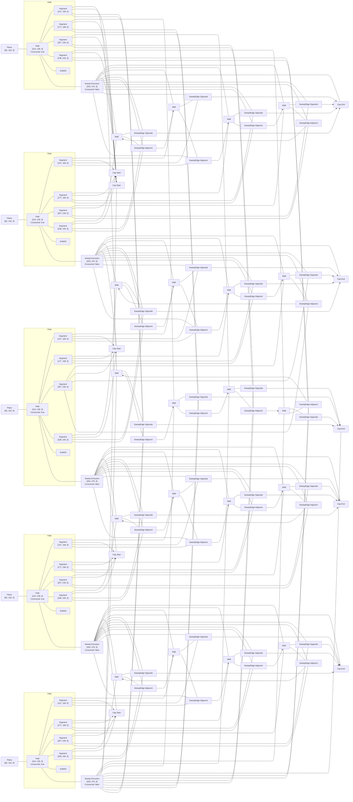

```mermaid
flowchart LR
  subgraph path2 [Path]
    2["Path<br>[110, 139, 0]<br>Consumed: true"]
      %% [ProgramBodyItem { index: 3 }, VariableDeclarationDeclaration, VariableDeclarationInit, FunctionExpressionBody, FunctionExpressionBodyItem { index: 0 }, VariableDeclarationDeclaration, VariableDeclarationInit, PipeBodyItem { index: 1 }]
    3["Segment<br>[147, 169, 0]"]
      %% [ProgramBodyItem { index: 3 }, VariableDeclarationDeclaration, VariableDeclarationInit, FunctionExpressionBody, FunctionExpressionBodyItem { index: 0 }, VariableDeclarationDeclaration, VariableDeclarationInit, PipeBodyItem { index: 2 }]
    4["Segment<br>[177, 199, 0]"]
      %% [ProgramBodyItem { index: 3 }, VariableDeclarationDeclaration, VariableDeclarationInit, FunctionExpressionBody, FunctionExpressionBodyItem { index: 0 }, VariableDeclarationDeclaration, VariableDeclarationInit, PipeBodyItem { index: 3 }]
    5["Segment<br>[207, 230, 0]"]
      %% [ProgramBodyItem { index: 3 }, VariableDeclarationDeclaration, VariableDeclarationInit, FunctionExpressionBody, FunctionExpressionBodyItem { index: 0 }, VariableDeclarationDeclaration, VariableDeclarationInit, PipeBodyItem { index: 4 }]
    6["Segment<br>[238, 245, 0]"]
      %% [ProgramBodyItem { index: 3 }, VariableDeclarationDeclaration, VariableDeclarationInit, FunctionExpressionBody, FunctionExpressionBodyItem { index: 0 }, VariableDeclarationDeclaration, VariableDeclarationInit, PipeBodyItem { index: 5 }]
    7[Solid2d]
  end
  subgraph path24 [Path]
    24["Path<br>[110, 139, 0]<br>Consumed: true"]
      %% [ProgramBodyItem { index: 3 }, VariableDeclarationDeclaration, VariableDeclarationInit, FunctionExpressionBody, FunctionExpressionBodyItem { index: 0 }, VariableDeclarationDeclaration, VariableDeclarationInit, PipeBodyItem { index: 1 }]
    25["Segment<br>[147, 169, 0]"]
      %% [ProgramBodyItem { index: 3 }, VariableDeclarationDeclaration, VariableDeclarationInit, FunctionExpressionBody, FunctionExpressionBodyItem { index: 0 }, VariableDeclarationDeclaration, VariableDeclarationInit, PipeBodyItem { index: 2 }]
    26["Segment<br>[177, 199, 0]"]
      %% [ProgramBodyItem { index: 3 }, VariableDeclarationDeclaration, VariableDeclarationInit, FunctionExpressionBody, FunctionExpressionBodyItem { index: 0 }, VariableDeclarationDeclaration, VariableDeclarationInit, PipeBodyItem { index: 3 }]
    27["Segment<br>[207, 230, 0]"]
      %% [ProgramBodyItem { index: 3 }, VariableDeclarationDeclaration, VariableDeclarationInit, FunctionExpressionBody, FunctionExpressionBodyItem { index: 0 }, VariableDeclarationDeclaration, VariableDeclarationInit, PipeBodyItem { index: 4 }]
    28["Segment<br>[238, 245, 0]"]
      %% [ProgramBodyItem { index: 3 }, VariableDeclarationDeclaration, VariableDeclarationInit, FunctionExpressionBody, FunctionExpressionBodyItem { index: 0 }, VariableDeclarationDeclaration, VariableDeclarationInit, PipeBodyItem { index: 5 }]
    29[Solid2d]
  end
  subgraph path46 [Path]
    46["Path<br>[110, 139, 0]<br>Consumed: true"]
      %% [ProgramBodyItem { index: 3 }, VariableDeclarationDeclaration, VariableDeclarationInit, FunctionExpressionBody, FunctionExpressionBodyItem { index: 0 }, VariableDeclarationDeclaration, VariableDeclarationInit, PipeBodyItem { index: 1 }]
    47["Segment<br>[147, 169, 0]"]
      %% [ProgramBodyItem { index: 3 }, VariableDeclarationDeclaration, VariableDeclarationInit, FunctionExpressionBody, FunctionExpressionBodyItem { index: 0 }, VariableDeclarationDeclaration, VariableDeclarationInit, PipeBodyItem { index: 2 }]
    48["Segment<br>[177, 199, 0]"]
      %% [ProgramBodyItem { index: 3 }, VariableDeclarationDeclaration, VariableDeclarationInit, FunctionExpressionBody, FunctionExpressionBodyItem { index: 0 }, VariableDeclarationDeclaration, VariableDeclarationInit, PipeBodyItem { index: 3 }]
    49["Segment<br>[207, 230, 0]"]
      %% [ProgramBodyItem { index: 3 }, VariableDeclarationDeclaration, VariableDeclarationInit, FunctionExpressionBody, FunctionExpressionBodyItem { index: 0 }, VariableDeclarationDeclaration, VariableDeclarationInit, PipeBodyItem { index: 4 }]
    50["Segment<br>[238, 245, 0]"]
      %% [ProgramBodyItem { index: 3 }, VariableDeclarationDeclaration, VariableDeclarationInit, FunctionExpressionBody, FunctionExpressionBodyItem { index: 0 }, VariableDeclarationDeclaration, VariableDeclarationInit, PipeBodyItem { index: 5 }]
    51[Solid2d]
  end
  subgraph path68 [Path]
    68["Path<br>[110, 139, 0]<br>Consumed: true"]
      %% [ProgramBodyItem { index: 3 }, VariableDeclarationDeclaration, VariableDeclarationInit, FunctionExpressionBody, FunctionExpressionBodyItem { index: 0 }, VariableDeclarationDeclaration, VariableDeclarationInit, PipeBodyItem { index: 1 }]
    69["Segment<br>[147, 169, 0]"]
      %% [ProgramBodyItem { index: 3 }, VariableDeclarationDeclaration, VariableDeclarationInit, FunctionExpressionBody, FunctionExpressionBodyItem { index: 0 }, VariableDeclarationDeclaration, VariableDeclarationInit, PipeBodyItem { index: 2 }]
    70["Segment<br>[177, 199, 0]"]
      %% [ProgramBodyItem { index: 3 }, VariableDeclarationDeclaration, VariableDeclarationInit, FunctionExpressionBody, FunctionExpressionBodyItem { index: 0 }, VariableDeclarationDeclaration, VariableDeclarationInit, PipeBodyItem { index: 3 }]
    71["Segment<br>[207, 230, 0]"]
      %% [ProgramBodyItem { index: 3 }, VariableDeclarationDeclaration, VariableDeclarationInit, FunctionExpressionBody, FunctionExpressionBodyItem { index: 0 }, VariableDeclarationDeclaration, VariableDeclarationInit, PipeBodyItem { index: 4 }]
    72["Segment<br>[238, 245, 0]"]
      %% [ProgramBodyItem { index: 3 }, VariableDeclarationDeclaration, VariableDeclarationInit, FunctionExpressionBody, FunctionExpressionBodyItem { index: 0 }, VariableDeclarationDeclaration, VariableDeclarationInit, PipeBodyItem { index: 5 }]
    73[Solid2d]
  end
  subgraph path90 [Path]
    90["Path<br>[110, 139, 0]<br>Consumed: true"]
      %% [ProgramBodyItem { index: 3 }, VariableDeclarationDeclaration, VariableDeclarationInit, FunctionExpressionBody, FunctionExpressionBodyItem { index: 0 }, VariableDeclarationDeclaration, VariableDeclarationInit, PipeBodyItem { index: 1 }]
    91["Segment<br>[147, 169, 0]"]
      %% [ProgramBodyItem { index: 3 }, VariableDeclarationDeclaration, VariableDeclarationInit, FunctionExpressionBody, FunctionExpressionBodyItem { index: 0 }, VariableDeclarationDeclaration, VariableDeclarationInit, PipeBodyItem { index: 2 }]
    92["Segment<br>[177, 199, 0]"]
      %% [ProgramBodyItem { index: 3 }, VariableDeclarationDeclaration, VariableDeclarationInit, FunctionExpressionBody, FunctionExpressionBodyItem { index: 0 }, VariableDeclarationDeclaration, VariableDeclarationInit, PipeBodyItem { index: 3 }]
    93["Segment<br>[207, 230, 0]"]
      %% [ProgramBodyItem { index: 3 }, VariableDeclarationDeclaration, VariableDeclarationInit, FunctionExpressionBody, FunctionExpressionBodyItem { index: 0 }, VariableDeclarationDeclaration, VariableDeclarationInit, PipeBodyItem { index: 4 }]
    94["Segment<br>[238, 245, 0]"]
      %% [ProgramBodyItem { index: 3 }, VariableDeclarationDeclaration, VariableDeclarationInit, FunctionExpressionBody, FunctionExpressionBodyItem { index: 0 }, VariableDeclarationDeclaration, VariableDeclarationInit, PipeBodyItem { index: 5 }]
    95[Solid2d]
  end
  1["Plane<br>[82, 102, 0]"]
    %% [ProgramBodyItem { index: 3 }, VariableDeclarationDeclaration, VariableDeclarationInit, FunctionExpressionBody, FunctionExpressionBodyItem { index: 0 }, VariableDeclarationDeclaration, VariableDeclarationInit, PipeBodyItem { index: 0 }]
  8["Sweep Extrusion<br>[253, 276, 0]<br>Consumed: false"]
    %% [ProgramBodyItem { index: 3 }, VariableDeclarationDeclaration, VariableDeclarationInit, FunctionExpressionBody, FunctionExpressionBodyItem { index: 0 }, VariableDeclarationDeclaration, VariableDeclarationInit, PipeBodyItem { index: 6 }]
  9[Wall]
    %% face_code_ref=Missing NodePath
  10[Wall]
    %% face_code_ref=Missing NodePath
  11[Wall]
    %% face_code_ref=Missing NodePath
  12[Wall]
    %% face_code_ref=Missing NodePath
  13["Cap Start"]
    %% face_code_ref=Missing NodePath
  14["Cap End"]
    %% face_code_ref=Missing NodePath
  15["SweepEdge Opposite"]
  16["SweepEdge Adjacent"]
  17["SweepEdge Opposite"]
  18["SweepEdge Adjacent"]
  19["SweepEdge Opposite"]
  20["SweepEdge Adjacent"]
  21["SweepEdge Opposite"]
  22["SweepEdge Adjacent"]
  23["Plane<br>[82, 102, 0]"]
    %% [ProgramBodyItem { index: 3 }, VariableDeclarationDeclaration, VariableDeclarationInit, FunctionExpressionBody, FunctionExpressionBodyItem { index: 0 }, VariableDeclarationDeclaration, VariableDeclarationInit, PipeBodyItem { index: 0 }]
  30["Sweep Extrusion<br>[253, 276, 0]<br>Consumed: false"]
    %% [ProgramBodyItem { index: 3 }, VariableDeclarationDeclaration, VariableDeclarationInit, FunctionExpressionBody, FunctionExpressionBodyItem { index: 0 }, VariableDeclarationDeclaration, VariableDeclarationInit, PipeBodyItem { index: 6 }]
  31[Wall]
    %% face_code_ref=Missing NodePath
  32[Wall]
    %% face_code_ref=Missing NodePath
  33[Wall]
    %% face_code_ref=Missing NodePath
  34[Wall]
    %% face_code_ref=Missing NodePath
  35["Cap Start"]
    %% face_code_ref=Missing NodePath
  36["Cap End"]
    %% face_code_ref=Missing NodePath
  37["SweepEdge Opposite"]
  38["SweepEdge Adjacent"]
  39["SweepEdge Opposite"]
  40["SweepEdge Adjacent"]
  41["SweepEdge Opposite"]
  42["SweepEdge Adjacent"]
  43["SweepEdge Opposite"]
  44["SweepEdge Adjacent"]
  45["Plane<br>[82, 102, 0]"]
    %% [ProgramBodyItem { index: 3 }, VariableDeclarationDeclaration, VariableDeclarationInit, FunctionExpressionBody, FunctionExpressionBodyItem { index: 0 }, VariableDeclarationDeclaration, VariableDeclarationInit, PipeBodyItem { index: 0 }]
  52["Sweep Extrusion<br>[253, 276, 0]<br>Consumed: false"]
    %% [ProgramBodyItem { index: 3 }, VariableDeclarationDeclaration, VariableDeclarationInit, FunctionExpressionBody, FunctionExpressionBodyItem { index: 0 }, VariableDeclarationDeclaration, VariableDeclarationInit, PipeBodyItem { index: 6 }]
  53[Wall]
    %% face_code_ref=Missing NodePath
  54[Wall]
    %% face_code_ref=Missing NodePath
  55[Wall]
    %% face_code_ref=Missing NodePath
  56[Wall]
    %% face_code_ref=Missing NodePath
  57["Cap Start"]
    %% face_code_ref=Missing NodePath
  58["Cap End"]
    %% face_code_ref=Missing NodePath
  59["SweepEdge Opposite"]
  60["SweepEdge Adjacent"]
  61["SweepEdge Opposite"]
  62["SweepEdge Adjacent"]
  63["SweepEdge Opposite"]
  64["SweepEdge Adjacent"]
  65["SweepEdge Opposite"]
  66["SweepEdge Adjacent"]
  67["Plane<br>[82, 102, 0]"]
    %% [ProgramBodyItem { index: 3 }, VariableDeclarationDeclaration, VariableDeclarationInit, FunctionExpressionBody, FunctionExpressionBodyItem { index: 0 }, VariableDeclarationDeclaration, VariableDeclarationInit, PipeBodyItem { index: 0 }]
  74["Sweep Extrusion<br>[253, 276, 0]<br>Consumed: false"]
    %% [ProgramBodyItem { index: 3 }, VariableDeclarationDeclaration, VariableDeclarationInit, FunctionExpressionBody, FunctionExpressionBodyItem { index: 0 }, VariableDeclarationDeclaration, VariableDeclarationInit, PipeBodyItem { index: 6 }]
  75[Wall]
    %% face_code_ref=Missing NodePath
  76[Wall]
    %% face_code_ref=Missing NodePath
  77[Wall]
    %% face_code_ref=Missing NodePath
  78[Wall]
    %% face_code_ref=Missing NodePath
  79["Cap Start"]
    %% face_code_ref=Missing NodePath
  80["Cap End"]
    %% face_code_ref=Missing NodePath
  81["SweepEdge Opposite"]
  82["SweepEdge Adjacent"]
  83["SweepEdge Opposite"]
  84["SweepEdge Adjacent"]
  85["SweepEdge Opposite"]
  86["SweepEdge Adjacent"]
  87["SweepEdge Opposite"]
  88["SweepEdge Adjacent"]
  89["Plane<br>[82, 102, 0]"]
    %% [ProgramBodyItem { index: 3 }, VariableDeclarationDeclaration, VariableDeclarationInit, FunctionExpressionBody, FunctionExpressionBodyItem { index: 0 }, VariableDeclarationDeclaration, VariableDeclarationInit, PipeBodyItem { index: 0 }]
  96["Sweep Extrusion<br>[253, 276, 0]<br>Consumed: false"]
    %% [ProgramBodyItem { index: 3 }, VariableDeclarationDeclaration, VariableDeclarationInit, FunctionExpressionBody, FunctionExpressionBodyItem { index: 0 }, VariableDeclarationDeclaration, VariableDeclarationInit, PipeBodyItem { index: 6 }]
  97[Wall]
    %% face_code_ref=Missing NodePath
  98[Wall]
    %% face_code_ref=Missing NodePath
  99[Wall]
    %% face_code_ref=Missing NodePath
  100[Wall]
    %% face_code_ref=Missing NodePath
  101["Cap Start"]
    %% face_code_ref=Missing NodePath
  102["Cap End"]
    %% face_code_ref=Missing NodePath
  103["SweepEdge Opposite"]
  104["SweepEdge Adjacent"]
  105["SweepEdge Opposite"]
  106["SweepEdge Adjacent"]
  107["SweepEdge Opposite"]
  108["SweepEdge Adjacent"]
  109["SweepEdge Opposite"]
  110["SweepEdge Adjacent"]
  1 --- 2
  2 --- 3
  2 --- 4
  2 --- 5
  2 --- 6
  2 --- 7
  2 ---- 8
  3 --- 100
  3 x--> 101
  3 --- 109
  3 --- 110
  4 --- 99
  4 x--> 101
  4 --- 107
  4 --- 108
  5 --- 98
  5 x--> 101
  5 --- 105
  5 --- 106
  6 --- 97
  6 x--> 101
  6 --- 103
  6 --- 104
  8 --- 9
  8 --- 10
  8 --- 11
  8 --- 12
  8 --- 13
  8 --- 14
  8 --- 15
  8 --- 16
  8 --- 17
  8 --- 18
  8 --- 19
  8 --- 20
  8 --- 21
  8 --- 22
  9 --- 15
  9 --- 16
  18 <--x 9
  10 --- 17
  10 --- 18
  20 <--x 10
  11 --- 19
  11 --- 20
  22 <--x 11
  16 <--x 12
  12 --- 21
  12 --- 22
  15 <--x 14
  17 <--x 14
  19 <--x 14
  21 <--x 14
  23 --- 24
  24 --- 25
  24 --- 26
  24 --- 27
  24 --- 28
  24 --- 29
  24 ---- 30
  25 --- 12
  25 x--> 13
  25 --- 21
  25 --- 22
  26 --- 11
  26 x--> 13
  26 --- 19
  26 --- 20
  27 --- 10
  27 x--> 13
  27 --- 17
  27 --- 18
  28 --- 9
  28 x--> 13
  28 --- 15
  28 --- 16
  30 --- 31
  30 --- 32
  30 --- 33
  30 --- 34
  30 --- 35
  30 --- 36
  30 --- 37
  30 --- 38
  30 --- 39
  30 --- 40
  30 --- 41
  30 --- 42
  30 --- 43
  30 --- 44
  31 --- 37
  31 --- 38
  40 <--x 31
  32 --- 39
  32 --- 40
  42 <--x 32
  33 --- 41
  33 --- 42
  44 <--x 33
  38 <--x 34
  34 --- 43
  34 --- 44
  37 <--x 36
  39 <--x 36
  41 <--x 36
  43 <--x 36
  45 --- 46
  46 --- 47
  46 --- 48
  46 --- 49
  46 --- 50
  46 --- 51
  46 ---- 52
  47 --- 34
  47 x--> 35
  47 --- 43
  47 --- 44
  48 --- 33
  48 x--> 35
  48 --- 41
  48 --- 42
  49 --- 32
  49 x--> 35
  49 --- 39
  49 --- 40
  50 --- 31
  50 x--> 35
  50 --- 37
  50 --- 38
  52 --- 53
  52 --- 54
  52 --- 55
  52 --- 56
  52 --- 57
  52 --- 58
  52 --- 59
  52 --- 60
  52 --- 61
  52 --- 62
  52 --- 63
  52 --- 64
  52 --- 65
  52 --- 66
  53 --- 59
  53 --- 60
  62 <--x 53
  54 --- 61
  54 --- 62
  64 <--x 54
  55 --- 63
  55 --- 64
  66 <--x 55
  60 <--x 56
  56 --- 65
  56 --- 66
  59 <--x 58
  61 <--x 58
  63 <--x 58
  65 <--x 58
  67 --- 68
  68 --- 69
  68 --- 70
  68 --- 71
  68 --- 72
  68 --- 73
  68 ---- 74
  69 --- 56
  69 x--> 57
  69 --- 65
  69 --- 66
  70 --- 55
  70 x--> 57
  70 --- 63
  70 --- 64
  71 --- 54
  71 x--> 57
  71 --- 61
  71 --- 62
  72 --- 53
  72 x--> 57
  72 --- 59
  72 --- 60
  74 --- 75
  74 --- 76
  74 --- 77
  74 --- 78
  74 --- 79
  74 --- 80
  74 --- 81
  74 --- 82
  74 --- 83
  74 --- 84
  74 --- 85
  74 --- 86
  74 --- 87
  74 --- 88
  75 --- 81
  75 --- 82
  84 <--x 75
  76 --- 83
  76 --- 84
  86 <--x 76
  77 --- 85
  77 --- 86
  88 <--x 77
  82 <--x 78
  78 --- 87
  78 --- 88
  81 <--x 80
  83 <--x 80
  85 <--x 80
  87 <--x 80
  89 --- 90
  90 --- 91
  90 --- 92
  90 --- 93
  90 --- 94
  90 --- 95
  90 ---- 96
  91 --- 78
  91 x--> 79
  91 --- 87
  91 --- 88
  92 --- 77
  92 x--> 79
  92 --- 85
  92 --- 86
  93 --- 76
  93 x--> 79
  93 --- 83
  93 --- 84
  94 --- 75
  94 x--> 79
  94 --- 81
  94 --- 82
  96 --- 97
  96 --- 98
  96 --- 99
  96 --- 100
  96 --- 101
  96 --- 102
  96 --- 103
  96 --- 104
  96 --- 105
  96 --- 106
  96 --- 107
  96 --- 108
  96 --- 109
  96 --- 110
  97 --- 103
  97 --- 104
  106 <--x 97
  98 --- 105
  98 --- 106
  108 <--x 98
  99 --- 107
  99 --- 108
  110 <--x 99
  104 <--x 100
  100 --- 109
  100 --- 110
  103 <--x 102
  105 <--x 102
  107 <--x 102
  109 <--x 102
```
