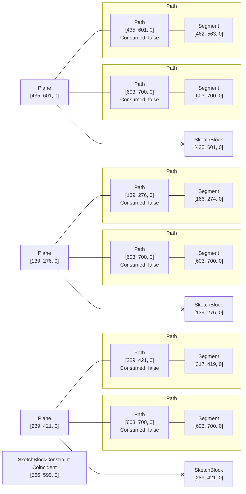

```mermaid
flowchart LR
  subgraph path2 [Path]
    2["Path<br>[139, 276, 0]<br>Consumed: false"]
      %% [ProgramBodyItem { index: 0 }, VariableDeclarationDeclaration, VariableDeclarationInit]
    3["Segment<br>[166, 274, 0]"]
      %% [ProgramBodyItem { index: 0 }, VariableDeclarationDeclaration, VariableDeclarationInit, SketchBlockBody, SketchBlockBodyItem { index: 0 }, VariableDeclarationDeclaration, VariableDeclarationInit]
  end
  subgraph path5 [Path]
    5["Path<br>[289, 421, 0]<br>Consumed: false"]
      %% [ProgramBodyItem { index: 1 }, VariableDeclarationDeclaration, VariableDeclarationInit]
    6["Segment<br>[317, 419, 0]"]
      %% [ProgramBodyItem { index: 1 }, VariableDeclarationDeclaration, VariableDeclarationInit, SketchBlockBody, SketchBlockBodyItem { index: 0 }, VariableDeclarationDeclaration, VariableDeclarationInit]
  end
  subgraph path8 [Path]
    8["Path<br>[435, 601, 0]<br>Consumed: false"]
      %% [ProgramBodyItem { index: 2 }, VariableDeclarationDeclaration, VariableDeclarationInit]
    9["Segment<br>[462, 563, 0]"]
      %% [ProgramBodyItem { index: 2 }, VariableDeclarationDeclaration, VariableDeclarationInit, SketchBlockBody, SketchBlockBodyItem { index: 0 }, VariableDeclarationDeclaration, VariableDeclarationInit]
  end
  subgraph path10 [Path]
    10["Path<br>[603, 700, 0]<br>Consumed: false"]
      %% [ProgramBodyItem { index: 3 }, ExpressionStatementExpr]
    11["Segment<br>[603, 700, 0]"]
      %% [ProgramBodyItem { index: 3 }, ExpressionStatementExpr]
  end
  subgraph path12 [Path]
    12["Path<br>[603, 700, 0]<br>Consumed: false"]
      %% [ProgramBodyItem { index: 3 }, ExpressionStatementExpr]
    13["Segment<br>[603, 700, 0]"]
      %% [ProgramBodyItem { index: 3 }, ExpressionStatementExpr]
  end
  subgraph path14 [Path]
    14["Path<br>[603, 700, 0]<br>Consumed: false"]
      %% [ProgramBodyItem { index: 3 }, ExpressionStatementExpr]
    15["Segment<br>[603, 700, 0]"]
      %% [ProgramBodyItem { index: 3 }, ExpressionStatementExpr]
  end
  1["Plane<br>[139, 276, 0]"]
    %% [ProgramBodyItem { index: 0 }, VariableDeclarationDeclaration, VariableDeclarationInit]
  4["Plane<br>[289, 421, 0]"]
    %% [ProgramBodyItem { index: 1 }, VariableDeclarationDeclaration, VariableDeclarationInit]
  7["Plane<br>[435, 601, 0]"]
    %% [ProgramBodyItem { index: 2 }, VariableDeclarationDeclaration, VariableDeclarationInit]
  16["SketchBlock<br>[139, 276, 0]"]
    %% [ProgramBodyItem { index: 0 }, VariableDeclarationDeclaration, VariableDeclarationInit]
  17["SketchBlock<br>[289, 421, 0]"]
    %% [ProgramBodyItem { index: 1 }, VariableDeclarationDeclaration, VariableDeclarationInit]
  18["SketchBlock<br>[435, 601, 0]"]
    %% [ProgramBodyItem { index: 2 }, VariableDeclarationDeclaration, VariableDeclarationInit]
  19["SketchBlockConstraint Coincident<br>[566, 599, 0]"]
    %% [ProgramBodyItem { index: 2 }, VariableDeclarationDeclaration, VariableDeclarationInit, SketchBlockBody, SketchBlockBodyItem { index: 1 }, ExpressionStatementExpr]
  1 --- 2
  1 --- 12
  1 <--x 16
  2 --- 3
  4 --- 5
  4 --- 10
  4 <--x 17
  5 --- 6
  7 --- 8
  7 --- 14
  7 <--x 18
  8 --- 9
  10 --- 11
  12 --- 13
  14 --- 15
```
