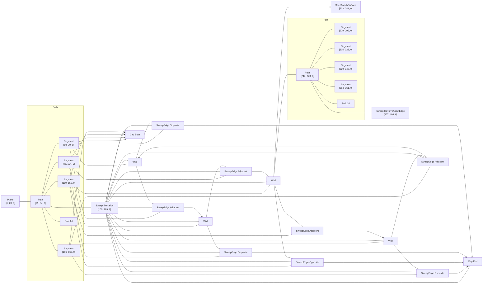

```mermaid
flowchart LR
  subgraph path3 [Path]
    3["Path<br>[29, 54, 0]"]
      %% [ProgramBodyItem { index: 0 }, VariableDeclarationDeclaration, VariableDeclarationInit, PipeBodyItem { index: 1 }]
    5["Segment<br>[60, 79, 0]"]
      %% [ProgramBodyItem { index: 0 }, VariableDeclarationDeclaration, VariableDeclarationInit, PipeBodyItem { index: 2 }]
    6["Segment<br>[85, 104, 0]"]
      %% [ProgramBodyItem { index: 0 }, VariableDeclarationDeclaration, VariableDeclarationInit, PipeBodyItem { index: 3 }]
    7["Segment<br>[110, 150, 0]"]
      %% [ProgramBodyItem { index: 0 }, VariableDeclarationDeclaration, VariableDeclarationInit, PipeBodyItem { index: 4 }]
    8["Segment<br>[156, 163, 0]"]
      %% [ProgramBodyItem { index: 0 }, VariableDeclarationDeclaration, VariableDeclarationInit, PipeBodyItem { index: 5 }]
    13[Solid2d]
  end
  subgraph path4 [Path]
    4["Path<br>[247, 273, 0]"]
      %% [ProgramBodyItem { index: 1 }, VariableDeclarationDeclaration, VariableDeclarationInit, PipeBodyItem { index: 1 }]
    9["Segment<br>[279, 299, 0]"]
      %% [ProgramBodyItem { index: 1 }, VariableDeclarationDeclaration, VariableDeclarationInit, PipeBodyItem { index: 2 }]
    10["Segment<br>[305, 323, 0]"]
      %% [ProgramBodyItem { index: 1 }, VariableDeclarationDeclaration, VariableDeclarationInit, PipeBodyItem { index: 3 }]
    11["Segment<br>[329, 348, 0]"]
      %% [ProgramBodyItem { index: 1 }, VariableDeclarationDeclaration, VariableDeclarationInit, PipeBodyItem { index: 4 }]
    12["Segment<br>[354, 361, 0]"]
      %% [ProgramBodyItem { index: 1 }, VariableDeclarationDeclaration, VariableDeclarationInit, PipeBodyItem { index: 5 }]
    14[Solid2d]
  end
  1["Plane<br>[6, 23, 0]"]
    %% [ProgramBodyItem { index: 0 }, VariableDeclarationDeclaration, VariableDeclarationInit, PipeBodyItem { index: 0 }]
  2["StartSketchOnFace<br>[203, 241, 0]"]
    %% [ProgramBodyItem { index: 1 }, VariableDeclarationDeclaration, VariableDeclarationInit, PipeBodyItem { index: 0 }]
  15["Sweep Extrusion<br>[169, 189, 0]"]
    %% [ProgramBodyItem { index: 0 }, VariableDeclarationDeclaration, VariableDeclarationInit, PipeBodyItem { index: 6 }]
  16["Sweep RevolveAboutEdge<br>[367, 406, 0]"]
    %% [ProgramBodyItem { index: 1 }, VariableDeclarationDeclaration, VariableDeclarationInit, PipeBodyItem { index: 6 }]
  17[Wall]
    %% face_code_ref=Missing NodePath
  18[Wall]
    %% face_code_ref=Missing NodePath
  19[Wall]
    %% face_code_ref=Missing NodePath
  20[Wall]
    %% face_code_ref=[ProgramBodyItem { index: 1 }, VariableDeclarationDeclaration, VariableDeclarationInit, PipeBodyItem { index: 0 }]
  21["Cap Start"]
    %% face_code_ref=Missing NodePath
  22["Cap End"]
    %% face_code_ref=Missing NodePath
  23["SweepEdge Opposite"]
  24["SweepEdge Opposite"]
  25["SweepEdge Opposite"]
  26["SweepEdge Opposite"]
  27["SweepEdge Adjacent"]
  28["SweepEdge Adjacent"]
  29["SweepEdge Adjacent"]
  30["SweepEdge Adjacent"]
  1 --- 3
  20 x--> 2
  3 --- 5
  3 --- 6
  3 --- 7
  3 --- 8
  3 --- 13
  3 ---- 15
  4 --- 9
  4 --- 10
  4 --- 11
  4 --- 12
  4 --- 14
  4 ---- 16
  20 --- 4
  5 --- 19
  5 x--> 21
  5 --- 26
  5 --- 30
  6 --- 17
  6 x--> 21
  6 --- 25
  6 --- 29
  7 --- 20
  7 x--> 21
  7 --- 24
  7 --- 28
  8 --- 18
  8 x--> 21
  8 --- 23
  8 --- 27
  15 --- 17
  15 --- 18
  15 --- 19
  15 --- 20
  15 --- 21
  15 --- 22
  15 --- 23
  15 --- 24
  15 --- 25
  15 --- 26
  15 --- 27
  15 --- 28
  15 --- 29
  15 --- 30
  17 --- 25
  17 --- 29
  30 <--x 17
  18 --- 23
  18 --- 27
  28 <--x 18
  19 --- 26
  27 <--x 19
  19 --- 30
  20 --- 24
  20 --- 28
  29 <--x 20
  23 <--x 22
  24 <--x 22
  25 <--x 22
  26 <--x 22
```
