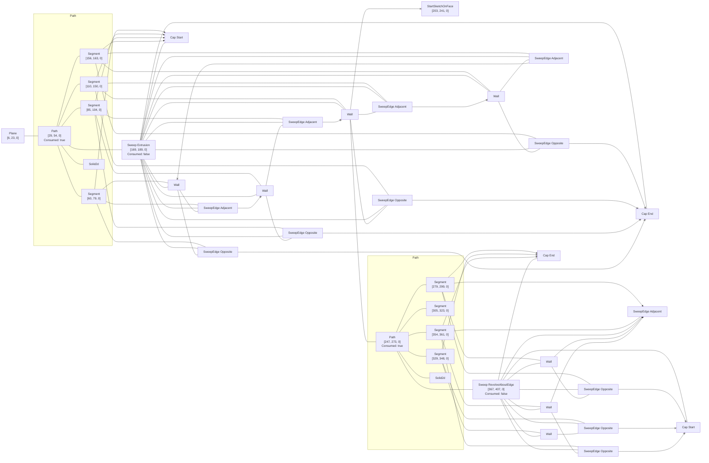

```mermaid
flowchart LR
  subgraph path2 [Path]
    2["Path<br>[29, 54, 0]<br>Consumed: true"]
      %% [ProgramBodyItem { index: 0 }, VariableDeclarationDeclaration, VariableDeclarationInit, PipeBodyItem { index: 1 }]
    3["Segment<br>[60, 79, 0]"]
      %% [ProgramBodyItem { index: 0 }, VariableDeclarationDeclaration, VariableDeclarationInit, PipeBodyItem { index: 2 }]
    4["Segment<br>[85, 104, 0]"]
      %% [ProgramBodyItem { index: 0 }, VariableDeclarationDeclaration, VariableDeclarationInit, PipeBodyItem { index: 3 }]
    5["Segment<br>[110, 150, 0]"]
      %% [ProgramBodyItem { index: 0 }, VariableDeclarationDeclaration, VariableDeclarationInit, PipeBodyItem { index: 4 }]
    6["Segment<br>[156, 163, 0]"]
      %% [ProgramBodyItem { index: 0 }, VariableDeclarationDeclaration, VariableDeclarationInit, PipeBodyItem { index: 5 }]
    7[Solid2d]
  end
  subgraph path23 [Path]
    23["Path<br>[247, 273, 0]<br>Consumed: true"]
      %% [ProgramBodyItem { index: 1 }, VariableDeclarationDeclaration, VariableDeclarationInit, PipeBodyItem { index: 1 }]
    24["Segment<br>[279, 299, 0]"]
      %% [ProgramBodyItem { index: 1 }, VariableDeclarationDeclaration, VariableDeclarationInit, PipeBodyItem { index: 2 }]
    25["Segment<br>[305, 323, 0]"]
      %% [ProgramBodyItem { index: 1 }, VariableDeclarationDeclaration, VariableDeclarationInit, PipeBodyItem { index: 3 }]
    26["Segment<br>[329, 348, 0]"]
      %% [ProgramBodyItem { index: 1 }, VariableDeclarationDeclaration, VariableDeclarationInit, PipeBodyItem { index: 4 }]
    27["Segment<br>[354, 361, 0]"]
      %% [ProgramBodyItem { index: 1 }, VariableDeclarationDeclaration, VariableDeclarationInit, PipeBodyItem { index: 5 }]
    28[Solid2d]
  end
  1["Plane<br>[6, 23, 0]"]
    %% [ProgramBodyItem { index: 0 }, VariableDeclarationDeclaration, VariableDeclarationInit, PipeBodyItem { index: 0 }]
  8["Sweep Extrusion<br>[169, 189, 0]<br>Consumed: false"]
    %% [ProgramBodyItem { index: 0 }, VariableDeclarationDeclaration, VariableDeclarationInit, PipeBodyItem { index: 6 }]
  9[Wall]
    %% face_code_ref=Missing NodePath
  10[Wall]
    %% face_code_ref=[ProgramBodyItem { index: 1 }, VariableDeclarationDeclaration, VariableDeclarationInit, PipeBodyItem { index: 0 }]
  11[Wall]
    %% face_code_ref=Missing NodePath
  12[Wall]
    %% face_code_ref=Missing NodePath
  13["Cap Start"]
    %% face_code_ref=Missing NodePath
  14["Cap End"]
    %% face_code_ref=Missing NodePath
  15["SweepEdge Opposite"]
  16["SweepEdge Adjacent"]
  17["SweepEdge Opposite"]
  18["SweepEdge Adjacent"]
  19["SweepEdge Opposite"]
  20["SweepEdge Adjacent"]
  21["SweepEdge Opposite"]
  22["SweepEdge Adjacent"]
  29["Sweep RevolveAboutEdge<br>[367, 407, 0]<br>Consumed: false"]
    %% [ProgramBodyItem { index: 1 }, VariableDeclarationDeclaration, VariableDeclarationInit, PipeBodyItem { index: 6 }]
  30[Wall]
    %% face_code_ref=Missing NodePath
  31[Wall]
    %% face_code_ref=Missing NodePath
  32[Wall]
    %% face_code_ref=Missing NodePath
  33["Cap Start"]
    %% face_code_ref=Missing NodePath
  34["Cap End"]
    %% face_code_ref=Missing NodePath
  35["SweepEdge Opposite"]
  36["SweepEdge Adjacent"]
  37["SweepEdge Opposite"]
  38["SweepEdge Opposite"]
  39["StartSketchOnFace<br>[203, 241, 0]"]
    %% [ProgramBodyItem { index: 1 }, VariableDeclarationDeclaration, VariableDeclarationInit, PipeBodyItem { index: 0 }]
  1 --- 2
  2 --- 3
  2 --- 4
  2 --- 5
  2 --- 6
  2 --- 7
  2 ---- 8
  3 --- 12
  3 x--> 13
  3 --- 21
  3 --- 22
  4 --- 11
  4 x--> 13
  4 --- 19
  4 --- 20
  5 --- 10
  5 x--> 13
  5 --- 17
  5 --- 18
  6 --- 9
  6 x--> 13
  6 --- 15
  6 --- 16
  8 --- 9
  8 --- 10
  8 --- 11
  8 --- 12
  8 --- 13
  8 --- 14
  8 --- 15
  8 --- 16
  8 --- 17
  8 --- 18
  8 --- 19
  8 --- 20
  8 --- 21
  8 --- 22
  9 --- 15
  9 --- 16
  18 <--x 9
  10 --- 17
  10 --- 18
  20 <--x 10
  10 --- 23
  10 <--x 39
  11 --- 19
  11 --- 20
  22 <--x 11
  16 <--x 12
  12 --- 21
  12 --- 22
  15 <--x 14
  17 <--x 14
  19 <--x 14
  21 <--x 14
  23 --- 24
  23 --- 25
  23 --- 26
  23 --- 27
  23 --- 28
  23 ---- 29
  24 --- 30
  24 x--> 34
  24 --- 35
  24 x--> 36
  26 --- 31
  26 x--> 34
  26 --- 37
  27 --- 32
  27 x--> 34
  27 --- 36
  27 --- 38
  29 --- 30
  29 --- 31
  29 --- 32
  29 --- 33
  29 --- 34
  29 --- 35
  29 --- 36
  29 --- 37
  29 --- 38
  30 --- 35
  30 x--> 36
  31 --- 37
  32 x--> 36
  32 --- 38
  35 <--x 33
  37 <--x 33
  38 <--x 33
```
