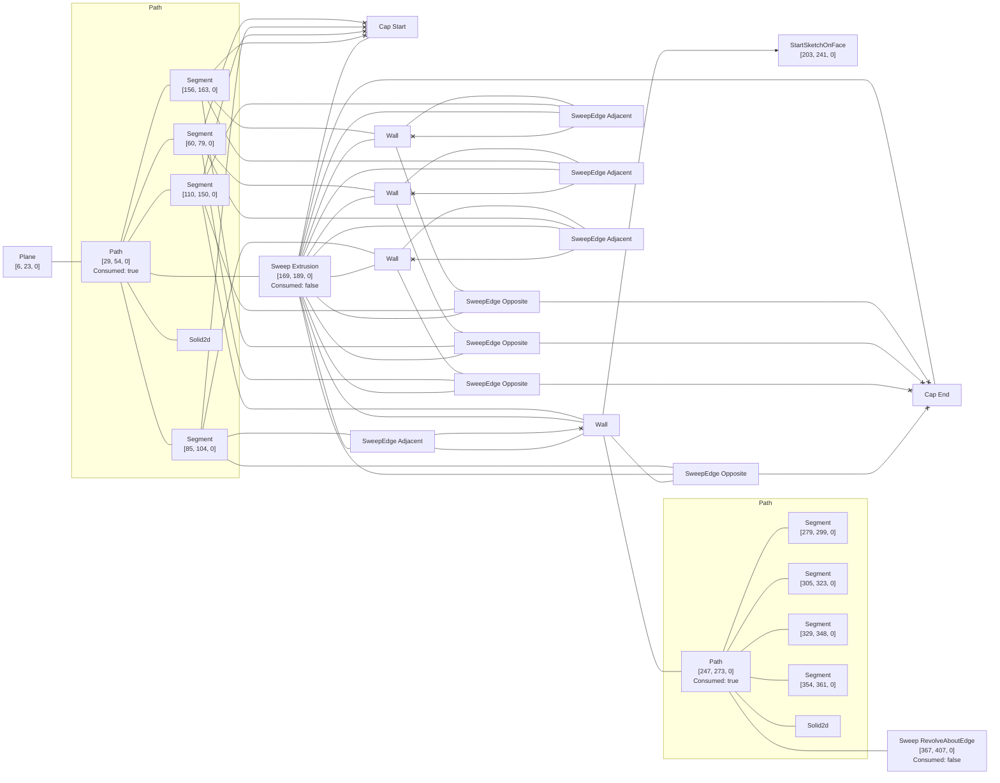

```mermaid
flowchart LR
  subgraph path7 [Path]
    7["Path<br>[29, 54, 0]<br>Consumed: true"]
      %% [ProgramBodyItem { index: 0 }, VariableDeclarationDeclaration, VariableDeclarationInit, PipeBodyItem { index: 1 }]
    8["Segment<br>[60, 79, 0]"]
      %% [ProgramBodyItem { index: 0 }, VariableDeclarationDeclaration, VariableDeclarationInit, PipeBodyItem { index: 2 }]
    9["Segment<br>[85, 104, 0]"]
      %% [ProgramBodyItem { index: 0 }, VariableDeclarationDeclaration, VariableDeclarationInit, PipeBodyItem { index: 3 }]
    10["Segment<br>[110, 150, 0]"]
      %% [ProgramBodyItem { index: 0 }, VariableDeclarationDeclaration, VariableDeclarationInit, PipeBodyItem { index: 4 }]
    11["Segment<br>[156, 163, 0]"]
      %% [ProgramBodyItem { index: 0 }, VariableDeclarationDeclaration, VariableDeclarationInit, PipeBodyItem { index: 5 }]
    22[Solid2d]
  end
  subgraph path15 [Path]
    15["Path<br>[247, 273, 0]<br>Consumed: true"]
      %% [ProgramBodyItem { index: 1 }, VariableDeclarationDeclaration, VariableDeclarationInit, PipeBodyItem { index: 1 }]
    16["Segment<br>[279, 299, 0]"]
      %% [ProgramBodyItem { index: 1 }, VariableDeclarationDeclaration, VariableDeclarationInit, PipeBodyItem { index: 2 }]
    17["Segment<br>[305, 323, 0]"]
      %% [ProgramBodyItem { index: 1 }, VariableDeclarationDeclaration, VariableDeclarationInit, PipeBodyItem { index: 3 }]
    18["Segment<br>[329, 348, 0]"]
      %% [ProgramBodyItem { index: 1 }, VariableDeclarationDeclaration, VariableDeclarationInit, PipeBodyItem { index: 4 }]
    19["Segment<br>[354, 361, 0]"]
      %% [ProgramBodyItem { index: 1 }, VariableDeclarationDeclaration, VariableDeclarationInit, PipeBodyItem { index: 5 }]
    21[Solid2d]
  end
  1["Cap End"]
    %% face_code_ref=Missing NodePath
  2["Cap Start"]
    %% face_code_ref=Missing NodePath
  3[Wall]
    %% face_code_ref=Missing NodePath
  4[Wall]
    %% face_code_ref=Missing NodePath
  5[Wall]
    %% face_code_ref=Missing NodePath
  6["Plane<br>[6, 23, 0]"]
    %% [ProgramBodyItem { index: 0 }, VariableDeclarationDeclaration, VariableDeclarationInit, PipeBodyItem { index: 0 }]
  12["Sweep Extrusion<br>[169, 189, 0]<br>Consumed: false"]
    %% [ProgramBodyItem { index: 0 }, VariableDeclarationDeclaration, VariableDeclarationInit, PipeBodyItem { index: 6 }]
  13["StartSketchOnFace<br>[203, 241, 0]"]
    %% [ProgramBodyItem { index: 1 }, VariableDeclarationDeclaration, VariableDeclarationInit, PipeBodyItem { index: 0 }]
  14[Wall]
    %% face_code_ref=[ProgramBodyItem { index: 1 }, VariableDeclarationDeclaration, VariableDeclarationInit, PipeBodyItem { index: 0 }]
  20["Sweep RevolveAboutEdge<br>[367, 407, 0]<br>Consumed: false"]
    %% [ProgramBodyItem { index: 1 }, VariableDeclarationDeclaration, VariableDeclarationInit, PipeBodyItem { index: 6 }]
  23["SweepEdge Adjacent"]
  24["SweepEdge Adjacent"]
  25["SweepEdge Adjacent"]
  26["SweepEdge Adjacent"]
  27["SweepEdge Opposite"]
  28["SweepEdge Opposite"]
  29["SweepEdge Opposite"]
  30["SweepEdge Opposite"]
  12 --- 1
  27 <--x 1
  28 <--x 1
  29 <--x 1
  30 <--x 1
  8 <--x 2
  9 <--x 2
  10 <--x 2
  11 <--x 2
  12 --- 2
  11 --- 3
  12 --- 3
  3 --- 23
  23 <--x 3
  3 --- 27
  8 --- 4
  12 --- 4
  4 --- 24
  24 <--x 4
  4 --- 28
  9 --- 5
  12 --- 5
  5 --- 25
  25 <--x 5
  5 --- 29
  6 --- 7
  7 --- 8
  7 --- 9
  7 --- 10
  7 --- 11
  7 ---- 12
  7 --- 22
  8 --- 25
  8 --- 29
  9 --- 26
  9 --- 30
  10 --- 14
  10 --- 23
  10 --- 27
  11 --- 24
  11 --- 28
  12 --- 14
  12 --- 23
  12 --- 24
  12 --- 25
  12 --- 26
  12 --- 27
  12 --- 28
  12 --- 29
  12 --- 30
  14 x--> 13
  14 --- 15
  14 --- 26
  26 <--x 14
  14 --- 30
  15 --- 16
  15 --- 17
  15 --- 18
  15 --- 19
  15 ---- 20
  15 --- 21
```
