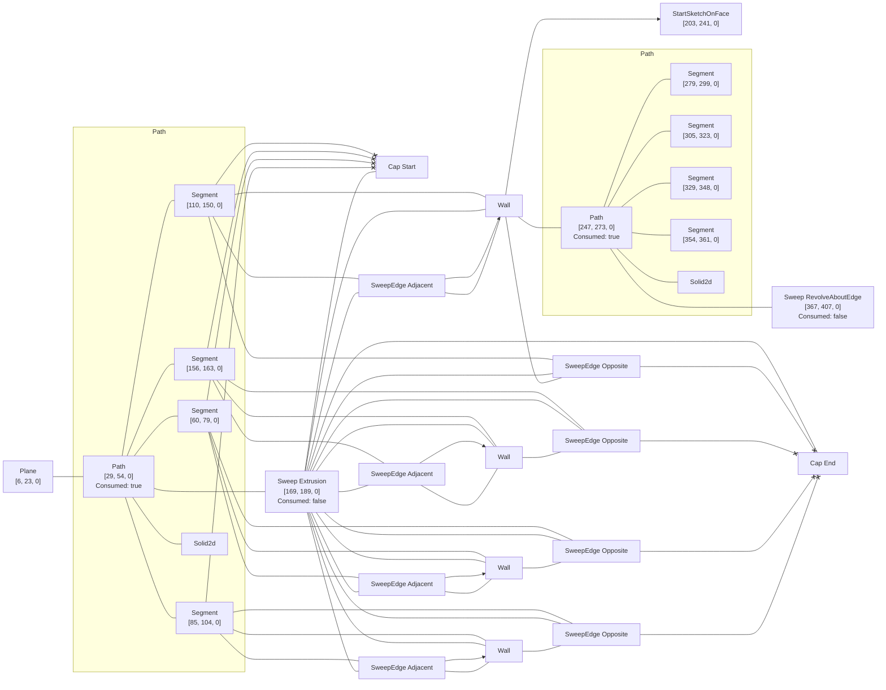

```mermaid
flowchart LR
  subgraph path4 [Path]
    4["Path<br>[29, 54, 0]<br>Consumed: true"]
      %% [ProgramBodyItem { index: 0 }, VariableDeclarationDeclaration, VariableDeclarationInit, PipeBodyItem { index: 1 }]
    12["Segment<br>[60, 79, 0]"]
      %% [ProgramBodyItem { index: 0 }, VariableDeclarationDeclaration, VariableDeclarationInit, PipeBodyItem { index: 2 }]
    13["Segment<br>[85, 104, 0]"]
      %% [ProgramBodyItem { index: 0 }, VariableDeclarationDeclaration, VariableDeclarationInit, PipeBodyItem { index: 3 }]
    6["Segment<br>[110, 150, 0]"]
      %% [ProgramBodyItem { index: 0 }, VariableDeclarationDeclaration, VariableDeclarationInit, PipeBodyItem { index: 4 }]
    7["Segment<br>[156, 163, 0]"]
      %% [ProgramBodyItem { index: 0 }, VariableDeclarationDeclaration, VariableDeclarationInit, PipeBodyItem { index: 5 }]
    15[Solid2d]
  end
  subgraph path3 [Path]
    3["Path<br>[247, 273, 0]<br>Consumed: true"]
      %% [ProgramBodyItem { index: 1 }, VariableDeclarationDeclaration, VariableDeclarationInit, PipeBodyItem { index: 1 }]
    8["Segment<br>[279, 299, 0]"]
      %% [ProgramBodyItem { index: 1 }, VariableDeclarationDeclaration, VariableDeclarationInit, PipeBodyItem { index: 2 }]
    9["Segment<br>[305, 323, 0]"]
      %% [ProgramBodyItem { index: 1 }, VariableDeclarationDeclaration, VariableDeclarationInit, PipeBodyItem { index: 3 }]
    10["Segment<br>[329, 348, 0]"]
      %% [ProgramBodyItem { index: 1 }, VariableDeclarationDeclaration, VariableDeclarationInit, PipeBodyItem { index: 4 }]
    11["Segment<br>[354, 361, 0]"]
      %% [ProgramBodyItem { index: 1 }, VariableDeclarationDeclaration, VariableDeclarationInit, PipeBodyItem { index: 5 }]
    14[Solid2d]
  end
  5["Plane<br>[6, 23, 0]"]
    %% [ProgramBodyItem { index: 0 }, VariableDeclarationDeclaration, VariableDeclarationInit, PipeBodyItem { index: 0 }]
  17["Sweep Extrusion<br>[169, 189, 0]<br>Consumed: false"]
    %% [ProgramBodyItem { index: 0 }, VariableDeclarationDeclaration, VariableDeclarationInit, PipeBodyItem { index: 6 }]
  28[Wall]
    %% face_code_ref=Missing NodePath
  27[Wall]
    %% face_code_ref=[ProgramBodyItem { index: 1 }, VariableDeclarationDeclaration, VariableDeclarationInit, PipeBodyItem { index: 0 }]
  30[Wall]
    %% face_code_ref=Missing NodePath
  29[Wall]
    %% face_code_ref=Missing NodePath
  2["Cap Start"]
    %% face_code_ref=Missing NodePath
  1["Cap End"]
    %% face_code_ref=Missing NodePath
  24["SweepEdge Opposite"]
  20["SweepEdge Adjacent"]
  23["SweepEdge Opposite"]
  19["SweepEdge Adjacent"]
  26["SweepEdge Opposite"]
  22["SweepEdge Adjacent"]
  25["SweepEdge Opposite"]
  21["SweepEdge Adjacent"]
  18["Sweep RevolveAboutEdge<br>[367, 407, 0]<br>Consumed: false"]
    %% [ProgramBodyItem { index: 1 }, VariableDeclarationDeclaration, VariableDeclarationInit, PipeBodyItem { index: 6 }]
  16["StartSketchOnFace<br>[203, 241, 0]"]
    %% [ProgramBodyItem { index: 1 }, VariableDeclarationDeclaration, VariableDeclarationInit, PipeBodyItem { index: 0 }]
  17 --- 1
  23 <--x 1
  24 <--x 1
  25 <--x 1
  26 <--x 1
  6 <--x 2
  7 <--x 2
  12 <--x 2
  13 <--x 2
  17 --- 2
  3 --- 8
  3 --- 9
  3 --- 10
  3 --- 11
  3 --- 14
  3 ---- 18
  27 --- 3
  5 --- 4
  4 --- 6
  4 --- 7
  4 --- 12
  4 --- 13
  4 --- 15
  4 ---- 17
  6 --- 19
  6 --- 23
  6 --- 27
  7 --- 20
  7 --- 24
  7 --- 28
  12 --- 21
  12 --- 25
  12 --- 29
  13 --- 22
  13 --- 26
  13 --- 30
  27 x--> 16
  17 --- 19
  17 --- 20
  17 --- 21
  17 --- 22
  17 --- 23
  17 --- 24
  17 --- 25
  17 --- 26
  17 --- 27
  17 --- 28
  17 --- 29
  17 --- 30
  27 --- 19
  19 x--> 27
  28 --- 20
  20 x--> 28
  29 --- 21
  21 x--> 29
  30 --- 22
  22 x--> 30
  27 --- 23
  28 --- 24
  29 --- 25
  30 --- 26
```
