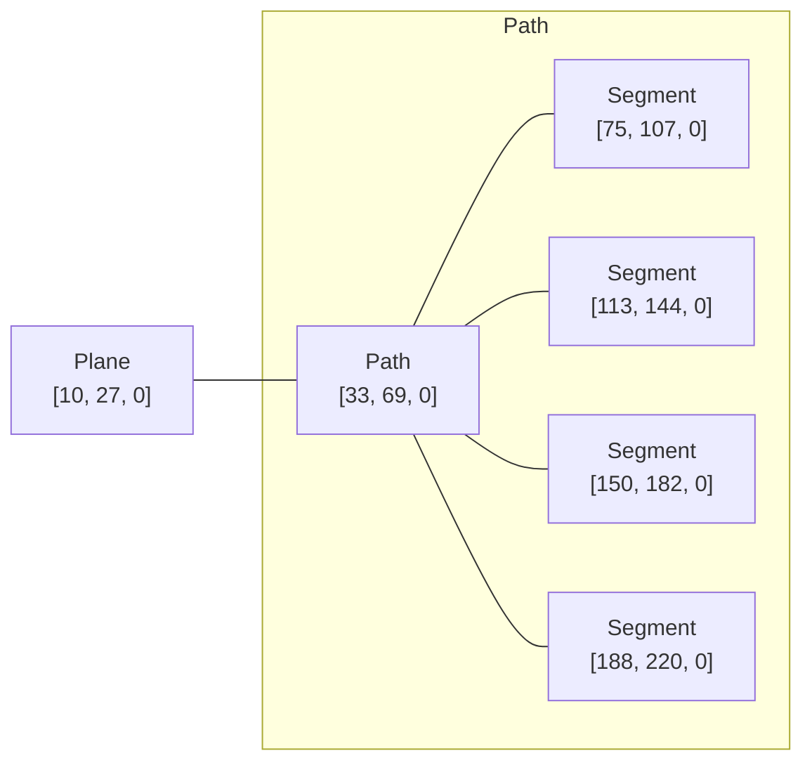

```mermaid
flowchart LR
  subgraph path2 [Path]
    2["Path<br>[33, 69, 0]"]
    3["Segment<br>[75, 107, 0]"]
    4["Segment<br>[113, 144, 0]"]
    5["Segment<br>[150, 182, 0]"]
    6["Segment<br>[188, 220, 0]"]
  end
  1["Plane<br>[10, 27, 0]"]
  1 --- 2
  2 --- 3
  2 --- 4
  2 --- 5
  2 --- 6
```
